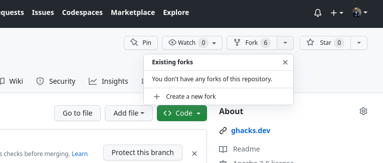
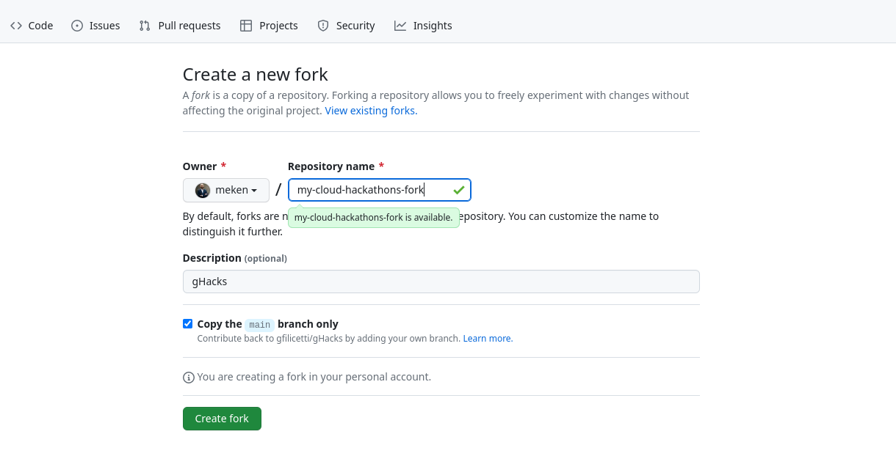
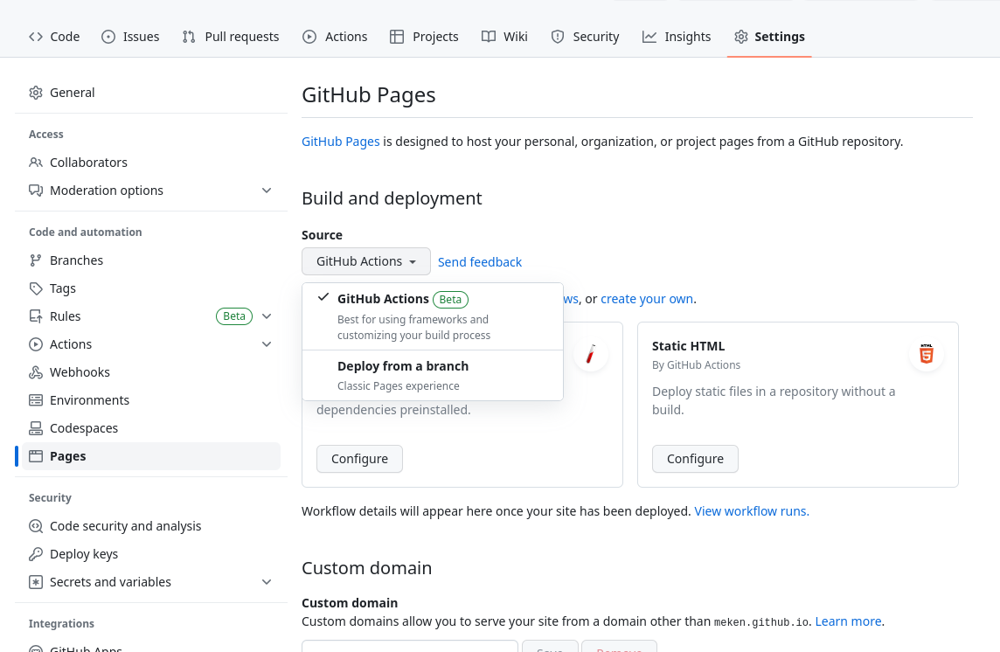
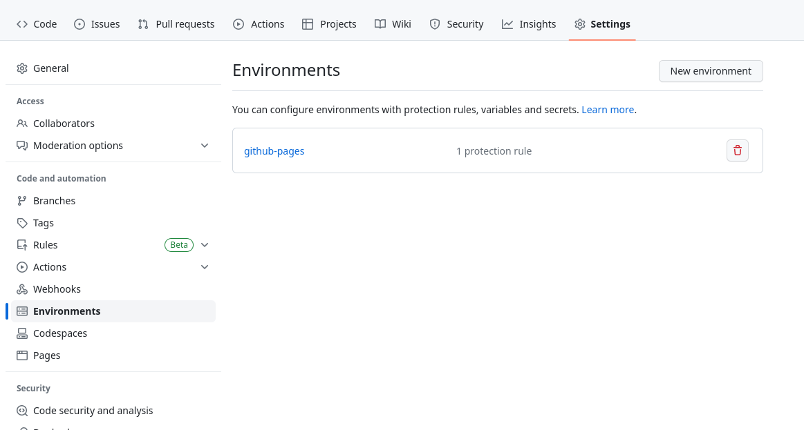
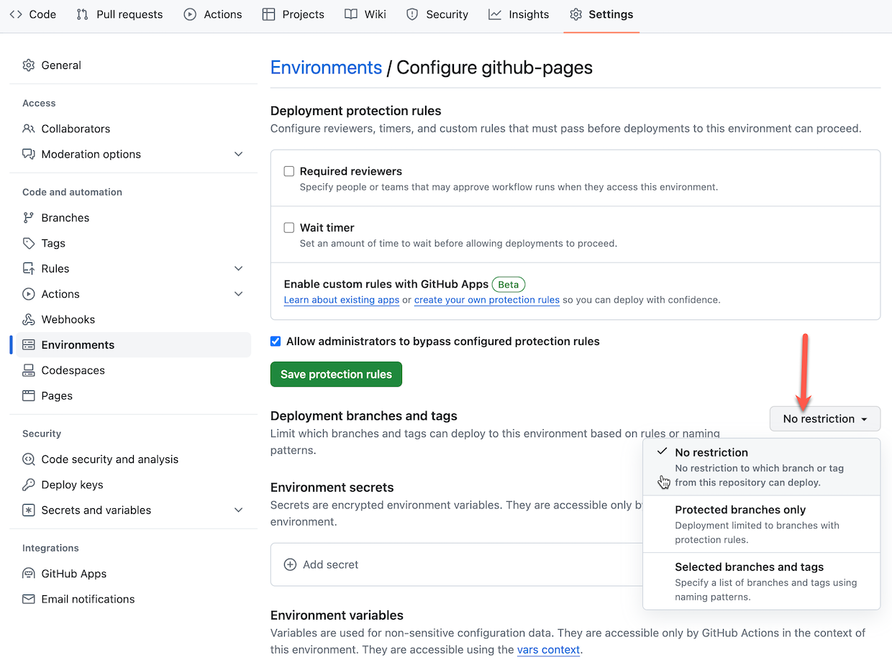
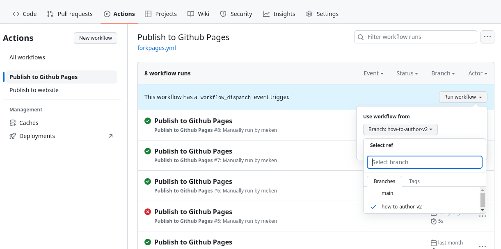
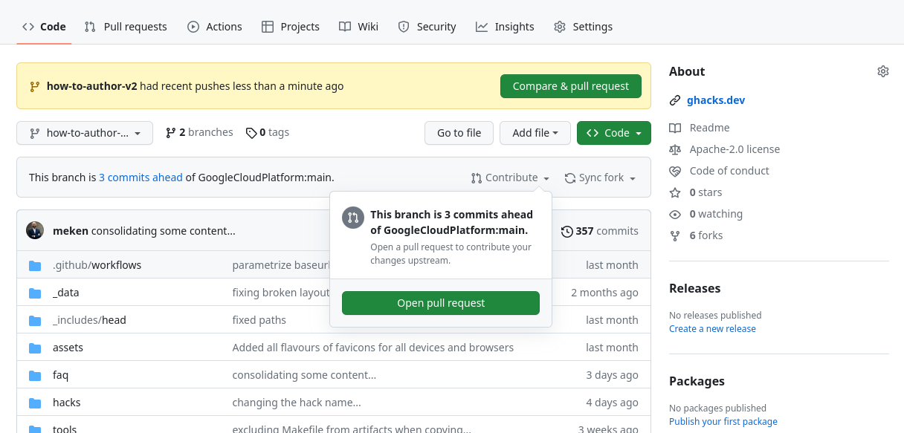

# How to Author a gHack

Developing a new gHack is a great way to get your content out to the world. Chances are if you've done workshops, PoCs or pilots in the past, you already have the material on which to build a gHack.

## The Quick Summary

In essence a gHack needs to satisfy the following criteria.

1. A gHack consists of **multiple, cumulative, hands-on challenges** building on top of each other
   > Think of a story consisting of multiple steps, starting with simple tasks and getting more advanced/detailed as the challenges progress. A gHack should provide value even if the participants don't get to solve all challenges.
1. Challenges are small puzzles to be solved by participants **without step-by-step instructions, screenshots or any other copy/paste** content provided
   > Solving the challenges means satisfying the *Success Criteria* described for the challenge. Remember there's no single golden path to solve these challenges, participants are free to come up with their own solutions as long as success criteria are met. The challenges shouldn't be trick questions as we don't want to frustrate participants. And finally, try to stay away from *coding from scratch* challenges, those are time consuming and don't provide too much value. Stick to configuring services (either through CLI, console, config files) or incomplete configuration/code sources (fix a trivial issue, add a single line to a file etc.)
1. The gHack concept is **designed for teams**, the idea is solve the challenges as a team
   > Although it's technically possible to do a gHack individually, we think that running those as teams provides the most value as the challenges require diverse set of skills so that people can also learn from each other. Make sure that during the event every participant gets to *drive* at least once.
1. Every team needs to be **accompanied by a coach during the event**
   > Sometimes teams might struggle to find the right solution; at those moments it's quite important to have someone who's done it before to give some hints, not the solution, but a direction, to prevent people from getting frustrated.

## Getting Started

Alright, you decided to author a new gHack, welcome to the club! The first thing you need to do is to fork this repository on Github. 

Navigate to [this repository](https://github.com/GoogleCloudPlatform/cloud-hackathons) on Github, and click on the *Fork* button on the top right. 



You'll be prompted with a screen to give the fork a name, you can keep the same name (*cloud-hackathons*) or provide a custom one.



Now you've got the fork, let's configure things properly so you can start developing your hack. First thing that you need to do is to clone your fork to your development environment (the prefix is either `git@` if you're using SSH authentication or `https://` if you're using PATs/credentials, we're assuming that you've configured your local authentication, otherwise see the Github [docs](https://docs.github.com/en/authentication/keeping-your-account-and-data-secure/about-authentication-to-github#authenticating-with-the-command-line)). You can also get this URL by going to your fork, click on the *Code* button and copy the URL.

```shell
git clone [git@|https://]github.com:YOUR_USERNAME/YOUR_FORK.git
```

This will create a local clone on your machine with *origin* set to your fork on Github. In order to make sure that you also can keep track of the original *cloud-hackathons* repository, you need to add another remote and call that *upstream* (could be called anything, but *upstream* is the convention). Note that this remote will be typically read-only for you, the only way to contribute your changes to that remote is through Pull Requests, which is described in later sections.

```shell
git remote add upstream https://github.com/GoogleCloudPlatform/cloud-hackathons.git
```

If you list the remotes, you should see something like this (https or git based on whether you're using access tokens or ssh):

```shell
$ git remote -v
> origin    https://github.com/YOUR_USERNAME/YOUR_FORK.git (fetch)
> origin    https://github.com/YOUR_USERNAME/YOUR_FORK.git (push)
> upstream  https://github.com/GoogleCloudPlatform/cloud-hackathons.git (fetch)
> upstream  https://github.com/GoogleCloudPlatform/cloud-hackathons.git (push)
```

If you want to know more about how to work with forks, see the Github [docs](https://docs.github.com/en/pull-requests/collaborating-with-pull-requests/working-with-forks/about-forks)

We're now ready to create a new gHack! You can create one from scratch, copy an existing one to modify, or run our scaffolding tool, either through Github Actions, or the command line.

### Scaffolding on the Command Line

The repository includes a shell script, `setup-newhack.sh` to create a new hack with all the necessary files in place, with placeholders in them. Make sure you're running it from the top level directory.

```shell
cd YOUR_FORK  # typically cloud-hackathons
tools/setup-newhack.sh --hack=century-of-iot --author=me@google.com --title="IoT hack of the century"
```

> **Note**  
> The title of your hack is the _visible_ title, and should be human readable, it will be used to link to your hack from the front page (the catalog). Also make sure to use "snake-case" for your hack name, ie: use dashes between words

This command will create a new folder in the `hacks` directory with placeholders for the content. You can then start editing those. In principle, the most important and possibly the only file to edit is the `README.md` in your new hack folder. But if you need any setup or additional capabilities you'll need to edit other files as well. See for an overview the [Anatomy of a gHack section](#the-anatomy-of-a-ghack).

Once you're done with (the first version of) your content you can commit your changes. You can either choose to create a branch (recommended) or do it on your main branch.

```shell
git checkout -b new-iot-hack  # if you go for a branch
git add .
git commit -m "initial version of the IoT hack..."
git push --set-upstream origin new-iot-hack
```

### Verifying the Rendering

Once a hack is wrapped up, it will end up in the original repository and will be rendered on the gHacks [website](https://ghacks.dev). But, if there's something wrong with the content, things can get horribly wrong. In order to prevent surprises, you can render it yourself using _Github Pages_. First step is to enable _Github Pages_ in your fork and choose for *Source* the _Github Actions_ option in the _Build and deployment_ section.



#### Branch Protections

The default configuration for Github Pages only works with the *main* branch. If you're planning to use branches for development you need to modify the protection rules. Go to the *Environments* settings and click on *github-pages* 



Now you can just either remove the protections, add specific branches or enable *Pages* for _All branches_.



#### Running the Action

Final step is to run the Github Action to generate the rendered website. Navigate to the Actions tab for your repository and click on the *Publish to Github Pages* workflow, and choose your branch if you have one.



The rendered website will be available on `https://YOUR_USERNAME.github.io/YOUR_FORK/`.

> **Note**  
> This approach also makes it possible for you to make quick changes to your content for specific events, without depending on the maintainers of this repo to validate and merge your PRs.

### Creating a Pull Request

Once everything is fine with your hack and you want to contribute to the original repository to be included in the official catalog, you need to create a *Pull Request*. As maintainers of the repository we're trying to keep the history clean in a semi-linear fashion. This requires you to rebase your branch/fork before we can merge it. You could do that through many different methods, but see below for the command line instructions.

```shell
git fetch upstream
git switch new-iot-hack  # or main if you're not using branches
git rebase upstream/main
```

If you get any conflicts you'll need to resolve those and commit your changes. Then you can push your changes to your origin. Since rebasing changes the Git history, you will need to force push your changes. 

```shell
git push -f 
```

> **Warning**  
> Please beware that force pushing your local will overwrite the commits in your *origin*. If you're collaborating with anyone else, they'll have to reset their local by doing a hard reset (and losing any work that they might not have committed/pushed).

Now you can create a PR through the Github UI. Navigate to your repository and click on the button to create a new PR.



If you have recent changes, there will be a yellow box at the top with a *Compare & pull request* button, otherwise, you can click on *Contribute* and click on the *Open pull request* button.

Once the maintainers validate the new hack, it'll be merged and visible on the official website. You can then remove your branch if you want to keep things clean.

If you want to create another hack, you can start from scratch and create another fork, or update your existing one. In that case (assuming that you've been following the instructions), make sure that your main branch is up to date with the upstream.

```shell
git switch main
git pull --ff-only --prune upstream main
```

If something goes wrong with rebasing (getting warnings about divergent set of commits), and you're confident that the remote is correct you can always reset to that. This typically happens if you've rebased things on the Github website, but your local doesn't have the rebased commits, you'll see that you're *n* commits behind and *m* commits ahead, and a message about the divergent set of commits. In that case try the following command

```shell
git reset --hard origin/new-iot-hack  # or any other branch that you want to sync to
```

> **Warning**  
> Here be dragons! Resetting your branch this way will remove all commits that you have locally on that branch, and will get whatever is in the remote branch. If that's the leading then fine, otherwise, you'll have to fix things first.

## GCP Project Setup

Some hacks will need certain resources to be created in GCP projects, before the hack starts. These could be enabling APIs, assigning permissions, creating buckets, databases etc. We expect these things to be automated through **Terraform**. 

By default the scaffolding process creates empty placeholders for the Terraform configuration. You can edit those anyway you want to create the things required for your hack.

We've documented how to use these Terraform scripts in [How to Setup Your Environment](howto-setup-environment.md).

### Customer Sandboxes

Our preferred option for hosting gHacks is through sandbox projects provided by the customers. Every team should have their own dedicated sandbox project, with `Owner` permissions for every team member (3-5 users). Ideally, these projects should be set up ahead of the event, and *Terraform* scripts should've been run. In addition, having a default network, with standard firewall rules to allow communication within the subnets would make sure that things are consistent with other environments.

### Qwiklabs

As mentioned in the previous section we'd like gHacks to be executed in customer environments. That way the resources created can stay behind and people can carry on even after the event. However, we're aware of the challenges of getting sandboxes available at customers, so gHacks are supported on a special Qwiklabs instance.

By default when a gHack is included in the official repository a new Qwiklabs lab is created in the special Qwiklabs instance. 

If you don't need anything special, the default Qwiklabs lab configuration `qwiklabs.yaml`, provided by the scaffolding tool, should be sufficient. If you need to edit that file, make sure that you've read the document available on [go/ql-scripts](http://go/ql-scripts).

#### Qwiklabs and Terraform

The Terraform scripts in the `artifacts` directory of your hack will be automatically executed when the labs start.

At the moment Qwiklabs only support Terraform **1.0.1**, so make sure that your Terraform configuration only uses capabilities available for that version. Note that you can still use the latest version of the GCP providers, this only applies to the Terraform version used.

The Terraform configuration when used by Qwiklabs has some pre-requisites. You'll need to make sure that your configuration includes the following variables, even if you don't use them!

- `gcp_project_id`
- `gcp_region`
- `gcp_zone`

If you've used the scaffolding tool, this is done for you automatically. 

Another thing to keep in mind is that all Qwiklabs projects come with a default network including a subnet for all regions. If you want your hacks to be available outside of Qwiklabs environments, make sure that either those environments have a default network configured as well, or just use a different specific network created and managed by your configuration.

#### Updating Qwiklabs

The process of synchronizing of your changes to the special Qwiklabs instance is done automatically but might take some time. Keep that in mind if you're in a rush.

It's also possible to create labs directly in the special Qwiklabs instance to try out things, you can then import the `README.md` as the instructions, and add the `ghacks-setup.zip` to the project instance in the Lab Resources section. You can create the zip file by navigating to your hack's artifacts directory and running `make`. But beware that image references etc. will not work in that case.

### Argolis

You can't use Argolis projects for customers (unless you're doing an internal event and everybody uses their own Argolis organization) but you can certainly test your Terraform configuration in an Argolis project. We recommend to test things in a new project to make sure that things are reproducable. As you probably already know Argolis comes with a lot of restrictive organization policies, you might need to disable some of those before running your scripts.

## The Anatomy of a gHack

### Files and Folders

Now that you've run the `setup-newhack.sh` script above, this is the directory structure it creates and the template files within:

```
hacks
├── century-of-iot
│   ├── artifacts  # (Optional) Terraform setup 
│   │   ├── Makefile
│   │   ├── runtime.yaml
│   │   ├── main.tf
│   │   ├── providers.tf
│   │   ├── outputs.tf
│   │   └── variables.tf
│   ├── images  # (Optional) Images used for hack description and/or solutions 
│   │   ├── architecture.png
│   │   └── results.png
│   ├── resources # (Optional) Lecture presentations, supporting files, etc. Will be supplied to students
│   │   ├── Makefile
│   │   ├── lectures.pdf
│   │   ├── kube-deploy.yaml
│   │   └── testing.html
│   ├── README.md      # (Required) Hack description
│   ├── solutions.md   # (Required) The coach's guide
│   ├── QL_OWNER       # (Required for qwiklabs) Line separated list of owner & collaborator's emails for the Qwiklab
│   └── qwiklabs.yaml  # (Required for qwiklabs) Qwiklab configuration
└── ...
```
## Student Guide

Why should someone take the time to deliver or participate in your hack?  This is the main question you need to answer in order to define your hack. Every gHack needs to have a good executive summary that quickly describes your hack to those who will host or attend your hack. Think of this as your marketing pitch. 

The **Student Guide** is the README.md that lives in the root of your hack's top level folder.

The **Student Guide** must include the following:

### Hack Title

Give your hack name. Keep it short, but consider giving it a "fun" name that is more than just the name of the technologies the hack will cover.
  
### Introduction

This is your chance to sell the casual reader on why they should consider your hack. In a paragraph or two, consider answering the following questions:

- What technologies or solutions will it cover? 
- Why are these technologies or solutions important or relevant to the industry?
- What real world scenarios can these technologies or solutions be applied to?

### Learning Objectives

This is where you describe the outcomes a hack attendee should have. Provide a short list of key learnings you expect someone to come away with when they complete this hack.

### Challenges - Table of Contents

Every gHack is made up of a collection of technical challenges. Here we list out the challenges by name, with no more than a single sentence description for each unless the challenge title is descriptive enough on its own.

Because this is a table of contents, we recommend that you create links to the challenge text further down in the Student Guide.

### Prerequisites

Provide a list of technical prerequisites for your hack here.  List out assumed knowledge attendees should have to be successful with the hack. For example, if the hack is an "Introduction to Kubernetes", the attendee should have a basic understanding of containers.  However, if it is an "Advanced Kubernetes" hack, then the attendee should know the basics of Kubernetes and not ask you what a "pod" or "deployment" is.

Provide a list of tools/software that the attendee needs to install on their machine to complete the hack. 

### Contributors

Finally, give yourself and your fellow hack authors some credit. List the names and optionally contact info for all of the authors that have contributed to this hack.

### Student Guide Template

To help you get started, we have provided a sample template for the Student Guide here:
- [Student Guide Template](template-student-guide.md). 

Please copy this template into your hack's root folder, rename it to **README.md**, and customize it for your hack.
> **Note** It is a good idea to read through the example markdown in the template to familiarize yourself with the various sections. The sections marked as "(Optional)" do **NOT** need to be in your Student Guide if you don't have content for those sections.

## Challenge Design

Challenges are at the heart of the gHack format. Designing challenges is what a hack author should spend the majority of their time focusing on. 

There are different approaches to designing a hackathon. If you are familiar with the Marvel Comic Universe movies, you know that they follow one of two patterns:
- "Origin Story" - A movie focused on the back story of a SINGLE superhero that lets the audience get to know that character in depth (perhaps with a sidekick character or two included).
- "Avengers Story" - A movie with an ensemble cast of superhero characters working together to solve a mega problem, with each character getting varying amounts of screen time. 

You can use the same patterns when designing a gHack.

- Singleton Hack - A hack designed to give in-depth hands-on experience with a specific technology and maybe a "sidekick technology" or two included.
- Solution Hack - A hack designed to give experience solving a real-world scenario that involves using multiple technologies together for the solution.

Once you have decided what type of hack you want to create, you should follow these guidelines when designing the challenges:

- Include a “Challenge 0” that helps attendees install all of the prerequisites that are required on their computer, virtual environment or GCP account.
- Challenge descriptions should be shorter than this section on how to design challenges. Keep it to a couple of sentences or bullet points stating the goal(s) and perhaps a hint at the skill(s) needed.
- Think through what skills/experience you want attendees to walk away with by completing each challenge
- Challenges should be cumulative, building upon each other and they should:
    - Establish Confidence – Start small and simple (think "Hello World")
    - Build Competence – By having successively more complex challenges.	
- Each challenge should provide educational value.  
    - For example, if an attendee completes only 3 out of 7 challenges, they should still walk away feeling satisfied that they have learned something valuable.
- Take into consideration that a challenge might have more than one way to solve it and that's OK.
- Provide verifiable success criteria for each challenge that lets the coaches and attendees know they have completed it.
- Provide relevant links to learning resources that should lead the attendees toward the knowledge they need to complete the challenge.
- Provide hints for items that could potentially be time consuming to figure out but are of low learning value or relevance to the actual goal of the challenge. **EG:** A command line parameter that is not obvious but would take hours to debug if it were missed.
- Do **NOT** provide a list of step-by-step instructions. These are challenges designed to make the attendees learn by solving problems, not blindly following instructions.

### Challenge Template

To help you get started, we have provided a sample markdown template for an individual gHack Challenge in the [Student Guide Template](template-student-guide.md).

If you haven't already, please copy this template into your hack's root folder and rename it to `README.md`.

For each of your challenges, you will add to the end of your Student Guide a new copy of the challenge template markdown that starts with: 
```markdown
## Challenge <#>: <Challenge Name>
```

Keep in mind that we're using [Github Flavored Markdown](https://github.github.com/gfm/) and support highlighting of blockquotes that start with `> **Note**` or `> **Warning**`. In addition any line that ends with two spaces and a newline will cause renderer to emit a linebreak. 

## Student Resources Folder

It is common to provide attendees with resources in order to complete the hack's challenges.  One example is to provide the code for an application that the hack's challenges are based on. Another example might be to provide sample or starter code files, artifacts, or templates that provide guidance for completing the hack's challenges.

If your hack provides attendees with code or resources, they should be included with your hack's contents in the `resources` folder.

During a gHack event, it is recommended that you have attendees download any provided resources as a zip file instead of having them clone the entire gHack repo onto their computer. Part of the [How To Host a gHack](howto-host-hack.md) guide gives instructions on how to make material available before your event.

This has the benefit of not having to direct the attendees to the gHack repo during your hack. Remember, attendees can always find the gHack repo.  However, remind your attendees that they are cheating themselves out of an education if they go foraging around in the gHack repo for the answers.

## Presentation Lectures

You may be wondering why there is a section called "Presentation Lectures" when the whole point of gHack is to be hands-on and not eyes front?

When you host a gHack event, there is always a kick off meeting where the attendees are welcomed and then introduced to the logistics of the hack. The best way to do that is with a *short* presentation delivered a few slides at a time.

After the kickoff meeting, its up to the hack authors if they want to provide any presentation lectures.  Some hack challenges are easy to jump right into.  Others are more complex and are better preceded by a brief introduction presentation.

It is OK and encouraged to offer a collection of "mini" presentation lectures if necessary for your hack's challenges. If you do provide a presentation lecture, consider these guidelines for each challenge:

- Try to limit the lectures to **5-10 minutes** per challenge.
- Provide a brief overview of the challenge scenario & success criteria
- Provide a brief overview of concepts needed to complete the challenge
- Provide "reference" slides that you might not present, but will have on hand if attendees need additional guidance
- Provide a slide with the challenge description that can be displayed when attendees are working on that challenge

We have more guidance on how and when to deliver mini presentation lectures for your challenges during your event in the [How To Host a gHack](howto-host-hack.md) guide.

Please publish any presentations in your hack's `resources` folder as a PDF file.

## Coach's Guide

Every gHack should come with a Coach's guide. The simple way to think of the Coach's guide is that should be the document with all of "the answers". The reality is, doing so would turn it into a giant step-by-step document loaded with detailed commands, screenshots, and other resources that are certain to be obsolete the minute you publish it. No one wants to maintain a document like that. 

Instead of treating the Coach's guide like a step-by-step document, treat it as the "owner's manual" you would want to provide to future coaches so they can host and deliver your gHack to others. 

The Coach's guide should include the following:

- List of high-level solution steps to each challenge
- List of known blockers (things attendees will get hung up on) and recommended hints for solving them. For example:
    - Resources that will take a long time to deploy in GCP: Go get a coffee.
    - Permission issues to be aware of, etc
- List of key concepts that should be explained to/understood by attendees before a given challenge (perhaps with a presentation lecture)
- List of reference links/articles/documentation that can be shared if attendees get stuck
- Estimated time it would take an attendee to complete each challenge. This will help coaches track progress against expectation. It should NOT to be shared with attendees.
- Suggested time a coach should wait before helping out if a team is not progressing past known blockers

The Coach's guide should be updated during & post event with key learnings, such as all the gotchas, snags, and other unexpected blockers that your attendees hit.

> **Note** The Coach's guide is the most detail oriented & time consuming item to produce however, here's a pro tip: Hack authors have been known to write the Coach's Guide as a post-mortem from their first run of the hack.

### Coach's Guide Template

To help you get started, we have provided a sample markdown template for a Coach's Guide in the [Coach's Guide Template](template-coach-guide.md).

Please copy this template into your hack's top folder, rename it to `solutions.md`, customize it and add in all of your challenges.

> **Note** It is a good idea to read through the example markdown in the template to familiarize yourself with the various sections. The sections marked as "(Optional)" do **NOT** need to be in your Coach's Guide if you don't have content for those sections.

## Coach Solutions Folder

This is where you can put any completed scripts/templates/code files for the coach's reference. It is understood that the solutions you provide here will be example solutions that represent **ONE** way to solve the challenges. 

The solution resources might include a full working application, configuration files, populated templates, or other resources that can be used to demonstrate how to solve the challenges. 

Examples of Coach solutions resources are:
- Prerequisites for the GCP environment if needed. 
    - Example: A VM image with Visual Studio or ML tools pre-installed. 
    - Example: A Terraform template and/or script that builds out an environment that saves time on solving a challenge
- Scripts/templates/etc for some challenges that can be shared with attendees if they get really stuck
    - Example: If challenges 1 through 3 build something (i.e. a GKE cluster) that is needed for challenge 4, you could “give” a stuck team the scripts so they could skip to challenge 4.

> **Note**  
> This content is NOT intended for hack attendees to see before or during a hack event. The content IS available publicly and thus an attendee can and WILL find it if they are determined enough. It is important to stress to the attendees that they should not cheat themselves out of an education by looking at the solutions.
