# How to Host a gHack

In a post-covid world, virtual events will be the way of the future for some time. Participating in a team-based hands-on event virtually may be a new concept for many. However, we have found that virtual gHacks events are often more collaborative than a traditional in-person event.

This document has the following sections:

- [gHacks Event Requirements](#what-do-you-need-to-host-a-ghacks-event)
- [gHacks Event Preparation](#event-preparation)
- [gHacks Event Day](#event-day)

## Quick Start

The following checklist summarizes all the steps required to host a gHack with links to the relevant sections in this guide.

> **Note** This is the general order you will work on things, but a lot of these items can be done in parallel.

### Before the gHack

1. Identify the participants and a stakeholder/point of contact from the customer and collect all email addresses.
   1. The [stakeholder](#know-your-audience) will help with, the [GCP Environment](#gcp-subscription), [Workstation security](#workstation-security) and [registration and invites](#registration-and-invites).
   1. **NOTE:** If you're hosting a multi-customer gHack, it could be difficult to get a lot of information about your attendees ahead of time. This is to be expected and since you'll be running in a Qwiklabs environment, there won't be GCP and Security issues.
1. Pick a gHack to run [from the catalog](https://ghacks.dev/#the-ghacks-collection) and review it with the stakeholder.
1. [Recruit enough coaches](#hack-coaches) as early as possible. 5 students (or 1 team) to 1 coach; 10 students (or 2 teams) to 1 coach if you're in a pinch.
1. Work with the stakeholder (**AT LEAST** 2 weeks prior) to see if running the gHack in the customer's environment is possible.
1. Based on testing and the customer's ability, decide if you're using the [customer's environment](#gcp-subscription) or a [Qwiklabs environment](#qwiklabs).
1. Choose whether to host in-person or remotely.
   1. [In person event](#tips-for-in-person) issues to think about and tips.
   1. [Virtual event](#tips-for-virtual) issues to think about and tips.
1. Create the [Google Space](#google-space-creation).
   1. **NOTE:** Make sure all emails can be invited, otherwise a Space can not be used.
1. Create the [Google Meet](#space-structure) link in the Space.
1. Create a [Calendar invite](#calendar-invite) using the same Meet link just created.
1. (Optional): [Create resource zip files](#making-resources-available) and upload them to the Space.
1. (If using Qwiklabs): Familiarize yourself with the [Qwiklabs Environment](#qwiklabs) and create the [Classroom instance](#classrooms).
1. Create a [kick off presentation](#event-kick-off-presentation-templates) from the templates.
1. If possible create preliminary teams ahead of time and include a team break-down slide in your kick-off presentation. Be prepare to shuffle teams around if needed.
   1. **NOTE:** For large, multi-customer events this will be impossible. Instead include a slide about *HOW* teams will be formed, eg: Randomly, Round Robin, etc.

### Day of the gHack

1. Join the meet early, change [meeting access type](#getting-there-virtual-event) and make all coaches co-hosts.
1. Start the day with the [kick off presentation](#kick-off-meeting) once everyone arrives.
1. Let students decide if they want to [form new teams](#team-formation) or keep the preliminary ones.
1. (Optional) [Deliver lectures](#hack-presentation-lectures-optional) before every challenge.
1. Teams will [hack](#hack-teams).
1. Coaches will [coach](#hack-coaches).
1. Event tips for [in person](#tips-for-in-person) or [virtual](#tips-for-virtual).
1. (Optional) Teams can have [stand ups](#stand-ups) to serve as checkpoints as desired.
1. Ask repeatedly to fill the feedback form: <https://forms.gle/otpMEfRPexHtvcnA9>. Participant feedback is CRUCIAL!

## What do you need to host a gHacks event?

At a minimum, three things:

1. [Hack Content](#hack-content)
1. [Google Chat and Meet](#google-chat-and-meet)
1. [People](#people)

### Hack Content

First and most important is hack content. The gHacks collection has many different hacks that have been contributed.

Choose a hack from the [gHacks Collection](../README.md#the-ghacks-collection)

Or, create your own with the guidance we have on [How To Author gHacks](howto-author-hack.md)

### Google Chat and Meet

Next, you need Google Chat and Google Meet. Specifically, we'll be creating a Google Chat Space that will be dedicated for your particular event. In this Space we'll be able to share files with the participants, chat together and we'll host a single Google Meet for all participants which will have breakout rooms for each team.

During a gHacks event, participants work together in teams of 3 to 5 people to solve the hack's challenges. The participants will need to share links, code snippets, or even screen share as they collaborate on the challenge solutions.

At an in-person event, each team will be sitting at the same table. During a virtual event, everyone will be sitting at home in their pajamas. The main difference is that during a virtual event, participants will need to join the Meet call in the event's Chat Space for the duration of the event. Most other aspects of the event are the same.

> **Note** To access a Google Chat Space, the participants will need a Google account. This can be their work account if the company runs Google Workspace, or it can be a Gmail account. If an participants doesn't have a Google account, please have them create one **AHEAD OF TIME** for this event: [Click here to create a new Gmail account](https://accounts.google.com/signup/v2/webcreateaccount?biz=false&cc=US&flowEntry=SignUp&flowName=GlifWebSignIn)

### People

Finally, you need people to hack. There are a few different roles that will need to be played at your gHacks event. They include:

- Lead Coach
  - The lead of the event both logistically and technically.
  - Responsible for the event preparation steps [outlined below](#event-preparation).
  - This person should be intimately familiar with the content and all of its solutions.
  - Delivers the kick off meeting & challenge intro lecture presentations (if required)
- Coaches
  - The dedicated coach for a team of 3 to 5 participants.
    - It is recommended to have 1 coach for every 5 participants. For experienced coaches, they can usually cover 2 teams (10 participants).
  - Provides guidance and direction for the team but does **NOT** provide answers. Typically answering questions with more questions and things to "ponder".
  - In charge of determining whether a team has finished a challenge based on the acceptance criteria in the challenge text. This review will determine if they move on to the next challenge.
- Participants
  - They are the students in the event that work in teams of 3 to 5.
  - Must join and participate in the event's Google Meet AND have their webcam and microphone turned on at all times. This most accurately simulates an in person team environment.

## Event Preparation

If you've gotten this far, then you have designated yourself as "Lead Coach" and are preparing to host a gHacks event.

As the event leader, most of the preparation steps are focused on preparing the collaboration tools: Google Chat, Spaces, Meet, etc. The preparation checklist focuses on three key areas:

- [Know Your Audience](#know-your-audience)
- [Google Space Creation](#google-space-creation)
- [Getting People To Your Event](#getting-people-to-your-event)

### Know Your Audience

If you are inviting participants that are outside of your organization, there are multiple things to think about with respect to using the hack environment and collaboration tools.

If you are hosting a hack with a single organization, it is critical to identify an event stakeholder in the external organization who can help you plan for your gHacks event. The event stakeholder can help you address the following preparation concerns.

> **Note** It is recommended that you start planning at least 2 weeks before the event to make sure everything is ironed out.

#### GCP Subscription

Most of the hacks in the gHacks collection require participants to have "Editor" access to a GCP project.

It is important to work with the event stakeholder to decide how participants will access GCP. Some organizations may provide individuals with their own projects.  Other organizations may provide access to a shared project created specifically for participants to use during the hack event.

If the organization is not providing access to a GCP project for the hack, participants will need to provide their own project or create a Qwiklabs environment if the hack has created one (see next section).

#### Qwiklabs

Some of the gHacks have been designed to work in a special Qwiklabs instance. If you're not able to run the hack in your own environment this could be an alternative.

It will require at least one person from the team to sign up for the gHacks Qwiklabs instance and start the lab. Since gHacks are team based events, it's sufficient for only one person to start the lab and should:

- Retrieve the GCP project details (project id, user names & passwords)
- Share details with the rest of the team so that participants can log in to the sandbox GCP project.

> **Note** Even though the QwikLab will contain the same instructions, it's better to ignore that and use the gHacks [website](https://ghacks.dev) like the rest of the team (they won't have access to the lab, only to the GCP project, using the credentials shared by the person who signed up).

In order to organize a gHack event with Qwiklabs, you'll need a *Classroom Template* and a *Classroom*. You'll need *Authoring* permissions on the special Qwiklabs instance to create those. Please follow the instructions on [go/ceqwiklabstraining](http://go/ceqwiklabstraining) to become an author.

If you run into any issues during lab startup make sure to follow the [troubleshooting guide](howto-troubleshoot.md).

##### Classrooms

You need to create *Classroom* instances for every event you want to organize (including any dry-runs you want to do with coaches before the real event). A *Classroom* has a start and an end date and references the *Classroom Template* which determines which lab is used.

> **Note** *Labs for Sales* has recently introduced a formal process for creating *Classrooms*. Before you can set up a *Classroom*, you'll have to complete and submit the form for capacity request through go/lfs-capacity-request. You'll be provided a code that you need to add to the *Classroom* as a tag. I

You'll need to add the coach for each team as a *student* to the classroom so that they can see the lab when they log into the Qwiklabs instance.

> **Note** The coaches for each team will be starting the Qwiklab and collecting the username/passwords to hand out to the team. There is no need for the students to be aware of the Qwiklab environment at all.

> **Warning** If there are more teams than coaches, you will have to recruit a "Team Lead" student to start the Qwiklab from teams without a dedicated coach. Please guide the Team Lead through this process.

Navigate to the [*Classrooms* section of the special Qwiklabs instance](https://ce.qwiklabs.com/classrooms)

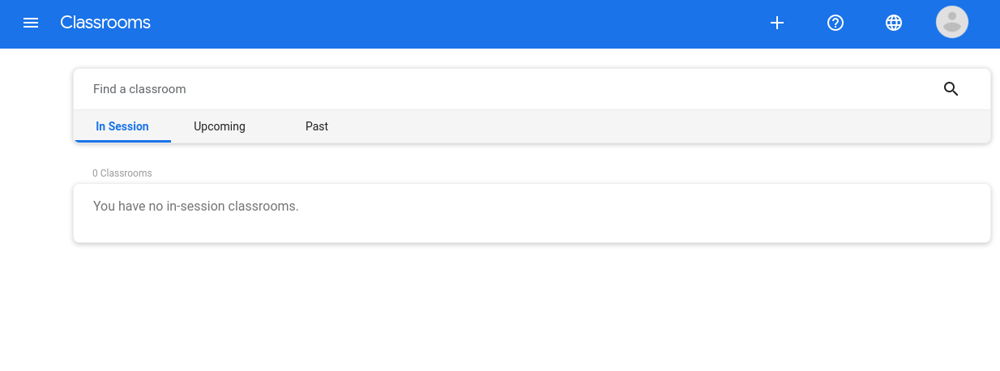

Click on the **+** button on the top right to create a new *Classroom*. First step is to choose the *Classroom Template*, as there's many of those, type `ghack` in the *Classroom template name* field and click on *Filter* button. Choose the right template from the filtered list.

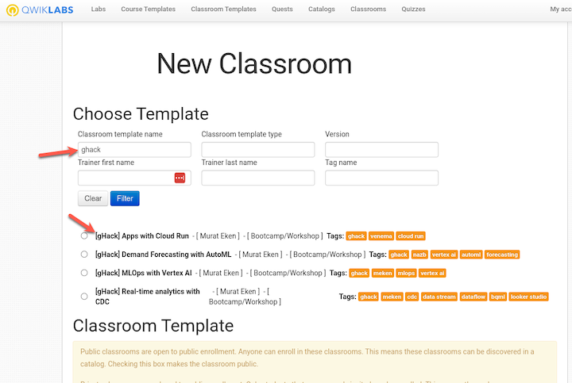

Untick the *Virtual Classroom* option, add the Lead Coach as a trainer and most importantly set the *start and end date* for the event. *Location* is required, but not as important as the *Timezone*.

> **Warning**
> Labs have a maximum duration and that value is set by the author of the gHack. If you try to set a start and end date longer than this duration, the classroom will default back to the maximum duration. If you need an instance longer than the default for the lab, get in contact with the gHack's author ASAP.

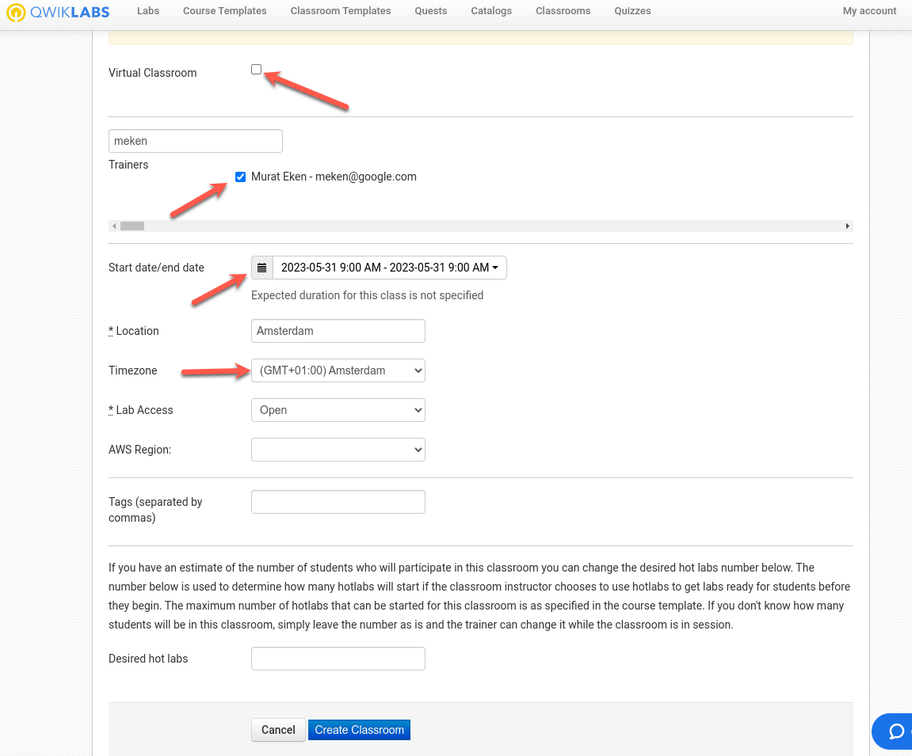.

> **Warning**  
> The *Timezone* you select is the one that applies to the *Start and End dates*, so pick the right one.

You can add tags to keep things discoverable for yourself. Once you're done with the configuration, click on the *Create Classroom* button.

You'll be forwarded to the next page to configure the subdomains, make sure to choose only * as the subdomain, which will then make your *Classroom* available at different URLs (ce.qwiklabs.com, explore.qwiklabs.com, taw.qwiklabs.com etc).

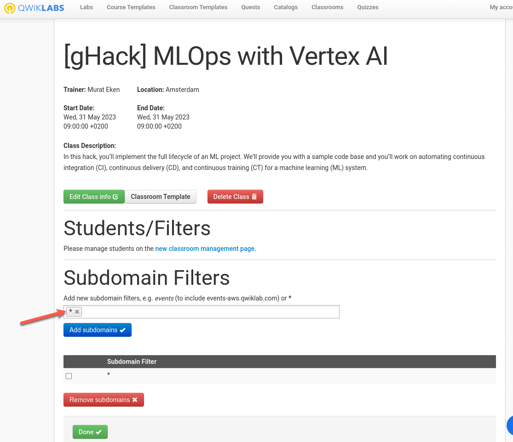

After clicking on *Done* you'll see the new *Classroom*.

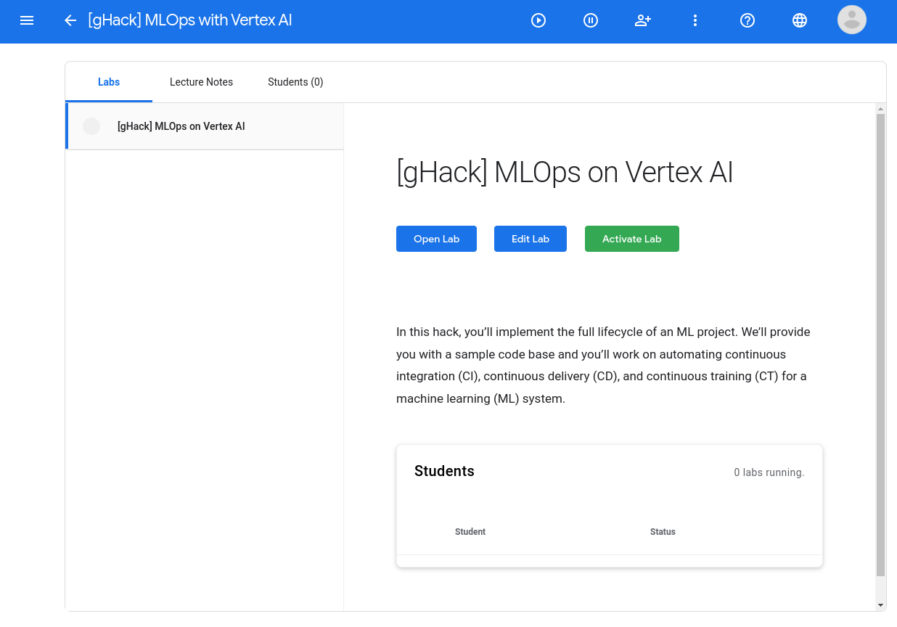

> **Warning**  
> The lab in the *Classroom* is not activated automatically, make sure that you activate it before the event by clicking on the *Activate Lab* button.

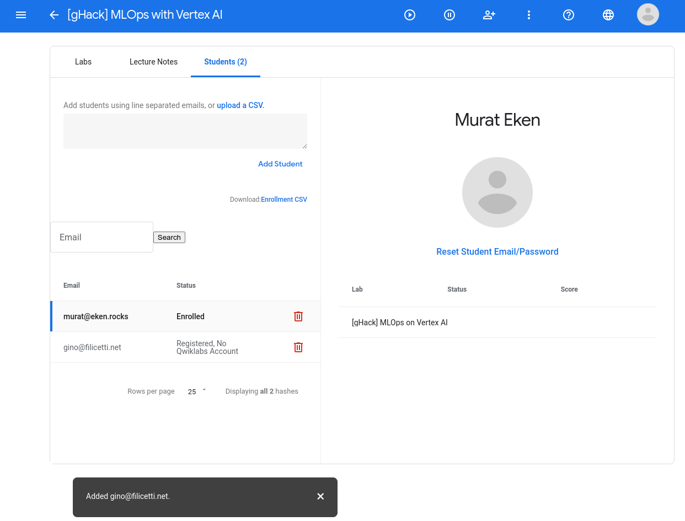

#### Workstation Security

Some organizations have tight security policies enforced on their employees' workstations. A common one is to not provide users with administrator privileges on their workstation. If this is the case, it may prevent them from installing tools or software needed to complete the hack.  

One workaround is to use the Google Cloud Shell. However, some organizations may disable access to the Google Cloud Shell. Another workaround is to provision a workstation VM in GCP that participants can SSH into to complete the hack.

Tight firewalls may make it challenging to access even the GCP Console itself from an organization's workstations. This is when you bang your head against the wall, give up, and be thankful you don't work for that organization.

All of these security concerns and their mitigation should be identified and addressed with your stakeholder at the customer at least **2 weeks** ahead of time.

### Google Space Creation

Now that all of the overhead is out of the way, it's time to build your event's Google Space.

This new Google Space will be used as the dedicated event space. This space will host documents, hold the Google Meet for the event along with its break-out rooms for each team and overall collaboration in real and near real-time.

We suggest naming your Google Space with at minimum the hack name and organization. You can also add the location or date too. This will make it easy for participants to remember what the Space was for after the event.

For example: `"gHack - Acme Corp - MLOps on GCP"`

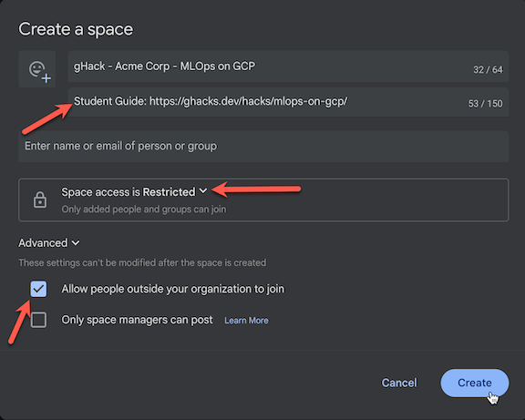

> **Note** Make sure that you check off the book to allow external users otherwise your customers won't be able to join.

> **Note** To access this new Google Space, the participants will need a Google account. This can be their work account if the company runs Google Workspace, or it can be a Gmail account. If a participant doesn't have a Google account, please have them create one **AHEAD OF TIME** for this event: [Click here to create a new Gmail account](https://accounts.google.com/signup/v2/webcreateaccount?biz=false&cc=US&flowEntry=SignUp&flowName=GlifWebSignIn)

### Space Structure

In our Google Space, we will have the following:

- **Add Participant** - The lead coach will click on `Add people & apps` and enter the email addresses of all the participants and coaches for this event.
  > **Note** See above, email addresses must be Google Workspace accounts or Gmail accounts to be able to join the Google Space. If an email is **NOT** a Google account it will turn **red**.
- **Student Guide** - The lead coach will paste a link to the student guide as the first entry in the chat.
- **Files** - The lead coach will click on `Share a file` and upload all files for the participants in this hack. See [Making Resources Available](#making-resources-available) below for information on creating the necessary files.
- **Chat** - Make sure to turn on History so that the chats are persisted between days.

 

- **Google Meet** - The lead coach will kick off by creating a new Google Meet in the space. This will be the central gathering spot for all the participants. This is where the kick off session, lectures, Q&A and the wrap up sessions are held together with all participants and coaches.

 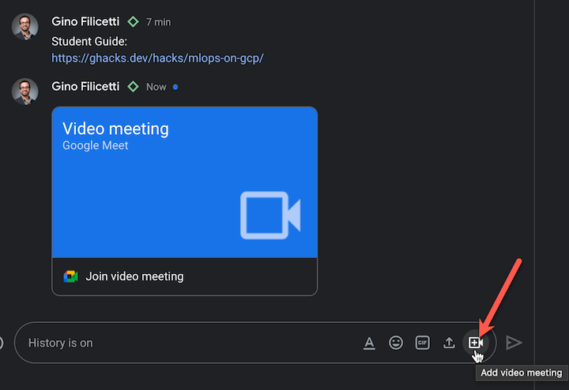

- **Make All Coaches Co-Hosts** - The lead coach will change the status of all coaches in the Google Meet and make them "co-hosts". This gives them the ability to float between breakout rooms as needed. Go to the **People** panel in Google Meet and click the 3 dots menu for each coach to make them co-hosts.

 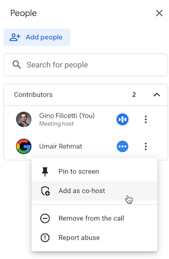

 > **Note** You must change the status of all coaches to "co-hosts" **BEFORE** creating breakout rooms or they will not have full co-host powers.

- **Breakout Rooms** - The lead coach will create 1 breakout room per team in the hack and name it appropriately. The participants will then join the breakout room they were assigned to work with their team. Coaches will join the breakout room for the team they were assigned. The lead coach (and other coaches if needed) will float around each of the breakout rooms as needed.

 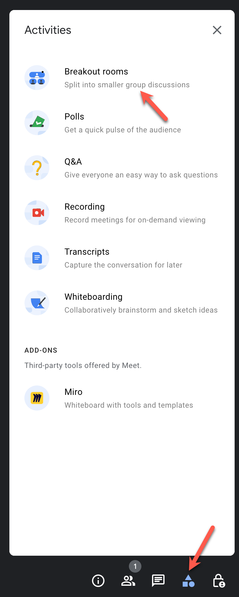
 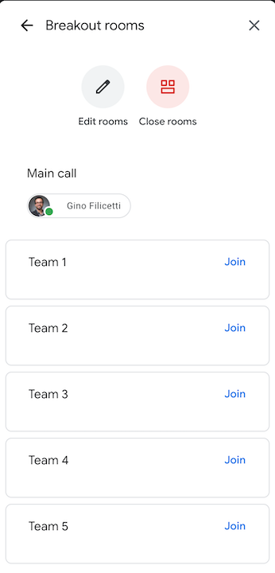
 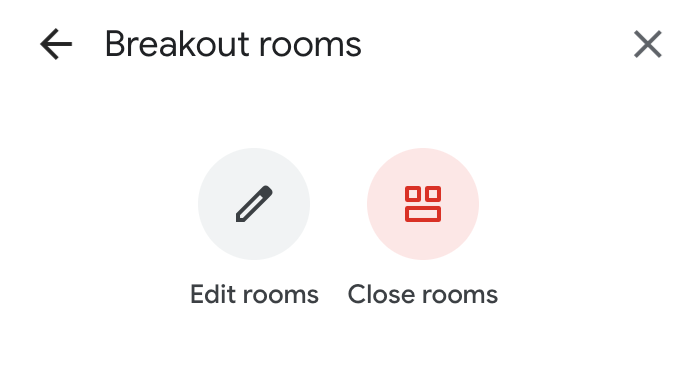

- **Coaches ONLY Chat** - The lead coach will create a multi-person chat for all the coaches to discuss things in private, away from participant eyes. Here you can put a direct link to the `solutions` folder for this hack from the github repo so coaches can easily look at solution files if they exist.

### Making Resources Available

If there are files that need to be made available to participants, we will do this through our Google Space's Files area. These files include:

- **ghack-setup.zip**: This contains Terraform scripts the participants will use to set up their environment.
- **student-resources.zip**: This contains all files in the `/resources` subfolder (if it exists).
- **lectures.pdf**: This is a PDF slide deck for lectures that will be presented during the hack (if it exists).

First we will create the needed zip files:

- Check if you have `make` installed on your computer
  - Open the **Terminal** program to get to a unix prompt.
  - Type `make --version`
  - Say yes if prompted to install command line developer tools
  - You should get the version number of make running the above command
- Run make to create a `ghack-setup.zip` file.
  - Run these commands:

    ```bash
    cd ./artifacts
    make
    ```

  - A new file called `ghack-setup.zip` will be created in the `/artifacts` folder of this hack
- Run make to create a `student-resources.zip` file.
  - Run these commands:

    ```bash
    cd ./resources
    make
    ```

  - A new file called `student-resources.zip` will be created in the `/resources` folder of this hack
- ***ALTERNATE***: If you can't get make to work, you can create the zip files by hand, just make sure the `resources` or `artifacts` folders are not included in the zip file.

Now we'll make everything available to the participants:

- Go to the new Google Space for your event and click on the **Files** tab and click on the **Add file** button.
- Upload `ghack-setup.zip`, `student-resources.zip` and `lectures.pdf` (if they exist).

 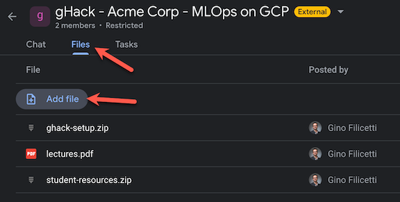

### Getting People To Your Event

Now that you have taken care of creating and preparing a Google Space for your hack, you need to get people to your hack.

#### Registration and Invites

It is up to you to decide how you will advertise your hack. You might send an invite to a larger group and let those interested RSVP by registering. Using [Google Forms](https://forms.google.com) is a great way to manage your event registration.

> **Warning** Be sure you understand the privacy implications of gathering personal information in a Google Form.

If you are hosting an hack for an external organization, you should coordinate with the event stakeholder to determine how participants will be invited. It is often best to let the event stakeholder manage the invite and registration process. That's one less job for you.

#### Add Registered Participants To Google Space

If you are hosting a virtual event, the event location ***IS*** the event Space you created in Google Chat. Therefore, it is important that the participants be added to the Space ***before*** the event.

Whether you used a Google Form or worked with an external organization stakeholder, you should gather the list of registered participants and add them to the Google Space a couple of days before the event.

> **Note** To add a participant to a Google Space, they will need a Google account. This can be their work account if the company runs Google Workspace or it can be a Gmail account. If a participant doesn't have a Google account, please have them create one **AHEAD OF TIME** for this event: [Click here to create a new Gmail account](https://accounts.google.com/signup/v2/webcreateaccount?biz=false&cc=US&flowEntry=SignUp&flowName=GlifWebSignIn)

**Example of adding participants to a Google Space:**

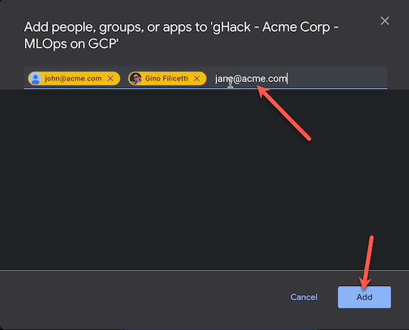

When someone is added to a Space, they will be emailed to accept the invite and join the Space.

> **Warning** The user will need to "activate" Google Chat if they've never used it before. Be aware of this, the link will be in the invite email.

> **Note** If the Space doesn't open up automatically for the user, they may need to click the '+' sign and select *Browse Spaces* and select the Space they were invited to.

#### Calendar Invite

Calendar invites are always important so participants don't forget about your event.
If someone is traveling to attend your event in person, they're not likely to forget to show up.  

When it comes to hosting a virtual gHacks event, a Calendar block is even MORE important. The key word is **BLOCK**! You need the participants to clear their calendar so they are dedicated to participating in the hack for the full event. Participants leaving part way through the hack are putting their team's success at risk.

We recommend sending a calendar invite to all registered participants as early as possible after they have registered. If you are hosting an external organization, coordinate with the event stakeholder to send the calendar invite.

When you create a calendar invite, you should include:

- A brief description of the event format
- A mention that they should have received an invite email for the event's Google Space.
- Instructions to make arrangements for others to cover their day jobs.
- Instructions to turn on their Out of Office messages.

## Event Day

The big day has arrived! It's show time!  Rest well and get a full night of sleep beforehand. You will need it to be fresh on hack day.

Below is the guidance on how to actually host and run a gHacks event:

- [Kick-Off Meeting](#kick-off-meeting)
- [Hacking](#hacking)
- [Stand Ups](#stand-ups)
- [In-Person Event Tips](#tips-for-in-person)
- [Virtual Event Tips](#tips-for-virtual)

### Kick-Off Meeting

Every gHacks event starts off with a Kick Off Meeting.  *How* you get to the kick off meeting depends on if it is a virtual or an in-person event.

#### Getting There: In Person

If you are hosting an in-person event, it is simple. Participants show up at the venue you shared with them in your invite, take a seat, and give you their full attention to kick off.

The in-person participants should be instructed to join the event's Google Space that they were invited to in email. Even though we'll be together in person during the hack, having access to a system to share files and code, etc is key.

#### Getting There: Virtual Event

Getting to the kick off meeting can be a little tricky for virtual participants. They will not join the kick off meeting the way they normally join a Google Meet from a calendar invite. Instead they will join a Google Meet that is taking place inside of the event's Google Space.

As covered in the [previous section](#event-preparation), participants should have been added to the Google Space before the event based on registration.

The lead coach should start the kick off meeting in the Google Space 15-20 mins before the kick off by clicking camera icon in the chat text field.


> **Note** To make things easier for external folks, you can make the meeting open to join without needing permission. Once you're in the meet, click on the **Host Controls** button, the lock icon at the very bottom right. Change **Meeting access type** to **Open**.

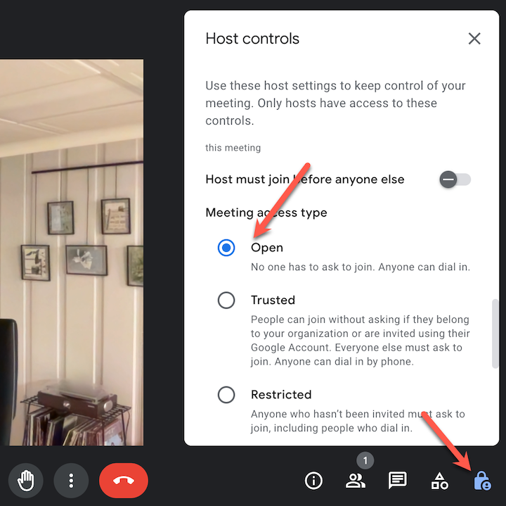

To join the kick off meeting, participants will first open up Google Chat and go to the event's Google Space. In there, they will find the icon to join the Google Meet that the lead coach created.

#### Welcomes & Intros

Now that you have everyone's attention, it is time to kick off by welcoming the participants and introducing the coaches. If it is a virtual event, we recommend the coaches turn on their cameras during the kick off as it helps drive the collaboration and interaction with the group.

If the size of the group is small, it is a good idea to get to know your participants by letting them introduce themselves.  Ask them to state their experience with the technology and what a successful event will look like for them.

For a large group, skip the participants intros (no one wants to be the 25th person to introduce themselves). Instead, the coaches should have the participants introduce themselves later when they split into their smaller teams.

#### Logistics

Once everyone is acquainted, the lead coach should cover the logistics. Start off by communicating the format and flow of the event. You should assume that the participants are not familiar with the gHacks format.

Explain the format:

- Participants will spend most of the time working in teams of 3-5 people to solve technical challenges.
- Challenges are not labs with step-by-step instructions. Participants will need to work together as a team to solve the challenge by researching documentation and following guidance from the coaches.
- Teams will move at their own pace through the challenges and not be beholden to the clock.
- There may be brief lecture presentations to the entire group at various points throughout the event to set up the hack's challenges.
- Break times will be set for lunch and the end of each hack day, however each team can set additional break times as needed.
- The coaches will bring the teams together at the beginning and end of each day for stand-up meetings to review progress and what they learned during each challenge.

Next, review how everyone will interact using the event's Google Space. The lead coach should provide a tour of the event Space, including showing the Files tab where the student resources for the hack are located, the link to the Student Guide and the event's Google Meet.

For a virtual event, the lead coach should explain how teams will use the breakout rooms to move into their team specific room and the larger meet.  Participants should be expected to be online and engaged in their team meetings for the duration of the event with mic and camera turned on.

At an in-person event, coaches may walk from table to table helping coach different teams. At a virtual event, they do the same by popping in and out of each team's breakout room throughout the event. When the coaches want all teams to come together, they will announce on each team's call to rejoin the main room.

#### Team Formation

Determine how you want to break the participants up into the smaller groups to form the hack teams. There are several options to consider:

- At an in-person event, the teams can be set by the table the participants sit at.
- Load balanced by skill level - This encourages a mix of experts and novices so that there is shared learning. Experts are encouraged to help novices.
- Segregated by skill level - This enables advanced participants to progress at a faster pace or take on additional challenges, while allowing novices to move at a less stressful pace as they work together to learn.
- Play Dodgeball - The lead coach nominates a few participants as team leaders. Allow the team leaders to pick their team members like in gym class at school.
- At a virtual event, given various participants locations, you may form teams by timezone. This enables teams to take break times that align to their timezone.
- Random

> **Note** If hosting a hack at an external organization, it is a good idea to ask the event stakeholder to help decide on team formation.

Once teams have been formed, encourage them to each give their team a fun name and rename their breakout room. This will help break the ice and get the team members collaborating out of the gate.

#### Event Kick Off Presentation Templates

To help you get started, we have provided a Google Slides template for kicking off a gHacks event here:

- [Make a copy of these slides](http://goto.google.com/ghacks-template-eventkickoff)
- [Or use this generic PDF](event-kickoff.pdf)

The kick off presentation template contains most of the instructions above that you can present to the participants before starting your gHacks event.

### Hacking

With the logistics out of the way, it is time to crank up the tech intensity.

#### Hack Presentation Lectures (Optional)

While not required, many of the hacks in the [gHacks collection](../README.md#the-ghacks-collection) have a PDF with lecture presentations included the `/resources` folder of the hack. These optional lecture presentations typically contain:

- An overview of the technical scenario of the hack itself.
- A review of workstation pre-requisites needed for the hack.
- Overviews for each challenge including technology concepts needed to complete them.

Before the teams depart the kick-off meeting, the lead coach should cover the hack overview, prerequisites, and overview of technology concepts for the first challenge.

Later, throughout the event, the lead coach should work with the coaches to monitor progress of the teams on each challenge. When the majority of teams (or individuals in a team) have completed a challenge, the lead coach should deliver the lecture for the next challenge. Ask those who are still working to pay attention to the short lecture, then return to completing the previous challenge.

At an in-person event, the lead coach calls everyone's attention to the front of the room to present. At a virtual event, the lead coach directs the teams to leave their breakout room and return to the main meeting.

Alternatively, if the teams are progressing at vastly different paces, the coaches may deliver the lecture for each challenge to the individual team in their own team meetings.

#### Hack Teams

Now it's time to get down to the business of solving the challenges as a team. If you are hosting an in-person hack, participants will start talking to each other and working together at their team tables to solve the challenges.

If it is a virtual event, the participants will leave the main meeting and gather in their team's breakout room and participate from there. The lead coach will take care of creating the breakout rooms and add each participant to their team's breakout room.

Once everyone is settled, the format and interactions are the same whether virtual or in-person:

- The individuals within the teams can now work together on their tasks, share screens, links, etc. to help complete the challenges.
- Teams must complete the challenges as a team. Individuals who complete a challenge before their team-mates should not continue to the next challenge. Instead, they should help other members of their team get over the finish line.
- While the team works together to solve challenges, it is expected that each individual contributes meaningfully to the group and completes the challenge on their own workstation.
- To ensure each individual is contributing to the team effort, we recommend one person be the "designated driver" for each challenge and share their screen with the team as they work through the challenge for all to observe. The rest of the team may be doing research or implementing the solution in parallel on their own workstation.
- As people get stuck the coaches should encourage them to talk through the issues with the team and share their screen to work through the challenge. Group collaboration is a very effective learning tool.  
- If a person within the team is having a problem that requires individual attention, the coach can ask the person to go to the coach's dedicated channel where they can start a channel meeting and work together to resolve the issues.
- Sharing is caring. As individuals or teams find useful tips and tricks, or solve roadblocks, the coaches should encourage them to share those items in the Google Space chat for everyone to see.
- Teams should not be beholden to the clock as they progress through the challenges. Therefore, they control their own schedule during the event and can decide to take breaks as needed outside of any scheduled meal breaks.

#### Hack Coaches

Coaches are essential to a gHacks event and can make the difference between a good experience and a poor experience for the participants. Ideally, there should be one coach per team. However, a coach with previous experience can reasonably manage two teams at the same time if there are not enough coaches available.

A coach's main role is to act as a technical advisor to the participants in a team. Coaches are not proctors who stand on the sideline and wait for participants to raise their hands for help. They should be actively engaged with the team(s) they are advising the majority of the time.

At an in-person event, the coaches should be sitting at the table with their team. At a virtual event, they should be engaged in their team's breakout room for the duration of the event.

Coaches will need to move around to interact with the lead coach, other coaches, or multiple teams. For example, a coach may ask another coach for help if a team runs into an issue that the coach does not know how to solve.

At a virtual event, the coaches can quickly jump in and out of the various team breakout rooms to check in on the team and provide support as required by joining the various channel meetings.

During the hack, a coach's responsibilities include:

- Keep the teams working as teams
  - Encourage participants to "learn from" and "share with" each other
  - If a coach observes individuals racing ahead, encourage them to help those who are behind.
  - Encourage participants to use the Google Space chat to collaborate/share info
  - Encourage participants to take turns "driving" for each challenge so each gets an opportunity to lead their team
- Help unblock teams that get stuck
  - Always and repeatedly encourage team members to unblock each other first
  - Provide hints, but not answers
- Repeat and confirm the challenge goals if there is ambiguity
  - If a coach observes an individual is blocked for a long time, help them get moving so they don't lose interest and disengage.
- Be a technical advisor and subject matter expert
- Provide hints/pointers to the teams on how to solve problems and where to find information.
  - Use the solutions in the Coach's guide to provide guidance, but do not share the guide with the participants
  - The Coach's guide will not be comprehensive. As subject matter experts, coaches should share their knowledge and explain key concepts to help the participants
- Notify the lead coach of unexpected blockers that arise during the event so they can be communicated to all teams and recorded for future reference.
- Verify that a team has completed each challenge by checking that they have met all of the success criteria.
- Solicit continuous feedback from the participants on their experience, the content, and what can be done to improve it. Encourage them to use the Google Space chat to share with all of the coaches and participants.

> **Note** Participants should not be judged on how far they get.  No trophies should be given for challenge completion.  If event hosts want to gamify/incentivize participants, they should focus on encouraging participants to share gained knowledge with each other.

### Stand-Ups

Throughout the event, the coaches should have various checkpoints or stand-ups that require all the individuals to take a break from hacking to... stand up. This is a good thing to do before starting a scheduled meal break, at the end of each day, and start of each subsequent day of the hack.

Coaches may have stand ups with their individual teams, or the lead coach may call all participants out of the breakout rooms and back into the main meeting to address them as a group.

Things that coaches should facilitate during a stand up:

- Require the participants to physically get up, stretch and take a minute away from their screens
- Ask for a quick status check of where the team is on a given challenge
- Review next steps and plan going forward to solve the challenges
- Upon completion of a challenge, discuss the solution and re-cap lessons learned.
- Review a technical concept that the team has struggled to understand

The lead coach should close out the gHacks event with a final stand-up that acts as a wrap-up session.

- Participants should be encouraged to share their parting thoughts and key learnings.
- Participant feedback should be solicited for a final time and notes collected by the lead coach
- Thank the participants for their time and dedication during the hack

### Tips for In Person

gHacks is designed to be a casual tech event. There are no formal requirements for hosting it in person other than a decent Internet connection.

If you have budget, spend it on food or swag.  Your participants will appreciate you for that.

There are plenty of guides out there for hosting a great in-person event. There's not much more we can add here.

### Tips for Virtual

gHacks were designed to be hosted as an in-person or virtual event. While most details of ***how*** to hack were covered earlier in this document, we wanted to share some tips and lessons learned for improving the virtual experience based on previous gHacks events that have been hosted.

- Require participants to keep an open mic and use cameras as often as possible. Noisy pets, kids, or spouses. It's all fine in the spirit of keeping remote participants engaged and feeling as though they are together.
- If a coach observes an individual on mute for long periods of time or not speaking up as the team hacks, the coach should reach out in a private chat to ask the person if they need help. The goal is to keep the person engaged in the hack and away from their email, phone, social media, etc.
- Coaches should never turn their cameras off so that participants know they are available, especially during any lectures or re-caps
- Stand-ups really need to be stand ups. Encourage participants to take a break from their screen and headsets and walk around. Sitting at a desk for long periods is not healthy.

Remote participants may be spread across timezones. There are multiple related learnings here:

- Participants should be in a similar timezone region (+/- 3 hours) to optimize scheduling and collaboration.
- Coaches should also be in the same timezone region. However, coaches can adjust their schedule to support remote participants in a different region if needed. For example, an east coast North American coach can agree to wake up early (4am) to support a virtual event scheduled for the European region.
- Balance kick-off and end times across a time zone region with an early start for the western-most time zone and a later end time for the eastern-most time zone.  For example, if hosting an event for North American participants, start at 7am Pacific/10am Eastern. End at 6pm Eastern/3pm Pacific.
- When forming teams, encourage folks to group by time zone. This allows the members of each team to take the same lunch or dinner break together.
- For a multi-day hack, after a shared kick-off meeting on day 1, coaches can designate the hours they will be available on the subsequent days. The teams can then decide to start earlier/finish later if all members are in the same time zone. For example, coaches can be available 10am-6pm Eastern. A team in the eastern time zone can start 9am and finish at 4pm. The team in the western time zone can work the same hours in their own time zone, resulting in them working the last hour without a coach.

It is possible to host a "hybrid" event that has some participants and coaches in person, and others remote. Here are recommendations from experiences we have had with different permutations:

- Hosting an in-person event with remote participants.
  - Group remote participants into one or more teams consisting only of remote participants. Don't mix and match.
  - Dedicate an in-person coach to support the remote teams
  - The dedicated in-person coach is responsible for making sure the A/V connections between the venue and the Google Meet for this event is working.
  - The dedicated in-person coach must represent the remote participants to the lead coach & other in-person participants. When questions come up online, the dedicated in-person coach can be the one to get the attention of the lead or other in-person coaches.
- Hosting an event where the participants are in-person, but the coaches are remote
  - This is a great solution when you want to host an event for participants in a different region
  - The coaches need to adjust their working hours to support the remote region.  For example, to support an event in Australia, a coach in the eastern US time zone would need to agree to work from 5pm to 1am.
  - This does require volunteers to be designated as facilitators in the physical venue. The facilitators are responsible for the A/V connectivity to the remote coaches and raising questions from participants in the venue to the online coaches.
- Hosting an event where individual teams work together in person, but distributed and remote from other teams.
  - For example, teams can work together in New York, Chicago, and Seattle. The lead coach may be in Chicago leading all three groups online.
