# How to Setup Your Environment

Before we can get started hacking, we need to set up our environment using a script provided by your gHack to provision all the needed resources.

This document has two sections, pick the one that corresponds to where you're running this gHack:

- [My Own Environment](#setting-up-your-own-environment)
- [A Qwiklabs Environment](#setting-up-a-qwiklabs-environment)

## Setting Up Your Own Environment

### Confirm Your Project Is Ready

Sign-in to the [Google Cloud Console](http://console.cloud.google.com/) and select the project that was assigned to you. Alternately, if you have permissions, you can create a new project for this hack.

### Start the Cloud Shell

Although you can use the Google Cloud command line interface locally on your machine, in this gHack you will be using the Google Cloud Shell instead to make it easier.

- From the GCP Console click the Cloud Shell icon on the top right toolbar:

    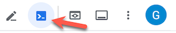

- It should only take a few moments to provision and connect to the environment. When it is finished, you should see something like this:

    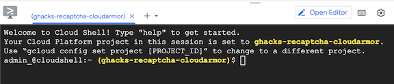

- This virtual machine is loaded with all the development tools you'll need. It offers a persistent 5GB home directory, and runs on Google Cloud, greatly enhancing network performance and authentication. All of your work in this gHack can be done completely in the browser.

### Upload and Unzip All Student Files

You've been given a set of files that you will need through-out this gHack. We need to copy them into the right places.

- In the Google Space for this gHack Event, go to the **Files** tab and download **ALL** available files to your computer.
  > **Note** Your hack may not come with all of these files, that's ok.

  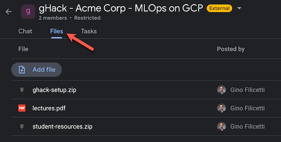

- Now go to the Cloud Shell, click the 3 vertical dots and select **Upload**.

  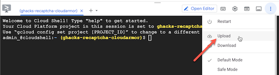

- If `student-files.zip` exists for your gHack you need to:
  - Upload it to the Cloud Shell
  - Run this command in the Cloud Shell to unzip it:
  
    ```bash
    unzip student-files.zip -d ~/student-files
    ```

- If `ghacks-setup.zip` exists for your gHack you need to:
  - Upload it to the Cloud Shell
  - Run this command in the Cloud Shell to unzip it:

    ```bash
    unzip ghacks-setup.zip -d ~/ghacks-setup
    ```

- Leave the unzipped student files where they are, we will be using them in various challenges throughout this gHack.

### Run Terraform to Provision Needed Resources

There are some resources that need to be created before starting our hack. We have consolidated these into a Terraform script that provisions everything for us. Each gHack will need to do something different in its script to get the environment ready, some examples are:

- Enabling the Google Cloud services we'll be using.
- Creating a net new VPC Network.
- Adding IAM permissions
- Creating Service Accounts

We need to run these commands to invoke the Terraform script and provision all of our pre-requisites:

```bash
cd ~/ghacks-setup
terraform init
terraform apply --auto-approve --var gcp_project_id=${GOOGLE_CLOUD_PROJECT} --var gcp_region=us-central1 --var gcp_zone=us-central1-a
```

You should see output similar to this:

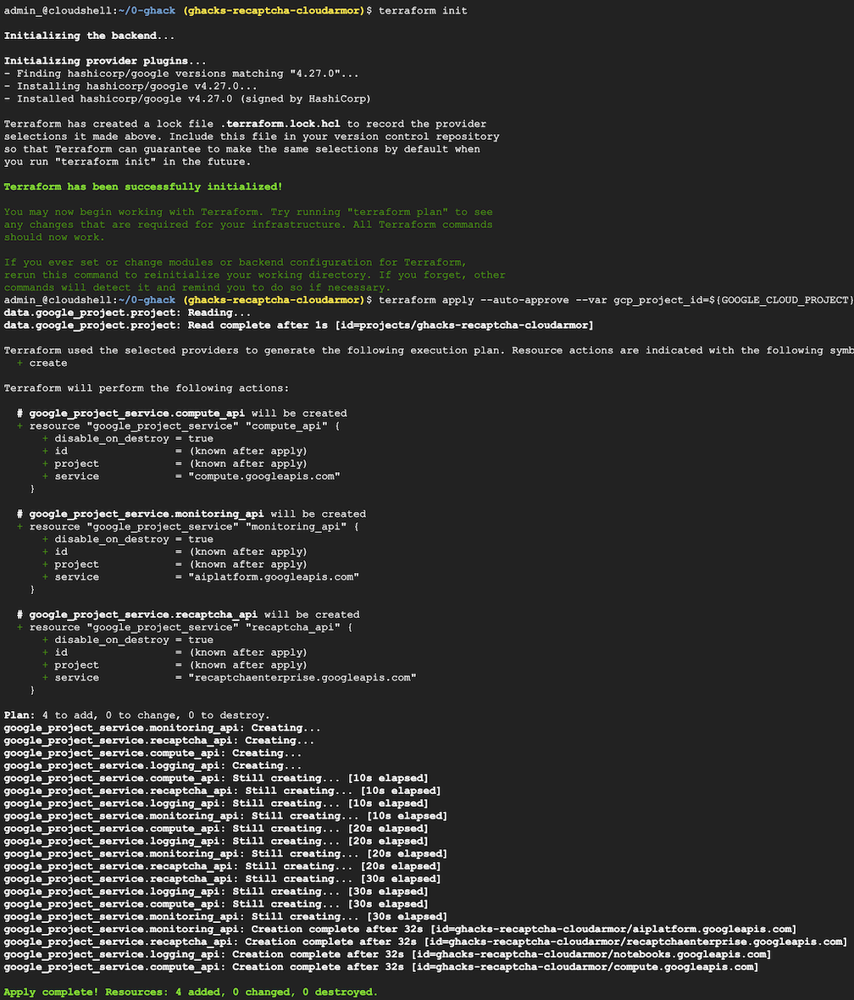

Keep track of the specific outputs, some labs might require that information. In case you lost that information, you can run the following command to list them again:

```shell
terraform output
```

## Setting Up A Qwiklabs Environment

Qwiklabs provide isolated sandbox environments to run gHacks. In principle a sandbox environment will include a single Google Cloud Project configured for 5 users (students). The *Terraform* scripts from the *artifacts* directory are executed automatically when the lab is started, so the participants don't have to do that themselves.

In order to get access to these environments, each team will pick **one** participant as the *Team Lead*. The Team Lead will create an account on the special [Qwiklabs instance for gHacks](https://explore.qwiklabs.com). Once this is set up, the Lead Coach will add the Team Lead's email account to the created *Classroom*.

### Qwiklabs Instance

When the *Classroom* is started (on the day of the event), the participant that has created the account (Team Lead) can log in to the [Qwiklabs instance](https://explore.qwiklabs.com) and will see the lab displayed on the home page.

> **Warning**  
> Only the Team Lead needs to join the Qwiklabs instance and follow the instructions below to start the lab.

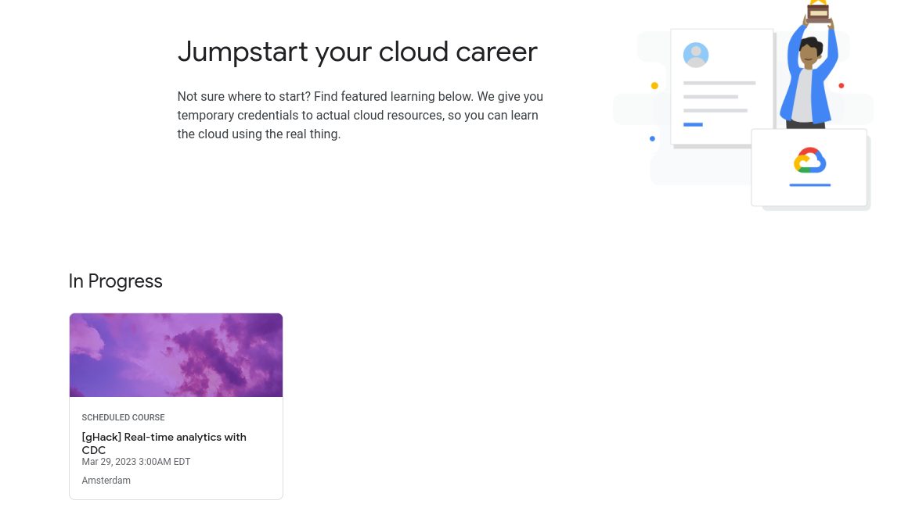

Once the Team Lead clicks on the course, and picks the lab, the lab can be started by clicking on the *Start* button.

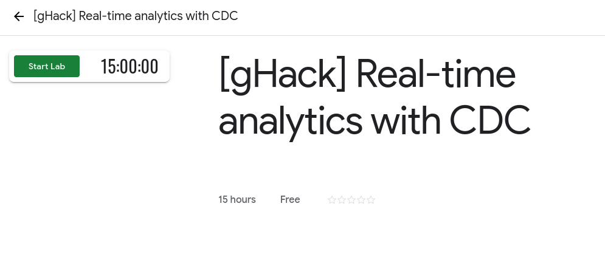

After the lab has started, on the left side of the screen, there will be a set of user names and passwords that can be used for logging in to the Google Cloud Console.

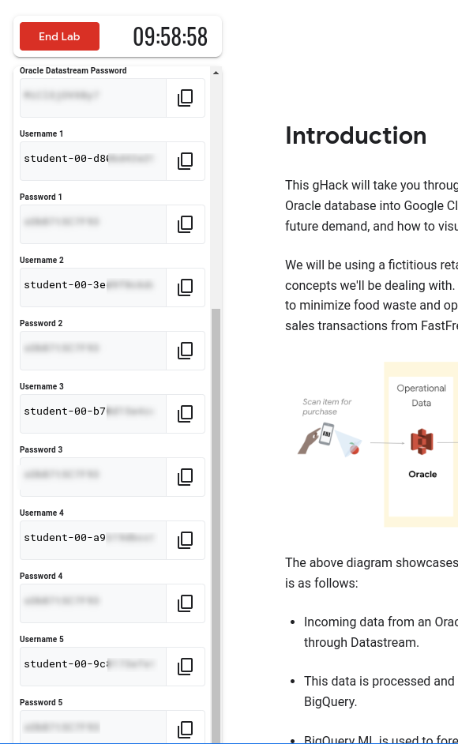

Although the passwords are the same, the user names will be different. The Team Lead will need to distribute this information to the rest of the team so that everybody can log in to the same project as *different* users.

### Google Cloud Console

Next step is to open the [Google Cloud Console](https://console.cloud.google.com) in **incognito** mode and log in to the project. Everyone on the team will need to complete these steps using the username password that has been assigned to them by the Team Lead.

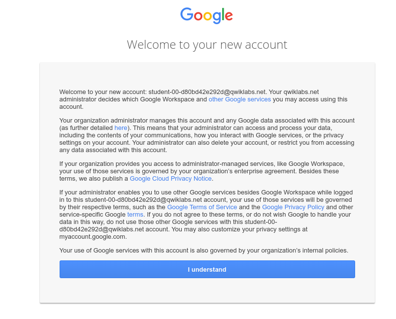

Once you've logged in, you'll need to accept the *Terms of Service*

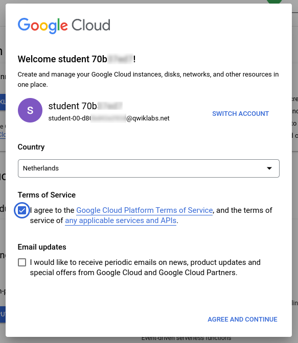

And pick the right project by clicking on *Select a Project*

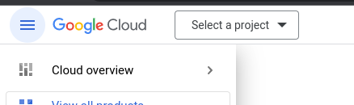

And choose the project that starts with *qwiklabs-gcp*

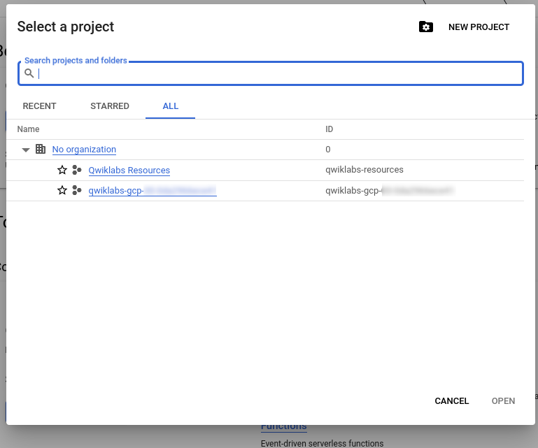

If your gHack requires you to set up student resources, you'll be provided a `student-files.zip`. In that case follow the instructions in [this](#upload-and-unzip-all-student-files) section to complete the setup. In Qwiklabs mode you can ignore the `ghacks-setup.zip` as that has been executed automatically for you.

> **Note**  
Since every team member will have access to the same Google Cloud Project, we recommend assigning a different *driver* for each challenge so that everybody gets to participate hands-on. The *driver* can share their screen so that the rest can see what's going on.

> **Warning**
> Although the Qwiklabs lab will include the instructions for the hack, we recommend you to follow the instructions on the [gHacks website](https://ghacks.dev) as those are accessible to **all** students (only the Team Lead will be logged into the Qwiklabs instance) and have a better layout.

## Success Criteria

- You have a project for your hacking
- You've confirmed that Cloud Shell is working for you
- You've uploaded and unzip student resources if they were provided
- You've run the Terraform script to install all needed pre-requisites if you're not using Qwiklabs

## Learning Resources

- [Creating and Managing Projects](https://cloud.google.com/resource-manager/docs/creating-managing-projects#before_you_begin)
- [VIDEO: Running Terraform in Cloud Shell](https://youtu.be/flNnefErtL0)
- [Terraform Documentation](https://developer.hashicorp.com/terraform/docs)
