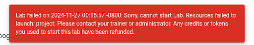
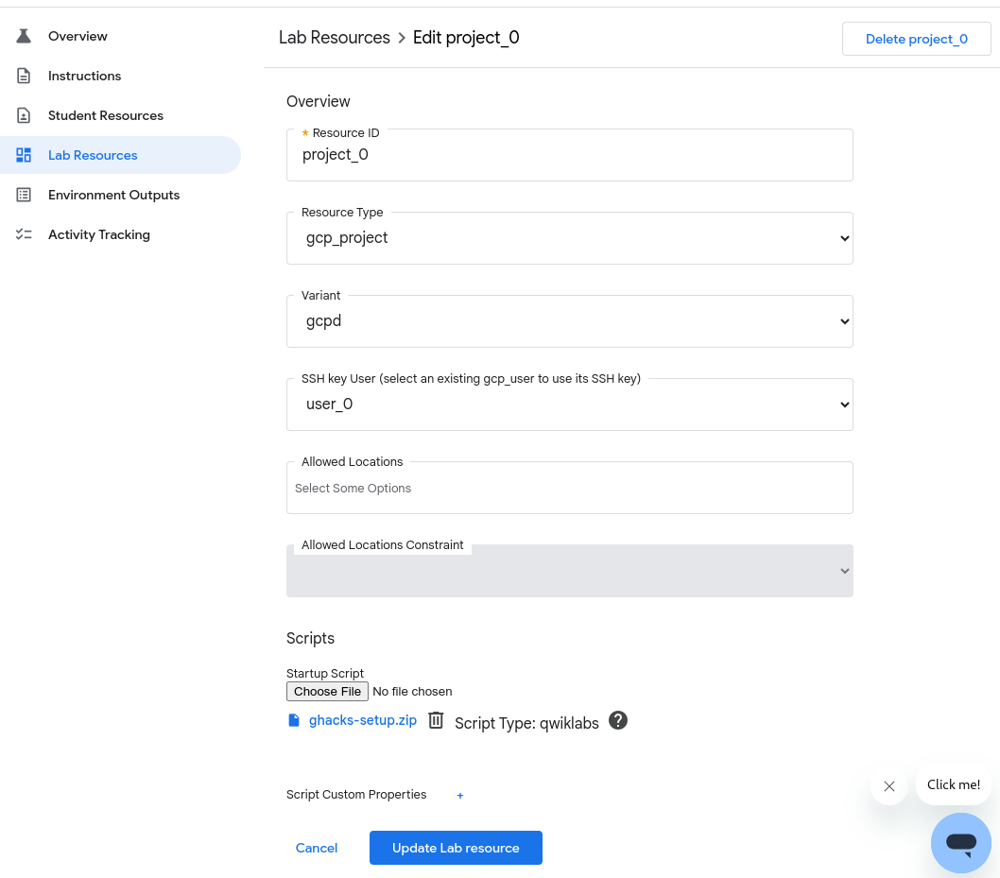
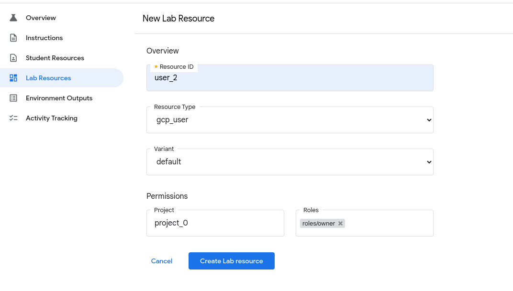

# How To Troubleshoot a gHack Lab

## Introduction

Although all gHacks are thoroughly reviewed and tested before they are added to the catalog, there have been a few incidents where a lab wasn't starting just before an event 😬. Even though in all those cases the culprit was referencing the *latest version* of a 3rd party dependency from the Terraform setup scripts and we nowadays expect and scrutinize authors to fix the versions of their 3rd party dependencies, you can follow the steps laid out in this document to investigate and potentially solve a potential problem in the unlikely event that you might still encounter it.

## Labs

New gHacks are added to the gHacks catalog through PRs on this Github repository. During that process the Terraform scripts are validated and tested by the authors as well as the maintainers of the repository by running them in new Argolis projects and in empty labs to ensure that they are reproducible. Once the PR is merged to the gHacks repository, there's an additional process that promotes it as a lab to the *Labs for Sales* environment which yields the official lab and makes that part of the Labs for Sales catalog. This lab is automatically created based on the configuration in the repository (`qwiklabs.yaml`, Terraform scripts etc). The automation is triggered by either maintainers of this repository and the final vetting is done by BDFL of Labs for Sales instance. Once the official lab is live, it's basically read-only, even for the authors.

## Error messages

The labs are initialized by running the Terraform scripts that are part of the gHacks during their startup. If something goes wrong during that process, the lab will fail with an error message such as *Resources failed to launch*:

There are cases where intermittent errors happen, so if another lab also shows the same error, it might be a global Labs for Sales instance related issue. Otherwise there's a real problem with the lab. In both cases, you can contact support. If you navigate to go/lfs you'll see a link to 24/7 support for Labs for Sales. They could get you the underlying error message if you have no access yourself.

## Fixing the problem

Once you've established that there's an issue with the Terraform scripts, you'll need to fix it. You could try to contact the author for help as they would be the most knowledgeable about the Terraform scripts and might have helpful pointers, but keep in mind that with the various time zones and daily responsibilities they might not be available. In that case, you'll have to experiment yourself with the available people. The recommended way is to create a fresh Argolis project and deploy the specific Terraform scripts from this repository in that environment (you can use Cloud Shell to clone this repository, and run Terraform as Cloud Shell has all the necessary tooling and the context). This will give you more control over parameters, allow you to iterate faster and provide better (potentially more verbose) error messages. But do keep in mind that Argolis has very strict Organization Policies in place so you might need to turn some of those off (mainly external IPs, shielded boot and the default network).

If you feel comfortable with the fixes, you should create an empty lab, and upload the fixed Terraform scripts as a *Project resource* in order to verify that the scripts also run successfully in the Labs for Sales environment.

## Updating the lab

After fixing the issue with the Terraform scripts you'll need to update the official lab. There's only a few people (super-authors) that can make limited manual changes to the deployed official labs. Any other change requires a PR in the gHacks repository (which needs to be reviewed), then a manual promotion to Labs for Sales (although this is pretty much scripted, it still needs to be manually triggered by the maintainers of this repository) and finally a manual approval by the maintainer of Labs for Sales. So, this approach won't be useful when you're in a hurry and/or under pressure to fix a lab in front of a full room of eager students… (although hopefully you'll never be in this situation as you'd test things way before the event, right? 😀)

So, if you're under pressure, you should create a new lab from scratch with the new/updated Terraform scripts. In that case you'll need to create a new lab (you could use the README.md of the gHack to initialize its instructions, although that's optional as students won't see the lab instructions). Then go to the *Lab Resources* section of the new lab and add the bundled zip file that contains the Terraform scripts and `runtime.yaml` (use the `Makefile` to create the zip, `make clean && make`) and configure that as the *Startup script*.

Then add 5 users to that lab which have the *Owner* role on the project

Once you have configured all 5 users, go to *Environment Outputs* and click on the link *To add the typical default environment outputs click here* This will add the user names/passwords & project id to the left panel when the lab starts. If you have additional Terraform outputs that need to be displayed there, you'll have to add those by clicking on the *Add Environment Output* button and using `project_0.startup_script.<custom_script_property>` (and replacing `<custom_script_property>` with the output name from your Terraform script).

After having configured these resources, you'll need to update the *Classroom Template* by including the new lab. In case you don't have edit rights, you can create a new *Classroom Template* and configure it with the new lab. Then update the *Classroom* (go in edit mode and choose the new or the updated *Classroom Template* and save) and don't forget to activate the new lab in the *Classroom*.
