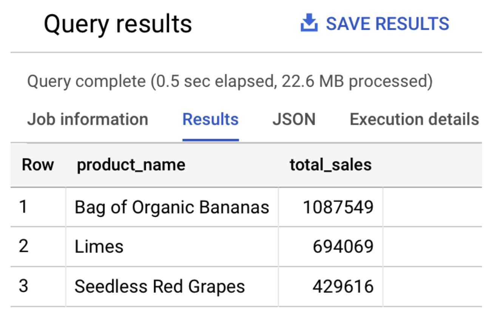

# Challenge 3 - Analyzing Your Data in BigQuery

[< Previous Challenge](./Challenge-02.md) - **[Home](../readme.md)** - [Next Challenge>](./Challenge-04.md)

## Introduction

After a few minutes, your backfilled data replicates into BigQuery. Any new incoming data streams into your datasets in (near) real-time. Each record  is processed by the UDF logic that you defined as part of the Dataflow template.

A real time view of the operational data is now available in BigQuery. You can run queries such as  comparing the sales of a particular product across stores in real time, or to combine sales and customer data to analyze the spending habits of customers in particular stores.

The following two new tables in the retail dataset are created by the Dataflow job:

- `ORDERS`: This output table is a replica of the Oracle table and include the transformations applied to the data as part of the Dataflow template:
- `ORDERS_log`: This staging table records all the changes from your Oracle source. The table is partitioned, and stores the updated record alongside some metadata change information, such as whether the change is an update, insert, or delete.

## Description

1. In BigQuery Console, run the following SQL to query the top three selling products:

    ```sql
    SELECT product_name, SUM(quantity) as total_sales
    FROM `retail.ORDERS`
    GROUP BY product_name
    ORDER BY total_sales desc
    LIMIT 3
    ```

    The output should be similar to the following:

    

1. In BigQuery, execute the following SQL statements to query the number of rows on both the `ORDERS` and `ORDERS_log` tables:

    ```sql
    SELECT count(*) FROM `hackfast.retail.ORDERS_log`;
    SELECT count(*) FROM `hackfast.retail.ORDERS`;
    ```

    **NOTE:** With the backfill completed, both statements return the number `520217`. Please wait until the backfill is done before closing this challenge.


## Success Criteria

- **TODO**: Need success criteria

## Learning Resources

- **TODO**: Need learning resources

*List of relevant links and online articles that should give the attendees the knowledge needed to complete the challenge.*

- link 1
- link 2
- link 3