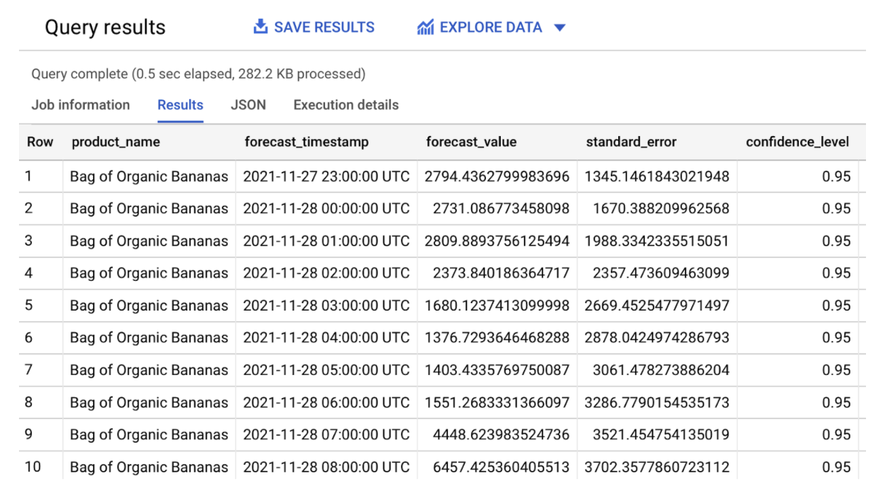
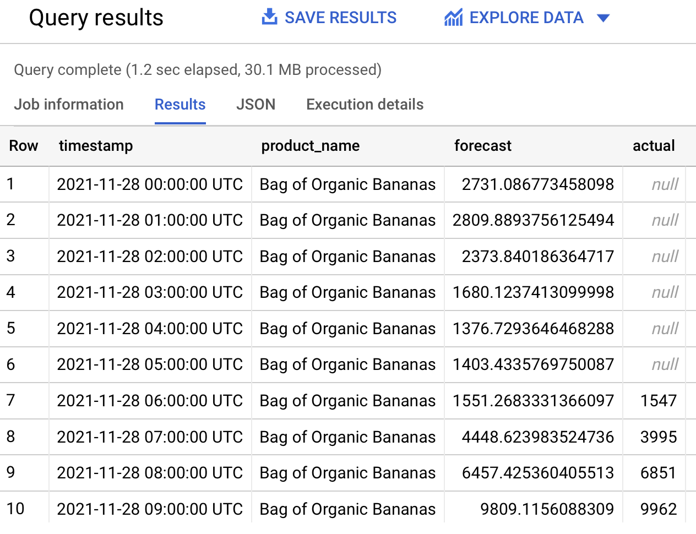

# Challenge 4 - Building a Demand Forecast

[< Previous Challenge](./Challenge-03.md) - **[Home](../readme.md)**

## Introduction

BigQuery ML can be used to build and deploy [demand forecasting](https://cloud.google.com/architecture/demand-forecasting-overview) models using the [ARIMA_PLUS](https://cloud.google.com/bigquery-ml/docs/reference/standard-sql/bigqueryml-syntax-create-time-series) algorithm. In this section, you use BigQuery ML to build a model to forecast the demand for products in store.

## Description

### Prepare your training data
Here you will use parts of the replicated data as training data to your model.

The training data  describes for each product (`product_name`), how many units were sold (`total_sold`) per hour (`hourly_timestamp`).

1. Using the BigQuery console, **run** the following SQL to create and save the training data to a new `training_data` table:

    ```sql
    CREATE OR REPLACE TABLE `retail.training_data`
    AS
        SELECT
            TIMESTAMP_TRUNC(time_of_sale, HOUR) as hourly_timestamp, product_name, 
            SUM(quantity) AS total_sold
        FROM `retail.ORDERS`
        GROUP BY hourly_timestamp, product_name
        HAVING hourly_timestamp 
        BETWEEN TIMESTAMP_TRUNC('2021-11-22', HOUR) AND TIMESTAMP_TRUNC('2021-11-28', HOUR)
    ORDER BY hourly_timestamp
    ```

1. **Run** the following SQL to verify the training_data table:

    ```sql
    SELECT * FROM `retail.training_data` LIMIT 10;
    ```

    

### Forecast Demand
1. Still In BigQuery, execute the following SQL to create a time-series model that uses the ARIMA_PLUS algorithm:

    Options to use for model named: `retail.arima_plus_model`:

    ```sql
    MODEL_TYPE='ARIMA_PLUS',
    TIME_SERIES_TIMESTAMP_COL='hourly_timestamp',
    TIME_SERIES_DATA_COL='total_sold',
    TIME_SERIES_ID_COL='product_name'
    ```

    SQL to use: 
    
    ```sql
    QUERY hourly_timestamp, product_name AND total_sold FROM OBJECT retail.training_data
    ```

    ***HACK NOW!*** *You can find information to hack this task [at this link.](https://cloud.google.com/bigquery-ml/docs/reference/standard-sql/bigqueryml-syntax-create-time-series)*

1. Run the following SQL to forecast the demand for organic bananas over the next 30 days:

    **NOTE:** The [`ML.FORECAST`](https://cloud.google.com/bigquery-ml/docs/reference/standard-sql/bigqueryml-syntax-forecast) function is used to forecast the expected demand over a horizon of n hours.

    ```sql
    SELECT * FROM ML.FORECAST(MODEL retail.arima_plus_model, STRUCT(720 AS horizon))
    ```

    The output should be similar to:

    

    Because the training data is hourly, the horizon value will use the same unit of time when forecasting (hours). A horizon value of 720 hours will return forecast results over the next 30 days.

    **NOTE:** Since this is a small sample dataset, further investigation into the accuracy of the model is out of scope for this tutorial.

### Create a view for easier visualization
1. In BigQuery, **run** the following SQL query to create a view, joining the actual and forecasted sales for a given product:

    ```sql
    CREATE OR REPLACE VIEW retail.orders_forecast AS (
    SELECT
    timestamp,
    product_name,
    SUM(forecast_value) AS forecast,
    SUM(actual_value) AS actual
    FROM
    (
    SELECT
        TIMESTAMP_TRUNC(TIME_OF_SALE, HOUR) AS timestamp,
        product_name,
        SUM(QUANTITY) as actual_value,
        NULL AS forecast_value
        FROM retail.ORDERS
        GROUP BY timestamp, product_name
    UNION ALL
    SELECT
        forecast_timestamp AS timestamp,
        product_name,
        NULL AS actual_value,
        forecast_value,
            FROM ML.FORECAST(MODEL retail.arima_plus_model,
                STRUCT(720 AS horizon))
        ORDER BY timestamp
    )
    GROUP BY timestamp, product_name
    ORDER BY timestamp
    )    
    ```

    **NOTE:** This view lets Looker query the relevant data when you explore the actual and forecasted data.

1. Still in BigQuery, **run** the following SQL to validate the view:

    ```sql
    SELECT * FROM retail.orders_forecast
    WHERE PRODUCT_NAME='Bag of Organic Bananas'
    AND TIMESTAMP_TRUNC(timestamp, HOUR) BETWEEN TIMESTAMP_TRUNC('2021-11-28', HOUR) AND TIMESTAMP_TRUNC('2021-11-30', HOUR)
    LIMIT 100;
    ```

    You see an output that is similar to the following:

    

    As an alternative to BigQuery views, you can also use Looker’s built-in derived tables capabilities. These include built-in derived tables and SQL-based derived tables. For more information, see [Derived Tables in Looker](https://docs.looker.com/data-modeling/learning-lookml/derived-tables).

## Success Criteria

- Table **retail.training_data** created
- ARIMA model **retail.arima_plus_model** created
- View **retail.orders_forecast** created


## Learning Resources

- [Creating and Using BigQuery Tables](https://cloud.google.com/bigquery/docs/tables)
- [Creating Views in BigQuery](https://cloud.google.com/bigquery/docs/views)
- [Creating ARIMA_PLUS Model](https://cloud.google.com/bigquery-ml/docs/reference/standard-sql/bigqueryml-syntax-create-time-series)