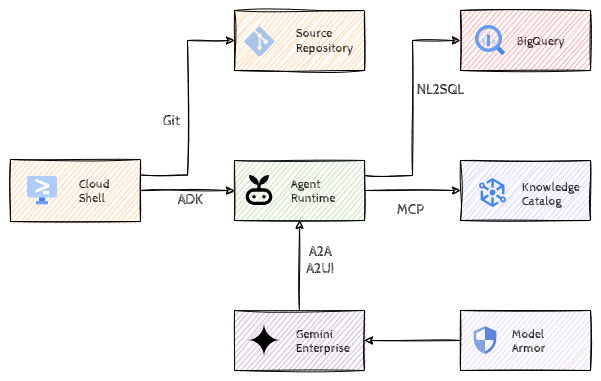

# Gemini Enterprise with ADK

## Introduction

In this hack, you will take on the role of a developer helping Sara, a Product Owner at a retail bank. Sara needs to analyze numbers for a newly launched product, and she wants to use a conversational interface that can tap into the bank's data. You will build an end-to-end business solution using the Agent Development Kit (ADK) and Gemini Enterprise.



## Learning Objectives

1. Set up and deploy an ADK agent to Agent Runtime on Google Cloud.  
2. Integrate BigQuery with natural language querying capabilities.  
3. Extend agent capabilities using MCP (Model Context Protocol) servers.  
4. Integration with Gemini Enterprise app.  
5. Implement A2UI for data visualization.  

## Challenges

- Challenge 1: Getting Started with ADK  
  - Clone skeleton code, run it locally in Cloud Shell.  
- Challenge 2: What's the date?
  - Basic tools
- Challenge 3: Talking to BigQuery  
  - Integrate the BigQuery toolset to query banking data using natural language.  
- Challagen 4: Agent Runtime
  - Scalable Agent hosting platform
- Challenge 5: Knowledge Catalog Integration  
  - Connect an MCP server to provide the agent with metadata and knowledge.  
- Challenge 6: Gemini Enterprise Integration  
  - Make the agent A2A compatible and register it as a custom agent in Gemini Enterprise.  
- Challenge 7: Visualizing Data (A2UI)  
  - Generate and visualize charts directly in the chat interface.  

## Prerequisites

- Access to a Google Cloud Project with the required APIs enabled.  
- Cloud Shell environment.  
- Familiarity with Python and basic SQL.

## Challenge 1: Getting Started with ADK

### Introduction

The first step is to get familiar with the [ADK](https://adk.dev/) (Agent Development Kit) and the deployment process. You will start with a skeleton project and see how to run it in your local environment before moving it to the cloud.  

### Description

We’ve already prepared a code base for you and put it in a Git repository (your coach will provide you the link). Clone that on Cloud Shell, create a virtual environment, activate it and install the Python dependencies from the `requirements.txt`. Configure the agent to use user credentials for local development through Agent Platform.

Once everything is set up, run `adk web` and make sure that the agent responds back.

### Success Criteria

- The Git repository has been cloned to Cloud Shell.  
- You get no errors when you greet the agent from the `adk web` UI.  
- No code was modified.

### Tips

- The utility `adk web` is part of ADK CLI that gets installed when you install the dependencies in your virtual environment.
- Newer versions of the `adk web` feature require you to set the `--allow_origins` to `"*"`

### Learning Resources

- [Cloud Shell](https://cloud.google.com/shell/docs/launching-cloud-shell)  
- [Cloud Shell Editor](https://cloud.google.com/shell/docs/launching-cloud-shell-editor)  
- [Previewing web apps](https://cloud.google.com/shell/docs/using-web-preview)  
- [Setting up authentication for ADK](https://adk.dev/agents/models/google-gemini/#google-cloud-agent-platform)
- [ADK CLI](https://adk.dev/api-reference/cli/#adk)

## Challenge 2: What's the date?

### Introduction

Although LLMs by themselves are powerful, they're not omniscient nor omnipotent. They need additional capabilities to get access to real-time data and to execute actions. This is where *Tools* play a role, they provide a way for LLMs/agents to access external systems, databases, or APIs; basically augmenting the LLM's knowledge base and enabling it to perform more complex operations.

### Description

If we'd ask our agent the current date, it would emit a date from the past. In order for our agent to be informed, we'll introduce a new function tool that returns the current date.

Create a new Python function `get_current_date` that returns the current date in `YYYY-MM-DD` format. Add a [docstring](https://peps.python.org/pep-0257/#one-line-docstrings) to that function explaining what it returns and in which format. Make that function available as a tool to the agent.

Commit and push your changes to the Git repository when you're done.

### Success Criteria

- When you ask the agent what the current date is, it returns today's date (it's okay if the UI shows it formatted differently).
- All the changes are committed and pushed to the Git repository.

### Learning Resources

- [Example function tool in ADK](https://adk.dev/tools-custom/function-tools/#example)

## Challenge 3: Talking to BigQuery

### Introduction

Our end user, Sara, needs to know how the new product is performing. Instead of writing SQL queries, she wants to ask questions in plain English.

We need a tool that can execute SQL queries. Luckily ADK comes pre-packaged with a toolset that can interact with BigQuery.

### Description

Update your agent to include the `BigQueryToolset` and filter the tools to use **only** the `execute_sql` tool.

Once the agent can run SQL queries successfully, commit and push your changes.

### Success Criteria

- Ask the agent: *How many accounts were created in the last 10 days not including today?*. This should result in 10 or 11 (data is randomly generated).
- All the changes are committed and pushed to the Git repository.

### Tips

- You should stick to the Application Default Credentials authentication method, we have provided some utility methods in `helpers.py`, you might want to have a look at that.

### Learning Resources

- [BigQuery Toolset in ADK](https://adk.dev/integrations/bigquery/)

## Challenge 4: Agent Runtime

### Introduction

So far we have been running things locally, it's now time to move it to the cloud so it can be hosted in a scalable and a secure way. We'll use Agent Platform [Agent Runtime](https://docs.cloud.google.com/gemini-enterprise-agent-platform/build/runtime) for that.

### Description

Deploy your agent to Agent Runtime using the ADK CLI, make sure that the Agent Runtime uses Agent Identity. Grant the required permissions to the identity of the Agent so that it can read data from and run jobs on BigQuery.

Once the agent can run SQL queries successfully on Agent Runtime (through the Playground section), commit and push your changes.

### Success Criteria

- Ask the agent on Agent Runtime: *How many customers joined last year?*.
- All the changes are committed and pushed to the Git repository.

### Tips

- Agent Runtime used to be called Agent Engine, some ADK CLI options still use that terminology
- If you need to redeploy your agent, provide the `--agent_engine_id` option so that it *replaces* your deployment (and doesn't create a new agent with a new identity)

### Learning Resources

- [Deploying with ADK CLI](https://adk.dev/api-reference/cli/#adk-deploy)
- [Agent Identity](https://docs.cloud.google.com/gemini-enterprise-agent-platform/scale/runtime/agent-identity)

## Challenge 5: Knowledge Catalog Integration

### Introduction

We have some cryptic abbreviations in our data. If we ask a follow up question to our agent, it would gladly make up terminology. However we want it to use our own Business Glossary. Typically this is done through [Knowledge Catalog](https://docs.cloud.google.com/dataplex/docs/introduction) on Google Cloud. And luckily again, we can access that as a tool.

Google Cloud provides various MCP (Model Context Protocol) servers with various tools, one of them being the Knowledge Catalog that provides metadata about the data.

### Description

We have already created a Business Glossary in Knowledge Catalog. Integrate the Knowledge Catalog MCP server into your agent and verify that you can resolve abbreviations. If everything works fine locally, redeploy your agent to Agent Runtime. Don't forget to grant the required permissions to the identity of the Agent (to read from Knowledge Catalog and use MCP Tools).

Once the agent can resolve abbreviations and run SQL queries successfully, commit and push your changes.

### Tips

- Keep in mind that this MCP server is a remote server available through Streamable HTTP.

### Success Criteria

- Ask the agent on Agent Runtime: "What's the adoption rate of Advantage Plus accounts in the last quarter?" and verify that the result is around ~20%.
- All the changes are committed and pushed to the Git repository.

### Learning Resources

- [MCP Toolset](https://adk.dev/tools-custom/mcp-tools)
- [Knowledge Catalog MCP](https://docs.cloud.google.com/dataplex/docs/use-remote-mcp)
- [Knowledge Catalog MCP Server reference](https://docs.cloud.google.com/dataplex/docs/reference/mcp)

## Challenge 6: Gemini Enterprise Integration

### Introduction

Now that your agent is powerful, it's time to make it available where Sara works: Gemini Enterprise app.

### Description

First create a new Gemini Enterprise app instance and choose Google Managed Identity model.

Import your agent into Gemini Enterprise app, and verify that the Agent is available and functional from Gemini Enterprise app.

### Success Criteria

- In the Gemini Enterprise app, ask the agent: "What are the available banking products?" and verify the response is: `TODO`  

### Learning Resources

- Gemini Enterprise app import custom agent

## Challenge 7: Visualizing Data (A2UI)

### Introduction

Numbers are great, but charts are better. Sara wants to see visual trends of the product's performance. Now, typically we’d have to build a custom UI or a dashboard to show various UI elements, but the [A2UI project](https://a2ui.org/) enables AI agents to generate rich, interactive user interfaces that render natively across web, mobile, and desktop, without executing arbitrary code. And Gemini Enterprise app has support for [basic UI components](https://a2ui-composer.ag-ui.com/basic-catalog) as well as charts.

### Description

In principle our agent could generate A2UI specs (the declarative model for a UI) if we prompted it properly. However, we’re going to keep things simple, and we’ll put the data in A2UI format ourselves using the ADK callback functionality.

Update the agent instructions to return data in csv format surrounded with `<chart></chart>` tags *only* when the user asks for a bar chart. Here's an example:

```text  
<chart>  
category,amount  
A, 5
B, 20
C, 35
D, 15
</chart>  
```

We’ve already provided a callback function that can detect these blocks in the model response and replace them with A2UI components. Go ahead and make sure that this function is called after the model is run.

Redeploy your agent and verify that charts are rendered correctly within the Gemini Enterprise app.

Finally commit and push your changes.

### Success Criteria

- Ask the agent: "Generate a bar chart showing the number of customers for each account type." and verify that a bar chart is rendered in the interface.  
- All the changes are committed and pushed to the Git repository.

### Learning Resources

- Callbacks
