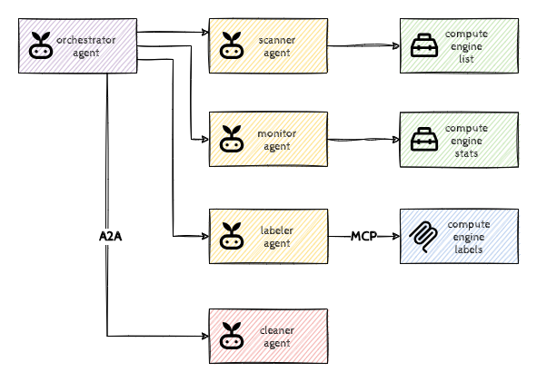

# Introduction to Agents with ADK

## Introduction

Welcome to DevCore Inc.! We are a fast-moving tech company where innovation thrives. Our developers have the freedom to spin up Cloud resources on demand, fostering rapid prototyping and experimentation. However, this freedom has a downside: *zombie resources*. Developers frequently create servers for tests but forget to stop or delete them afterwards.

This results in hundreds of idle resources running 24/7, costing the company tens of thousands of dollars every month for zero value. The manual cleanup process is tedious, error-prone, and can't keep up. We need an automated, intelligent system to solve this problem.

Our objective is to build a *Cloud Janitor* an AI-powered agentic solution that can automatically identify, verify, and safely terminate unused cloud resources.



In this hack, we'll use the Agent Development Kit (ADK) framework to develop this solution step-by-step, starting with a single agent and progressively building a collaborative, multi-agent system.

## Learning Objectives

This hack will help you explore the following tasks:

- Using LLM Agents to analyze unstructured data
- Augmenting Agents with Tools to expand their capabilities
- Using multiple agents for collaboration
- A bit of prompt engineering
- Model Context Protocol (MCP) as the abstraction layer for 3rd party tools
- Agent2Agent (A2A) Protocol for using 3rd party remote agents

## Challenges

- Challenge 1: First Scan
- Challenge 2: Equipping the Scanner
- Challenge 3: Sticky Notes
- Challenge 4: Agent Symphony
- Challenge 5: MCP: Universal Tooling
- Challenge 6: A2A: Remote Agent Power

## Prerequisites

- Basic knowledge of GCP
- Basic knowledge of Python
- Access to a GCP environment

> [!NOTE]  
> In principle you could do the challenges in any environment, but we recommend Cloud Shell as it comes with most of the required tooling.

## Contributors

- Murat Eken

## Challenge 1: First Scan

### Introduction

We're taking baby steps, let's get started with our development environment. This challenge is all about getting the quintessential *Agent* to work so that we can start building it further.

> [!NOTE]  
> You could run this (and the remaining challenges) from any VM, but we recommend you to use Cloud Shell as it comes with most of the prerequisites pre-installed.

### Description

We've already prepared a code base for you and put it in a Git repository (your coach will provide you the link). Clone that on Cloud Shell, create a virtual environment and install the requirements.

Once everything is set up, run `adk web` and make sure that the agent responds back.

### Success Criteria

- The Git repository has been cloned to Cloud Shell.
- You get no errors when you greet the agent from the `adk web` UI.
- No code was modified.

### Learning Resources

- [Cloud Shell](https://cloud.google.com/shell/docs/launching-cloud-shell)
- [Cloud Shell Editor](https://cloud.google.com/shell/docs/launching-cloud-shell-editor)
- [Previewing web apps](https://cloud.google.com/shell/docs/using-web-preview)

### Tips

- [Setting up authentication for ADK](https://google.github.io/adk-docs/get-started/quickstart/#set-up-the-model)

## Challenge 2: Equipping the Scanner

### Introduction

We have our first agent, and if you'd now ask for resources, the LLM would gladly make some suggestions. But since it doesn't know about our projects, it would probably fabricate imaginary ones. This is because LLMs lack real-time and specific information; think about your internal documents/databases/processes/rules, LLMs have no access to that information, unleess we inform them.

This is where *Tools* come into the picture: they provide a way for LLMs/agents to access external systems, databases, or APIs, thereby augmenting the LLM's knowledge base and enabling it to perform more complex, data-dependent operations. Although in this challenge we'll use a tool to gather additional information, tools can also be used to execute actions such as creating tickets, modifying local files, updating databases, generating media, sending communications etc.

> [!NOTE]  
> This might not be too obvious as we're keeping it simple in this hack, but keep in mind that LLMs are flexible enough to call the appropriate tools even when you ask them questions that might not be directly related to the tool. For example, imagine an Agent with a tool for looking up weather information, you could ask the Agent what to wear, and the Agent would use the tool to check the weather conditions to find the right outfit.

### Description

The provided code base already has a function that can look up the resources running in our project in `tools.py`. Update the `resource_scanner_agent` to use that function as a tool. Once everything works as expected, push the changes to the repository.

### Success Criteria

- The Agent has been configured to use the `get_compute_engine_vm_info` function as a tool.
- The Agent lists the following Virtual Machines when it's asked to list all resources:

  ```text
  - gce-sbx-lnx-blob-001
  - gce-dev-lnx-tomcat-001
  - gce-dev-lnx-tomcat-002
  - gce-stg-lnx-nginx-001
  ```

- The changes have been pushed to the remote Git repository.

### Learning Resources

- [Tools in ADK](https://google.github.io/adk-docs/tools/)

### Tips

- You can verify the list by navigating to the *VM Instances* page in the Google Cloud Console or by using the `gcloud compute instances list` command in Cloud Shell.

## Challenge 3: Sticky Notes

### Introduction

Meaningful, multi-turn conversations require agents to understand context. Just like humans, they need to recall the conversation history: what's been said and done to maintain continuity and avoid repetition. The Agent Development Kit (ADK) provides structured ways to manage this context through *Session*, *State*, and *(Long Term) Memory*.

In this challenge we'll focus on the session state. Within each `Session` (our conversation thread), the `state` attribute acts like the agent's dedicated scratchpad for that specific interaction. While session events hold the full history, session state is where the agent stores and updates dynamic details needed during the conversation.

### Description

Modify the `resource_scanner_agent` to save the list of all virtual machines in the session state. The list should adhere to the correct output schema and stored in the session state under the name `resources`.

### Success Criteria

- The Agent has been configured to store the list of virtual machines in the session state.
- The session state contains the same set of virtual machines using the correct schema when prompted to list the resources.
- The changes have been pushed to the remote Git repository.

### Learning Resources

- [Session state in ADK](https://google.github.io/adk-docs/sessions/state/)

### Tips

- You can use `adk web` UI to inspect the session state (and to verify that everything works as expected).

## Challenge 4: Agent Symphony

### Introduction

Breaking down complex problems into smaller, manageable sub-problems is a well-established strategy in software development. Multi-agent systems apply this principle to AI, allowing specialized agents to handle specific aspects of a larger task.

In this challenge we'll introduce the concept of *sub-agents* and *workflow agents* which are specialized agents that control the execution flow of its sub-agents.

> [!NOTE]  
> Workflow agents (sequential, parallel, loop) can be useful for orchestration in many cases as they're reliable, well structured and predictable. However, it's also possible to use LLM based Agents for orchestration if more flexibility is needed. In that case you'll be defining the order and conditions for running the sub-agents in the agent's instructions (the prompt).

### Description

Create two new agents, an `resource_monitor_agent` which, should filter the list of resources found by the `resource_scanner_agent`, and stores that into the session store as `idle_resources`. This agent should return back only the instances that are idle.

Then create a new sequential agent `orchestrator_agent` that calls the `resource_scanner_agent` and the `resource_monitor_agent` in sequence. Once you have created the new agents, update the `root_agent` to be the `orchestrator_agent`.

> [!NOTE]  
> This is a very basic scenario where we're looking up basic stats and letting the Agent to decide what's idle. The power of the LLM based agents is however that they can also detect more advanced patterns (which is beyond the scope of this challenge)

### Success Criteria

- The Agent runs both `resource_scanner_agent` and `resource_monitor_agent` in sequence and updates the session store.
- The session state contains `gce-dev-lnx-tomcat-001`,  `gce-dev-lnx-tomcat-002` and `gce-sbx-lnx-blob-001` (and their details) for `idle_resources` when prompted to find the idle resources.
- The changes have been pushed to the remote Git repository.

### Learning Resources

- [Multi-Agent Systems in ADK](https://google.github.io/adk-docs/agents/multi-agents/)

### Tips

- You can use `adk web` UI to view the agents involved.

## Challenge 5: MCP: Universal Tooling

### Introduction

We have built and referenced our own tool in the second challenge, but what about using tools developed by others? This is where the Model Context Protocol (MCP) plays a role; it offers a standardized method for agents to comprehend and engage with the functionalities of external tools and services developed by others. This is vital as it empowers agents to expand their capabilities by using other pre-packaged tools.

There's a plethora of various MCP Tool providers (for example see this [list](https://mcpservers.org/)), which can run locally as well as remotely. For this challenge we'll use a sample tool that we have developed for this hack using [FastMCP](https://gofastmcp.com/getting-started/welcome) library and running remotely on [Cloud Run](https://cloud.google.com/run/docs/host-mcp-servers).

In this challenge we'll make sure that idle resources are tagged so that we can give the developers time to verify if we can stop them. In order to do that we'll use an MCP tool that adds a new label with a termination date in the future to the idle resource.

### Description

We have already provided an `mcp-server` on Cloud Run. It provides a number of tools that are basically responsible for updating the labels on resources.

Create a new agent `resource_labeler_agent`, configure it to use the toolset from that server. Instruct the agent to add the `janitor-scheduled` label with the value set to 7 days in the future to the idle instances. Make sure that the agent does not add the label if the instance already has a `janitor-scheduled` label.

Then add the `resource_labeler_agent` to the `orchestrator_agent` sequence.

### Success Criteria

- The Agent runs `resource_scanner_agent`, `resource_monitor_agent` and `resource_labeler_agent` in sequence.
- The instances `gce-dev-lnx-tomcat-001`,  `gce-dev-lnx-tomcat-002` have the label `janitor-scheduled` with the value set to 7 days in the future.
- The instance `gce-sbx-lnx-blob-001` is not updated and keeps `janitor-scheduled` label set to yesterday.
- The changes have been pushed to the remote Git repository.

### Learning Resources

- [MCP Tools in ADK](https://google.github.io/adk-docs/tools/mcp-tools/)

### Tips

- You can use a [proxy](https://cloud.google.com/sdk/gcloud/reference/run/services/proxy) to simplify the authentication for the Cloud Run service.
- You can verify the list by navigating to the *VM Instances* page in the Google Cloud Console or by using the `gcloud compute instances describe` command in Cloud Shell.
- LLMs have no understanding of the current date and can struggle with date arithmetic, you might want to use additional tools.

## Challenge 6: A2A: Remote Agent Power

### Introduction

In the previous challenge we've learned that we can use tools developed by others, but what about agents? This is where Agent2Agent comes in, it provides a standard way for discovering and utilizing agents developed by others.

### Description

We have already provided an `a2a-server` on Cloud Run. It has a single agent deployed that's responsible for stopping the idle resources that have been marked with the `janitor-scheduled` label.

Create a new agent `resource_cleaner_agent` that uses A2A protocol to connect to the remote `a2a-server` and add it to the `orchestrator_agent` sequence as the last one.

### Success Criteria

- The Agent runs all the agents in sequence and stops all the idle resources that have been marked with the `janitor-scheduled` label where the date is in the past, leaving only the following running:

  ```text
  - gce-dev-lnx-tomcat-001
  - gce-dev-lnx-tomcat-002
  - gce-prd-lnx-env-setup
  ```

- The changes have been pushed to the remote Git repository.

### Learning Resources

- [Using A2A Agents in ADK](https://google.github.io/adk-docs/a2a/quickstart-consuming/)

### Tips

- You can use `adk web` UI to view the agents involved.
- You can use a [proxy](https://cloud.google.com/sdk/gcloud/reference/run/services/proxy) to simplify the authentication for the Cloud Run service.
- For this challenge if you're using the Cloud Run proxy, you need to stick to port `8080`.
- You can verify the list by navigating to the *VM Instances* page in the Google Cloud Console or by using the `gcloud compute instances list` command in Cloud Shell.
