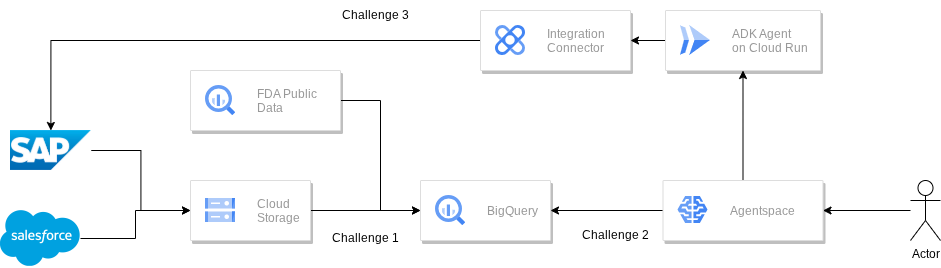

# Agentic AI and SAP

## Introduction

Welcome to the **Agentic AI and SAP**, where we explore the powerful synergy between Google Cloud's AI capabilities and your enterprise data, especially from SAP. This hack is designed to challenge you to build intelligent applications that unify disparate business data and leverage cutting-edge AI agents for automation and insights.

## Architecture

During the course of the challenges you are going to be building the following architecture for your agentic applications

## Learning Objectives

In this hack, you will tackle common enterprise challenges by leveraging Google Cloud solutions. You will gain hands-on experience in:

1. **Unified Data Foundation:** Establishing a robust data backbone by integrating SAP and other enterprise data sources (like Salesforce) into Google BigQuery, Google's highly scalable and analytical data warehouse.
2. **Conversational AI with Agentspace:** Rapidly deploying no-code agentic applications that allow natural language interaction with your integrated enterprise data, providing immediate insights and automating responses.
3. **Advanced Agent Orchestration with ADK:** Designing and implementing sophisticated, collaborative AI agents using Google's Agent Development Kit (ADK) to automate complex business processes within SAP.

## Challenges

This hack is structured into three main challenges, each building on the previous one, guiding you from data preparation to advanced agentic workflows.

- Challenge 1: Preparing Your Data Feast in BigQuery
- Challenge 2: Quick No-Code Agentic Applications on Google Cloud using Agentspace
- Challenge 3: Diving Deeper - Collaborative Agents with Google ADK

## Prerequisites

To make the most of this hack, ensure you have the following:

- Your own GCP project with **Owner IAM role**.
- Basic familiarity with Google Cloud Console and services.
- (Optional but recommended) Basic understanding of enterprise data concepts (e.g., SAP data, CRM data).

## Contributors

- Ekaterina Kruse
- Viktor Palkin

---

## Challenge 1: Preparing Your Data Feast in BigQuery

> [!NOTE]
> This challenge focuses on establishing a solid data foundation for your AI applications. Think about how a robust, unified dataset can empower smarter insights and automations.

### Introduction

Before AI can work its magic, it needs data. In the enterprise, this data often resides in disparate systems like SAP, CRM platforms (like Salesforce), and even public datasets. This challenge is about bringing all these "ingredients" together into a centralized, highly scalable data warehouse: Google BigQuery. You'll learn to ingest structured data from various sources and create analytical views that unlock hidden value.

### Description

Your goal in this challenge is to set up a BigQuery dataset that will serve as the single source of truth for your AI agents. You are responsible for:

- Creating a new BigQuery dataset for your lab.
- Load essential SAP Material Master data from Cloud Storage into your BigQuery dataset.
- Load Salesforce Customer Case data from Cloud Storage into your BigQuery dataset..
- Create a view over the FDA Food Enforcement Data to filter out only data related to `ice cream`

> [!IMPORTANT]
> Pay close attention to the data formats and schemas required for loading data into BigQuery. Ensure your commands correctly specify source formats, skip headers, and define column names and types.

### Success Criteria

- Validate that a BigQuery dataset named `icecream_lab` exists in your GCP project.
- Verify that the `MaterialMasterData` table contains SAP material information.
- Confirm that the `CustomerCases` table contains Salesforce customer feedback.
- Demonstrate that the `fda_ice_cream_enforcements` view exists and correctly filters public FDA data for "ice cream" related entries.
- Show that all loaded tables and the view are accessible and contain data previews in the BigQuery Console.

### Tips

- The FDA FOOD enforcement data can be found in `bigquery-public-data.fda_food.food_enforcement` table. Try querying it to explore it

### Learning Resources

- [BigQuery Documentation: Loading Data](https://cloud.google.com/bigquery/docs/loading-data-cloud-storage-csv)
- [BigQuery Documentation: Creating Views](https://cloud.google.com/bigquery/docs/views)
- [Google Cloud Shell Overview](https://cloud.google.com/shell/docs/overview)
- [Creating BigQuery Dataset](https://cloud.google.com/bigquery/docs/datasets#bq)

---

## Challenge 2: Quick No-Code Agentic Applications on Google Cloud using Agentspace

> [!IMPORTANT]
> This challenge introduces Google Agentspace, a powerful platform for quickly building conversational AI applications without deep coding expertise. Focus on integrating your prepared data and enabling natural language interaction.

### Introduction

With your data now centralized in BigQuery, the next step is to make it accessible and intelligent. Google Agentspace allows you to quickly deploy conversational AI applications that can understand natural language queries and retrieve information from your various data sources. This means users can simply ask questions about your SAP or Salesforce data, and the AI will provide answers, acting as a smart assistant. You'll also learn to integrate external actions like sending emails.

### Description

In this challenge, you will build and configure an Agentspace application to serve as an intelligent assistant for your "ice cream" business. Your tasks include:

- **OAuth Configuration:** Set up an OAuth consent screen for internal applications and create an OAuth client for your Agentspace application. This is crucial for enabling secure user authorization, especially for actions like sending emails.
- **Agentspace App Creation:** Instantiate a new Agentspace application, selecting the appropriate type and tier (e.g., "Search + Assistant").
- **Data Store Integration:** Connect your Agentspace app to the BigQuery tables and view you created in Challenge 1 (`MaterialMasterData`, `CustomerCases`, `fda_ice_cream_enforcements`). Additionally, integrate an unstructured data source from Cloud Storage (like a recipe PDF).
- **Action Integration:** Connect and configure the Gmail tool as an action within your Agentspace app, enabling it to send emails.
- **Google Search Grounding:** Enable Google Search grounding to allow your agent to pull information from the web to augment its responses.
- **Interaction and Testing:** Once indexing is complete, interact with your Agentspace application using a series of diverse natural language prompts. Observe how the agent leverages your integrated structured and unstructured data, as well as external web search, to provide comprehensive answers and execute actions.

> [!NOTE]
> Indexing data stores in Agentspace can take several minutes. Be patient and use this time to explore the interface or review the next challenge. You can also work on Task 3 in a separate tab while waiting.

### Success Criteria

- Verify that an OAuth consent screen and a "Web application" OAuth client are successfully configured, with the correct redirect URI for Agentspace.
- Demonstrate that your Agentspace application is created and accessible.
- Show that all required data stores (three BigQuery sources, one Cloud Storage source) are successfully connected and indexed within your Agentspace application.
- Confirm that the Gmail action is properly configured with the correct OAuth client ID and secret.
- Successfully interact with the Agentspace app using various prompts that demonstrate its abilities:
  - **Prompt 1:**
    - **Datasource:** MaterialMasterData (SAP via BQ)
    - **Prompt:** `Analyze our product portfolio. Identify and summarize the key strengths of our ice cream catalog, focusing on: Flavor variety (range of types offered), Unique or innovative flavor profiles mentioned, Mention of premium ingredients or quality attributes, Presence of interesting textures (swirls,           inclusions, crunches). Provide a concise summary of these strengths.`

  - **Prompt 2:**
    - **Datasources:** CustomerCases (SFDC via BQ), Web Search
    - **Prompt:** `Retrieve customer feedback on our ice cream products, focusing on the improvement suggestions from our customers. Can you identify any particular pattern in this feedback? Additionally, conduct a review our competitors’ strategy online. Based on both results, suggest what should we work on to             improve our portfolio and drive sales.`

  - **Prompt 3:**
    - **Datasources:** CustomerCases (SFDC via BQ), Web Search
    - **Prompt:** `Generate a concept image for a potential new summer seasonal flavor: "Lemon Berry Bliss". The image should show a scoop of pale yellow lemon ice cream generously swirled with a vibrant mixed berry (strawberry, blueberry, raspberry) ribbon. It should look bright, appealing, and refreshing, perhaps         set against a simple, clean background.`

  - **Prompt 4:**
    - **Datasource:** fda\_ice\_cream\_enforcements (BQ View), Web Search
    - **Prompt:** `Analyze historical product recalls related to ice cream and information on the web to find out how we can avoid major issues and recalls with our products and build a great reputation.`

  - **Prompt 5:**
    - **Datasources:** CustomerCases (SFDC via BQ), MaterialMasterData (SAP via BQ), Recipes PDF (Cloud Storage)
    - **Prompt:** `We have got a request to focus on improvement of the recipe of Pistachio River Ripple. Based on the customer feedback and an existing recipe, suggest what exactly needs to be changed. List exact ingredients we need to purchase to make those changes.`

  - **Prompt 6:** (This uses the Gmail Tool - you may be prompted to authorize)
    - **Action:** Send Email
    - **Prompt:** `Send an email to our purchasing organization (purchasing@company.com) with the recipe improvement suggestions for Pistachio River Ripple and the ingredients that need to be purchased.`

### Tips

- When setting up OAuth, ensure the "Authorized redirect URIs" for your web application client are exact.
- Give meaningful names to your Agentspace app and data stores for easier management.
- Experiment with different phrasing for your prompts to understand the agent's natural language understanding capabilities. Feel free to explore multimodality (e.g. generate images)
- Observe the "sources" cited by the Agentspace responses to understand which data stores it is utilizing for each query.
- In the next task, you will need to provide an email with recommended new ingredients. Please, make sure that you request Agentspace to generate this email. Example prompts:

"We have got a request to focus on improvement of the recipe of Pistachio River Ripple. Based on the customer feedback and an existing recipe, suggest what exactly needs to be changed. List exact ingredients we need to purchase to make those changes."

"Send an email to our purchasing organization (<purchasing@company.com>) with the recipe improvement suggestions for Pistachio River Ripple and the ingredients that need to be purchased."

### Learning Resources

- [Google Agentspace Documentation](https://cloud.google.com/agentspace/agentspace-enterprise/docs/overview)
- [Google Cloud OAuth Consent Screen Configuration](https://developers.google.com/workspace/guides/configure-oauth-consent)

---

## Challenge 3: Diving Deeper - Collaborative Agents with Google ADK

> [!IMPORTANT]
> This challenge dives into building sophisticated, collaborative AI agents using the Google Agent Development Kit (ADK). This is where you bring the power of AI to automate complex SAP business processes.

### Introduction

Beyond simple conversational queries, AI agents can be orchestrated into teams to automate complex, multi-step business processes. In this challenge, you will explore how to design and implement a team of custom AI agents using the Google Agent Development Kit (ADK) to streamline a common SAP workflow: creating Purchase Requisitions (PRs) from email requests. This involves not just data extraction but also vendor selection and integration with your SAP backend. This demonstrates how AI can significantly enhance procurement efficiency and compliance.

### Description

Your primary objective is to implement and deploy a collaborative team of AI agents that automate the creation of Purchase Requisitions in an SAP ERP system, triggered by email requests. The agents will work together to:

- **Initiate the Process:** A "Greeter agent" will start the PR creation workflow by receiving email text from a user.
- **Vendor Discovery:** An "SAP vendor retriever agent" will interact with SAP to find existing or potential vendors.
- **Data Extraction:** A "PR intake agent" will extract all necessary Purchase Requisition details (e.g., item description, quantity) from the raw email text.
- **Vendor Vetting:** A "Vendor due diligence agent" will validate and select the most appropriate vendor(s) by checking their status in SAP, preferred supplier lists, and compliance flags.
- **SAP PR Creation:** An "SAP_PR_creator agent" will use the extracted data and vetted vendor information to automatically create the Purchase Requisition in the SAP system via APIs.

You will achieve this by:

1. **Environment Setup:** Reviewing pre-configured Application Integration components essential for connecting your agents to the SAP environment. This includes examining a Network Endpoint Attachment for private connectivity and creating the `SAP Gateway` Integration Connector (`s4-vendors`).
2. **Coding Exercises:** Modifying existing code (provided with TODOs) within a Google Cloud Run service (`purchasing-agent-service`). You will need to implement the logic for the various agents to perform their specific roles, involving API calls to SAP through the Application Integration connector.
    - Access the Cloud Run service, modify the code, and redeploy.
    - Refer to the provided GitLab repository for potential solutions or guidance on the TODO tasks.

> [!IMPORTANT]
> The focus is on understanding the interaction between agents and their integration with SAP. While code snippets or solutions may be provided as a reference, strive to understand the underlying logic and design principles of a collaborative agent system.

### Success Criteria

- Verify the existence and configuration of the `saps4hana-endpoint-attachment` in Integration Connectors.
- Confirm the successful creation and configuration of the `s4-vendors` SAP Gateway Connection in Integration Connectors, including its region, service, and authentication details.
- Successfully complete the TODOs within the `purchasing-agent-service` on Cloud Run, effectively implementing the collaborative agent team.
- Show that the team of agents can successfully process an email request for a Purchase Requisition, culminating in the creation of a PR in the simulated SAP system.

### Tips

- Pay close attention to the roles and responsibilities of each agent. How do they pass information to each other?
- Familiarize yourself with the concept of Application Integration and its role as a bridge between Google Cloud services and SAP.
- Use Cloud Run Code Editor to quicker make changes in the code of your agents. Make sure you don't overwrite each other changes.
- When debugging your agents, check the Cloud Run logs for errors or unexpected behavior.
- Consider how you would handle edge cases or error conditions in a real-world multi-agent system.
- Use the email generated on the previous step with the Agentspace while triggering the workflow with the ADK.

### Learning Resources

- [Google Cloud Run Documentation](https://cloud.google.com/run/docs)
- [Google Cloud Application Integration Connectors: SAP Gateway](https://cloud.google.com/integration-connectors/docs/connectors/sapgateway/configure)
- [Google Agent Development Kit (ADK)](https://google.github.io/adk-docs/)
- [Google ADK Application integration tool](https://google.github.io/adk-docs/tools/google-cloud-tools/#application-integration-tools)
- [GitLab Repository for the sample agent](https://gitlab.com/ekakruse/sapwithadk)
