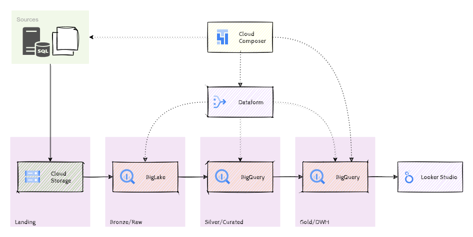

# Modernizing Classic Data Warehousing with BigQuery

## Introduction

In this hack we'll implement a classic data warehouse using modern tools, such as Cloud Storage, BigQuery, Dataform, Looker Studio and Cloud Composer. We'll start with a modified version of the well known AdventureWorks OLTP database, and we'll implement a dimensional model to report on business questions using a BI visualization tool.



In our scenario, the data has already been copied from the database to a landing bucket in Cloud Storage as CSV files. In the first challenge we'll create BigLake tables in BigQuery to make that data accessible in BigQuery. In the second challenge we'll apply some basic cleansing and transformations to load the data into staging tables. In the third challenge we're going to automate this process using Dataform. The fourth challenge is all about creating the dimensional model and the fact table. And in the fifth challenge we'll introduce the OBT concept and use Looker Studio to build reports. In the 6th challenge we'll add some basic security to our data, the 7th challenge is for the data scientists, using interactive notebooks to analyze data and train ML models and finally, we'll automate, orchestrate and monitor the whole process by tapping into Cloud Composer and Cloud Monitoring in the last 2 challenges.

## Learning Objectives

This hack will help you explore the following tasks:

- BigQuery as a classic Data warehouse
- BigLake for accesing data in an object store and applying table semantics
- Dataform for automating data transformation steps
- Dimensional modeling with a star schema
- Access control to data through dynamic data masking & row level security
- Looker Studio for visualizing data
- Colab for data exploration
- Cloud Composer for orchestration
- Cloud Monitoring for monitoring and alerting

## Challenges

- Challenge 1: Loading the source data
- Challenge 2: Staging tables
- Challenge 3: Dataform for automation
- Challenge 4: Dimensional modeling
- Challenge 5: Business Intelligence
- Challenge 6: Access control
- Challenge 7: Notebooks for data scientists
- Challenge 8: Cloud Composer for orchestration
- Challenge 9: Monitoring the workflow

## Prerequisites

- Basic knowledge of GCP
- Basic knowledge of Python
- Basic knowledge of SQL
- Access to a GCP environment

## Contributors

- Murat Eken

## Challenge 1: Loading the source data

### Introduction 

This first step is all about getting started with the source data. Typically data is copied periodically from operational data stores, such as OLTP databases, CRM systems etc. to an *analytics data platform*. Many different methods exist for getting that data, either through pushes (change data capture streams, files being generated and forwarded etc.), or pulls (running periodically a query on a database, copying from a file system etc). But for now we'll ignore all that and assume that somehow data has been collected from the source systems and put into a Google Cloud Storage bucket.

> **Note** For the sake of simplicity, we'll implement full loads. In real world applications with larger datasets you might want to consider incremental loads.

### Description

We have already copied the data from the underlying database to a specific Cloud Storage bucket. Go ahead and find that bucket, and have a look at its contents. Create a new BigQuery dataset called `raw` in the same region as that storage bucket, and create **BigLake** tables for the following entities: `person`, `sales_order_header` and `sales_order_detail`. You can ignore the other files for now.

### Success Criteria

- There is a new BigQuery dataset `raw` in the same region as the landing bucket.
- There are 3 BigLake tables with content in the `raw` dataset: `person`, `sales_order_header` and `sales_order_detail`.

### Learning Resources

- [Creating BigQuery datasets](https://cloud.google.com/bigquery/docs/datasets#console)
- [Introduction to BigLake tables](https://cloud.google.com/bigquery/docs/biglake-intro)
- [Creating BigLake tables](https://cloud.google.com/bigquery/docs/create-cloud-storage-table-biglake)

## Challenge 2: Staging tables

### Introduction

Before we create our dimensional model we'll first do some cleanup. There's a plethora of different approaches here, and different modeling techniques (Data Vault, normalized persistent/ephemeral staging tables etc.), but we'll keep things simple again. Our source data is already relational and has the correct structure (3NF), we'll stick to that data model and only do some minimal cleansing.

### Description

Some of the tables have duplicate records and problematic columns that we'd like to remove. Create a new BigQuery dataset called `curated` and create a new table for each BigLake table from the previous challenge. Name the new tables by prefixing them with `stg_` and remove any **duplicate** records as well as any columns with **only `null` values**. Make sure that the columns `order_date`, `due_date`, `ship_date`, `birth_date` and `date_first_purchase` have the **data type `DATE`** in the new tables.

### Success Criteria

- There is a new BigQuery dataset `curated` in the same region as the other datasets.
- There are 3 BigQuery tables with content in the `curated` dataset: `stg_person`, `stg_sales_order_header` and `stg_sales_order_detail` with no duplicate records and no columns with only `null` values.
- The columns `order_date`, `due_date`, `ship_date`, `birth_date` and `date_first_purchase` in the new tables have the data type `DATE`.

### Learning Resources

- [Creating BigQuery tables from a query result](https://cloud.google.com/bigquery/docs/tables#create_a_table_from_a_query_result)
- [BigQuery Date functions](https://cloud.google.com/bigquery/docs/reference/standard-sql/date_functions)

### Tips

- Data Profile (with 100% sampling!) can help you find `null` columns.
- [EXCEPT](https://cloud.google.com/bigquery/docs/reference/standard-sql/query-syntax#select_except) is useful when you want to discard a few columns when selecting all columns from a table.

## Challenge 3: Dataform for automation

### Introduction

Although we've only dealt with 3 tables so far, our data model has many more tables, and we have to perform multiple SQL operations to process the data. Doing this manually is error-prone and labor intensive. Wouldn't it be great if we could automate this by developing and operationalizing scalable data transformation pipelines in BigQuery using SQL? Enter *Dataform* 🙂

### Description

Create a new Dataform _Repository_, update its settings to use the `BQ DWH Dataform Service Account`, _override_ workspace compilation settings to ensure that _Project ID_ points to your project. Then link it to [this Github repository](https://github.com/meken/gcp-dataform-bqdwh.git), using `HTTPS` as the protocol, `main` as the _Default branch name_ and the provided `git-secret` as the secret to connect.

After configuring the Dataform repository, create a new _Development Workspace_, solve any errors and execute the pipeline with the *tag* `staging`. 

> **Note** The provided `git-secret` has a dummy value, it'll be ignored when you pull from the repository. When you link a Git repository, Dataform clones that repository _locally_ (in your Dataform Development Workspace) and you can commit your changes to your local copy. Normally you'd be able to push those changes to the remote (either main or a different branch), but since the provided secret doesn't have any write permissions, you won't be able to do that for this exercise.

### Success Criteria

- There's a successful execution of the provided Dataform pipeline for the `staging` tables.
- The following 12 tables have been created in the `curated` dataset: 
  - `stg_address`
  - `stg_country_region`
  - `stg_credit_card`
  - `stg_customer`
  - `stg_order_status`
  - `stg_person`
  - `stg_product`
  - `stg_product_category`
  - `stg_product_subcategory`
  - `stg_sales_order_detail`
  - `stg_sales_order_header`
  - `stg_state_province`

### Learning Resources

- [Creating a Dataform repository](https://cloud.google.com/dataform/docs/create-repository)
- [Connecting to a Git repository](https://cloud.google.com/dataform/docs/connect-repository)
- [Configuring Dataform workflow settings](https://cloud.google.com/dataform/docs/configure-dataform)
- [Creating a development workspace](https://cloud.google.com/dataform/docs/create-workspace)

### Tips

- You need to install packages to solve the errors about `npm` packages not found. This can be done from the UI if you open the `workflow_settings.yaml` file.

## Challenge 4: Dimensional modeling

### Introduction

Dimensional modeling is a data warehousing technique that organizes data into fact tables containing measurements and dimension tables, which provide context for those measurements. This structure makes data analysis efficient and intuitive, allowing users to easily understand and query data related to specific business events.

### Description

We're going to create a **star schema** by extracting _dimension_ tables and a _fact_ table from the _staging_ tables that have been created in the previous challenge. First you need to create another dataset and call it `dwh`.

We have already provided the code for the dimension tables, first run the pipeline for the tag `dimension` and then create a new `fact_sales.sqlx` file in the same folder, configure it with the tag `fact` and create the fact table with the following columns:

- `sales_key`  (surrogate key built out of `sales_order_id` and `sales_order_detail_id`)
- `product_key` (surrogate key built out of `product_id`)
- `customer_key` (surrogate key built out of `customer_id`)
- `credit_card_key` (surrogate key built out of `credit_card_id`)
- `ship_address_key` (surrogate key built out of `ship_to_address_id`)
- `order_status_key` (surrogate key built out of `status`)
- `order_date_key` (surrogate key built out of `order_date`)
- `unit_price`
- `unit_price_discount`
- `cost_of_goods_sold` (retrieved from `stg_products` table, `standard_cost` column)
- `order_quantity`
- `gross_revenue` (calculated by multiplying `unit_price` with `order_quantity`)
- `gross_profit` (calculated by subtracting discounts and costs of goods sold from `gross_revenue`)

Once the configuration is complete run the Dataform pipeline with the tag `fact` and commit your changes.

### Success Criteria

- There is a new BigQuery dataset `dwh` in the same region as the other datasets.
- There's a successful execution of the provided Dataform pipeline for the `fact` tag.
- There are dimension tables and a new fact table, `fact_sales` in the `dwh` dataset, with the columns as specified above having in total **121317** rows.

### Learning Resources

- [Creating tables with Dataform](https://cloud.google.com/dataform/docs/define-table)

## Challenge 5: Business Intelligence

### Introduction

Business intelligence (BI) in data warehousing involves using tools and techniques to analyze the massive amounts of data stored in a data warehouse to extract meaningful insights, identify trends, and support better business decision-making. In other words, we translate raw data into actionable information. We can get that information by running SQL queries, but we can also create visual dashboards using a visualization tool, such as Looker or Looker Studio, to achieve the same.

### Description

We're going to create a new report in *Looker Studio*. Since we're keeping things simple and Looker Studio works better with an _OBT_ (one big table), we'll create that as a first step.

Add a new file `obt_sales.sqlx` and configure it to create a new table `obt_sales` in the `dwh` dataset by joining **all** of the dimension tables with the fact table, and add the tag `obt`. Make sure to exclude all of the surrogate keys. 

Once the table is created, create a new Looker Studo report using the new table and configure the following charts:

- Scorecards for `gros_revenue` and `gross_profit` with human readable numbers.
- Donut chart for `gross_revenue` broken down by product categories.
- Map chart showing `gross_profit` for every city.
- A line chart showing `gros_revenue` and `gross_profit` per quarter (e.g. Y2021Q3).

### Success Criteria

- There's a new table `obt_sales` with **121317** records in the `dwh` dataset that joins the dimension tables with the fact table as a result of running the Dataform pipeline with the tag `obt` .
- There's a new Looker Studio report with the abovementioned charts.

### Learning Resources

- [BigQuery explained: Working with joins and more](https://cloud.google.com/blog/topics/developers-practitioners/bigquery-explained-working-joins-nested-repeated-data)
- [Using Looker Studio with BigQuery](https://cloud.google.com/bigquery/docs/visualize-looker-studio)
- [Calculated fields in Looker Studio](https://support.google.com/looker-studio/answer/6299685)

### Tips

- There are different types of joins you can do with BigQuery, choose the correct one.
- You'll need to create a calculated field in Looker Studio to get the _quarter_ information in proper format.

## Challenge 6: Access control

### Introduction

Data access management is the process of defining, enforcing, and monitoring the rules and policies governing who has access to data. Access management ensures that data is only accessible to those who are authorized to access it. BigQuery provides different mechanisms to help you with data access:
- [Identity and Access Management](https://cloud.google.com/bigquery/docs/access-control) to manage access to your BigQuery resources such as projects, datasets, tables, and views
- [Authorized views](https://cloud.google.com/bigquery/docs/authorized-views), datasets, routines let you share query results with particular users and groups without giving them access to the underlying source data
- And if you want more granular control, you can utilize [Column Level Security](https://cloud.google.com/bigquery/docs/column-level-security-intro), [Row Level Security](https://cloud.google.com/bigquery/docs/row-level-security-intro), and [Dynamic Data Masking](https://cloud.google.com/bigquery/docs/column-data-masking-intro)

### Description

We'll add a couple of data governance rules to the `obt_sales` table that we've created in the previous challenge. Turn on _Row Level Security_ for one of the users by letting that user see only the data for the product category `Accessories`. Make sure that everyone else on the team has access to all of the data. 

In addition, for the same user, add dynamic data masking to the columns `full_name`, showing only first 4 characters and replacing the rest with `XXXXX`, and `birth_date`, replacing it with the Unix epoch date.

> **Note** We're granting permissions for individual users for the sake of simplicity in this challenge, but the best practice is to use _User Groups_ for this purpose (which also simplifies the management of these rules).

### Success Criteria

- One user can read only the data for the product category `Accessories` from the `obt_sales` table.
- The same user can only read the masked version of `full_name` and `birth_date` columns from the `obt_sales` table.
- All other users can read all data unmasked from the `obt_sales` table.

### Learning Resources

- [Row Level Security](https://cloud.google.com/bigquery/docs/managing-row-level-security)
- [The TRUE filter](https://cloud.google.com/bigquery/docs/using-row-level-security-with-features#the_true_filter)
- [Introduction to Dynamic Data Masking](https://cloud.google.com/bigquery/docs/column-data-masking-intro)


## Challenge 7: Notebooks for data scientists

### Introduction

BigQuery Studio and SQL are great tools for data analytics, but data scientists also enjoy working with interactive notebooks using *Python*. Luckily BigQuery provides Python notebooks capabilites integrated with BigQuery, making it possible to run Python and (serverless) Spark tasks.

### Description

We've already designed a [Python notebook](https://raw.githubusercontent.com/meken/gcp-dataform-bqdwh/v2.0.0/notebooks/churn-analysis.ipynb) for this challenge. Upload that to BigQuery, run the notebook interactively until you get to the cell for creating the model. Edit the cell and add the necessary SQL to create a BigQuery ML model, and run the notebook to completion.

> **Warning**  
> Since notebooks on BigQuery use _End User Credentials_, make sure that you're running this notebook as a user that doesn't have the row level security filter applied to limit the data.

### Success Criteria

- All the cells from the provided Colab notebook has been run successfully.
- There's a new _Logistic Regression_ model, `churn_model`, in the `dwh` dataset that predicts whether a customer will churn or not, trained on the prepared training data.

### Learning Resources

- [BigQuery Python Notebooks](https://cloud.google.com/bigquery/docs/create-notebooks#upload_notebooks)
- [Introduction to AI/ML in BigQuery](https://cloud.google.com/bigquery/docs/bqml-introduction)
- [Tutorial on building a BQML model](https://cloud.google.com/bigquery/docs/logistic-regression-prediction)

## Challenge 8: Cloud Composer for orchestration

### Introduction

Running the Dataform pipelines manually works, but it's not very practical. We'd rather automate this process and run it periodically. Although Dataform provides a lot of functionality to automate and schedule running the pipelines, we're going to consider a bit more flexible orchestrator  that can also run additional steps that might not be part of the Dataform pipelines, such as pulling data from source systems, running the inferencing with the model we've created in the last challenge etc. 

This challenge is all about Cloud Composer, which is basically a managed and serverless version of the well-known [Apache Airflow](https://airflow.apache.org/) framework, to schedule and run our complete pipeline.

> **Note** There's a myriad of different orchestration services on Google Cloud, see the [documentation](https://cloud.google.com/bigquery/docs/orchestrate-workloads) for more information and guidance on which one to pick for *your* specific needs. 

### Description

We've already created a *Cloud Composer* environment for you. You need to configure and run [this pre-configured DAG](https://raw.githubusercontent.com/meken/gcp-dataform-bqdwh/v2.0.0/dags/etlflow.py) (which is basically a collection of tasks organized with dependencies and relationships) on that environment. The DAG is scheduled to run daily at midnight, pulls source data from different source systems (although in our case it's using a dummy operator to illustrate the idea), runs the Dataform pipeline to generate all of the required tables, and finally runs the latest version of our churn model on our customer base to predict which customers will be churning and stores the predictions in a new BigQuery table. 

Find the DAGs bucket for the Cloud Composer environment and copy the provided DAG into the correct location. Update the _environment variables_ of the Cloud Composer environment to refer to the correct Dataform repository and use the tag `v1.0.1` as the Git reference.

> **Note** It might take a few minutes for the DAG to be discovered by Airflow, be patient :) Once the DAG is discovered it will be started automatically, make sure to configure the environment variables before you upload the DAG.

### Success Criteria

- There's a new DAG that's triggered every day at midnight.
- There's at least one successful run of the DAG.
- No code was modified.

### Learning Resources

- [Cloud Composer Overview](https://cloud.google.com/composer/docs/composer-3/composer-overview)
- [Cloud Composer Environment Variables](https://cloud.google.com/composer/docs/composer-3/set-environment-variables)
- [Triggering DAGs](https://cloud.google.com/composer/docs/composer-3/trigger-dags)

## Challenge 9: Monitoring the workflow

### Introduction

When we run our Cloud Composer DAG manually it's easy to see if it has failed or not, but we've configured to run it automatically every day; what if something goes wrong tomorrow or the day after? In order to make sure that things stay healthy we need to do some continous monitoring, create incidents when something goes wrong and notify the responsible people. This is where _Cloud Monitoring_ comes in to the play. In this challenge we'll introduce a very basic method of monitoring failed Cloud Composer workflows using Cloud Monitoring.

### Description

Create a new _Alerting Policy_ for _Failed DAG runs_ that will be triggered if there's at least 1 failed DAG run for the workflow from the previous challenge, for a rolling window of `10 minutes` using `delta` function and use an _Email Notification Channel_ that sends an email to your personal account(s). Configure a _Policy user label_ with the key `workflow-name` and the name of the monitored workflow as the value. Set the _Policy Severity Level_ to `Critical` and use some sensible values for the other fields. 

Create a new `broken.csv` file with the following (idea is to have multiple `csv` files with irreconcilable schemas to cause an error):

```
foo,bar
xx,yy
```

And upload it to the landing bucket for one of the entities (next to a `data.csv` file, do not overwrite!) and re-run the Cloud Composer DAG.

> **Note** If you had DAG failures in the previous challenge, the configured alert might be triggered before you re-run the DAG. Please ignore that and go ahead with uploading the broken file and re-run the DAG.

When you receive an email for the incident, follow the link to view and then `Acknowledge` it.

> **Note** This might take ~10 minutes as Airflow will retry the failing tasks multiple times before giving it up and mark the DAG run as _failed_.

### Success Criteria

- There's a new failed DAG run.
- There's a new Cloud Monitoring incident related to the failed DAG run, that's _Acknowledged_.
- No code was modified.

### Learning Resources

- [Using Monitoring Dashboard for Cloud Composer](https://cloud.google.com/composer/docs/composer-3/use-monitoring-dashboard)
- [Creating and managing notification channels](https://cloud.google.com/monitoring/support/notification-options)
