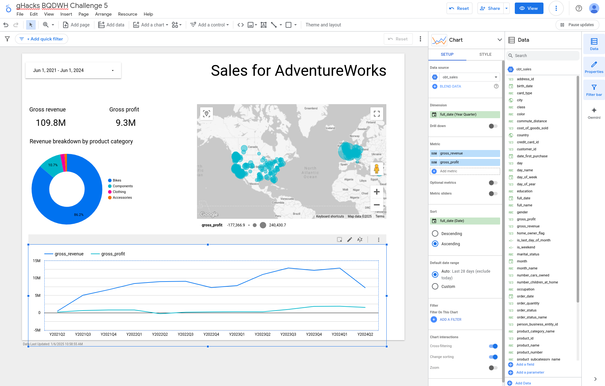

# Modernizing Classic Data Warehousing with BigQuery

## Introduction

## Coach's Guides

- Challenge 1: Loading the source data
- Challenge 2: Staging tables
- Challenge 3: Dataform for automation
- Challenge 4: Dimensional modeling
- Challenge 5: Business Intelligence
- Challenge 6: Access control
- Challenge 7: Notebooks for data scientists
- Challenge 8: Cloud Composer for orchestration
- Challenge 9: Monitoring the workflow

## Challenge 1: Loading the source data

### Notes & Guidance

Although most of this will be done through the UI by the participants, the following commands make it possible to run this challenge from the command line.

```shell
REGION=us-central1  
BQ_DATASET=raw
bq mk --location=$REGION -d $BQ_DATASET
```
  
Creating the BigLake connection:

```shell
CONN_ID=conn
bq mk --connection --location=$REGION --connection_type=CLOUD_RESOURCE $CONN_ID

SA_CONN=`bq show --connection --format=json $REGION.$CONN_ID | jq -r .cloudResource.serviceAccountId`

gcloud projects add-iam-policy-binding $GOOGLE_CLOUD_PROJECT --member="serviceAccount:$SA_CONN" \
    --role="roles/storage.objectViewer" --condition=None
```

Once the connection is created and has the proper permissions, you can then run the following SQL for the tables `person`, `sales_order_header` and `sales_order_detail` after updating the relevant bits.

```sql
CREATE OR REPLACE EXTERNAL TABLE raw.person
  WITH CONNECTION `$REGION.$CONN_ID`
  OPTIONS (
    format = "CSV",
    uris = ['gs://${PROJECT_ID}-landing/person/*.csv']
  );
```

Let participants explore the data from BigQuery so that they understand that they're applying table semantics to blobs (CSV files).

## Challenge 2: Staging tables

### Notes & Guidance

```shell
BQ_DATASET=curated
bq mk --location=$REGION -d $BQ_DATASET
```

See below for example solutions, note that there are multiple ways of achieving the same objective and participants are free to explore those.

```sql
CREATE TABLE curated.stg_person AS
  SELECT DISTINCT * EXCEPT(hobby, comments, birth_date, date_first_purchase),
  SAFE.PARSE_DATE("%FZ", birth_date) AS birth_date,
  SAFE.PARSE_DATE("%FZ", date_first_purchase) AS date_first_purchase
  FROM raw.person
```

```sql
CREATE TABLE curated.stg_sales_order_header AS
  SELECT DISTINCT * EXCEPT(comment, order_date, ship_date, due_date), 
    DATE(order_date) AS order_date, 
    DATE(ship_date) AS ship_date,
    DATE(due_date) AS due_date 
  FROM raw.sales_order_header
```

```sql
CREATE TABLE curated.stg_sales_order_detail AS
  SELECT DISTINCT * 
  FROM raw.sales_order_detail
```

The table `person` has one duplicate record for `business_entity_id` with the value `11751`. You can verify that there are no duplicate records for this table by either checking the total number of rows (must be **19972**) or by running the following query (result should be empty):

```sql
SELECT
  business_entity_id,
  COUNT(*) cnt
FROM
  `curated.stg_person`
GROUP BY
  business_entity_id
HAVING
  cnt > 1
```

## Challenge 3: Dataform for automation

### Notes & Guidance

Configuring the Git connection should be trivial through the UI, you should click on the link `CONNECT WITH GIT` in the `SETTINGS` tab. In that settings tab you can also set the _Google Cloud Project ID_ by editing `Workspace compilation overrides`.

Once the development workspace has been created, navigate to `workflow_settings.yaml` and click on `INSTALL PACKAGES` button to install the required packages. And then `START EXECUTION` and pick Tag _staging_. Don't forget to include the dependencies.

## Challenge 4: Dimensional modeling

### Notes & Guidance

```shell
BQ_DATASET=dwh
bq mk --location=$REGION -d $BQ_DATASET
```

See below for an example, but just like the previous examples, there are multiple options (left joins are fine too).

```sql
config {
    type: "table",
    schema: "dwh",
    tags: ["fact"]
}

SELECT
  ${keys.surrogate("sod.sales_order_id", "sod.sales_order_detail_id")} AS sales_key,
  ${keys.surrogate("sod.product_id")} AS product_key,
  ${keys.surrogate("customer_id")} AS customer_key,
  ${keys.surrogate("credit_card_id")} AS credit_card_key,
  ${keys.surrogate("ship_to_address_id")} AS ship_address_key,
  ${keys.surrogate("status")} AS order_status_key,
  ${keys.surrogate("order_date")} AS order_date_key,
  -- sod.sales_order_id,
  -- sod.sales_order_detail_id,
  sod.unit_price,
  sod.unit_price_discount,
  p.standard_cost AS cost_of_goods_sold,
  sod.order_qty AS order_quantity,
  sod.order_qty * sod.unit_price AS gross_revenue,
  (sod.order_qty * sod.unit_price * (1 - sod.unit_price_discount)) - (p.standard_cost) AS gross_profit
FROM
  ${ref("stg_sales_order_detail")} sod,
  ${ref("stg_sales_order_header")} soh,
  ${ref("stg_product")} p
WHERE
  sod.sales_order_id = soh.sales_order_id
  AND sod.product_id = p.product_id
```

Total number of rows for this table should be: **121317**

## Challenge 5: Business Intelligence

### Notes & Guidance

```sql
config {
    type: "table",
    schema: "dwh",
    tags: ["obt"]
}

SELECT
  * EXCEPT(
    address_key,
    date_key,
    product_key,
    sales_key,
    customer_key,
    order_date_key,
    order_status_key,
    credit_card_key,
    ship_address_key
  )
FROM
  ${ref("fact_sales")}
LEFT JOIN
  ${ref("dim_product")}
ON
  ${ref("fact_sales")}.product_key = ${ref("dim_product")}.product_key
LEFT JOIN
  ${ref("dim_customer")}
ON
  ${ref("fact_sales")}.customer_key = ${ref("dim_customer")}.customer_key
LEFT JOIN
  ${ref("dim_credit_card")}
ON
  ${ref("fact_sales")}.credit_card_key = ${ref("dim_credit_card")}.credit_card_key
LEFT JOIN
  ${ref("dim_order_status")}
ON
  ${ref("fact_sales")}.order_status_key = ${ref("dim_order_status")}.order_status_key
LEFT JOIN
  ${ref("dim_address")}
ON
  ${ref("fact_sales")}.ship_address_key = ${ref("dim_address")}.address_key
LEFT JOIN
  ${ref("dim_date")}
ON
  ${ref("fact_sales")}.order_date_key = ${ref("dim_date")}.date_key
```

Create a new _calculated field_ in Looker Studio (through `Add a field`) using the following formula:

```sql
CONCAT("Y", year, "Q", quarter_of_year)
```

Most of the charts should be trivial, the last one might present some challenges, see below an example dashboard and the configuration for the final chart in the following screenshot:



## Challenge 6: Access control

### Notes & Guidance

It's not required to add these to the Dataform configuration file for `obt_sales`, but participants are free to explore that if they want to. See the warning message in the solution guide for the [Cloud Composer challenge](#challenge-8-cloud-composer-for-orchestration) for more information.

### Row Level Security

Turning on row level security requires creating a new _Row Access Policy_

```sql
CREATE OR REPLACE ROW ACCESS POLICY
  only_accessories
ON
  dwh.obt_sales 
GRANT TO ('user:student-XXX@qwiklabs.net') FILTER 
USING (product_category_name="Accessories");
```

There are multiple ways to turn off row level security for users/groups, below is the `TRUE` filter approach that's very granular, but you can also assign the role `roles/bigquery.filteredDataViewer` to those users to disable row level security for them.

```sql
CREATE OR REPLACE ROW ACCESS POLICY 
  all_access 
ON 
  dwh.obt_sales
GRANT TO (
  "user:student-YYY@qwiklabs.net",
  "user:student-YYY@qwiklabs.net",
  "..."
)
FILTER USING (TRUE);
```

### Dynamic Data Masking

For the data masking create a _Taxonomy_ in the same region, add 2 _Policy Tags_ (one for the _birth date_ and the other one for the _full name_), turn on _Enforce access control_, and add a different _Masking rule_ for each of the _Policy Tags_ by clicking on _Manage Data Policies_. 

If you indicate the target principal during rule creation, it will get _Masked Reader_ role automatically, otherwise you'll have to configure that yourself.
In order to let everyone else read data without masking you need to assign the _Fine Grained Reader_ role to them. The roles can be assigned at the tag level (preferred and recommended) or project level.

> **Note** Dynamic Data Masking will require fewer steps when the feature _Data policy directly on columns_ becomes available.

## Challenge 7: Notebooks for data scientists

### Notes & Guidance

Afer uploading the notebook, connecting to a runtime and running the cells, the following snippet can be used to create the model (which will take roughly a minute to complete):

```sql
CREATE OR REPLACE MODEL `dwh.churn_model`
OPTIONS
(
  model_type='LOGISTIC_REG',
  auto_class_weights=TRUE,
  input_label_cols=['churned']
) AS
SELECT * EXCEPT(customer_id) FROM exploration.churn_training
```

> **Warning** Make sure that this is run by a user that doesn't have a row level security policy applied to limit the data.

You can ignore the warning messages in the 2nd (authenticate_user is not supported in Colab Enterprise) and 13th (BigQuery error in show operation) cells. Those cells will succeed anyways.

## Challenge 8: Cloud Composer for orchestration

### Notes & Guidance

You need to set the environment variable `DATAFORM_REPOSITORY_ID` to the repository name (not the development workspace) configured in Challenge 4.

Note that the provided Git reference points to a tag in the remote repo, which includes the working code for the fact & obt tables. So Dataform will be using our code instead of the code built by the participants in the previous challenges.

> **Warning** Keep in mind that the DAG runs the Dataform pipeline which will recreate the tables. At the time of this writing, recreating tables unfortunately removes the row level security filters and data policies, although there is a bug filed to address this issue. The current alternative is to apply these measures as part of the Dataform ([post_operations](https://cloud.google.com/dataform/docs/dataform-core#define-SQL) for RLS and [policy tags](https://cloud.google.com/dataform/docs/policy-tags) for masking) or Cloud Composer pipelines.

## Challenge 9: Monitoring the workflow

### Notes & Guidance

This should be trivial as well, from the _Monitoring_ tab of the Cloud Composer environment you can find the _Failed DAG runs_ chart and create an alert from it by filling in the provided details. Alternative is to go to the Cloud Monitoring screen and create a new chart based on the metric `Cloud Composer Workflow->Workflow->Workflow Runs` with a filter for `state = failed` and then save it in a dashboard. Once the chart is available in the dashboard, you can create the alert the same way as for the pre-defined _Failed DAG runs_ from the _Monitoring_ tab of the environment.