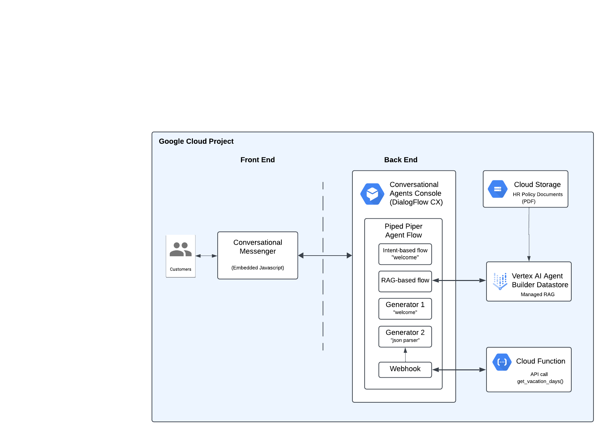

# Intro to CCAI and Virtual Agents

## Introduction

This hack will be an introduction to the world of Contact Center modernization and will teach you how to build a robust chat agent using Google's DialogFlow CX platform.

You will be building a virtual agent for the HR department of a company called PipedPiper. Your agent will be the central place for employees to find authoritative answers  on company policies as well as place to get data from other internal systems (eg. Workday). This agent will demonstrate how a company can increase employee productivity by centralizing access to knowledge - data stored in internal data sets as well as API driven systems - all accessed using natural language from a single chat.

## Learning Objectives

In this hack you will be solving a common problem of standing up a virtual chat agent - useful in many instances to help a companies internal as well as external users. More specifically we will be exploring the foundations for Google's platform called Contact Center AI (CCAI) and the tool for building agents called DialogFlow CX (DF CX).

In this hack you will:

1. Create you first agent 
1. Configure the agent to answer basic questions 
1. Set up a authoritative knowledge set based on which the agent can provide answers
1. Allow the agent to provide GenAI based answers
1. Incorporate an external system API call to answer questions 

## Challenges

- Challenge 1: First agent on the scene
   - Create and initialize a Dialogflow agent
- Challenge 2: What's -YOUR- intent?
   - Set up a basic Q&A steering using Intents and Event handlers 
- Challenge 3: Getting smarter
   - Give Agent access to PDF documents to use in chat answers
- Challenge 4: GenAI Time
   - Update our agent flow to include answers based on generator 
- Challenge 5: Agent Phone Home
   - Call external system for knowledge

## Prerequisites

- Basic knowledge of GCP
- Access to a GCP environment

## Contributors

- Roman M
- Gino F
- ?

## Challenge 1: First agent on the scene

### Introduction

This challenge is all about setting up and getting our agent configured.

### Description

Create a new agent in the Dialogflow CX Console. Test your agent with a simple "hello" message.

Use the DialogFlow Messenger Integration to create a chat bubble on the provided `page.html` page so that your agent is reachable via a web page.

Host the webpage and test it in a browser.

### Success Criteria

- An agent is created in your project
- The agent can respond to an "hello" message
- Dialogflow Messenger agent widget is responding similarly to "hello" messages on a webpage

### Tips

- None :\

### Learning Resources

- [Dialogflow Basics](https://cloud.google.com/dialogflow/cx/docs/basics)
- [Testing Agents](https://cloud.google.com/dialogflow/cx/docs/concept/test-case)
- [Running a Webserver](https://realpython.com/python-http-server/)

## Challenge 2: What's -YOUR- intent?

### Introduction

In this challenge we will train our agent on "Intents" - things we want it to understand from human language and act on them deterministically. 

### Description

Create a new Intent for the agent to handle escalations. We want to train the agent on certain phrases that would cause it to 'understand' that the human in the chat wants help from a live agent. 
> **NOTE:** Try to use at least 6 training phrases when creating the intent 

> **NOTE:** It could take a few minutes for the new training phrases to get picked up by the agent

Create a new Route to hold the escalation intent with the appropriate agent response

### Success Criteria

- A new escalation Intent is created
- A new Route is created for the esclaation Intent 
- The Agent responds to the new escalation Intent
- The agent continues to respond to "hello" messages

### Tips

- None :\

### Learning Resources

TODO

- [Dialogflow Intents](https://cloud.google.com/dialogflow/cx/docs/concept/intent)
- [Dialogflow Fulfillments](https://cloud.google.com/dialogflow/cx/docs/concept/fulfillment)

## Challenge 3: Getting smarter

### Introduction

In this challenge we enable the agent to answer questions based will company HR policy documents 

### Description

Create a data store with the PDF HR documents provided.

> **NOTE:** Indexing the documents will take about 5-10 minutes

Add your data store to the agent

### Success Criteria

- A data store is created and indexed your documents
- Agent is connected to the data store 
- Agent can respond to questions answerable by the HR documents

### Tips

- None :\

### Learning Resources

- [Data Store Agents](https://cloud.google.com/dialogflow/vertex/docs/concept/data-store-agent)

## Challenge 4: Time for GenAI

### Introduction

In this challenge we will use Google's Gemini to enhance the agents responses and make it more interactive.

### Description

Create a new Generator for the Default Welcome Intent Route, that generates more human-like welcome messages, and make sure that only that response is generated for this intent/route.

### Success Criteria

- There is a Generator created with a prompt that responds with human-like welcome messages
- Agent uses new Generator 
- Agent is connected to the data store 
- Agent can respond to questions answerable by the HR documents

### Tips

- None :\

### Learning Resources

- [Data Store Agents](https://cloud.google.com/dialogflow/vertex/docs/concept/data-store-agent)

 ## Challenge 5: Agent Phone Home

 ### Introduction
 
 In this challenge we see how to use Gemini to translate between natural language questions and API\JSON. This will let our agent answer question based on data found in an external system it can only get by an API call.

### Description

Create a new intent for answering a question about PipePiper's vacation days policy. Create a webhook that will get answers from the given Cloud Function (acting as a placeholder for a real CRM). Create two generators; one for translating the user question into an API call to the webhook, the other for translating the response JSON and answering the initial user question.

### Success Criteria 

- Agent has a webhook that can call the provided cloud function code
- Agent can send questions about vacation policy to the webhook
- Agent can provide correct answers based on webhook JSON respone back to the user

### Learning Resources
- [Dialogflow CX Webhooks](https://cloud.google.com/dialogflow/cx/docs/concept/webhook)