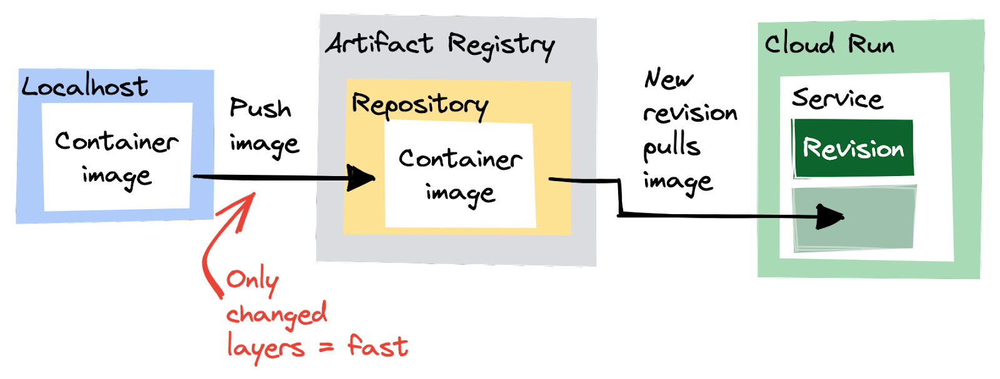
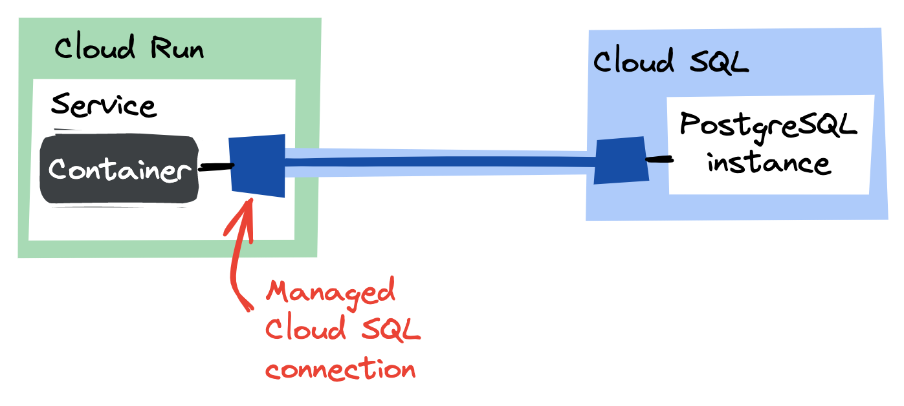
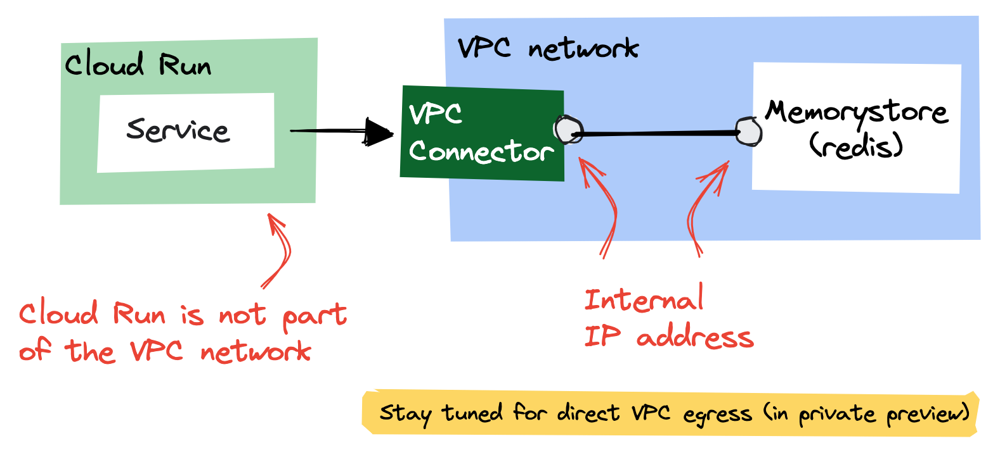

# Ready, Steady, Cloud Run!

## Introduction

We'll be using Cloud Run to quickly configure, deploy and troubleshoot a web service. During the process we'll introduce different ways to store data for the web service and learn about how to discover and fix issues. 

## Learning Objectives

This is going to be an introduction to running apps on Cloud Run. We'll dive into various aspects of app development using cloud native tooling on GCP.

1. Deploying and configuring apps on Cloud Run
1. Logging and monitoring for troubleshooting
1. Working with different data stores, Firestore, Memorystore and Cloud SQL
1. Keeping secrets safe in Secret Manager

## Challenges

- Challenge 1: Building and deploying a web service
- Challenge 2: A faster feedback loop
- Challenge 3: Logging and Monitoring
- Challenge 4: Firestore
- Challenge 5: Cloud SQL
- Challenge 6: Keeping secrets safe
- Challenge 7: Memorystore

## Prerequisites

- Your own GCP project with Owner IAM role
- Access to an environment with the following 
  - gcloud (>= 410.0.0)
  - node.js (>= v19.1.0)
  - docker (>= 20.10.22)
  - an editor
  - **Note** Cloud Shell has all of these pre-installed
- Basic knowledge of GCP
- Knowledge of docker, nodejs/npm and Javascript

## Contributors

- Wietse Venema

## Challenge 1: Building and deoploying a web service

### Introduction 

Before we can deploy the app, we need its source code. So, the first step is to get the code for the web service and run it locally to verify that everything is running smoothly.

### Description

We've prepared a [sample project](https://github.com/meken/speedrun/archive/refs/heads/main.zip), navigate there and download the project to your environment. Unpack it, install the dependencies and start it (without using containers). Edit the service to show your *Team Name* in the welcome page.

Once the service is running locally, deploy it to Cloud Run *from source code* using *the command line*. Pick `us-central1` as the *region*, allow *unauthenticated invocations*, and stick to the defaults for the rest.

> **Note** The deployment might take a few minutes to complete.

### Success Criteria

- The app can run locally (without containers)
- The app is successfully deployed to Cloud Run
- The tests in `run.test.js` are all passing
- The only code change made is to show the *Team Name* in the welcome message

### Learning Resources

- [Deploying apps to Cloud Run](https://cloud.google.com/run/docs/deploying-source-code)

### Tips

- Cloud Shell supports vim/emacs/nano, but it also has a [visual editor](https://cloud.google.com/shell/docs/launching-cloud-shell-editor)
- Cloud Shell also supports running apps and previewing those in the [browser](https://cloud.google.com/shell/docs/using-web-preview)

## Challenge 2: A faster feedback loop

### Introduction 

Waiting for a slow deployment is stressful. Some might argue that it is just as stressful as watching [2001: A Space Odyssey](https://en.wikipedia.org/wiki/2001:_A_Space_Odyssey_(film)#Critical_response) from start to finish. Let's fix that using the *Artifact Registry*.

### Description

Although the previous step already created a container registry managed by Cloud Run, we want our own to control its various aspects. Create a new standard Artifact Registry in `us-central1`. Build the image locally (using the provided `Dockerfile`), run it locally to verify that everything works as expected, and push it to the newly created Artifact Registry. Make sure that the Cloud Run is using the latest image.

### Success Criteria

- Verify that the container can run locally
- Cloud Run is using the pushed image
- The tests in `faster-feedback.test.js` are all passing
- No code change is needed for this challenge

### Learning Resources

- Docker repository on [Artifact Registry](https://cloud.google.com/artifact-registry/docs/repositories/create-repos#docker)
- [Pushing/Pulling images](https://cloud.google.com/artifact-registry/docs/docker/pushing-and-pulling)

### Tips

- Make sure `docker` is [authenticated properly](https://cloud.google.com/artifact-registry/docs/docker/pushing-and-pulling#auth) (or you'll get an error that says the repository doesn't exist)
- Don't expect your changes to appear after a push. Cloud Run only pulls an updated container image when you [create a revision](https://cloud.google.com/run/docs/deploying#revision)

## Challenge 3: Logging and Monitoring

### Introduction 

Tracing, profiling, and debugging are essential tools for any programmer, but even the most experienced programmers can't live without `console.log` or `System.out.println`. On Cloud Run, all the logs your app writes to stdout (and [more](https://cloud.google.com/run/docs/logging#container-logs)) ends up in *Cloud Logging*.

If you use structured logging (that's writing a JSON-formatted message), you can add severity, correlate requests with logs, and add additional metadata.

### Description

Browse to `/logging` on your deployed service. This should be generating some logs, visible in *Logs* section of Cloud Run UI. However it's not working at the moment, fix the issue by editing `service/routes/logging.js`

### Success Criteria

- Verify that the logs end up in Cloud Logging
- The tests in `logging.test.js` are all passing
- The code changes are only in the `logging.js` file

## Challenge 4: Firestore

### Introduction 

*Cloud Firestore* is a flexible, scalable database for mobile, web, and server development. Our app is also using this very useful service, but something is off.

### Description

Similar to the previous challenge, browse to `/firestore` and fix the issue.

> **Warning**  
> The mode you select is permanent for the project and cannot be changed, so choose wisely.

> **Note**  
> The Compute Engine default service account has been assigned the right roles to access Firestore. If you choose any other service account for your Cloud Run app, you'll have to make sure that it has the right permissions.

### Success Criteria

- The tests in `firestore.test.js` are all passing
- No code change is needed for this challenge

### Learning Resources

- Different [modes](https://cloud.google.com/datastore/docs/firestore-or-datastore) for Firestore

### Tips

- When in doubt, check the source code

## Challenge 5: Cloud SQL

### Introduction 

We know, Firestore is a great product with an incredibly high service level agreement (SLA), but it's a proprietary database, and it's a *document store*.

When it comes to querying data, relational databases are hard to beat. Who doesn't love SQL? Let's take a look at connecting Cloud Run to *Cloud SQL*: a fully-managed product that provides MySQL, PostgreSQL and SQL Server.

### Description

We've already deployed a Cloud SQL instance for you. If you browse to `/sql`, you'll see that things are not working properly yet. You need to make sure that Cloud Run can connect to it. Pass the database name (`database`), database user name (`app`) and the database user password (`my-precious`) as environment variables in plain text (don't worry we'll fix that later) to the Cloud Run instance.

> **Note**  
> The Compute Engine default service account has been assigned the right roles to access the SQL database. If you choose any other service account for your Cloud Run app, you'll have to make sure that it has the right permissions.

### Success Criteria

- Cloud Run is configured to connect to the Cloud SQL instance
- Database details are passed as environment variables to the Cloud Run instance
- The endpoint `/sql` returns **OK**
- The tests in `sql.test.js` are all passing
- No code change is needed for this challenge

### Learning Resources

- [Connecting Cloud Run to Cloud SQL](https://cloud.google.com/sql/docs/postgres/connect-run)

### Tips

- You can find the instance name of the Cloud SQL instance on the Cloud SQL instances page in the Google Cloud console

## Challenge 6: Keeping secrets safe

### Introduction 

In the previous challenge we've passed the password using an environment variable. The implication is that everyone with Viewer permissions to the Google Cloud project can read that password, which is not desirable. A better option is to use *Secret Manager*.

Secret Manager provides a central place and single source of truth to manage, access, and audit secrets across Google Cloud.

### Description

Add the database password to the Secret Manager, and configure Cloud Run to refer to that secret for the database password.

> **Note**  
> The Compute Engine default service account has been assigned the right roles to access Secret Manager. If you choose any other service account for your Cloud Run app, you'll have to make sure that it has the right permissions.

### Success Criteria

- Verify that the database password is in Secret Manager
- Verify that the environment variable containing the password is not in plain text
- Verify that the `/sql` endpoint is still returning **OK**
- No code change is needed for this challenge

### Learning Resources

- [Using secrets in Cloud Run](https://cloud.google.com/run/docs/configuring/secrets)

### Tips

- You can't have an environment variable in plain text and as a secret with the same name, so you might need to delete the plain text version

## Challenge 7: Memorystore

### Introduction 

If you need fast (under 10ms) access to shared data, Memorystore is a great option.

### Description

We've already deployed a Memorystore instance in your project. Open the endpoint `/redis` and make it work.

### Success Criteria

- The tests in `redis.test.js` are all passing
- No code change is needed for this challenge

### Learning Resources

- [Serverless VPC Access for Memorystore](https://cloud.google.com/memorystore/docs/redis/connect-redis-instance-cloud-run)

### Tips

- Once again consider enviroment variables to the rescue once the network configuration is completed
