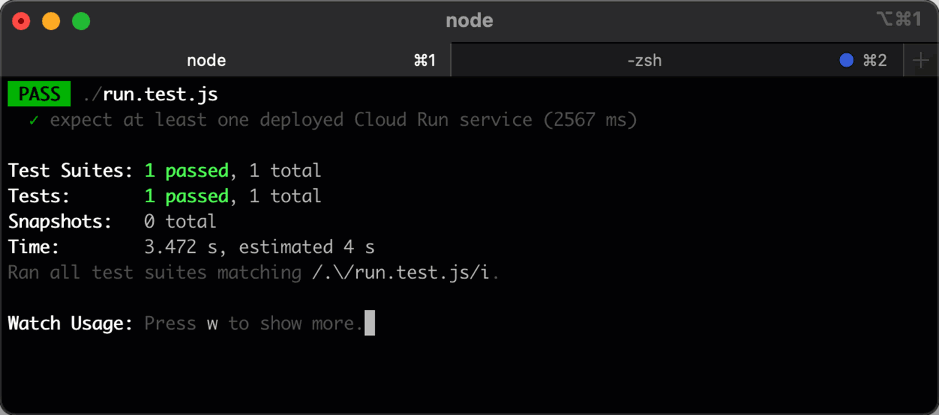

# Cloud Run in a Speed Run

## Introduction

Welcome to the coach's guide for the *Cloud Run in a Speed Run* hack. Here you will find links to specific guidance for coaches for each of the challenges.

> **Note** If you are a gHacks participant, this is the answer guide. Don't cheat yourself by looking at this guide during the hack!

## Coach's Guides

- Challenge 1: Building and deploying a web service
- Challenge 2: A faster feedback loop
- Challenge 3: Logging and Monitoring
- Challenge 4: Firestore
- Challenge 5: Cloud SQL
- Challenge 6: Keeping secrets safe
- Challenge 7: Memorystore

## Challenge 1: Building and deploying a web service

### Notes & Guidance

If participants have chosen to work from their local environments (instead of Cloud Shell), it's recommended to create a new configuration for gcloud. They'll also have to install all the prerequisites to be able to complete the challenges.

> **Note**  
> The easiest option is to use Cloud Shell as it has everything that's needed, it will provide a smooth experience. The only downside of using Cloud Shell is that the participants won't typically use Cloud Shell in their day-to-day workflow.

You can download and upload the zip file to Cloud Shell through the UI, but it's easier to use `wget`. 

```shell
wget https://github.com/meken/speedrun/archive/refs/heads/main.zip
```

It's also allowed to do a `git clone` if they manage to find the repository on Github.

After unpacking the zip file, you need to change directory to the `service` directory and install the dependencies.

```shell
cd speedrun-main/service  # assuming that the zip file is used
npm install
```

You can start the application by running the following command in the same directory

```shell
npm start
```

The app should be available on `http://localhost:8080`. 

The *Team Name* in the welcome message can be configured in `service/routes/index.js` file.

In order to deploy the app to Cloud Run, use the following command, while still in `service` directory (you can omit the `--source` flag as it's the default).

```shell
gcloud run deploy my-first-app --source .
```

In order to run the tests change directory to the top level `test` directory and install the dependencies there first.

```shell
cd ../test   # assuming that you were in service directory
npm install 
```

Once the dependencies are installed, you can run the tests from that directory.

```shell
npm run test ./run.test.js  # while in the test directory
```

You should see something like this:



## Challenge 2: A faster feedback loop

### Notes & Guidance

Creating the Artifact Registry should be straight forward, make sure to ignore the one created by Cloud Run in the first challenge.

Using the `Setup Instructions` from the Artifact Registry you can run the following command to authenticate.

```shell
gcloud auth configure-docker us-central1-docker.pkg.dev
```

Building the docker image locally should also be trivial, assuming that you're in the `service` directory, run the following command:

```shell
docker build -t my-first-app:v1 .
```

You can then run the local container:

```shell
docker run -p 8080:8080 my-first-app:v1
```

Once everything is up and running, push the local image to the new Artifact Registry

```shell
REPOSITORY_NAME=...
docker tag my-first-app:v1 us-central1-docker.pkg.dev/$GOOGLE_CLOUD_PROJECT/$REPOSITORY_NAME/my-first-app:v1
docker push us-central1-docker.pkg.dev/$GOOGLE_CLOUD_PROJECT/$REPOSITORY_NAME/my-first-app:v1
```

Now you can update the Cloud Run deployment to use the new image (stick to the same region).

```shell
gcloud run deploy my-first-app --region us-central1 --image us-central1-docker.pkg.dev/$GOOGLE_CLOUD_PROJECT/$REPOSITORY_NAME/my-first-app:v1
```

## Challenge 3: Logging and Monitoring

### Notes & Guidance

Just uncomment the log statements in `service/routes/logging.js`. After fixing it, you need to create a new version and do a redeployment.

```shell
IMAGE_TAG="my-first-app:v2"
IMAGE_FULL="us-central1-docker.pkg.dev/$GOOGLE_CLOUD_PROJECT/$REPOSITORY_NAME/$IMAGE_TAG"

docker build -t $IMAGE_TAG .
docker tag $IMAGE_TAG $IMAGE_FULL
docker push $IMAGE_FULL

gcloud run deploy my-first-app --region us-central1 --image $IMAGE_FULL
```

## Challenge 4: Firestore

### Notes & Guidance

## Challenge 5: Cloud SQL

### Notes & Guidance

## Challenge 6: Keeping secrets safe

### Notes & Guidance

## Challenge 7: Memorystore

### Notes & Guidance

