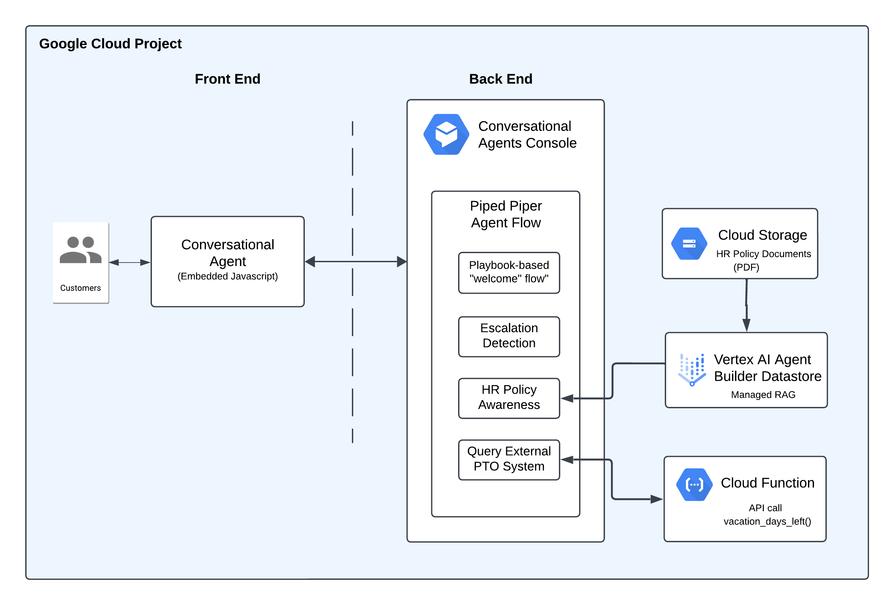

# Introduction to Conversational Agents

## Introduction

This hack will be an introduction to the world of Customer Engagement modernization. We will teach you how to build a robust conversational agent using Google Cloud's Customer Engagement Suite.



You will be building a conversational agent for the HR department of a company called Piped Piper. Your agent will be the central place for employees to find authoritative answers on company policies as well as place to get data from other internal systems (eg. Workday for PTO balance, etc). This agent will demonstrate how a company can increase employee productivity by centralizing access to knowledge; from data stored in internal data sets to API driven systems, all of this can be accessed using natural language from a single chat.

## Learning Objectives

In this hack you will be standing up a conversational chat agent and making it useful in many instances to help Piped Piper's employees. More specifically we will be exploring the foundations of Google Cloud's Customer Engagement Suite (CES) and the tool for building agents called Conversational Agents (formerly DialogFlow CX).

In this hack you will:

1. Create your first agent 
1. Set up a basic Playbook to detect an escalation scenario
1. Set up an authoritative knowledge base using internal HR policy documentes to help answer questions
1. Create an external system API call for data we can use in responses

## Challenges

- Challenge 1: First Agent On The Scene
   - Create and initialize a Conversational Agent
- Challenge 2: What's the Game Plan?
   - Set up a basic Playbook to detect an escalation scenario
- Challenge 3: Getting Smarter
   - Give the agent access to PDF documents to use in chat answers
- Challenge 4: Agent Phone Home
   - Call an external system's API for even more knowledge

## Prerequisites

- Basic knowledge of GCP
- Access to a GCP environment

## Contributors

- Roman Mezhibovski
- Gino Filicetti
- Lexi Flynn

## Challenge 1: First Agent On The Scene

### Introduction

This challenge is all about setting up and getting our agent configured.

### Description

First download the files we'll be using in the rest of this gHack from [this link](https://github.com/gfilicetti/ces-agents-intro/archive/refs/heads/main.zip). Unzip the zip file and keep the files handy, they will be needed in various challenges.

Create a new agent in the Conversational Agents Console. Test your agent with a simple "hello" message.

Use the Conversational Messenger Integration to create a chat bubble on the provided `agent-page.html` page so that your agent is reachable via a web page.

Host the webpage on a webserver running in CloudShell and test it in a browser to make sure the chat bubble appears and works.

### Success Criteria

- An agent is created in your project
- The agent can respond to an "Hello" message
- The agent widget running on `agent-page.html` is also responding to "Hello" messages in the same way

### Tips

- Don't forget! You can upload files to your Cloud Shell and even expose ports to make it available in your browser.

### Learning Resources

- [Conversational Agents Console](https://dialogflow.cloud.google.com/v2/projects/)
- [Agents](https://cloud.google.com/dialogflow/cx/docs/concept/agent)
- [CloudShell - Manage Files](https://cloud.google.com/shell/docs/uploading-and-downloading-files)
- [Running a Webserver](https://realpython.com/python-http-server/)
- [CloudShell - Preview Webservers](https://cloud.google.com/shell/docs/using-web-preview)


## Challenge 2: Following the Playbook...

### Introduction

Now that we have an agent, we want to make it useful and give it some goals. This is accomplished using Playbooks.

### Description

In this challenge we will create a basic Playbook that we can use to detect an escalation scenario. 

You will need to give it a goal and give it some instructions.

The Playbook will need to be given some examples, create an example set called `Escalate`.

Whenever a user types something requiring a human, the conversation state should change to `ESCALATED`.

> **NOTE** Don't forget to use the Simulator to test your agent as you go.

### Success Criteria

- A new Playbook is created
- The Playbook has a goal and instructions
- The Playbook has been trained by examples in a set called `Escalate`.
- A user typing something that obviously requires a human triggers the conversation state to change to `ESCALATED`

### Learning Resources

- [Playbook Concepts](https://cloud.google.com/dialogflow/cx/docs/concept/playbook)
- [Playbook Best Practices](https://cloud.google.com/dialogflow/cx/docs/concept/playbook/best-practices)

## Challenge 3: Getting Smarter

### Introduction

In this challenge we will enable the Agent to handle questions based on Piped Piper's HR policy documents.

### Description

The downloaded zip from Challenge 1 contains all of Piped Piper's HR policy documents as PDFs. 

Create a data store for these documents that can be used in your Playbook as a "tool". 

> **NOTE**: Your new data store can take 10+ minutes to fully ingest all of the PDF documents. If you click into the data store on the Agent Builder page and click on the Activity tab you can watch its progress.

Once your documents are ingested, you will need to add this new "tool" to your Playbook.

### Success Criteria

- A data store of type **Unstructured documents** is created and has indexed your documents
- A new tool pointing to this data store has been added to your Playbook.
- The Agent is now capable of answering questions about Piped Piper's HR Policies, such as:
   - *What is our paid time off policy?*
   - *Do we offer sabbaticals?*
   - *What is our paid leave policy?*

### Tips
- Don't forget you can ask follow up questions because the Agent keeps the conversation context.

### Learning Resources

- [Data Stores](https://cloud.google.com/dialogflow/cx/docs/concept/data-store)
- [Tools](https://cloud.google.com/dialogflow/cx/docs/concept/data-store/handler)

## Challenge 4: Agent Phone Home

### Introduction

Now that we can answer questions about Piped Piper's HR policies, we want to enhance our agent to call external systems to get answers as well.

In this challenge we will be connecting to an external system system that can be queried to get employee PTO days balance information. 

### Description

A Cloud Run Function with an HTTP REST api has already been deployed for you. You will need the URL of this endpoint. This can be found in the [Google Cloud Console](https://console.cloud.google.com/).

You will need to create an **OpenAPI** tool to make the call to this endpoint.

You will need a YAML scheme for this tool. We have provided the YAML for you below. 

> **NOTE** Make sure you read the comments as there are some substitutions you need to make.

```yaml
openapi: 3.0.0
info:
  title: Vacation Days API
  version: 1.0.0
servers:
  - url: https://us-central1-ccai-ghacks.cloudfunctions.net # Replace with your root Cloud Run root URL
paths:
  /vacation-days: # Matches the function name in your URL
    get:
      summary: Get remaining vacation days
      operationId: getVacationDays
      responses:
        '200':
          description: Number of vacation days remaining
          content:
            application/json:
              schema:
                type: object
                properties:
                  vacation_days_left:
                    type: integer
                    description: The number of vacation days left.
                    example: 15 # An example value (this is never actually returned)
```

For authentication to this endpoint, you need to configure a **Service Agent Token** and use **ID Token**. You then need to find the **Dialog Flow Service Agent** and give it IAM permissions to "invoke" both Cloud Run and Cloud Run Functions.

Once this tool is finished, incorporate it into your Playbook so that questions about number of vacation days are answered with a number.

> **NOTE** The number of vacation days is generated randomly, so it should always be changing.

### Success Criteria

- There is a new tool for calling an HTTP REST endpoint
- The agent uses this new endpoint to answer questions about vacation days such as:
   - How many vacation days do I have left?
- Questions about vacation days always return a different number.

### Learning Resources

- [OpenAPI Tool](https://cloud.google.com/dialogflow/cx/docs/concept/playbook/tool#openapi)
- [DialogFlow Service Agent](https://cloud.google.com/iam/docs/service-agents#dialogflow-service-agent)
- [Granting IAM Roles to Service Agents/Accounts](https://cloud.google.com/iam/docs/manage-access-service-accounts#single-role)
- [Cloud Run IAM Roles](https://cloud.google.com/run/docs/reference/iam/roles)
- [Cloud Functions IAM Roles](https://cloud.google.com/functions/docs/reference/iam/roles)
