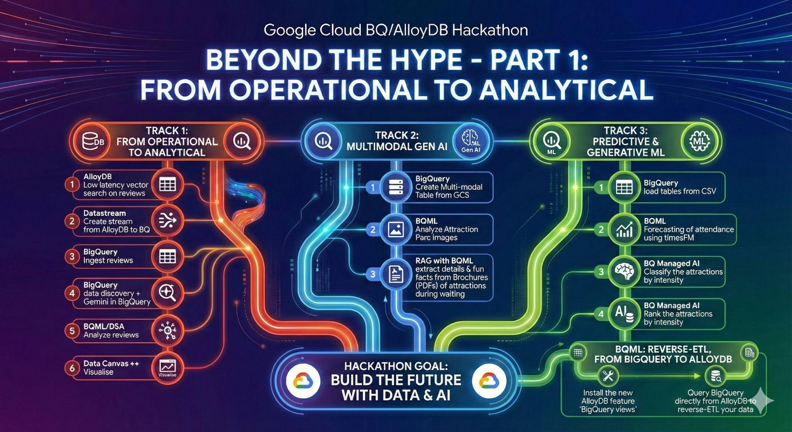
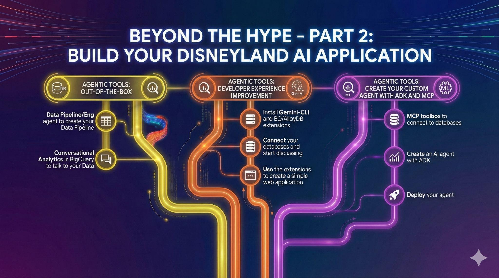

# Disneyland Data Analytics

## Introduction

Welcome, future Disney data wizards!🪄

Forget tedious travel guides and endless forum scrolling. Imagine planning the perfect Disneyland trip, equipped with data-driven insights. Which park offers the best experience? When are the crowds thinnest? Can you predict the best time to conquer that notoriously long queue?

In this gHack, you're building your ultimate Disneyland planning tool. We've got the data: reviews from visitors across global branches, historical waiting times, and attendance figures. Your mission? Transform this raw data into actionable insights leveraging the power of AI and Data on Google Cloud.





## Learning Objectives

In this hack, you will build an end-to-end data analytics pipeline leveraging AI/ML capabilities on Google Cloud.

1. **Gather Data:** Load diverse Disneyland reviews, waiting times, and attendance figures into AlloyDB, our high-performance, PostgreSQL-compatible database.
2. **Seamless Movement:** Use Datastream, our serverless change data capture service, to effortlessly move this dynamic information into BigQuery, Google Cloud's powerful serverless data warehouse.
3. **Predict the Magic:** Unleash BigQuery ML to analyze review sentiment and forecast waiting times directly with SQL.
4. **Talk to your data:** Use pre-built tools and intelligent agents to get insights using natural language.
5. **Intelligent Interaction:** Build an intelligent agent powered by MCP toolbox and ADK (Agent Development Kit) to provide data-driven answers to complex queries.

## Challenges

- Challenge 1: Data Ingestion, Search and Sync
  - Load data into AlloyDB, create embeddings for similarity search, and sync data to BigQuery using Datastream.
- Challenge 2: Data Discovery & Quality
  - Explore data semantically in BigQuery, perform profiling and quality scans, and use Gemini for data preparation.
- Challenge 3: Sentiment & Categorization with Gemini
  - Use BigQuery ML and Gemini to analyze reviews for sentiment and categories, and visualize insights with Data Canvas.
- Challenge 4: Multimodal Analytics (Images & PDFs)
  - Perform image analysis and build a RAG system for PDF brochures entirely within BigQuery.
- Challenge 5: Predictive Analytics & Classification
  - Forecast waiting times and use advanced AI functions to classify and rank attractions by intensity.
- Challenge 6: Operationalizing Insights & Data Agents
  - Sync data back to AlloyDB using Reverse-ETL and leverage out-of-the-box Data Agents for natural language interaction.
- Challenge 7: Intelligent Interaction & Agents
  - Use Gemini-CLI for rapid data exploration and build a custom AI agent using Agent Development Kit (ADK) and MCP toolbox.

## Prerequisites

- Your own GCP project with Owner IAM role.
- Google Cloud CLI installed.
- Basic knowledge of SQL and PostgreSQL.
- Access to Vertex AI APIs.

## Contributors

- Rayhane Rezgui
- Matt Cornillon

## Challenge 1: Data Ingestion, Search and Sync

### Introduction

For this initial stage, you will retrieve the data from your AlloyDB operational database and load it into BigQuery for subsequent data analysis. You will also set up everything needed in AlloyDB for your future agent!

### Description

#### Data loading in AlloyDB

First, ingest reviews for Disneyland amusement parks and a list of attractions into your AlloyDB for PostgreSQL cluster.

> [!NOTE]  
> You should be provided the AlloyDB details such as credentials and proxy ip address.

- Create a table `disneyland_reviews` with 6 columns: `review_id` and `rating` as integer, `year_month`, `reviewer_location`, `review_text`, `branch` as text.
- Create a table `disneyland_attractions` with 4 columns: `attraction_id` as integer, `branch`, `name` and `description` as text.
- Import data from the following CSVs:
  - `gs://<YOUR_PROJECT_ID>/reviews.csv`
  - `gs://<YOUR_PROJECT_ID>/attractions.csv`

> [!TIP]  
> If you don't know how to write the SQL (e.g. to create a table), consider using the *Generate SQL* option in AlloyDB Studio Query Editor.  
> And if you don't know how to do something in Google Cloud in general, (e.g. importing a CSV file from GCS to AlloyDB), consider using the Gemini Cloud Assist (click on the Gemini icon at the top right corner of the screen).

#### Generate Embeddings

To provide attraction recommendations, you need to create embeddings of attraction descriptions:

- Install the `vector` extension in AlloyDB.
- Add a vector column called `embedding` to your `disneyland_attractions` table.
- Generate and populate the embedding of the descriptions using the native integration between AlloyDB and Vertex AI.
- Find top 5 attractions most similar to `Dark ride in space` using the embeddings.

#### Sync to BigQuery with Datastream

To stream our data from AlloyDB to BigQuery, we'll use Google Datastream. It will *backfill* the already existing data and will listen to all changes in source tables (using Change Data Capture) and send them to BigQuery.

- Create a [publication and a replication slot](https://docs.cloud.google.com/datastream/docs/configure-alloydb-psql#configure_alloydb_for_replication) in your AlloyDB database.
- Create a Datastream source profile for your AlloyDB database
  - Stick to `us-central1` whenever prompted for a region, otherwise you might need to recreate some firewall rules
  - Use the public IP of the **proxy** as the hostname and database user/password that you've been provided earlier
  - Use *Encryption type* `None`
  - Choose IP allowlisting for *Connectivity method*
  - Provide the replicaton slot name and publication name that you've created in the previous step
  - Choose the two tables that you have created as the *Objects to include*
- Create a Datastream destination profile for BigQuery
  - Stick to the same region as your source (`us-central1` in this case)
  - For *Schema grouping* use *Single dataset for all schemas* and pick the dataset `disney` in your project
  - Stick to *Stream write mode* of `Merge`
  - And a *Staleness limit* of `0 seconds`
- If the validation is successful create & start the stream from AlloyDB to BigQuery

> [!NOTE]  
> It might take a few minutes before all data is synced to BigQuery.

### Success Criteria

- Verify that `disneyland_reviews` has 42,656 rows and `disneyland_attractions` has 73 rows in AlloyDB.
- Demonstrate a similarity search on attraction descriptions to identify the top 5 attractions similar to `Dark ride in space`.
- Show a BigQuery table with 42,656 rows that's synced from the AlloyDB `disneyland_reviews` table.
- Show a BigQuery table with 73 rows that's synced from the AlloyDB `disneyland_attractions` table.

### Learning Resources

- [Generating text embeddings in AlloyDB](https://cloud.google.com/alloydb/docs/ai/work-with-embeddings)

## Challenge 2: Data Discovery & Quality

### Introduction

Now that your data is in BigQuery, it's time to explore its potential and ensure its quality before performing advanced analysis.

### Description

#### Data Discovery and Insights in BigQuery

We can directly navigate to our tables from the BigQuery Studio interface, but we'll use the *Search* capabilities to find a table. Search for `rating` in the *Explorer* pane using the *Search for resources* search box at the top. Filter for your project to get the correct table.

Navigate to the table that's found and *Generate Insights with publishing* to generate descriptions for the table and its columns. Use the generated *insights* to answer any question without you writing the SQL.

You can also generate descriptions from the *Schema* tab of the tables, navigate to the schema for other table in your dataset and generate those descriptions for the table.

It's also possible to generate dataset level insights to capture any hidden relationships across tables, go ahead and generate insights for the dataset as well.

> [!NOTE]  
> It might take a few minutes to generate the insights. You can have a look at the next task while insights are being generated for the various resources.

#### Data Profiling and Quality

The goal of this section is to clean and prepare your data. However, you're not very familiar with the distribution of the values of each column. You need to profile your data to know what kind of transformation steps you need to perform on your data.

Google Cloud's *Knowledge Catalog* automates profiling scans to deliver consistent data quality metrics. Key statistics identified include null counts, distinct values, data ranges, and value distributions. It's possible to activate a profile scan through the BigQuery Interface.

Go ahead and do a *Quick data profile* for the `reviews` table and answer the following questions:

- What's the average rating of Disneyland?
- Where are reviewers located the most?
- Are all reviews unique?
- What's the percentage of "missing" data from the year_month column?

*Knowledge Catalog* also has support for automatic data quality which lets you define and measure the quality of the data in your BigQuery tables. You can automate the scanning of data, validate data against defined rules, and log alerts if your data doesn't meet quality requirements. You can manage data quality rules and deployments as code, improving the integrity of data production pipelines.

Define and run a quality scan on the same table with the following rules (stick to defaults for anything else):

- Checks for `null` values in the `branch` column.
- Validates that `rating` is in the set `{1, 2, 3, 4, 5}`.
- Checks for uniqueness of `review_id`.
- Ensure results are exported to a BigQuery table `quality_scan_results`.

> [!NOTE]  
> It might take a few minutes to generate the profile & quality scans

#### Data Preparation using Gemini

Following the data quality and profiling scans you performed, it's time to clean the data before analyzing it.

*Data preparations* are BigQuery resources, which use Gemini in BigQuery to analyze your data and provide intelligent suggestions for cleaning, transforming, and enriching it. You can significantly reduce the time and effort required for manual data preparation tasks.

Use Gemini-powered *Data Preparation* to clean your data:

- Filter out rows where `branch` is `NULL` or empty.
- Replace "missing" in `year_month` with `NULL`.
- Replace underscores with spaces in the `branch` column.
- Export to a transformed table `disneyland_reviews_cleaned`.

### Success Criteria

- Demonstrate Gemini-generated descriptions added to the metadata of the dataset, tables, and columns.
- Answer at least one question about the reviews data using the generated *insights*.
- Answer specific questions based on the profile scan (e.g., average rating, reviewer location, uniqueness, missing data percentage).
- Show the `quality_scan_results` table with the defined rules.
- Verify the existence of the `disneyland_reviews_cleaned` table with the applied transformations.

### Learning Resources

- [BigQuery Data Insights](https://cloud.google.com/bigquery/docs/data-insights)
- [BigQuery Data Profiling](https://cloud.google.com/dataplex/docs/data-profiling-overview)
- [BigQuery Data Quality](https://cloud.google.com/dataplex/docs/auto-data-quality-overview)
- [BigQuery Data Preparation Suggestions](https://cloud.google.com/bigquery/docs/data-prep-get-suggestions)

## Challenge 3: Sentiment & Categorization with Gemini

### Introduction

Now that you've cleaned your data, you can start analyzing it using BigQuery ML and Gemini models. Your goal is to extract categories from reviews and perform sentiment analysis to understand visitor experiences better.

### Description

#### Analyze Reviews with Gemini

We'll use BigQuery ML `AI.GENERATE_TEXT` function to access Gemini models and generate text. Before we can use that function we'll have to create a model in BigQuery.

Once the model is created, we can start using it for the following tasks:

- **Extract Categories:** Analyze a sample of 100 reviews from `disneyland_reviews` to identify categories (e.g., cleanliness, food, waiting time). Each review could have multiple categories, assume that the category column is a comma separated list. Store the results in a table `reviews_categories`. The new table should contain all of the columns from the original `disneyland_reviews` table and one more text column called `categories`.
- **Sentiment Analysis:** Classify the same 100 reviews into *Positive*, *Negative*, or *Neutral* sentiments. Store these in a table `reviews_analysis`. Make sure that the generated text is only the sentiment (without any punctuation or additional text). Similar to previous task, the new table should contain all of the columns from the original `disneyland_reviews` table and one more text column called `sentiment`.

> [!NOTE]  
> Make sure to use a sample of 100 (using the LIMIT clause) so that processing is quick, running Gemini on 40K rows could take a while.

#### Visualize with Data Canvas

Use BigQuery's *Data Canvas* to explore your results visually.

- Create a graph showing the percentage of positive vs. negative reviews.
- Create another graph showing the number of reviews per category and the sentiment distribution within each category (make sure that the category list is split).

> [!NOTE]
> You can use Data Canvas' *Canvas Assistant* feature to help you.

### Success Criteria

- Table `reviews_categories` with extracted categories for 100 reviews.
- Table `reviews_analysis` with sentiment classification for 100 reviews.
- A Data Canvas showing the required graphs and insights.

### Learning Resources

- [BigQuery AI.GENERATE_TEXT function](https://docs.cloud.google.com/bigquery/docs/reference/standard-sql/bigqueryml-syntax-ai-generate-text)

## Challenge 4: Multimodal Analytics (Images & PDFs)

### Introduction

Disneyland isn't just about text; it's about magic you can see and read about! In this challenge, you'll use BigQuery's multimodal capabilities to analyze images and build a RAG (Retrieval-Augmented Generation) system for brochures.

### Description

#### Image Analysis

You have photos taken by visitors in `gs://<YOUR_BUCKET>/attraction_parc_photos/`. Some are from Disneyland, some are not.

- Create an **Object Table** in BigQuery that references these images.
- Use Gemini via BigQuery ML (`AI.GENERATE_TEXT` and the model you've creaated in the previous challenge) to identify which photos are actually from Disneyland and store the results in a table `images_analysis` with the `uri` of the image and a boolean column `is_disneyland`.

#### RAG System for Brochures

While waiting in line, visitors want fun facts. You have PDF brochures in `gs://<YOUR_BUCKET>/disneyland_brochures/`.

- Create an **Object Table** for the PDF files.
- Use the pre-provided Python UDF `chunk_pdf` to parse the PDFs into chunks, store the results in a new table `brochures_chunks` with the columns `uri` and `chunk`.
- Create a new embbedding model in BigQuery and generate embeddings for these chunks using it.
- Perform a **Vector Search** to answer questions like: *"Where to eat a tex-mex meal buffet-style?"*
- Generate an augmented answer using the search results.

> [!NOTE]
> The Python UDF `chunk_pdf` is already created for you in the `disney` dataset. You just need to call it!

### Success Criteria

- An Object Table for images and a successful analysis identifying Disneyland photos.
- An Object Table for PDFs.
- A table containing embeddings for the PDF chunks.
- A successful Vector Search and an AI-generated answer based on the brochures.

### Learning Resources

- [Example usage of the `chunk_pdf` UDF](https://docs.cloud.google.com/bigquery/docs/multimodal-data-sql-tutorial#analyze_pdf_data)

## Challenge 5: Predictive Analytics & Classification

### Introduction

Predicting the future and understanding ride intensity is key to a perfect visit. In this challenge, you'll forecast waiting times and classify attractions.

### Description

#### Forecast Waiting Times

Load the historical data from `gs://<YOUR_BUCKET>/waiting_times.csv` into a BigQuery table `waiting_times`.

- Use `AI.FORECAST` function to predict average hourly waiting times for the first day of 2025.
- Store the results in `forecasted_waiting_time`.

#### Classify and Rank Rides

Let's use BigQuery's managed AI functions to categorize attractions without human bias.

- Use `AI.CLASSIFY` to categorize rides into `[easy-peasy, thrilling, extreme]` based on their descriptions.
- Use `AI.SCORE` to rank attractions on a **thrill level** from 1 to 10.

### Success Criteria

- A BigQuery table `waiting_times` with historical data.
- A table with predictions for the first day of 2025.
- A table with attractions classified by intensity and ranked by thrill level.

### Learning Resources

- [Forecasting example on BigQuery](https://docs.cloud.google.com/bigquery/docs/timesfm-time-series-forecasting-tutorial)
- [BigQuery AI.CLASSiFY function](https://docs.cloud.google.com/bigquery/docs/reference/standard-sql/bigqueryml-syntax-ai-classify)
- [BigQuery AI.SCORE function](https://docs.cloud.google.com/bigquery/docs/reference/standard-sql/bigqueryml-syntax-ai-score)

## Challenge 6: Operationalizing Insights & Data Agents

### Introduction

Now that you have insights in BigQuery, it's time to make them actionable! You'll sync data back to your operational database (AlloyDB) and set up agents for easy access.

### Description

#### Reverse-ETL to AlloyDB

Use the `bigquery_fdw` extension in AlloyDB to query your BigQuery results directly from PostgreSQL.

- Install the `bigquery_fdw` extension in AlloyDB.
- Create a **Foreign Table** in AlloyDB that maps to your `reviews_analysis` table in BigQuery.
- Verify the connection by running a `SELECT` query in AlloyDB Studio.

As this functionality is not part of the documentation, you can use the following to get things working:

```sql
CREATE EXTENSION bigquery_fdw; 

CREATE SERVER bq_disney FOREIGN DATA WRAPPER bigquery_fdw; 

CREATE USER MAPPING FOR postgres SERVER bq_disney;
```

You can now create a *foreign table* that will be mapped to a specific table in BigQuery.

```sql
CREATE FOREIGN TABLE reviews_analysis (
    "review_id" int,
    "sentiment" text
  ) 
  SERVER bq_disney OPTIONS (
    PROJECT '<YOUR PROJECT ID>',
    DATASET 'disney',
    TABLE 'reviews_analysis'
  );
```

And before you can use this table, you'll need to grant a service account the required permissions, running from Cloud Shell:

```shell
SA=$(gcloud beta alloydb clusters describe disney-cluster --region=us-central1 --format="value(serviceAccountEmail)")
for ROLE in "roles/bigquery.dataViewer" "roles/bigquery.readSessionUser"; do
  gcloud projects add-iam-policy-binding $GOOGLE_CLOUD_PROJECT \
    --member="serviceAccount:$SA" \
    --role="$ROLE"
done
```

#### Out-of-the-Box Data Agents

Leverage BigQuery's built-in agents to simplify data interaction.

- **Data Engineering Agent:** Create a new *Pipeline* in Bigquery that creates the view `average_waiting_time` in `disney` dataset by joining `waiting_times` and `disneyland_attractions` to calculate the average waiting_time per attraction, using the agent's assistance.
- **Conversational Analytics Agent:** Create and publish an agent called `my_disney_friend` in the BigQuery *Agents* tab. Ask it questions like: *"What's the average waiting time per attraction?"*

### Success Criteria

- Successful query of BigQuery data from within AlloyDB using a foreign table.
- A BigQuery view `average_waiting_time` created with the help of the Data Engineering Agent.
- A published and functional Conversational Analytics Agent.

## Challenge 7: Intelligent Interaction & Agents

### Introduction

The final stage! You'll use professional developer tools and build a custom AI agent that can act on your data.

### Description

#### Developer Experience with Gemini-CLI

[Gemini-CLI](https://geminicli.com/) is an open-source AI agent for your terminal.

- Install Gemini-CLI and its BigQuery/AlloyDB extensions.
- Configure it to connect to your databases.
- Use prompts to generate a fancy HTML summary of your data in both BigQuery and AlloyDB.

#### Build a Custom Agent with ADK & MCP Toolbox

Build a full-fledged assistant that can recommend attractions, provide waiting time estimates, and handle reviews.

- Deploy an [MCP toolbox for databases](https://github.com/googleapis/genai-toolbox) server using AlloyDB and BigQuery as sources.
- Define tools for the agent: listing attractions, recommendations, adding reviews, and waiting time estimation.
- Deploy an agent using the [Agent Development Kit (ADK)](https://google.github.io/adk-docs/) that uses these tools.
- Demonstrate a full conversation with your assistant in the ADK web interface.

### Success Criteria

- Gemini-CLI output showing successful connection to both BigQuery and AlloyDB.
- An HTML page generated by Gemini-CLI describing the data.
- A functional ADK agent using MCP tools to interact with Disneyland data.
