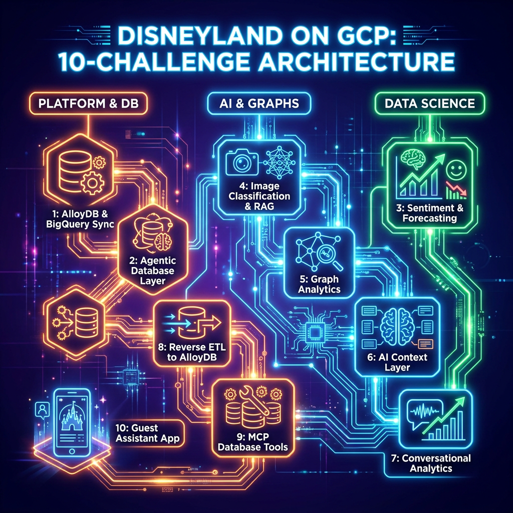
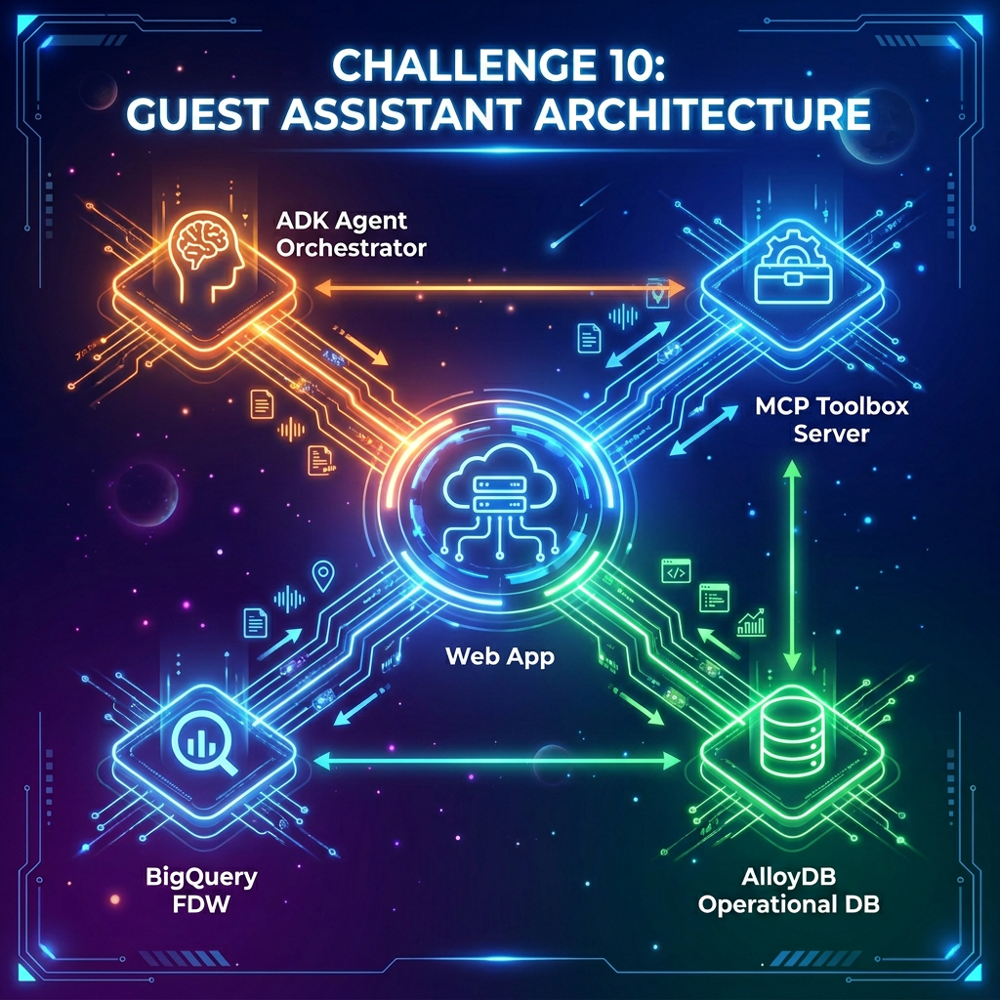

# Disneyland Agentic Data Cloud



## Introduction

Welcome, Disney Data Wizards! 🪄

Planning the perfect Disneyland trip is a complex optimization problem. Visitors want to maximize magic and minimize waiting. They want to know: *Which rides are best suited for them? When are the crowds thinnest? What is the optimal route through the park to avoid bottleneck queues?*

In this gHack, your mission is to transform raw data—visitor reviews, attraction catalogs, historical wait times, park brochures, and visitor movement logs—into an end-to-end, intelligent guest assistance system.

This gHack is designed to be highly challenging and is structured into **10 challenges** that can be parallelized across **3 key team personas** to optimize development speed:

- **DB & Platform Engineers** will build the operational database in AlloyDB, configure Datastream replication, set up the database agentic layer, sync analytical insights, and assemble the final agent and web UI (Challenges 1, 2, 8, 9, and 10).
- **Data Scientists & Analysts** will train predictive models, perform sentiment analysis, cluster attractions in BigQuery, and design the semantic layer/Conversational Analytics agent for park managers (Challenges 3, 6, and 7).
- **AI & Graph Engineers** will construct RAG pipelines, classify multimodal images, and model/query visitor movement patterns using property graphs in BigQuery (Challenges 4 and 5).

Get ready to build an agentic data pipeline that would make Mickey proud! Let the magic begin! ✨

---

## Learning objectives

In this hack, you will build an end-to-end data pipeline with AI and database capabilities on Google Cloud:

1. **AlloyDB AI**: Ingest operational data and generate vector embeddings natively.
2. **Real-time replication**: Set up CDC from AlloyDB to BigQuery using Datastream.
3. **Agentic database**: Configure predictable SQL generation in AlloyDB and expose it as tools.
4. **Predictive analytics**: Train forecasting and sentiment models using BigQuery ML.
5. **Multimodal RAG**: Build image classification and PDF search pipelines.
6. **Graph analysis**: Map visitor movements and query patterns using GQL.
7. **Context layer (Knowledge Catalog)**: Build a centralized metadata context layer, business glossary, and profiling rules.
8. **Conversational analytics**: Build a natural language assistant using BigQuery Studio.
9. **AlloyDB sync**: Copy insights back to AlloyDB using FDW for fast serving.
10. **MCP tools**: Expose database capabilities using the MCP Toolbox.
11. **App deployment**: Build a web app with the ADK and deploy it locally.

---

## Challenges

- Challenge 1: Setting up AlloyDB and replicating data to BigQuery
- Challenge 2: Creating the agentic database layer
- Challenge 3: Sentiment and wait-time forecasting
- Challenge 4: Image classification and brochure RAG
- Challenge 5: Graph analytics and visitor flow
- Challenge 6: Preparing the Context Layer
- Challenge 7: Conversational analytics for insights
- Challenge 8: From insights to action, syncing BigQuery and AlloyDB
- Challenge 9: Exposing Database Tools via MCP
- Challenge 10: Building the guest assistant app

---

## Prerequisites

- Basic knowledge of Google Cloud services (AlloyDB, BigQuery, Datastream)
- Intermediate knowledge of SQL and PostgreSQL
- Basic familiarity with Python and Agentic AI concepts (MCP, ADK)
- Access to a Google Cloud project with the necessary APIs and resources provisioned

---

## Contributors

- Matt Cornillon
- Rayhane Rezgui

---

## 👥 Team Roles & Parallelization Paths

This gHack is designed to be highly challenging but is **fully parallelizable** across different team members. Whether you are a team of 2, 5, or more, you can split the challenges to build in parallel and assemble a complete intelligent system in under 4 hours.

### 📊 Recommended Parallelization Options

Here is how you can divide and conquer based on your team size:


#### 🧩 Option 1: The 3-Group Split (Recommended)

- **Group A (Platform & DB Engineers):** Focuses on the core transactional and serving loop.
  - *Path:* [Challenge 1](#challenge-1-setting-up-alloydb-and-replicating-data-to-bigquery) -> [Challenge 2](#challenge-2-creating-the-agentic-database-layer) -> [Challenge 8](#challenge-8-from-insights-to-action-syncing-bigquery-and-alloydb) -> [Challenge 9](#challenge-9-exposing-database-tools-via-mcp) -> [Challenge 10](#challenge-10-building-the-guest-assistant-app)
- **Group B (Data Scientists):** Focuses on analytics, forecasting, and clustering.
  - *Path:* [Challenge 3](#challenge-3-sentiment-and-wait-time-forecasting) -> Assist Group C with [Challenge 7](#challenge-7-conversational-analytics-for-insights) or Group A with [Challenge 10](#challenge-10-building-the-guest-assistant-app)
- **Group C (AI & Graph Engineers):** Focuses on unstructured data, graphs, and internal conversational search.
  - *Path:* [Challenge 4](#challenge-4-image-classification-and-brochure-rag) -> [Challenge 5](#challenge-5-graph-analytics-and-visitor-flow) -> [Challenge 6](#challenge-6-preparing-the-context-layer) -> [Challenge 7](#challenge-7-conversational-analytics-for-insights)

#### 👥 Option 2: The 2-Group Split

- **Group A (Database & Application Developers):** Focuses on database setup, agentic tool serving, and app integration.
  - *Path:* [Challenge 1](#challenge-1-setting-up-alloydb-and-replicating-data-to-bigquery) -> [Challenge 2](#challenge-2-creating-the-agentic-database-layer) -> [Challenge 8](#challenge-8-from-insights-to-action-syncing-bigquery-and-alloydb) -> [Challenge 9](#challenge-9-exposing-database-tools-via-mcp) -> [Challenge 10](#challenge-10-building-the-guest-assistant-app)
- **Group B (AI, ML & Analytics Engineers):** Focuses on all BigQuery-centric analytics, ML models, RAG, and property graphs.
  - *Path:* [Challenge 4](#challenge-4-image-classification-and-brochure-rag) -> [Challenge 3](#challenge-3-sentiment-and-wait-time-forecasting) -> [Challenge 5](#challenge-5-graph-analytics-and-visitor-flow) -> [Challenge 6](#challenge-6-preparing-the-context-layer) -> [Challenge 7](#challenge-7-conversational-analytics-for-insights)

---

## Challenge 1: Setting up AlloyDB and replicating data to BigQuery

**Target Persona:** Data Engineer / DBA | **Estimated Duration:** 45 minutes

### Introduction

AlloyDB is our operational data store, and BigQuery is the workhorse for analytical workloads. In this challenge, you will initialize the operational database in AlloyDB, load the base data from Cloud Storage, generate embeddings at the source using AlloyDB AI, and set up real-time replication to BigQuery using Datastream. Finally, you will explore the replicated data in BigQuery Studio using the new Data Canvas visual interface.

### Description

#### Task 1.1: Ingest Data into AlloyDB

First, let's connect to your **AlloyDB for PostgreSQL** cluster.

> [!TIP]
> **AlloyDB Postgres Credentials:**
>
> - **Database:** `disney` *(Note: Connect to the default `postgres` database first to create the `disney` database, then reconnect to `disney` for the rest of the hackathon)*
> - **Username:** `postgres`
> - **Password:** Use the one provided by your coach

Connect using **AlloyDB Studio** or `psql` and perform the following tasks:

1. **Create a Dedicated Database:**
   Connect to the default `postgres` database and run the following SQL command to create a new dedicated database:

    ```sql
    CREATE DATABASE disney;
    ```

   Once created, **disconnect and reconnect** to your new `disney` database. All subsequent tables, extensions, and queries in this hackathon must be run within the `disney` database.

2. **Create the Tables:**
    - **`disneyland_reviews`**: Represents visitor reviews.
        - Columns: `review_id` (integer, Primary Key), `rating` (integer), `year_month` (text), `reviewer_location` (text), `review_text` (text), `branch` (text).
    - **`disneyland_attractions`**: Represents the park's attractions.
        - Columns: `attraction_id` (integer, Primary Key), `branch` (text), `name` (text), `description` (text).
    - **`visitor_movements`**: Represents visitor movements in the park.
        - Columns: `visitor_id` (integer), `from_attraction_id` (integer), `to_attraction_id` (integer), `timestamp` (timestamp).
3. **Add a Full-Text Search Vector:**
   To enable high-performance hybrid search later, add a generated `tsvector` column to the attractions table:

    ```sql
    ALTER TABLE disneyland_attractions 
    ADD COLUMN description_tsvector tsvector 
    GENERATED ALWAYS AS (to_tsvector('english', description)) STORED;
    ```

4. **Import Data from Cloud Storage:**
   Use the AlloyDB Import API (via UI or `gcloud`) or the tool of your choice to import the data from these public CSVs:
    - `gs://ghacks-disneyland-on-gcp/reviews.csv` into `disneyland_reviews`
    - `gs://ghacks-disneyland-on-gcp/attractions.csv` into `disneyland_attractions`
    - `gs://ghacks-disneyland-on-gcp/visitor_movements.csv` into `visitor_movements`

#### Task 1.2: Generate Vector Embeddings at the Source

To support semantic searches on our attractions, we need to generate and store vector embeddings directly inside AlloyDB using **AlloyDB AI**.

1. **Enable the Extensions:**

    ```sql
    CREATE EXTENSION IF NOT EXISTS vector CASCADE;
    CREATE EXTENSION IF NOT EXISTS google_ml_integration CASCADE;
    ALTER DATABASE disney SET google_ml_integration.enable_preview_ai_functions = 'on';
    ```

2. **Add the Embedding Column:**
   Add a vector column of size 3072 (the output dimension of `gemini-embedding-001`) to the attractions table:

    ```sql
    ALTER TABLE disneyland_attractions ADD COLUMN embedding vector(3072);
    ```

3. **Generate Embeddings:**
   Populate the `embedding` column by calling Gemini Enterprise Agent Platform's embedding model natively from SQL:

    ```sql
    -- TODO: Write an UPDATE query that populates the `embedding` column by calling 
    -- Gemini Enterprise Agent Platform's embedding model natively from SQL using the 'gemini-embedding-001' model.
    ```

#### Task 1.3: Set Up Real-Time Replication with One-Click Datastream

To stream our data from AlloyDB to BigQuery in near real-time, we will use **Google Datastream** via the **One-Click Datastream Integration**.

**Create the Stream (One-Click Setup):**

1. In the Google Cloud Console, navigate to **AlloyDB > Clusters**.
2. Select your cluster, and look for the **Replicate data to BigQuery**.
3. Follow the guided wizard and customize the stream.
4. Ensure to
   - Create the stream in the same region as your AlloyDB cluster
   - Use **Built-in database authentication**
   - Select the three tables you just created
   - Configure the write mode select **Merge**, staleness limit to **0 seconds** and a single datatset for all schemas named **disney**.

The stream will be created and started automatically, do not wait until its finished. You can start challenge 2 and come back to this step later.

#### Task 1.4: Prove the Flow with Data Canvas

Once the stream is running, the data will begin replicating to BigQuery.

1. Navigate to **BigQuery Studio**.
2. Open **Data Canvas** (the new visual interface for exploring data).
3. Load the replicated `disneyland_reviews` table.
4. Create a quick visualization (e.g., a bar chart showing the average rating per branch) to verify the data is flowing correctly from AlloyDB.

### Success Criteria

To validate this challenge, you must demonstrate the following:

- Verify that `disneyland_reviews` has ~20,000 rows and `disneyland_attractions` has ~73 rows in AlloyDB.
- Provide the SQL query you used to generate the embeddings natively in AlloyDB.
- Run a similarity search query in AlloyDB demonstrating the top 5 attractions similar to `'thrilling dark ride in space'`.
- Show a visualization of your BigQuery Data Canvas showing the replicated reviews.

---

## Challenge 2: Creating the agentic database layer

**Target Persona:** DBA / Database Developer | **Estimated Duration:** 40 minutes | *Prerequisite: Challenge 1*

### Introduction

In this challenge, you will establish the **agentic database layer** directly on top of your AlloyDB instance. This involves configuring **QueryData** to guarantee predictable SQL generation for common queries (NL2SQL), and exposing advanced database capabilities (like hybrid search and semantic filtering) as SQL functions.

By preparing these operational capabilities now, you lay the foundation for the agent to interact securely and deterministically with your data.

### Description

**QueryData** is an intelligent natural language-to-SQL (NL2SQL) engine in AlloyDB that translates conversational questions into precise, secure SQL queries. Rather than just matching static "golden queries", it uses a **Context Set** (a JSON file defining your schema's business logic) to dynamically construct queries using:

- **Query Templates:** Parameterized QA pairs (using `$1`, `$2`) that allow the engine to generalize query patterns.
- **Query Facets:** Reusable filters (e.g., mapping "highly rated" to `rating >= 4`) that can be dynamically appended.
- **Value Search Queries:** Background queries (exact, fuzzy, or semantic) that map user-typed entities to actual database values.

For more details, see the [AlloyDB QueryData Documentation](https://cloud.google.com/alloydb/docs/ai/querydata).

#### Task 2.1: Enable the AlloyDB Data API

QueryData and downstream API integration require the **AlloyDB Data API** (also known as the `executesql` API) to be explicitly enabled on your AlloyDB instance. Run the following `curl` command in your Cloud Shell to enable it:

```bash
curl -X PATCH \
  -H "Authorization: Bearer $(gcloud auth print-access-token)" \
  -H "Content-Type: application/json" \
  "https://alloydb.googleapis.com/v1alpha/projects/\${GOOGLE_CLOUD_PROJECT}/locations/<YOUR_REGION>/clusters/disney-cluster/instances/disney-instance?updateMask=dataApiAccess" \
  -d '{"dataApiAccess": "ENABLED"}'
```

*(Note: Replace `<YOUR_REGION>` with the region where your cluster is deployed, e.g. `europe-west1`. The project ID is automatically resolved via the `GOOGLE_CLOUD_PROJECT` environment variable in Cloud Shell.)*

#### Task 2.2: Register IAM Users in AlloyDB

To interact with the database, QueryData relies on **IAM Database Authentication**. This means that each user that needs to use querydata must be registered as a database user and given privileges. We will just use personal accounts for querydata.

To register your user, follow these steps:

1. **Log in using Basic Authentication:**
   - In the Google Cloud Console, navigate to **AlloyDB > Clusters** and select your cluster.
   - Click **AlloyDB Studio** in the left menu.
   - Sign in to the `disney` database using **Basic Authentication** (Username: `postgres`, Password: `<your_cluster_password>`).

2. **Register the IAM User:**
   - In your AlloyDB console, navigate to **Users**
   - Click **Add user account**
   - Select **Cloud IAM**
   - Enter the email you use to log into the Google Cloud Console in the **User ID** field
   - Click **Save**

#### Task 2.3: Set Up the QueryData Context Set in AlloyDB

1. **Create the JSON Context Set File:**
   Create a file named `querydata_disney_context.json` on your local system. Fill in the SQL templates and queries according to the requirements:

    ```json
    {
      "templates": [
        {
          "nlQuery": "Show available attractions in Disneyland Paris",
          "sql": "/* TODO: Write SQL to select name, description from public.disneyland_attractions filtered by branch */",
          "intent": "List all attractions for a specific park branch",
          "manifest": "List attractions by branch",
          "parameterized": {
            "parameterized_intent": "Show available attractions in $1",
            "parameterized_sql": "/* TODO: Write the parameterized SQL using $1 */"
          }
        },
        {
          "nlQuery": "Find reviews with rating 5 for Space Mountain",
          "sql": "/* TODO: Write SQL to join reviews and attractions on branch, filtered by attraction name and rating */",
          "intent": "Get reviews with a specific rating for a named attraction",
          "manifest": "Get reviews by attraction and rating",
          "parameterized": {
            "parameterized_intent": "Find reviews with rating $2 for $1",
            "parameterized_sql": "/* TODO: Write the parameterized SQL using $1 (name) and $2 (rating) */"
          }
        },
        {
          "nlQuery": "Average rating of attractions in California Adventure",
          "sql": "/* TODO: Write SQL to select the average rating from public.disneyland_reviews filtered by branch */",
          "intent": "Calculate the average review rating for a specific branch",
          "manifest": "Average rating by branch",
          "parameterized": {
            "parameterized_intent": "Average rating of attractions in $1",
            "parameterized_sql": "/* TODO: Write the parameterized SQL using $1 */"
          }
        }
      ],
      "facets": [
        {
          "sql_snippet": "/* TODO: Write SQL snippet to filter rating >= 4 */",
          "intent": "highly rated reviews",
          "manifest": "Filter reviews by a minimum rating threshold",
          "parameterized": {
            "parameterized_intent": "reviews with rating greater than or equal to $1",
            "parameterized_sql_snippet": "/* TODO: Write the parameterized SQL snippet using $1 */"
          }
        }
      ],
      "value_searches": [
        {
          "query": "SELECT DISTINCT T.name as value, 'public.disneyland_attractions.name' as columns, 'Attraction Name' as concept_type, (1.0 - ts_rank(to_tsvector('english', T.name), plainto_tsquery('english', $value))) as distance, '{}'::text as context FROM public.disneyland_attractions T WHERE to_tsvector('english', T.name) @@ plainto_tsquery('english', $value)",
          "concept_type": "Attraction Name",
          "description": "Full-text search for attraction names"
        },
        {
          "query": "SELECT DISTINCT T.branch as value, 'public.disneyland_attractions.branch' as columns, 'Branch Name' as concept_type, (1.0 - ts_rank(to_tsvector('english', T.branch), plainto_tsquery('english', $value))) as distance, '{}'::text as context FROM public.disneyland_attractions T WHERE to_tsvector('english', T.branch) @@ plainto_tsquery('english', $value)",
          "concept_type": "Branch Name",
          "description": "Full-text search for park branches"
        }
      ]
    }
    ```

2. **Upload Context Set to AlloyDB (via IAM Authentication):**
    - In the Google Cloud Console, open **AlloyDB Studio** again.
    - This time, sign in using **IAM Authentication** (this will use your logged-in Google account, which you registered in Task 2.2). You can click on the "Switch user/database" button (icon with a person and database) to switch to IAM authentication.
    - In the left sidebar, check for **Context sets**.
    - Click **Create context set**, name it `disney-context`, and upload the `querydata_disney_context.json` file.
    - Validate the setup by using the **Test context set** feature with variations of your natural language templates.

#### Task 2.4: Expose AlloyDB AI Operators

You will prepare SQL queries that leverage AlloyDB's advanced AI features to expose them as tools.

> [!TIP]
> Remember to switch back to **basic authentication** (logging in as the `postgres` user) in AlloyDB Studio before executing the SQL queries in this task.

1. **Hybrid Search (ScaNN + FTS):**
   Before setting up hybrid search, you need to install the required extensions in AlloyDB.

   **What is Hybrid Search (`ai.hybrid_search`)?**
   Hybrid search combines the strengths of **semantic search** (vector similarity) and **keyword search** (Full-Text Search) to deliver highly relevant results. While vector search excels at understanding the conceptual meaning of a query, keyword search ensures exact matches (like names or specific terms) aren't missed. The `ai.hybrid_search` function, provided by the `ai` extension, executes both searches in parallel and merges their results using Reciprocal Rank Fusion (RRF) to produce a single, unified relevance score.

   Run the following SQL commands in AlloyDB Studio to install the extensions and create the necessary indexes:

    ```sql
    -- Install required extensions
    CREATE EXTENSION IF NOT EXISTS alloydb_scann CASCADE;
    CREATE EXTENSION IF NOT EXISTS rum CASCADE;

    -- Index RUM for Keyword FTS
    CREATE INDEX IF NOT EXISTS attractions_tsvector_idx ON disneyland_attractions USING RUM (description_tsvector rum_tsvector_ops);

    -- Index ScaNN for Vector Cosine Similarity
    CREATE INDEX IF NOT EXISTS attractions_vector_idx ON disneyland_attractions USING scann (embedding cosine) WITH (num_leaves=10);
    ```

   After creating the indexes, try running a hybrid search query using the `ai.hybrid_search` function to see it in action (try searching for a "thrilling space roller coaster").

   This hybrid search capability will be mapped later directly to an MCP tool. Save it as a SQL file for later reference.

2. **Semantic Filtering (`google_ml.if`):**
   Create a SQL function to easily evaluate if a specific attraction is suitable or safe based on a guest's natural language profile (e.g., checking if a specific ride is safe for pregnant women or suitable for toddlers).

   **What is Semantic Filtering (`google_ml.if`)?**
   Semantic filtering allows you to evaluate complex, natural language conditions directly within your SQL queries. Unlike vector similarity searches that rank results by closeness, `google_ml.if` uses a generative AI model to evaluate a prompt against your data on a row-by-row basis, returning a simple boolean (`true` or `false`). This is extremely powerful for ad-hoc safety or suitability checks where pre-defined categories or labels do not exist.

   > [!TIP]
   > Before writing the reusable SQL function, it is highly recommended to build and run a standalone test query in AlloyDB Studio. This allows you to verify the behavior of `google_ml.if` on a single attraction (for example, testing if "Space Mountain" is suitable for "pregnant women") before embedding it in the function.

   Create the SQL function:

    ```sql
    CREATE OR REPLACE FUNCTION check_attraction_suitability(attraction_name TEXT, suitability_profile TEXT)
    RETURNS TABLE(name TEXT, description TEXT) AS $$
      SELECT name, description 
      FROM disneyland_attractions 
      WHERE name = attraction_name
        AND /* TODO: Add the google_ml.if operator logic here to evaluate description against suitability_profile */;
    $$ LANGUAGE SQL;
    ```

### Success Criteria

To validate this challenge, you must demonstrate the following:

- Show a screenshot or validation proof of the **QueryData** displaying a successful natural-language-to-SQL translation.
- Provide the SQL DDL definition for the `check_attraction_suitability` function in AlloyDB Studio.
- Provide the SQL query you used to run and test the hybrid search (ScaNN + FTS) in AlloyDB Studio, along with its results.
- Provide the SQL query showing how you called and tested the `check_attraction_suitability` function in AlloyDB Studio, along with its results.

---

## Challenge 3: Sentiment and wait-time forecasting

**Target Persona:** Data Scientist / Data Analyst | **Estimated Duration:** 45 minutes | *Note: Can be parallelized immediately using raw CSVs in BigQuery.*

### Introduction

Analyzing visitor sentiment and forecasting ride waiting times are crucial to improving the guest experience. In this challenge, you will use BigQuery ML and the new BigQuery Studio Data Science Agent to perform automated sentiment classification on reviews, train a time-series forecasting model to predict future waiting times, and build unsupervised classification and ranking models to categorize attractions by intensity.

### Description

#### Task 3.1: Automated Sentiment Analysis with BQ Studio Data Science Agent

Rather than writing Python code from scratch, you will leverage the new **Data Science Agent** in BigQuery Studio to accelerate your analysis.

> [!IMPORTANT]
> **Dependency Note:**
> This task queries the `disneyland_reviews` table in BigQuery, which is replicated from AlloyDB. This requires **Challenge 1** (specifically the Datastream replication in Task 1.3) to be completed first.

1. Open the **Data Science Agent** panel in BigQuery Studio.
2. Using natural language, prompt the agent to write a SQL query or a Python notebook that classifies the sentiment of the reviews in `disneyland_reviews` into `Positive`, `Negative`, or `Neutral`.
3. The agent should suggest using `AI.GENERATE_TEXT` or `AI.GENERATE` with a Gemini model (e.g., `gemini-2.5-flash`) to perform the sentiment classification.
4. Run the generated query on a sample of **100 reviews** and save the results into a new table `reviews_sentiment_analysis`.

#### Task 3.2: Time-Series Wait Time Forecasting

We want our guest assistant to predict wait times for any hour of the day.

1. Load the historical wait times dataset from:
   `gs://ghacks-disneyland-on-gcp/waiting_time.csv` into a BigQuery table named `waiting_times`.
2. Use BigQuery ML to train a time-series forecasting model. You can choose either:
    - **ARIMA_PLUS**: The classic, fast statistical forecasting model.
    - **TimesFM**: Google's state-of-the-art foundation model for time-series forecasting (using `AI.FORECAST`).
3. Forecast the wait times for all attractions for the next 24 hours in 30-minute intervals, and save the results in a table named `forecasted_waiting_times`.

#### Task 3.3: Ride Clustering (Intensity & Popularity)

To better classify our rides, we will group attractions into logical clusters using unsupervised learning.

1. Build a query that aggregates statistics for each attraction: average wait time, total review count, and average rating.
2. Use `AI.CLASSIFY` to categorize rides based on their descriptions into one of three magical categories: `[easy-peasy, thrilling, extreme]`.
3. Use `AI.SCORE` to compare and order attractions based on a thrill level, where Rank 10 is the most extreme and Rank 1 is the least.

### Success Criteria

To validate this challenge, you must demonstrate the following:

- Show the prompt and the resulting SQL/Python code generated by the Data Science Agent.
- Show the trained forecasting model and a query displaying the forecasted wait times for the next 24 hours.
- Verify the creation and content of the following two tables:
  - `thrill_class`: containing a column `class` with the extracted category.
  - `thrill_score`: containing a column `rank` with the numerical thrill rank score.

---

## Challenge 4: Image classification and brochure RAG

**Target Persona:** AI Developer / Data Scientist | **Estimated Duration:** 45 minutes

### Introduction

Disneyland managers have a collection of visitor photos and PDF brochures. In this challenge, you will construct a pipeline to organize this unstructured data, perform image classification, and build a Vector Search-based Retrieval-Augmented Generation (RAG) pipeline to query and extract information from park brochures using natural language.

### Description

#### Task 4.1: Multimodal Image Classification

You have a GCS bucket containing park photos: `gs://ghacks-disneyland-on-gcp/attraction_parc_photos/`.

1. Create a **BigQuery Object Table** pointing to the GCS bucket.
2. Create a remote model in BigQuery pointing to a multimodal model (e.g., `gemini-2.5-flash`).
3. Use `AI.GENERATE_TEXT` to pass the image URIs to the model with a prompt asking: *"Is this image from a Disneyland park? Answer with a JSON object containing keys 'is_disneyland' (boolean) and 'reason' (string)."*
4. Save the structured results into a table `images_classification`.

#### Task 4.2: Streamlined PDF Document Processing

We want our assistant to answer detailed questions based on the official park brochures (PDFs) located in `gs://ghacks-disneyland-on-gcp/disneyland_brochures/`. You can choose between two options.

Create an **Object Table** in BigQuery pointing to the brochures bucket.

**Option 1: AI.SEARCH with OBJECTREF**
- Use `AI.SEARCH` to find *"Where can I find a buffet-style Tex-Mex meal?"*

**Option 2: For a more streamlined pipeline, let’s create chunks of the pdfs, then generate embeddings. Finally use Vector search to find similarities.**
- Extract chunks of the PDF files (using `AI.GENERATE`, `AI.PARSE_DOCUMENT` or a UDF Function).
- Generate embeddings for each text chunk using a remote BQML embedding model (`gemini-embedding-001`).
- Store the chunks and their vector embeddings in a table `brochure_embeddings`.

#### Task 4.3: Intelligent Search and Response with AI.SEARCH & AI.GENERATE_TEXT

1. Perform a vector search over the `brochure_embeddings` table. Find the most relevant document chunks for the question: *"Where can I find a buffet-style Tex-Mex meal?"* (or French: *"Où manger un repas tex-mex à volonté ?"*).
2. Pass the retrieved chunks as context along with the question to `gemini-2.5-flash` using `AI.GENERATE_TEXT` to generate a grounded, accurate response.

### Success Criteria

To validate this challenge, you must demonstrate the following:

- Verify the BQ Object Tables created for both photos and PDFs.
- Show the results from the `images_classification` table displaying at least 5 images, their classification, and the reason.
- Show the final SQL query performing the vector search and RAG generation, along with the grounded text response answering the Tex-Mex question.

---

## Challenge 5: Graph analytics and visitor flow

**Target Persona:** Graph Specialist / Data Analyst | **Estimated Duration:** 45 minutes

### Introduction

Understanding visitor movement patterns is key to optimizing park operations and recommending optimal paths to avoid long queues. In this challenge, you will define a Property Graph in BigQuery using BigQuery's new native SQL Graph capabilities over the replicated visitor movement logs, query the graph for flow patterns and multi-hop journeys, and construct a routing recommendation table.

### Description

#### Task 5.1: Build a Property Graph in BigQuery

Using BigQuery's new native **SQL Graph** capabilities, you will define a property graph over the attractions and movements.

> [!IMPORTANT]
> **Dependency Note:**
> Creating the Property Graph requires both `public_disneyland_attractions` and `public_visitor_movements` tables to exist in BigQuery. This requires **Challenge 1** (Datastream replication) to be committed first.

1. Define the **Property Graph** schema.
    - **Nodes (Vertices):** Attractions (from the replicated `public_disneyland_attractions` table).
    - **Edges (Relationships):** Movements (from the replicated `public_visitor_movements` table).
2. Write the DDL to create the property graph `disney_movement_graph`.

#### Task 5.2: Query the Graph for Patterns

Write graph queries using `GRAPH_TABLE` and GQL match patterns to solve the following analytical questions:

1. **Flow Analysis:** *What are the top 3 attractions visitors run to immediately after leaving "Space Mountain"?*
   Write a query matching paths: `(a:Attraction {name: 'Space Mountain'}) -[e:Moved]-> (b:Attraction)`.
2. **Multi-Hop Journeys:** *Find the most common 3-ride sequences (A -> B -> C) starting from "Space Mountain" taken by the same visitor within a 2-hour window.*
   Analyze paths matching: `(a:Attraction {name: 'Space Mountain'}) -[e1:Moved]-> (b:Attraction) -[e2:Moved]-> (c:Attraction)` where both movements are made by the same visitor.

#### Task 5.3: Visitor Journey Tracking & Path Analysis

Now, let's explore GQL's path capabilities to analyze journeys taken by visitors.

1. **Specific Journey Tracking:** Write a graph query using quantified path patterns to find how many rides visitor `'11613'` took to get from `'Dumbo the Flying Elephant'` to `'Disneyland Railroad'`.
2. **Multi-Hop Journeys by Visitor:** Write a graph query to find all unique visitor IDs who traveled from `'Space Mountain'` to `'Indiana Jones Adventure'` through an intermediate attraction in a 2-hop journey (A -> B -> C) where both transitions are made by the same visitor.

#### Task 5.4: Graph-Based Recommendations

To power our intelligent guest assistant, we need to provide next-ride recommendations based on real visitor behavior.

1. **Extract Recommendations:** Write a graph query to find the most recurrent next attraction visitors go to after visiting each specific attraction.
2. **Build the Recommendation Table:** Save the results of this query into a new BigQuery table named `graph_recommendations`. This table should include the current attraction, the recommended next attraction, and a ranking score (e.g., based on frequency). This table will be synced and used later by the agent.

### Success Criteria

To validate this challenge, you must demonstrate the following:

- Show the SQL DDL statement used to define and create the Property Graph `disney_movement_graph`.
- Provide the SQL graph query for the "Flow Analysis" (top 3 rides after Space Mountain) and its corresponding output.
- Provide the SQL graph query for "Multi-Hop Journeys" starting from Space Mountain and its corresponding output.
- Provide the SQL graph queries for "Visitor Journey Tracking" and "Reachable Journeys", and display their outputs.
- Verify the creation and content of the `graph_recommendations` table showing the most recurrent next attractions.

---

## Challenge 6: Preparing the Context Layer

**Target Persona:** Data Engineer / AI Architect | **Estimated Duration:** 40 minutes

### **Introduction**

Before creating your conversational AI agents, you need to build a centralized context layer. This layer ensures your agents understand your business terminology, operational metadata, and data asset structures, leading to higher accuracy and fewer hallucinations.

#### **Task 6.1: Technical Metadata Enrichment**

1. Navigate to your BigQuery dataset.  
2. Enrich your chosen data assets (such as `disneyland_reviews`) by adding schema descriptions to columns.  
3. Ensure critical columns like your vector embeddings, image analysis JSON fields, and source URIs have clear technical metadata descriptions.

#### **Task 6.2: Business Glossary Alignment**

To align raw technical structures with organizational understanding, you must map your catalog to a standardized business vocabulary.

1. **Glossary Creation:** Create a centralized Business Glossary for the Disneyland analytics ecosystem.  
2. **Core Definitions:** Define core business terms and definitions inside the glossary (e.g., define terms like *"Rollercoaster"*, *"Premium visitor"*, or *"Buffet Dining Category"*  
   *An example: “Premium visitor”: A visitor who left more than 2 reviews*).  
3. **Asset Mapping to BigQuery:** Link these business terms directly to their corresponding BigQuery columns to map technical metadata to business language.  
4. **Asset Mapping to AlloyDB:** Try mapping some terms to AlloyDB assets as well to see how Knowledge Catalog equally integrates to operational & analytical databases.

#### **Task 6.3: Automated profiling & quality**

It’s very important to understand the distribution of the values in a column and quality rules in order to better discover the data.

1. Run a data profile scan on the disneyland\_reviews table. Analyze the results.  
2. Define & run an automatic data quality scan with different rules (profile-based, predefined generic, custom, etc)

#### **Task 6.4: Automated GCS Metadata Generation**

Set up an automated extraction pipeline to handle documentation and unstructured assets within your environment.

> [!TIP]
> **This can be done in the BigQuery Metadata Curation tab.**

1. Configure the pipeline to analyze your unstructured `gs://ghacks-disneyland-on-gcp/` bucket.  
2. Automatically generate and attach metadata tags (such as language, document type, target audience, and revision date) to the PDF assets, use semantic inference for better results.

#### **Task 6.5: lookup context API Integration**

Once your technical, business, and object storage metadata are established, wire them into your execution layer for application discovery.

1. Utilize the LookupContext API to fetch operational and structural context dynamically. Test the API against a standard BigQuery data asset and an AlloyDB transactional database table. You can use Python or a rest API  
2. Verify that the API returns detailed, low-latency context maps that an LLM agent can ingest to understand the underlying database schemas and table relationships.

### **Success Criteria**

To validate this challenge, you must demonstrate the following:

- Show the enriched schema descriptions for your target tables directly within the BigQuery Console.  
- Provide a summary or export of the linked terms inside your centralized Disneyland Business Glossary.  
- Show the successful pipeline logs or sample metadata tags generated for the PDF assets in Cloud Storage.  
- Provide the API JSON response payload from a successful `LookupContext` call showing the multi-database schema mapping.

---

## Challenge 7: Conversational analytics for insights

**Target Persona:** Data Analyst / Product Manager | **Estimated Duration:** 30 minutes

### Introduction

Disneyland park managers need to query this complex multi-silo dataset (reviews, wait times, graph movements, classifications) without writing SQL. In this challenge, you will build a data agent using BigQuery's Conversational Analytics. You will leverage the context layer defined in the Knowledge Catalog.

### Description

#### Task 7.1: Initialize the Conversational Analytics Agent

1. In BigQuery Studio, navigate to the **Agents** tab.
2. Create a new agent named `disney_park_analyst` and connect it to the table under disney dataset. You can also put the previously created BQ graph as a knowledge source. (You can either choose tables or a Graph, not both)

#### Task 7.2: Use the Knowledge Catalog

To prevent the agent from hallucinating, you can leverage the previously configured Knowledge Catalog.

1. **Metadata Descriptions:** Choose sources with curated metadata.
2. **Synonyms & Vocabulary:** Make sure business terms are imported.

#### Task 7.3: Define Golden Queries

Train the agent's SQL generation engine by providing **Golden Queries**—pre-approved, highly accurate SQL templates that the model can reference.

Provide golden queries for:

- Joining the attractions table with the wait-time forecasts.
- Querying the graph routing table.

#### Task 7.4: Execute Multi-Silo Prompts

Once configured, test the agent in the chat interface. Ask complex, cross-dataset questions like:

- *« Which attractions have the highest negative sentiment today, and what is the most common path visitors take after leaving them? »*

### Success Criteria

To validate this challenge, you must demonstrate the following:

- Show the Conversational Analytics agent `disney_park_analyst` configured in the BigQuery Console.
- List the synonyms and Golden Queries you defined in the agent's configuration.
- Show a screenshot or proof of the chat interface successfully answering the complex multi-silo prompt without any SQL syntax errors.

---

## Challenge 8: From insights to action, syncing BigQuery and AlloyDB

**Target Persona:** DBA / Database Developer | **Estimated Duration:** 45 minutes | *Prerequisites: Challenge 1 and 2 must be completed. Challenge 3 and 5 must be completed (or mock tables used in BigQuery).*

### Introduction

To serve analytical insights (like wait time forecasts and next-ride recommendations) with sub-millisecond latency and without overloading BigQuery, we will not query BigQuery directly from the agent. Instead, we will use **BigQuery Foreign Data Wrapper (FDW)** to copy the analytical insights from BigQuery into **local tables** inside AlloyDB.

This ensures that AlloyDB remains the single, high-performance serving layer for the agent, while BigQuery is used purely for heavy analytical processing.

### Description

#### Task 8.1: Create Local Analytical Tables in AlloyDB

First, you need to create the local tables in AlloyDB that will store the synced analytical data.

1. Open **AlloyDB Studio** and connect to your `disney` database.
2. Run the following DDL statements to create the target tables:

    ```sql
    CREATE TABLE IF NOT EXISTS public.forecasted_waiting_times (
        attraction_id INT,
        forecasted_timestamp TIMESTAMP,
        predicted_wait_time NUMERIC
    );

    CREATE TABLE IF NOT EXISTS public.graph_recommendations (
        attraction_id INT,
        recommended_next_attraction_id INT,
        recommendation_rank INT
    );
    ```

#### Task 8.2: Map BigQuery Tables using the AlloyDB Studio Wizard

Use the built-in wizard to easily map the BigQuery tables as foreign tables.

1. In **AlloyDB Studio**, click on the **BigQuery Tables**  three-dots button in the Data Explorer pane on the left-hand-side.
2. Follow the wizard to connect to your BigQuery tables.
3. Map the following tables, naming the foreign tables with a `bq_` prefix to distinguish them from your local tables:
    - Map `disney.forecasted_waiting_times` to a foreign table named `bq_forecasted_waiting_times`.
    - Map `disney.graph_recommendations` to a foreign table named `bq_graph_recommendations`.
4. Query the foreign tables to verify the connection.

#### Task 8.3: Sync Data from BigQuery to AlloyDB

Now, copy the data from the foreign tables into your local AlloyDB tables.

1. In AlloyDB Studio, run the following SQL queries to perform the initial sync:

    ```sql
    -- Sync wait time forecasts
    INSERT INTO public.forecasted_waiting_times (attraction_id, forecasted_timestamp, predicted_wait_time)
    SELECT attraction_id, forecasted_timestamp, predicted_wait_time 
    FROM public.bq_forecasted_waiting_times;

    -- Sync graph recommendations
    INSERT INTO public.graph_recommendations (attraction_id, recommended_next_attraction_id, recommendation_rank)
    SELECT attraction_id, recommended_next_attraction_id, recommendation_rank 
    FROM public.bq_graph_recommendations;
    ```

2. Verify that the local tables `public.forecasted_waiting_times` and `public.graph_recommendations` now contain rows.

### Success Criteria

To validate this challenge, you must demonstrate the following:

- Show the DDL used to create the local tables in AlloyDB.
- Provide a screenshot of AlloyDB Studio showing the local tables populated with synced data from BigQuery.

---

## Challenge 9: Exposing Database Tools via MCP

**Target Persona:** Platform Engineer / DBA | **Estimated Duration:** 30 minutes | *Prerequisites: Challenges 2, 7, and 8 must be completed.*

### Introduction

Now that all operational and analytical data resides locally in AlloyDB, you will expose these capabilities as tools using the **MCP Toolbox for databases**. This allows any downstream AI agent to securely and efficiently interact with the database.

### Description

#### Task 9.1: Install MCP Toolbox

In your Cloud Shell terminal, download and make the toolbox executable:

```bash
export VERSION=1.1.0
curl -L -o toolbox https://storage.googleapis.com/mcp-toolbox-for-databases/v$VERSION/linux/amd64/toolbox
chmod +x toolbox
```

#### Task 9.2: Configure `tools.yaml`

Create a `tools.yaml` file outlining all the tools.

```yaml
# ==========================================
# SOURCES
# ==========================================

# Source 1: Standard Postgres Connection (used for Tools 1-5)
kind: source
name: disney-db
type: alloydb-postgres
project: "[YOUR_PROJECT_ID]"
region: "europe-west1"
cluster: "[YOUR_CLUSTER]"
instance: "[YOUR_INSTANCE]"
ipType: "public"
database: "disney"
user: "postgres"
password: "buildwithgemini2026"

---

# Source 2: Gemini Data Analytics API (used for QueryData)
kind: source
name: gda-api-source
type: cloud-gemini-data-analytics
projectId: "[YOUR_PROJECT_ID]"

# ==========================================
# TOOLS
# ==========================================

---
# Tool 1: Hybrid Search using ScaNN and Full-Text Search
kind: tool
name: search_attractions_hybrid
type: postgres-sql
source: disney-db
description: "Performs a high-performance hybrid (vector + keyword) search on park attractions based on user interests."
parameters:
  - name: vector_query
    type: string
    description: "Semantic search term (e.g., 'thrilling space roller coaster')"
  - name: text_query
    type: string
    description: "Keyword search term (e.g., 'Space Mountain')"
statement: |
  -- TODO: Write the hybrid search query utilizing AlloyDB's ai.hybrid_search operator, 
  -- combining the vector cosine similarity index and the full-text search index.
  -- (Hint: Pass the vector query embedded via google_ml.embedding)
---
# Tool 2: Semantic Filtering using AlloyDB AI operator (google_ml.if)
kind: tool
name: check_ride_suitability
type: postgres-sql
source: disney-db
description: "Evaluates if a specific attraction is safe or suitable based on a guest's profile (e.g., 'pregnant women' or 'toddlers')."
parameters:
  - name: attraction_name
    type: string
    description: "Name of the attraction"
  - name: suitability_profile
    type: string
    description: "Profile of the guest (e.g., 'pregnant women', 'toddlers')"
statement: |
  -- TODO: Call your check_attraction_suitability function with the appropriate parameters
---
# Tool 3: Transactional Tool to record new reviews
kind: tool
name: add_attraction_review
type: postgres-sql
source: disney-db
description: "Saves a new customer review for an attraction into the operational database."
parameters:
  - name: rating
    type: integer
    description: "Numerical rating out of 5"
  - name: review_text
    type: string
    description: "Customer review text"
  - name: branch
    type: string
    description: "The park branch location"
statement: |
  -- TODO: Write an INSERT statement that records a new review into the disneyland_reviews table.
---
# Tool 4: Analytical Tool checking Wait Time Forecasts (Local Table)
kind: tool
name: get_wait_time_forecast
type: postgres-sql
source: disney-db
description: "Queries the local database to get forecasted wait times for a specific attraction."
parameters:
  - name: attraction_id
    type: integer
    description: "Unique ID of the attraction"
statement: |
  -- TODO: Query the local table public.forecasted_waiting_times for the attraction's predicted wait time
---
# Tool 5: Analytical Tool checking Graph Recommendations (Local Table)
kind: tool
name: get_next_ride_recommendation
type: postgres-sql
source: disney-db
description: "Gets next-ride routing recommendations for a guest leaving a specific attraction to avoid queues."
parameters:
  - name: attraction_id
    type: integer
    description: "Unique ID of the attraction"
statement: |
  -- TODO: Query the local table public.graph_recommendations to retrieve recommendations
---
# Tool 6: QueryData Natural Language Search
kind: tool
name: query_disney_data
type: cloud-gemini-data-analytics-query
source: gda-api-source
description: "Use this tool to ask natural language questions about the Disneyland reviews, attractions, and wait times. It will translate your question into SQL, execute it, and return the answer."
location: "europe-west1"
context:
  datasourceReferences:
    alloydb:
      databaseReference:
        projectId: "[YOUR_PROJECT_ID]"
        region: "europe-west1"
        clusterId: "[YOUR_CLUSTER]"
        instanceId: "[YOUR_INSTANCE]"
        databaseId: "disney"
      agentContextReference:
        # Tip: You can find this ID in AlloyDB Studio by clicking on 'Edit Context'
        # It should be in this format: projects/[YOUR_PROJECT_ID]/locations/[LOCATION]/contextSets/[CONTEXT_NAME]
        contextSetId: "projects/[YOUR_PROJECT_ID]/locations/europe-west4/contextSets/disney-context"
generationOptions:
  generateQueryResult: true
  generateNaturalLanguageAnswer: true
  generateExplanation: true
  generateDisambiguationQuestion: true

---
# ==========================================
# TOOLSET
# ==========================================
kind: toolset
name: disneyland_operational_tools
tools:
  - search_attractions_hybrid
  - check_ride_suitability
  - add_attraction_review
  - get_wait_time_forecast
  - get_next_ride_recommendation
  - query_disney_data
```

#### Task 9.3: Start and Validate the Server

```bash
# Start the toolbox
./toolbox --config tools.yaml --ui
```

Open the visual web interface in Cloud Shell (default port is 5000), execute each of the tools, and verify that they are pulling/pushing data successfully.

> [!TIP]
> When using the Cloud Shell web preview, be sure to append `/ui` to the end of the URL in your browser to access the MCP toolbox interface.

### Success Criteria

To validate this challenge, you must demonstrate the following:

- Show the **MCP Toolbox UI** with the six tools (`search_attractions_hybrid`, `check_ride_suitability`, `add_attraction_review`, `get_wait_time_forecast`, `get_next_ride_recommendation`, and `query_disney_data`) defined and tested successfully (all showing a green status).

---

## Challenge 10: Building the guest assistant app

**Target Persona:** Full-Stack AI / App Developer | **Estimated Duration:** 90 minutes | *Prerequisites: Challenges 2, 7, 8, and 9 must be completed.*

### Introduction

This is the final integration and application challenge! Because the entire database agentic layer—including BigQuery FDW data sync, operational/analytical SQL tools, and MCP Toolbox—has already been securely structured in Challenges 7, 8, and 9, this challenge focuses exclusively on the developer's magic: constructing the conversational guest assistant, vibe-coding a premium web application, and deploying it **locally**.



### Description

#### Task 10.1: Scaffold the Guest Assistant with ADK

Using the **Agent Development Kit (ADK)**, you will construct the conversational agent that consumes your MCP tools.

1. **Create `agent.py`:**
   Set up the agent, pointing it to your local MCP server to load the toolset:

    ```python
    from google.adk.agents import Agent
    from toolbox_core import ToolboxSyncClient

    # 1. Connect to the MCP server running on port 5000
    # TODO: Initialize the ToolboxSyncClient pointing to your local MCP server
    toolbox = ...

    # 2. Load all tools (operational + analytical)
    # TODO: Load the 'disneyland_operational_tools' toolset from the MCP client
    disney_tools = ...

    # 3. Define the Guest Guide Agent
    # TODO: Configure your Agent named 'disney_guide_agent'. Use the 'gemini-2.5-flash' model,
    # write a rich, magical system instruction guiding the assistant on its persona and tool usage,
    # and link the loaded tools to the agent.
    visitor_guide = Agent(
        ...
    )
    ```

#### Task 10.2: Vibe-Coding a Premium Web Application

Rather than a generic, plain interface, you will **vibe-code a stunning, premium web application** that hooks into your ADK agent.

**Leverage the Google AI Stack for Vibe-Coding:**

- **Stitch:** Use Stitch to rapidly design and iterate on the premium web interface (dark modes, glassmorphism, animations) and export production-ready components.
- **Google Antigravity 2.0 & CLI:** Use the `antigravity` CLI and its Agentic IDE capabilities to autonomously scaffold and vibe-code the frontend logic, hooking it directly to your ADK agent.
- **Google AI Studio:** Prototype, experiment, and fine-tune any complex conversational interactions or multimodal prompts before integrating them into your codebase.

### Success Criteria

To validate this challenge, you must demonstrate the following:

- Show a screenshot or proof of the **Vibe-Coded Web App** running, showcasing a premium design with glassmorphism, animations, and a rich, responsive layout.
- Show a full conversation demonstration in your application UI where the agent uses hybrid search, checks wait times, recommends a next-ride, and records a review—all working flawlessly in one session.

---

**Congratulations! You have completed the Disneyland Agentic Data Cloud gHack! 🏆**
You have built a state-of-the-art, end-to-end agentic data pipeline on Google Cloud. Have a magical day! 🪄✨
