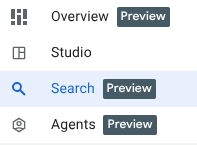
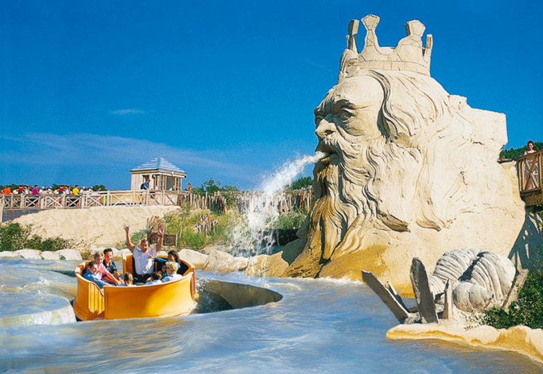
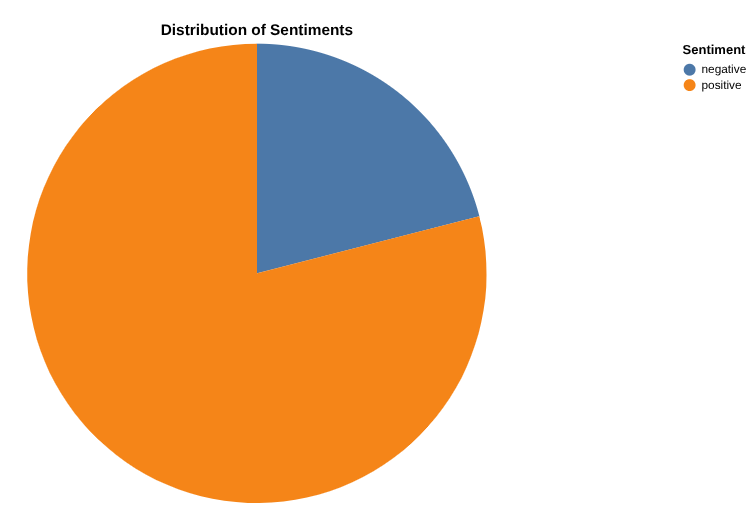
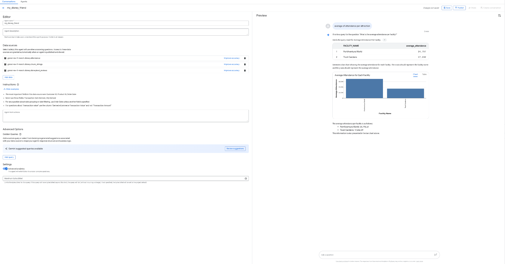
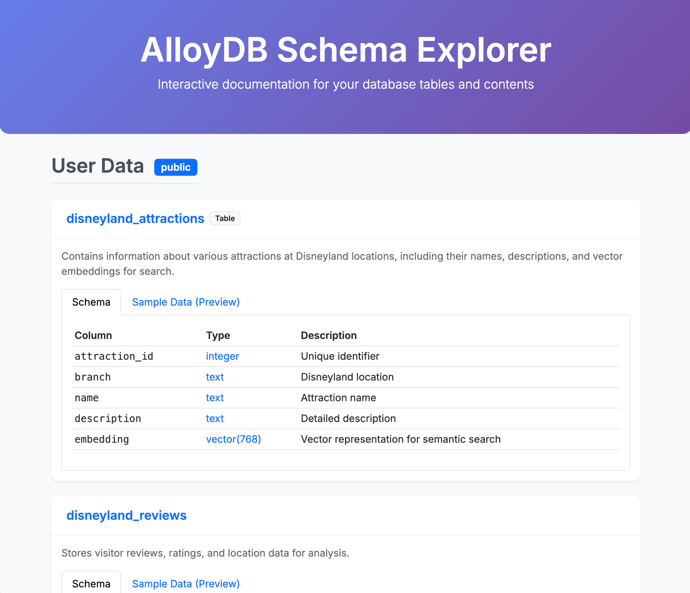
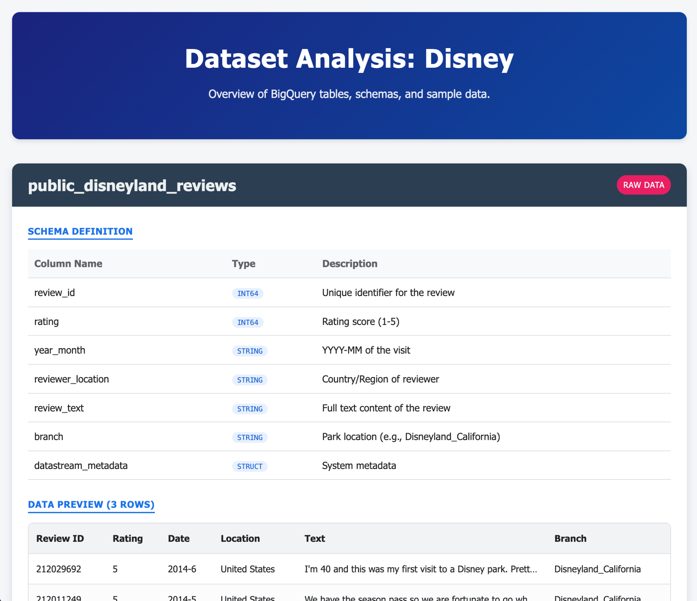

# Disneyland Data Analytics

## Introduction

Welcome, future Disney data wizards!🪄

Forget tedious travel guides and endless forum scrolling. Imagine planning the perfect Disneyland trip, equipped with data-driven insights. Which park offers the best experience? When are the crowds thinnest? Can you predict the best time to conquer that notoriously long queue?

In this gHack, you're building your ultimate Disneyland planning tool. We've got the data: reviews from visitors across global branches, historical waiting times, and attendance figures. Your mission? Transform this raw data into actionable insights leveraging the power of AI and Data on Google Cloud.

## Learning Objectives

In this hack, you will build an end-to-end data analytics pipeline leveraging AI/ML capabilities on Google Cloud.

1. **Gather Data:** Load diverse Disneyland reviews, waiting times, and attendance figures into AlloyDB, our high-performance, PostgreSQL-compatible database.
2. **Seamless Movement:** Use Datastream, our serverless change data capture service, to effortlessly move this dynamic information into BigQuery, Google Cloud's powerful serverless data warehouse.
3. **Predict the Magic:** Unleash BigQuery ML to analyze review sentiment and forecast waiting times directly with SQL.
4. **Talk to your data:** Use pre-built tools and intelligent agents to get insights using natural language.
5. **Intelligent Interaction:** Build an intelligent agent powered by MCP toolbox and ADK (Agent Development Kit) to provide data-driven answers to complex queries.

## Challenges

- Challenge 1: Data Ingestion & Sync
  - Load data into AlloyDB, create embeddings for similarity search, and sync data to BigQuery using Datastream.
- Challenge 2: Data Discovery & Quality
  - Explore data semantically in BigQuery, perform profiling and quality scans, and use Gemini for data preparation.
- Challenge 3: Multi-modal Analysis
  - Analyze attraction images and build a RAG system to query park brochures using PDF chunking and vector search.
- Challenge 4: ML & Reverse-ETL
  - Forecast waiting times, classify rides by intensity, and implement Reverse-ETL to move insights back to AlloyDB.
- Challenge 5: Intelligent Agents
  - Create conversational analytics agents in BigQuery and build a custom AI agent using ADK and MCP Toolbox.

## Prerequisites

- Your own GCP project with Owner IAM role.
- Google Cloud CLI installed.
- Basic knowledge of SQL and PostgreSQL.
- Access to Vertex AI APIs.

## Contributors

- Rayhane Rezgui
- Matt Cornillon

## Challenge 1: Data Ingestion & Sync

### Introduction

For this initial stage, you will retrieve the data from your AlloyDB operational database and load it into BigQuery for subsequent data analysis. You will also set up everything needed in AlloyDB for your future agent!

### Description

#### Data loading in AlloyDB

First, ingest reviews for Disneyland amusement parks and a list of attractions into your AlloyDB for PostgreSQL cluster.

> [!NOTE]  
> You should be provided the AlloyDB credentials.

- Create a table `disneyland_reviews` with 6 columns: `review_id` and `rating` as integer, `year_month`, `reviewer_location`, `review_text`, `branch` as text.
- Create a table `disneyland_attractions` with 4 columns: `attraction_id` as integer, `branch`, `name` and `description` as text.
- Import data from the following CSVs:
  - `gs://<YOUR_PROJECT_ID>/reviews.csv`
  - `gs://<YOUR_PROJECT_ID>/attractions.csv`

> [!TIP]  
> If you don't know how to write the SQL, for example to create a table, consider using the *Generate SQL* option in AlloyDB Studio Query Editor.
> And if you don't know how to do something in Google Cloud, for example how to import a CSV file from GCS to AlloyDB, consider using the Gemini Cloud Assist (click on the Gemini icon at the top right corner of the screen).

#### Generate Embeddings

To provide attraction recommendations, you need to create embeddings of attraction descriptions:

- Install the `vector` extension in AlloyDB.
- Add a vector column called `embedding` to your `disneyland_attractions` table.
- Generate and populate the embedding of the descriptions using the native integration between AlloyDB and Vertex AI.

#### Sync to BigQuery with Datastream

To stream our data from AlloyDB to BigQuery, we'll use Google Datastream. It will listen to all changes in source tables (using Change Data Capture) and send them to BigQuery.

- Create a [publication and a replication slot](https://docs.cloud.google.com/datastream/docs/configure-alloydb-psql#configure_alloydb_for_replication) in your AlloyDB database.
- Create a Datastram source profile for your AlloyDB database
  - Stick to `us-central1` region, otherwise you might need to recreate some firewall rules
  - Use the public IP of the proxy to connect and database user/password that you've been provided earlier
  - Choose IP allowlisting for *Connectivity*
- Create a Datastream destination profile for BigQuery
  - Use single dataset `disney` for all schemas
  - Write mode should be `MERGE`
  - Staleness limit should be `0 seconds`
  - Replicate only the two tables that you have created
- Create & start the stream from AlloyDB to BigQuery

### Success Criteria

- Verify that `disneyland_reviews` has 42,656 rows and `disneyland_attractions` has 73 rows in AlloyDB.
- Demonstrate a similarity search on attraction descriptions to identify the top 5 attractions similar to `Dark ride in space`.
- Show a BigQuery Table called `disneyland_reviews` with 42,656 rows (after sync and potential historical data merge).
- Show a BigQuery Table called `disneyland_attractions` with 73 rows.

### Learning Resources

- [AlloyDB Documentation](https://cloud.google.com/alloydb/docs)
- [Datastream Documentation](https://cloud.google.com/datastream/docs)
- [pgvector on AlloyDB](https://cloud.google.com/alloydb/docs/ai/work-with-embeddings)

## Challenge 2: Data Discovery & Quality

### Introduction

Now that your data is in BigQuery, it's time to explore its potential and ensure its quality before performing advanced analysis.

### Description

#### Data Discovery in BigQuery

Explore the new enhancements in the BigQuery interface:

- Use the **Search** tab to perform semantic search on your data assets (e.g., search for "attractions" or "branch").

- Use **Data Insights** on the `disneyland_reviews` table to gain insights without writing complex SQL.
- Use **BigQuery Knowledge Engine** to generate descriptions for your dataset, tables, and columns using Gemini.

#### Data Profiling and Quality

Perform a profile scan and a quality scan using Dataplex Universal Catalog:

- Profile your data to understand value distributions and null counts.
- Define a quality scan that:
  - Checks for null values in the `branch` column.
  - Validates that `rating` is in the set `{1, 2, 3, 4, 5}`.
  - Checks for uniqueness of `review_id`.
- Ensure results are exported to a BigQuery table `quality_scan_results`.

#### Data Preparation using Gemini

Use Gemini-powered Data Preparation to clean your data:

- Filter out rows where `branch` is NULL or empty.
- Replace "missing" in `year_month` with NULL.
- Replace underscores with spaces in the `branch` column.
- Export to a transformed table `disneyland_reviews_cleaned`.

### Success Criteria

- Demonstrate Gemini-generated descriptions added to the metadata of the dataset, tables, and columns.
- Answer specific questions based on the profile scan (e.g., average rating, missing data percentage).
- Show the `quality_scan_results` table with the defined rules.
- Verify the existence of the `disneyland_reviews_cleaned` table with the applied transformations.

### Tips

- Data insights might take a few minutes to generate.
- Profiling scans can be activated directly through the BigQuery interface.

### Learning Resources

- [BigQuery Data Insights](https://cloud.google.com/bigquery/docs/data-insights)
- [Dataplex Data Profiling](https://cloud.google.com/dataplex/docs/data-profiling-overview)
- [BigQuery Data Preparation Suggestions](https://cloud.google.com/bigquery/docs/data-prep-get-suggestions)

## Challenge 3: Multi-modal Analysis

### Introduction

In this challenge, you'll step beyond structured data and explore how to analyze images and unstructured documents (PDFs) directly within BigQuery.

### Description

#### Image Analysis in BigQuery

You have photos taken by visitors in `gs://<YOUR_PROJECT_ID>/attraction_parc_photos/`.

- Use BigQuery Object Tables and Gemini (via `ML.GENERATE_TEXT`) to identify which photos are actually from Disneyland.
- Create a column `is_disneyland` (boolean) to store the result.

#### RAG System for Park Brochures

Create a Retrieval-Augmented Generation (RAG) system using park brochures in `gs://<YOUR_PROJECT_ID>/disneyland_brochures/`.

- Create an object table for the PDF files.
- Create a Python UDF to chunk the PDF files.
- Parse the PDFs, generate embeddings, and store them in a table.
- Implement a vector search to answer questions like: *"Where to eat a tex-mex meal buffet-style?"*

### Success Criteria

- Show an object table referencing the images and a results table `images_analysis` with the `is_disneyland` classification.
- Demonstrate the Python UDF for PDF chunking.
- Show a successful vector search and an augmented answer for a question about the park brochures.

### Tips

- You might need to grant the `Vertex AI User` role to the BigQuery connection service account.
- The UDF function can take up to 3 minutes to be created.

### Learning Resources

- [BigQuery Object Tables](https://cloud.google.com/bigquery/docs/object-table-introduction)
- [Multimodal RAG in BigQuery](https://cloud.google.com/bigquery/docs/multimodal-data-sql-tutorial)

## Challenge 4: ML & Reverse-ETL

### Introduction

Now you'll use BigQuery's advanced ML capabilities to forecast wait times and classify attractions. Finally, you'll close the loop by moving these insights back to your operational database.

### Description

#### Forecast Waiting Times

Predict the waiting times for attractions using historical data in `gs://<YOUR_PROJECT_ID>/waiting_times.csv`.

- Load the data into a BigQuery table `waiting_times`.
- Train a forecasting model (Arima_Plus or TimesFM) or use `AI.FORECAST`.
- Forecast waiting times for every 30 minutes in 2025.

#### Classify and Rank Rides

Use BigQuery Managed AI functions:

- Use `AI.CLASSIFY` to categorize rides into: `[easy-peasy, thrilling, extreme]`.
- Use `AI.SCORE` to rank attractions based on a "thrill level" from 1 to 10.

#### Reverse-ETL: BigQuery to AlloyDB

Move your insights back to AlloyDB using the "BigQuery views" feature in AlloyDB (BigQuery Foreign Data Wrapper).

- Grant AlloyDB service account privileges to query BigQuery.
- Install the `bigquery_fdw` extension in AlloyDB.
- Create a foreign table in AlloyDB mapped to your BigQuery analysis results.
- Ingest the data into a native AlloyDB table.

### Success Criteria

- Show a table of forecasted waiting times.
- Demonstrate a table with rides classified by intensity and ranked by thrill level.
- Show the results of a SQL query in AlloyDB that retrieves data directly from BigQuery.
- Show a new table in AlloyDB containing the ingested BigQuery insights.

### Tips

- For forecasting, remember to split your data into training and evaluation sets.
- AlloyDB `bigquery_fdw` requires specific IAM roles (`bigquery.dataViewer`, `bigquery.readSessionUser`) for the AlloyDB service account.

### Learning Resources

- [BigQuery ML Time Series Forecasting](https://cloud.google.com/bigquery/docs/timesfm-time-series-forecasting-tutorial)
- [BigQuery ML AI Functions](https://cloud.google.com/bigquery/docs/reference/standard-sql/bigqueryml-syntax-ai-classify)
- [AlloyDB BigQuery Integration](https://cloud.google.com/alloydb/docs/connect-to-bigquery)

## Challenge 5: Intelligent Agents

### Introduction

In the final challenge, you will build intelligent interfaces that allow users (and yourself) to interact with your data using natural language.

### Description

#### Out-of-the-Box Data Agents

- Use the **Data Engineering Agent** in BigQuery to create a pipeline that joins `waiting_times` and `attractions`.
- Create a **Conversational Analytics** agent in the BigQuery "Agents" tab.

- Connect it to your `disney` tables and publish it.

#### Gemini-CLI Exploration

- Use **Gemini-CLI** with the BigQuery and AlloyDB extensions.
- Generate a fancy HTML page that explains the content of your databases using natural language prompts.

#### Custom AI Agent (ADK & MCP)

Create a full-featured assistant for park visitors:

- Deploy an **MCP Toolbox** server using AlloyDB and BigQuery as sources.
- Define tools for: listing attractions, recommendations, adding reviews, and providing wait time estimations.
- Deploy the agent using **Agent Development Kit (ADK)** and showcase a full conversation.

### Success Criteria

- Show a published Conversational Agent in the BigQuery UI.
- Demonstrate Gemini-CLI connecting to both databases (via `/mcp` command) and generating data insights.
- Showcase a full discussion with your ADK-powered assistant, demonstrating the use of various tools to query the data.

### Tips

- ADK and MCP Toolbox can be deployed on Cloud Shell for fast development and debugging.
- Be creative with your Gemini-CLI prompts!

### Learning Resources

- [BigQuery Conversational Analytics](https://cloud.google.com/bigquery/docs/conversational-analytics)
- [Gemini-CLI Extensions](https://geminicli.com/extensions/)
- [Agent Development Kit (ADK)](https://google.github.io/adk-docs/)
- [MCP Toolbox for Databases](https://github.com/googleapis/genai-toolbox)
