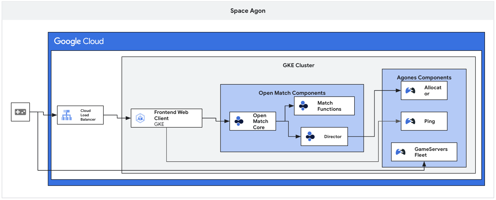
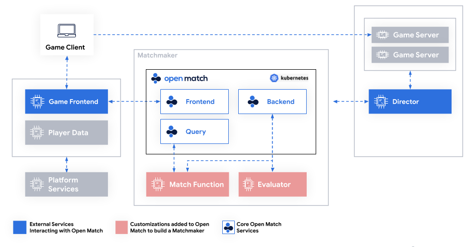

# Gaming in GCP: Have Fun!

## Introduction

Welcome to the Gaming Hackathon on Google Cloud! This hackathon is designed to showcase the power of Google Cloud's gaming services and help you create innovative gaming solutions using technologies like Game Server, Open Match, Spanner, and BigQuery.

In this hackathon, you will have the opportunity to explore and utilize the advanced features and capabilities offered by Google Cloud to develop and deploy gaming applications. You will leverage services such as:

- Game Server: Build scalable and reliable game server infrastructure using Game Server, which provides managed Kubernetes clusters specifically designed for game hosting.

- Open Match: Create matchmaking systems with Open Match, an open-source matchmaking framework that enables flexible and customizable matchmaking logic to ensure fair and enjoyable multiplayer experiences.

- Spanner: Utilize Spanner, a globally distributed and strongly consistent database service, to store game-related data with low latency and high availability.

- BigQuery: Leverage BigQuery, a fully-managed analytics data warehouse, to gain valuable insights from game telemetry data and perform real-time analytics.

## Learning Objectives

The objectives of this hackathon are:

- Create a Multiplayer Game Infrastructure: Build a scalable and reliable game infrastructure using Game Server, allowing players to connect and interact in a multiplayer gaming environment.

- Implement Matchmaking Logic: Develop a custom matchmaking system using Open Match to create fair and balanced matches for players based on their skill levels, preferences, or other criteria.

- Store and Analyze Game Telemetry: Utilize Spanner and BigQuery to store and analyze game telemetry data, enabling real-time analytics, player behavior analysis, and performance optimization.

- Innovate and Showcase Your Gaming Solution: Demonstrate your creativity and innovation by developing unique features, gameplay mechanics, or integration with other Google Cloud services to enhance the gaming experience.

## Challenges

- Setting Up the Environment
   - Before we can hack, you will need to set up a few things.
   - Run the instructions on our [Environment Setup](../../faq/howto-setup-environment.md) page.
- Challenge 1: Agones Game Servers on Kubernetes
   - Deploy Agones, an open-source, multiplayer, dedicated game-server built on Kubernetes in the Google Cloud environment.
- Challenge 2: Dynamic Game Matching with Open Match
   - Implement dynamic game matching using Open Match in the Google Cloud environment.
- Challenge 3: Game State and Activity Management with Spanner
   - leverage Google Cloud Spanner as the game state and activity store in the Google Cloud environment.
- Challenge 4: Player Churn Prediction with BigQuery ML
   - Leverage Google BigQuery to predict player churn in your multiplayer gaming platform in the Google Cloud environment.

## Prerequisites

- Your own GCP project with Owner IAM role
- A basic understanding of Docker and Kubernetes 
   - If you lack a basic understanding, you can review [Docker](https://docs.docker.com/) and [Kubernetes](https://kubernetes.io/docs/home/) now.
- Access to an environment with the following 
  - gcloud (>= 410.0.0)
  - node.js (>= v19.1.0)
  - **Note** Cloud Shell has these pre-installed

## Contributors

- Daniel Wang

## Challenge 1: Deploying Agones Game Servers on Kubernetes

### Introduction

In this challenge, you will learn how to deploy Agones, an open-source, multiplayer, dedicated game-server built on Kubernetes, in the Google Cloud environment.

### Description

Your task is to deploy Agones on a Kubernetes cluster in Google Cloud. Follow the steps below:

- Set up a Google Kubernetes Engine (GKE) cluster. You can use the Google Cloud Console or command-line tools to create the cluster.

- Install Agones on the Kubernetes cluster. Use the provided Agones documentation to install the required components and configure Agones.

- Create a simple game server deployment. Define a basic game server deployment using the Agones configuration. This will include specifying the game server image, ports, and other necessary parameters.

- Test the deployment. Validate that the game server deployment is successful by checking the status of the pods and services created by Agones. Ensure that the game server is running and accessible.

> **Note** Although you can create this cluster using the Google Cloud Console UI, we encourage you to explore and figure out how to create clusters using the `gcloud` CLI tool.

### Success Criteria

- Agones is successfully installed on the Kubernetes cluster.
- A game server deployment is created and running without errors.
- The game server is accessible and functioning as expected.

### Tips

- Familiarize yourself with the Agones documentation before starting the deployment.
- Use the Google Cloud Console, Cloud SDK, or a configuration management tool like Terraform to set up the GKE cluster.
- Follow the recommended best practices and configuration options for Agones to ensure a successful deployment.
- Test the game server deployment thoroughly to ensure it meets the success criteria.

### Learning Resources

- [Kubernetes Overview](https://kubernetes.io/docs/concepts/overview/)
- [GKE Overview](https://cloud.google.com/kubernetes-engine/docs/concepts/kubernetes-engine-overview)
- [Zonal Clusters](https://cloud.google.com/kubernetes-engine/docs/how-to/creating-a-zonal-cluster)
- [Open-source Game Server](https://cloud.google.com/blog/products/containers-kubernetes/introducing-agones-open-source-multiplayer-dedicated-game-server-hosting-built-on-kubernetes)
- [Agones documentation](https://agones.dev/)
- [Create a Game Server](https://agones.dev/site/docs/getting-started/create-gameserver/)
- [Build a Simple Game Server](https://agones.dev/site/docs/tutorials/simple-gameserver-nodejs/)
- [List of code examples](https://agones.dev/site/docs/examples/)
- [Agones GitHub Repository](https://github.com/googleforgames/agones)

## Challenge 2: Dynamic Game Matching with Open Match

### Introduction

In the previous challenge, you successfully built a scalable game server infrastructure using Game Server on Google Cloud. Now it's time to enhance the multiplayer gaming experience by implementing dynamic game matching using Open Match.

### Description

In this challenge, you will integrate Open Match into your game server infrastructure to create a dynamic matchmaking system. Open Match allows you to define matchmaking rules and algorithms to ensure fair and balanced matches for players.

- Start by reviewing the Open Match documentation to understand its key concepts and how it can be integrated into your game server environment.

- Identify the matchmaking requirements and criteria for your game. Consider factors such as player skill level, game mode preferences, and geographical location.

- Implement the necessary changes to your game server infrastructure to integrate Open Match. This may involve modifying your game server code, configuring Open Match components, and setting up the required communication channels.

- Define matchmaking rules and algorithms based on your game's requirements. Consider factors like player ranking, skill-based matching, and latency optimization.

- Test the matchmaking system by simulating multiple players joining the game and verifying that they are correctly matched according to the defined rules.

### Success Criteria

- The matchmaking system successfully matches players based on the defined rules and criteria.
- Players are assigned to matches that provide fair and balanced gameplay experiences.
- The matchmaking system scales effectively with increasing player traffic.

### Tips

- Refer to the Open Match documentation and examples to understand the integration process and best practices.
- Use Open Match SDKs and APIs to communicate with the matchmaking service and implement custom matchmaking logic.
- Consider leveraging additional Google Cloud services such as Pub/Sub for event-driven communication between game servers and Open Match.

### Learning Resources

- [Open Match Documentation](https://open-match.dev/site/docs/)
- [Open Match GitHub Repository](https://github.com/googleforgames/open-match)
- [Open Match Get Started](https://open-match.dev/site/docs/getting-started/)
- [Open Match Tutorials](https://open-match.dev/site/docs/tutorials/matchmaker101/)
- [Open Match Guides](https://open-match.dev/site/docs/guides/matchmaker/)

## Challenge 3: Game State and Activity Management with Spanner

### Introduction

In the previous challenges, you built a game server infrastructure and implemented dynamic game matching. Now, let's take your multiplayer gaming experience to the next level by leveraging Google Cloud Spanner as the game state and activity store.

### Description

In this challenge, you will integrate Google Cloud Spanner into your game server infrastructure to manage the game state and player activity. Cloud Spanner is a fully managed, globally distributed relational database service that provides strong consistency and horizontal scalability.

- Start by familiarizing yourself with the **Spanner Gaming Sample repository**. This repository contains code and resources to help you get started with using Spanner for game state and activity management.

- Understand the data model used in the Spanner Gaming Sample and evaluate how it aligns with your game's requirements. Identify any modifications or extensions needed to store the specific game state and activity data relevant to your game.

- Set up a Cloud Spanner instance and database by following the instructions in the repository's documentation. Ensure that the necessary schema and tables are created to store the game state and player activity.

- Modify your game server code to interact with the Spanner database. Implement functionality to read and update the game state and player activity data in Spanner. This may involve integrating Spanner client libraries and writing database queries.

- Test the integration by simulating gameplay scenarios and verifying that the game state and player activity are accurately stored and retrieved from Spanner. Ensure that concurrent updates and consistency constraints are handled correctly.

### Success Criteria

- The game server successfully connects to the Cloud Spanner instance and can read/write the game state and player activity data.
- The game state is consistently stored and retrieved from Spanner, reflecting the current state of the game.
- Player activity data, such as player scores, achievements, and progress, is accurately recorded and updated in Spanner.
- The Spanner database scales effectively to handle increasing player activity and game state updates.

### Tips
- Refer to the Spanner Gaming Sample repository's documentation for detailed instructions and best practices.
- Utilize Spanner's distributed transactions and strong consistency guarantees to ensure data integrity and synchronization across game servers.
- Consider partitioning and sharding techniques to distribute the game state and activity data across Spanner nodes for optimal performance.
- Monitor and analyze the performance of your Spanner instance using Cloud Spanner-specific tools and metrics.

### Learning Resources

- [Google Cloud Spanner](https://cloud.google.com/spanner/docs)
- [Spanner Gaming Sample](https://github.com/cloudspannerecosystem/spanner-gaming-sample)
- [Global Multiplayer Sample](https://github.com/googleforgames/global-multiplayer-demo)

## Challenge 4: Player Churn Prediction with BigQuery ML

### Introduction

Retaining players in online games can be challenging, with high churn rates observed shortly after the initial game play. To address this issue, developers can leverage BigQuery ML in combination with Google Analytics 4 data to predict the likelihood of specific players returning to the game. In this challenge, you will explore the process of using BigQuery ML to run propensity models on Google Analytics 4 data from a gaming application and predict user churn.

### Description

In this challenge, you will follow the steps outlined in the provided blog post to predict user churn using BigQuery ML and Google Analytics 4 data. The key steps involved are as follows:

- Data Exploration: Explore the BigQuery export dataset for Google Analytics 4 to understand the structure and content of the data.

- Data Preprocessing: Preprocess the raw event data from Google Analytics 4 to transform it into an appropriate format for training a machine learning model. This includes identifying and extracting relevant features, labeling users as churned or returned based on specific criteria, and processing demographic and behavioral features.

- Model Training: Utilize BigQuery ML to train a classification model, such as logistic regression, using the preprocessed training data. Adjust the model hyperparameters and evaluate its performance using evaluation metrics such as precision, recall, accuracy, and F1-score.

- Prediction Generation: Apply the trained model to new data to make churn predictions for individual users. Obtain the propensity scores indicating the probability of users churning or returning.

### Success Criteria

- Successfully preprocess the raw event data from Google Analytics 4 using SQL queries in BigQuery.
- Train a classification model using BigQuery ML, such as logistic regression, and achieve reasonable evaluation metrics (precision, recall, accuracy, F1-score).
- Generate churn predictions for individual users using the trained model.
- Document the steps, findings, and insights gained from the churn prediction process.

### Tips

- Familiarize yourself with the structure and content of the Google Analytics 4 data by exploring the provided dataset in BigQuery.
- Take the time to understand the criteria for labeling users as churned or returned based on the blog post. Adjust these criteria if needed to align with your use case.
- Utilize SQL queries in BigQuery to preprocess the data, extract relevant features, and calculate behavioral and demographic metrics.
- Experiment with different classification models supported by BigQuery ML, such as logistic regression, to find the best-performing model for your use case.
- Evaluate the trained model using appropriate evaluation metrics to assess its performance.
- Consider the practical applications of churn predictions and think about how they can be utilized to improve user retention in your gaming app.

### Learning Resources

- [BigQuery Sample Dataset for Gaming App](https://developers.google.com/analytics/bigquery/app-gaming-demo-dataset)
- [Blog post: Player Churn Prediction with BigQuery ML](https://cloud.google.com/blog/topics/developers-practitioners/churn-prediction-game-developers-using-google-analytics-4-ga4-and-bigquery-ml)
- [BigQuery Documentation](https://cloud.google.com/bigquery/docs)
- [BigQuery ML Documentation](https://cloud.google.com/bigquery/docs/bqml-introduction)