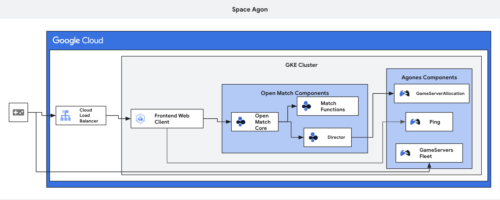

# Gaming on Google Cloud

## Introduction

Welcome to the Gaming on Google Cloud gHack! In this gHack, you will have the opportunity to explore and utilize the advanced features and capabilities offered by Google Cloud to develop and deploy gaming applications. You will be learning to implement and leverage:

- Agones Game Server: Build scalable and reliable game server infrastructure using the Agones Game Server, which provides managed Kubernetes clusters specifically designed for game hosting.
- Open Match: Create matchmaking systems with Open Match, an open-source matchmaking framework that enables flexible and customizable matchmaking logic to ensure fair and enjoyable multiplayer experiences.



## Learning Objectives

The objectives of this gHack are:

- Create a Multiplayer Game Infrastructure: Build a scalable and reliable game infrastructure using the Agones Game Server, allowing players to connect and interact in a multiplayer gaming environment.
- Implement Matchmaking Logic: Customize and deploy a matchmaking system using Open Match to match up players.

## Challenges

- Challenge 1: Deploy the Agones Game Server Deployment Platform on Kubernetes
   - Deploy Agones, a library for hosting, running and scaling dedicated game servers on Kubernetes.
- Challenge 2: Deploy GameServers - Space Agon
   - Deploy a dedicated server to your Agones cluster and demonstrate its functionality.
- Challenge 3: Deploy and manage a Fleet
   - Deploy a Fleet of GameServers to your Agones cluster and manage it.
- Challenge 4: Deploy your own frontend web client and Service
   - Deploy your own web client to connect to your GameServers.
- Challenge 5: Matchmaking with Open Match
   - Implement Open Match and customize your matchmaking function.

## Prerequisites

- Your own GCP project with Owner IAM role.
- A basic understanding of Docker and Kubernetes. 
   - If you lack a basic understanding, you can review [Docker](https://docs.docker.com/) and [Kubernetes](https://kubernetes.io/docs/home/) now.
- Access to an environment with the following:
  - gcloud (>= 410.0.0)
  - node.js (>= v19.1.0)
  > **Note** Cloud Shell has these pre-installed.

## Contributors

- Damian Lance
- Gino Filicetti
- Robert Bailey
- Mark Mandel
- Zach Loafman
- Daniel Wang

## Challenge 1: Agones Game Servers on Kubernetes

### Introduction

In this challenge, you will learn how to deploy Agones, a library for hosting, running and scaling dedicated game servers on Kubernetes.

### Description

Your task is to deploy an Agones game server in Google Cloud, that will include the following:

- Install Agones using Helm on a freshly provisioned Google Kubernetes Engine (GKE) Autopilot cluster using the CLI.

- Install Open Match v1.8.1 to your cluster and apply an evaluator.
Writing the evaluator customizations doesn’t fit within the time constraints for this challenge, so the code has been provided. You can install Open Match and apply the evaluator with the following command: 
```
export OM_NS=open-match
export OM_VER=1.8.1
helm repo add $OM_NS https://open-match.dev/chart/stable
helm repo update
helm install $OM_NS \
	--create-namespace --namespace $OM_NS $OM_NS/open-match \
	--version $OM_VER \
	--set open-match-customize.enabled=true \
	--set open-match-customize.evaluator.enabled=true \
	--set open-match-customize.evaluator.replicas=1 \
	--set open-match-override.enabled=true \
	--set open-match-core.swaggerui.enabled=false \
	--set global.kubernetes.horizontalPodAutoScaler.frontend.maxReplicas=1 \
	--set global.kubernetes.horizontalPodAutoScaler.backend.maxReplicas=1 \
	--set global.kubernetes.horizontalPodAutoScaler.query.minReplicas=1 \
	--set global.kubernetes.horizontalPodAutoScaler.query.maxReplicas=1 \
	--set global.kubernetes.horizontalPodAutoScaler.evaluator.maxReplicas=1 \
	--set query.replicas=1 \
	--set frontend.replicas=1 \
	--set backend.replicas=1 \
	--set redis.master.resources.requests.cpu=0.1 \
	--set redis.replica.replicaCount=0 \
	--set redis.metrics.enabled=false
```
- Deploy a simple game server to verify your Agones installation.
- Test the deployment by ensuring that the game server is running and accessible. To test, you will need to install `nc` to your Cloud Shell with:
```
sudo apt-get -y install netcat
``` 

> **Note** Although you can create this cluster using the Google Cloud Console UI, we encourage you to explore and figure out how to create clusters using the gcloud CLI tool.

> **Note** The reason we are installing Agones with Helm and not YAML is because this is more representative of a production scenario. The Agones documentation for this type of installation is also more detailed and explanatory.

> **Note** Open Match isn’t used until Challenge 5, and is not a requirement for Agones functionality. Open Match can sometimes take time to enter a ready state which is why we are installing it now. We are installing with Helm because it makes it easy to see the customizations that are being made to the default install.

### Success Criteria

- A GKE Autopilot cluster has been provisioned.
- Agones is successfully installed on the GKE cluster.
- Open Match is installed and its associated pods are running. Pods being in the `READY` state is not required at this time. 
- A game server is created and running without errors.
- The game server is accessible and functioning as expected.
   - Use the nc commands given in the Agones docs to show the game server working.
   - Exit the server using nc and use kubectl to show that it is no longer running.

### Tips

- Familiarize yourself with the Agones documentation before starting the deployment.
- Use the Google Cloud Console to set up the GKE cluster.
- Follow the recommended best practices and configuration options for Agones to ensure a successful deployment.
- You might want to consider what the best source of documentation for creating your cluster is ... the Google or Agones docs ...
- Test the game server deployment thoroughly to ensure it meets the success criteria.
- The nc command interaction is a little misleading. After executing the command, it will move the cursor to a new line. Type anything you want into the new line and hit enter.

### Learning Resources

- [Create a Game Server](https://agones.dev/site/docs/getting-started/create-gameserver/)
- [Agones Troubleshooting](https://agones.dev/site/docs/guides/troubleshooting/)
- [GKE Overview](https://cloud.google.com/kubernetes-engine/docs/concepts/kubernetes-engine-overview)
- [Agones Troubleshooting](https://agones.dev/site/docs/guides/troubleshooting/)
- [Open Match install](https://open-match.dev/site/docs/installation/)
- [Understanding Open Match Evaluators](https://open-match.dev/site/docs/guides/evaluator/)

## Challenge 2: Deploy a frontend web client and Service

### Introduction

Deploy a web client to connect to your GameServers.

### Description

Before we can start playing on a real game server, we are first going to need a frontend to connect through. To do this, you will need to:

- Clone the [Space Agon repo](https://github.com/TheLanceLord/space-agon-ghack) into your Cloud Shell so you can work with the files contained in that repo:
- Create an Artifact Registry repository for Docker images.
- Build a Docker image for the Space Agon web client frontend and push it to your project’s Artifact Registry with the following code:
```
export REGISTRY=<YOUR-ARTIFACT-REGISTRY-REPO>
docker build . -f Frontend.Dockerfile -t $REGISTRY/space-agon-frontend:0.1
docker push $REGISTRY/space-agon-frontend:0.1
```
- Create and apply a frontend.yaml file for Space Agon containing a Deployment and a Service for the frontend container you build using the following specifications:
   - Replicas: 2
   - Container port: 8080
   - Service type: LoadBalancer
   - Service port: 80
   - Set resource requests and limits of:
      - Memory: 100Mi
      - CPU: 100m

At this point, you don’t have any game servers to connect to, so you still can’t play anything, but we will fix that in the next challenge.

> **Note** If you’re running an Autopilot cluster and see some errors, it might be because the cluster needs to scale before it can run your container. Be patient and give it some time. 

> **Note** Epilepsy warning for Mac users. Mac users with non-Intel chips using Chrome or Safari will see a lot of flashing large boxes on the screen. You will need to download and install Firefox and use it as your browser for this gHack.

> **Note** Unfamiliar with Docker and what the build and push commands do? After this gHack, check out [Modernizing the Monolith: Containerizing and Deploying to Kubernetes](https://ghacks.dev/hacks/modernizing-monoliths/) to get hands-on experience with containerizing and deploying applications.

### Success Criteria

- GKE shows your frontend deployment and service are both running.
- Demonstrate you can connect to your frontend via your Service’s IP address by using your browser to connect to `http://<YOUR-FRONTEND-IP>`.

### Tips

- The skeleton of a frontend.yaml file has been provided in the GitHub repository.
- If you aren’t a fan of command line text editors, such as vi, emacs or nano, click the `Open Editor` button (pencil icon) in the Cloud Shell to get a web-based editor that you can use for the entire gHack.

### Learning Resources

- [Space Agon repo](https://github.com/TheLanceLord/space-agon-ghack)
- [Set up an external Application Load Balancer with Ingress](https://cloud.google.com/kubernetes-engine/docs/tutorials/http-balancer)
- [Types of Kubernetes Services](https://cloud.google.com/kubernetes-engine/docs/concepts/service#types-of-services)
- [Agones Troubleshooting](https://agones.dev/site/docs/guides/troubleshooting/)
- [Creating and manage cluster and node pool labels](https://cloud.google.com/kubernetes-engine/docs/how-to/creating-managing-labels)

## Challenge 3: Deploy Dedicated Servers - Space Agon

### Introduction

Deploy a 'Dedicated Gaming Server' to your Agones cluster and demonstrate its functionality.

### Description

Your task is to deploy an Agones GameServer of Space Agon in Google Cloud and play test it with your team. This will require you to do the following:

- Build a Docker image for the Space Agon dedicated server and push it to your project’s Artifact Registry with the following code:
```
export REGISTRY=<YOUR-ARTIFACT-REGISTRY-REPO>
docker build . -f Dedicated.Dockerfile -t $REGISTRY/space-agon-dedicated:0.1
docker push $REGISTRY/space-agon-dedicated:0.1
```
- Write and apply a gameserver.yaml file for Space Agon with the following specifications:
   - Container Port: 2156
   - Protocol: TCP
   - Set resource requests and limits of:
      - Memory: 200Mi
      - CPU: 500m

### Success Criteria

- GKE shows a GameServer is deployed.
- You are able to play a game of SpaceAgon with your team by first connecting to `http://<YOUR-FRONTEND-IP>` and then clicking **Connect to Server** and providing your GameServers IP address and port.

### Tips

- A gameserver.yaml is in the Space Agon root directory and has a note on port specifications and compute requests.
- If the web client is stuck showing the loading message, refreshing it should fix the issue.

### Learning Resources

- [GameServer Specification](https://agones.dev/site/docs/reference/gameserver/)
- [Agones Troubleshooting](https://agones.dev/site/docs/guides/troubleshooting/)
- [Examples for other functioning gameserver.yaml files](https://agones.dev/site/docs/examples/)

## Challenge 4: Deploy and manage a Fleet

### Introduction

Deploy a Fleet of GameServers to your Agones cluster and manage it. A Fleet is a managed set of Game Servers; Fleets manage Game Servers similar to how Deployments manage Pods.

### Description

Your task is to deploy an Agones Fleet of Space Agon gameservers in Google Cloud and play test it with your team. This will require you to do the following:

- Write and apply a fleet.yaml file for Space Agon to deploy 2 game servers in your cluster.
- Write an allocation.yaml and create the allocator in your Agones cluster.

> **Note** You must ALWAYS use `kubectl create` with the allocator.yaml file, `kubectl apply` will not work.

> **Note** An allocator flags a game server so kubernetes knows not to delete it unless explicitly told to. It is most commonly used to flag that a game server has players on it, and will protect that server from scale down operations.

### Success Criteria

- GKE shows your Fleet has all game servers running and ready.
- Demonstrate that you can scale your Fleet to 5 game servers using kubectl commands.
- GKE shows one of the game servers in your Fleet has been allocated.
- Demonstrate you can play a game on the allocated server by first connecting to `http://<YOUR-FRONTEND-IP>` and then clicking **Connect to Server** and providing your GameServers IP address and port. and that that allocation flag disappears in GKE when all players have disconnected.

### Tips

- Skeleton templates for fleet.yaml and allocator.yaml file have been provided in the GitHub repository.
- Fleet and GameServer yaml files are very similar. Leverage your work from the previous challenge.
- The default yaml examples in the Agones documentation will NOT work as is. Make sure to connect the dots.

### Learning Resources

- [Fleet Specification](https://agones.dev/site/docs/reference/fleet/)
- [GameServerAllocation Specification](https://agones.dev/site/docs/reference/gameserverallocation/)
- [Fleet Autoscaler Specification](https://agones.dev/site/docs/reference/fleetautoscaler/)
- [Agones Troubleshooting](https://agones.dev/site/docs/guides/troubleshooting/)

## Challenge 5: Matchmaking with Open Match

### Introduction

Implement Open Match, which allows for automated matching of connecting players to a game server based on logic you define. The matchmaking function for Space Agon is simple, pairing players based on the order of their requests. You will customize this function to allow your entire team to play a match on a single game server.


### Description

So far, the Find Game feature hasn’t been working because your cluster’s matchmaking service isn’t set up to handle it. To get this feature working, you will need to:

- Build a Docker image for the Matchmaking Function and push it to your project’s Artifact Registry with the following code:
```
export REGISTRY=<YOUR-ARTIFACT-REGISTRY-REPO>
docker build . -f Mmf.Dockerfile -t $REGISTRY/space-agon-mmf:0.1
docker push $REGISTRY/space-agon-mmf:0.1
```
- Write and apply a mmf.yaml, creating a deployment of your Matchmaking Function and a service to access it.
- Build a Docker image for the Director and push it to your project’s Artifact Registry with the following code:
```
docker build . -f Director.Dockerfile -t $REGISTRY/space-agon-director:0.1
docker push $REGISTRY/space-agon-director:0.1
```
- Write and apply a director.yaml which includes RBAC.
- Modify the Matchmaking Function to support a single game with your entire gHack team(including coach), or at least 4 players.

> **Note** The Director is a backend component in the Online Game Service that typically performs the following tasks:
   - Fetch Matches from Open Match for each MatchProfile.
   - Fetch game allocations from a DGS (Dedicated Game Server) system.
   - Establish connections from players to game servers and set Assignments based on connections in Open Match.

### Success Criteria

- GKE shows your Matchmaking Function and Director deployments are running.
- Your team, including your coach, are able to connect and play on a single game server using the Find Game feature.

### Tips

- A frontend.yaml file has been provided in your GitHub repository. It includes notes to help you know what sections are needed.

### Learning Resources

- [Open Match API](https://open-match.dev/site/docs/reference/api/)
- [Using RBAC Authorization](https://kubernetes.io/docs/reference/access-authn-authz/rbac/)
- [Director example (no RBAC)](https://github.com/googleforgames/open-match/blob/main/tutorials/default_evaluator/director/director.yaml)
