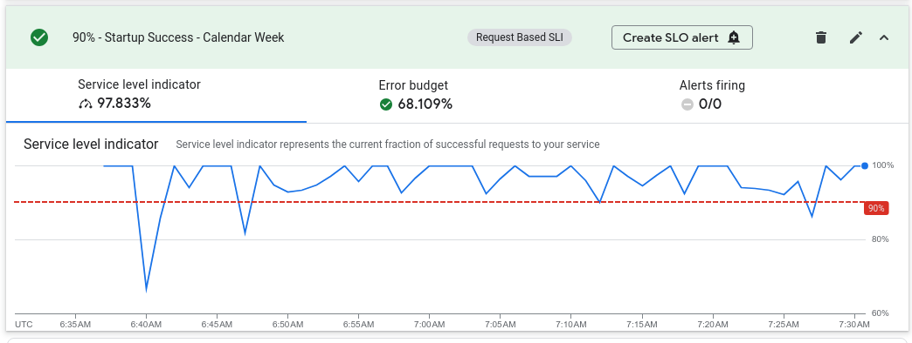
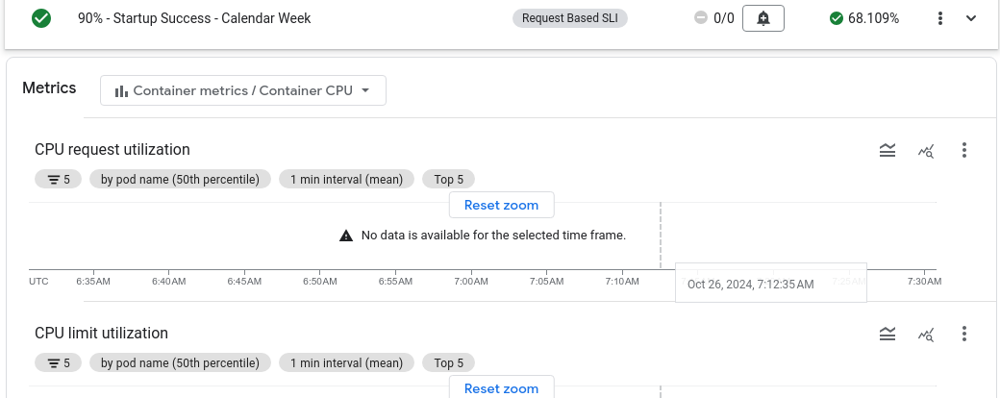

# Practical SRE

Welcome to the Practical SRE (Site Reliability Engineering) Workshop! In this hands-on session, you’ll step into the role of SREs and Product Owners for the **Movie Guru** GenAI app—a cutting-edge application that helps users find movies using natural language queries powered by AI. Your mission is to ensure that Movie Guru delivers a smooth, reliable, and responsive experience for its users.

The Movie Guru app's backend is currently running in your cloud environments and has been pre-instrumented to silently generate a wealth of metrics through the use of a load generator. This means that as you work on these challenges, you’ll have access to valuable data reflecting its performance and user interactions, allowing you to make informed decisions throughout the workshop.

Throughout this session, you’ll analyze how real users interact with the Movie Guru app, and based on those insights, you will:

1. Design User Journeys (UJs): Understand the key workflows and map out user journeys that represent typical interactions with the app, such as logging into the app, chatting with the agent for movie recommendations etc.

1. Define SLIs (Service Level Indicators): Identify measurable signals that reflect the health and performance of the app. These indicators could include response time, query accuracy, and success rates for search results.

1. Set SLOs (Service Level Objectives): Establish concrete performance targets that **Movie Guru** should meet, such as ensuring 99% of user queries return results within 2 seconds or that 95% of responses are relevant.

1. Set up Alerting: Implement a robust alerting system to track your SLIs and SLOs and ensure that when the app's performance falls short of your SLOs, the right people are alerted. You’ll learn how to configure alerts for incidents such as slow response times, degraded search accuracy.

By the end of this workshop, you’ll have developed a comprehensive reliability framework for Movie Guru, gaining practical SRE skills that can be applied to real-world systems. This will include creating actionable alerts, ensuring operational excellence, and building a culture of reliability around AI-powered apps.

## Prerequisites

- Your own GCP project with Editor IAM role.
- Kubectl
- gcloud command line tool

## Contributors

- Manasa Kandula
- Steve McGhee

## Challenge 1: Your first day as SRE

### Prerequisites

Before we start our first day as SREs, we are going to start up metrics collection so that we have a nice load of metrics to work with in later challenges.

You'll set up and generate application metrics using Locust, a powerful load testing tool. The goal is to simulate user activity on the Movie Guru backend application, which is running on a GKE cluster. Locust is also deployed within the same cluster, and its load generator is pre-configured.

You will be provided with the address of the Locust load generator at the start of the project. It should look like this: <http://LocustIP:8089> (replace with the correct IP).

#### Step 1: Generate Load on the Application

- Open your browser and navigate to the Locust load generator address. You should see a screen similar to the one below:

   

- Fill out the *Start new load test* form with the following values:

  - Number of users at peak: 3
  - Spawn rate: 0.05
  - Host: <http://mockserver-service.movie-guru.svc.cluster.local>
  - Runtime: 3 hours (under Advanced options)
  
   This configuration will gradually increase the load on the backend, spawning around 3 simulated users over the course of 3 hours.

- Once the load test begins, Locust will swarm various backend endpoints, simulating traffic as users interact with the application. You should see something similar to this:

  

- Confirm this is running as expected and start challenge 1.

### Introduction

Ok. You have started on Day 1 as the newly formed SRE team for **The Movie Advisory Company**, a start-up whose first product is the **Movie Guru** app.

Your first task is to get an idea of what the application looks like.

- Navigate to "<http://FrontEndIP>" (replace with the correct IP) to visit the app.
- Login in using your name or email. The movie guru app hasn't implemented authentication yet (it is on the roadmap).
- Work with the app and get an understanding of it. Make sure you do the following:
  - Log into to it. What happens after you log in?
  - Ask for movie recommendations ("Eg: I feel like watching a fantasy movie").
  - Express strong likes and dislikes towards certain genres, plot types etc. ("Eg: I love movies with funny animals" or "I really can't stand movies with violence").
  - Keep an eye on your user profile, does the app remember what you like?
  - Log out and log in a few times to understand how the app behaves.
- Based on your interaction, make a list of atleast 2 **user journeys** you can identify with the **Movie Guru** app.
- If you need a refresher on what a user journey is, visit the section on **What is a user journey?** (below).
- Clearly document your user journeys using a structured format that includes:
  - **Goal:** The user's objective in this journey.
  - **Steps:** The specific actions the user takes to achieve the goal.

### What is a User Journey?

In the context of SRE (Site Reliability Engineering), a user journey (UJ) describes the series of steps a user takes to accomplish a specific goal while interacting with a service. It focuses on the user's perspective and their experience with the system's performance and reliability. It is like a map that shows the steps a user takes to achieve a goal while using our service. We use this map to understand user behavior, their expectations, and improve their experience.

Here is an example UJ for a typical online webshop:

#### Example: Adding an Item to an Online Shopping Cart

Goal: Add a desired product to their shopping cart.
Steps:

- Browse an e-commerce website.
- Find a product they want to purchase.
- Click the "Add to Cart" button.
- View the updated shopping cart with the added item.

## Success Criteria

To successfully complete this exercise, you should have:

- **Identify at least 2 user journeys:** Written down 2 UJs in the format mentioned above for the **Movie Guru** app

## Learning Resources

**Compare your journeys to the examples below:**  See how your ideas align with the user journeys provided below. The examples below cover some common interactions, but there will be other ways users interact with the app. There is no perfect answer.

**User journeys are hypotheses:** They are your best guess about how users will interact with the app.  These journeys will need to be refined over time based on real user data and feedback.

### Example User Journeys for Movie Guru

Here are a few examples of user journeys for the Movie Guru app:

#### UJ 1: Access the App

**Goal:**  Start using the Movie Guru app and view the main interface.

**Steps:**

1. Go to the Movie Guru login page.
1. The user enters their username.
1. Click the "Login" button.
1. View the main page. This contains the chatbot, with any chat history loaded (if it exists), and a view of featured films, and profile info (if it exists).

#### UJ 2: Get Useful Responses

Goal: Receive helpful and relevant responses from the Movie Guru chatbot.

Steps:

1. Initiate Chat: The user opens the chat interface in the Movie Guru app.
    - The app may have an initial profile with some initial preferences to guide the interaction.
2. User Receives a Response:
    - Movie Guru provides an initial response based on the user's input or previous interactions.
3. User Explores the Response:
    - The user reads and interprets the information provided.
    - The user may ask follow-up questions or request clarification.
4. User Provides Feedback:
    - The user provides explicit feedback (e.g., "This is helpful!" or "I need more information on this").
    - The user may rephrase their query or ask for alternative suggestions.
5. User Receives Refined Response:
    - Movie Guru refines its response based on the user's feedback, providing more relevant and helpful information.
6. Repeat Steps 2-5 (Optional): The user can continue to interact and provide feedback to further refine the conversation.
7. End Chat: The user ends the chat session.

#### UJ 3: Update Preferences

**Goal:** Update invalid preferences to personalize future recommendations.

**Steps:**

1. Access Preferences: The user navigates to the "Preferences" or "Profile" section of the home page.
1. View Existing Preferences (Optional): The app displays any existing preferences the user has previously saved. This could include:
   - Liked/dislikes genres
   - Liked/disliked actors
   - Liked/disliked directors
1. Delete Wrong/Invalid Items: The user interacts with the interface to adjust their preferences. This might involve:
1. Receive Confirmation (Optional): The app provides feedback to the user that their preferences have been successfully saved by not rendering the preference again.

## Challenge 2: There are others

Your second day as an SRE at **The Movie Advisory Company** started with a bang. The CEO, clearly fueled by an excessive amount of coffee, stormed into your workspace, ranting about Movie Guru's unreliable performance.  "Users are complaining about the site not always being reachable!" he yelled, "This is unacceptable! Movie Guru needs to be up 100% of the time!" He demanded a solution immediately. With a panicked look in his eyes, he pointed you towards the platform team (a single, overworked engineer) and the application team (known for their eccentric work habits).
Your challenge:  figure out how to improve the app's stability, manage the CEO's expectations, and prevent a complete meltdown.  Welcome to the world of SRE!

Challenge Steps:

1. **Initial Response to CEO:** Analyze the CEO's demands in the context of SRE principles. Are there any parts of his demand that clash with those principles? Discuss your analysis with a teammate or coach. Optionally you and your team do a short role-play with one of you acting as the CEO.

   > **NOTE**: The focus on the role-play should be on articulating your reasoning and how it aligns with SRE principles. The focus shouldn't be on trying to persuade the CEO to change their mind (this isn't a communication/negotiation workshop).

2. **Information Gathering:** You're not alone in this quest for stability! To improve Movie Guru's stability, you'll need to collaborate with others. Identify the key stakeholders within the company and determine what information you need from each of them to achieve your reliability goals.

### Success Criteria

To successfully complete this challenge, you should be able to demonstrate the following:

**Initial Response:**

- Explained why 100% uptime is an unrealistic and potentially harmful goal.
- Clearly articulated the relationship between reliability and cost.
- Emphasized the importance of aligning reliability targets with user needs and business priorities.
- [BOUNUS] Communicated the need to balance reliability investments with other factors like innovation.

**Information Gathering:**

- Identified key stakeholder teams within The Movie Advisory Company (including technical teams, product owners, and business stakeholders).
- Explained the role of each stakeholder group in ensuring Movie Guru's reliability.
- Specified the information needed from each stakeholder group to assess the current state of reliability and plan for improvements.
- Demonstrated an understanding of the importance of collaboration and communication in achieving reliability goals.

### Learning Resources

By systematically identifying your stakeholders and gathering the necessary information, you gain a holistic view of Movie Guru's reliability. This sets the stage for effective improvements that balance business needs, user expectations, current system design, and technical debt—all without chasing the mirage of 100% uptime

#### Initial Response

You have effectively addressed the CEO's demand for 100% uptime by:

- **Challenging the feasibility of 100% reliability:** You clearly explained why achieving perfect uptime is practically impossible and highlighted the exponential relationship between reliability and cost.
- **Emphasizing user needs:**  You highlighted the importance of aligning reliability targets with user expectations and business needs, rather than blindly pursuing an arbitrary number.
- **Balancing reliability with other priorities:** You emphasized the need to balance reliability investments with other crucial factors like innovation and new feature development. Overachieving on reliability (providing more than what the user expects) is also not a good thing.

**Key takeaway:**  You successfully communicated that 100% is the wrong target for everything and that a balanced approach to reliability is essential for the long-term success of Movie Guru.

#### Information Gathering

As the SRE responsible for improving Movie Guru's stability, you need to collaborate with various stakeholders within the organization. You are there to **break down silos** and not solve everthing on your own.
Remember, there's no single "right answer" to this challenge.
The goal is to encourage you to think critically about who you need to involve and what information you need to gather.

To guide your thinking, consider these two key aspects:

1. **Identify Key Stakeholders:**

 **Technical Teams:**
    - **Development Team:** Responsible for the application code. They can provide insights into potential bugs, performance bottlenecks, and upcoming releases.
    - **Platform Team:** Manages the underlying infrastructure (servers, databases, etc.). They can offer information about system architecture, resource allocation, potential infrastructure limitations, incident history, monitoring tools, and existing alerting mechanisms.
    - **QA Team:** (If one exists) Responsible for testing the application. They can offer insights into known issues, testing procedures, and potential areas of fragility.

 **Business and Product Stakeholders:**
    - **Product Owner/Product Manager:** Can provide crucial information about user needs and expectations regarding reliability, the product roadmap, and how stability fits into the overall business strategy.
    - **Other Business Stakeholders:** Consider departments like marketing, sales, and customer support. They can offer insights into how reliability impacts their work, provide valuable user feedback, and clarify budget constraints.

**2. Gather Essential Information:**

Once you've identified the key stakeholders, consider what specific information you need from each of them. This might include:

- **Current Performance Data:** Uptime history, error rates, latency metrics.
- **System Architecture Diagrams:** Visual representations of the app's components and their interactions.
- **Deployment Processes:** How new code is released and deployed to production.
- **Monitoring and Alerting:** What tools and systems are used to monitor the app's health, and what alerts are in place?
- **Incident Response Procedures:** How are incidents handled, and what are the communication channels?

**Collaboration is Key:** Remember that achieving reliability is a shared responsibility. Building strong relationships with these teams is essential for success.

## Challenge 3: Your first set of SLOs

In the previous challenge, you dove deep into Movie Guru's reliability landscape, discovering a young app with room to grow. You learned that the company currently lacks a robust way to measure and define user experience, relying instead on the unsustainable goal of constant uptime.

Armed with the insights gained from exploring the app, collaborating with stakeholders, and understanding the system's design, challenges, and user feedback, it's time to take a crucial step: defining Service Level Objectives (SLOs). If you need a referesher on SLOs, see the section **What is an SLO?** below.

SLOs provide a clear and measurable way to define the desired reliability of your services, ensuring they align with user expectations and business goals.  Remember, the product owner or product manager (PO/PM) often has valuable insights into user needs.  Be sure to consider their perspective as you embark on this challenge.

**Your Task:**

1. **Choose Your Journeys:** Select two key user journeys for **Movie Guru**. These could be the ones you identified in Challenge 1 or the examples provided.
2. **Craft Your SLOs:**  Define specific, measurable, achievable, relevant, and time-bound (SMART) SLOs for each chosen user journey. Consider what aspects of reliability matter most to users in each journey and how you can measure success.

### What are SLOs?

Based on Google's SRE framework, Service Level Objectives (SLOs) are target values or ranges for a service's reliability, measured by Service Level Indicators (SLIs). SLOs help you define the desired user experience and guide decisions about reliability investments. They act as a key communication tool between technical teams and business stakeholders, ensuring everyone is aligned on what level of reliability is acceptable and achievable.  Crucially, SLOs should be based on what matters most to users, not arbitrary targets like 100% uptime.

Example SLO:

For the user journey of "adding a product to an online shopping cart", a possible SLO could be:

- **99.9% of "Add to Cart" requests should be successful within 2 seconds, measured over a 30-day rolling window**.
This SLO focuses on the key user action ("Add to Cart") and sets targets for both availability (99.9% success rate) and latency (2-second response time). It's specific, measurable, and directly tied to user experience, ensuring a smooth and efficient shopping experience.
The addition of "measured over a 30-day rolling window" specifies the timeframe for evaluating the SLO. This means that the success rate and response time are calculated based on data collected over the past 30 days. This rolling window provides a continuous and up-to-date assessment of the SLO's performance.

### Success Criteria

- You have crafted 2 SLOs for the **Movie Guru** app. Each SLO includes the following components, demonstrating a comprehensive understanding of how to define and measure service level objectives:
  - **Objective:** A clear statement of the desired reliability target for a specific user journey or feature.
  - **Service Level Indicator (SLI):**  A specific and measurable metric used to assess the service's performance against the objective (e.g., availability, latency, error rate).
  - **Target:**  The desired level of performance for the SLI (e.g., 99.9% availability).
  - **Time window:** The period over which the SLI is measured (e.g., 30-day rolling window).
  - [OPTIONAL] **Measurement:**  A clear description of how the SLI will be measured and tracked (e.g., using logs, monitoring tools, user feedback).

## Challenge 4: Let the monitoring begin

### Introduction

The platform team introduces you to the app's monitoring dashboards in the Google Cloud Console. They've set up four dashboards, each providing key insights into different aspects of Movie Guru's performance:

- **Login Dashboard**: Tracks the health and efficiency of the user login process.
- **Startup Dashboard**: Monitors the performance of the post-login startup process, ensuring users get into the app quickly.
- **Chat Dashboard**: Provides a comprehensive view of user interactions with the chatbot, including engagement, sentiment, and response times.
- **User Profile Dashboard**: Tracks the performance and reliability of user profile management functions.
  
To give you a well-rounded understanding of each area, every dashboard includes at least two crucial metrics:

- **Success Counters**: These show how often the server successfully responds to requests, giving you a sense of overall availability and reliability.
- **Latency Counters**: These track how long it takes the server to respond to requests, providing insights into performance and potential bottlenecks.

On top of these, the chat dashboard has 3 other dashboards:

1. **User Engagement Dashboard**: This tracks the User Engagement Rate for the Movie Guru chatbot. It essentially measures the percentage of chatbot interactions that result in either an **Engaged** or **Acknowledged** outcome. These metrics are gathered by analysing the chat conversations.

2. **User Sentiment Dashboard**: This gauges user satisfaction with the Movie Guru chatbot by tracking the sentiment expressed in user messages. It categorizes messages as "positive," "negative," "neutral," or "unknown". The dashboard then displays the percentage of each sentiment category over time,  as a multi-line graph.

3. **Safety Issue Dashboard**: This tracks the rate of user chat messages where the user made unsafe remarks.

### Latency Metrics

- These metrics (for all dashboards) measures how long it takes for users to get a successful response from the server.
- It provides insights into the speed and efficiency of a specific server process (eg: login, chat, etc).
- Lower latency means faster logins, contributing to a better user experience.
- The dashboard displays several percentiles of login latency (10th, 50th, 90th, 95th, 99th), giving you a comprehensive view of the login speed distribution.
- This metric is also displayed as a line chart, allowing you to track changes in latency over time and identify any performance degradations.

### Challenge Steps

- Analyze Existing Metrics
  - Navigate to Google Cloud Monitoring \> Dashboards \> Custom Dashboards.  
  - Examine the "Login", "Startup", and "Chat" dashboards.  
  - Create a list of the metrics captured in each dashboard (Login, Chat, Startup).
- Assess User Experience
  - Based on the metrics and your own experience (or user feedback if available), describe how users likely perceive the app's performance.  
  - For example: "Users may experience slow initial load times, especially during peak hours. Chat functionality generally seems responsive, but occasional connection errors can be frustrating."  
  - Categorize aspects of the application into:  
    - **Going Well:** Features or areas with good performance.  
    - **Need Improvement:** Areas with minor performance issues.  
    - **Need Improvement Urgently:** Areas with significant performance issues impacting user experience.
- Define Short-Term SLOs (for the items below)
  - After discussing with product owners, you’ve identified two key SLOs for short-term improvement. Fill in realistic, achievable values that you would like the app to meet in the short term (1 month). Let the current indicators be a guide.
- Set Aspirational SLOs (Optional)
- While short-term SLOs guide immediate improvements, long-term aspirational SLOs set ambitious targets for the app's future performance (make any necessary assumptions about current technical debt, issues etc when necessary).

#### SLO 1: App Accessibility and Responsiveness

- **Objective:** `xx%` of users should be able to access the Movie Guru app and view the main interface within `yy` seconds, measured over a `zz`-day rolling window.  
- **Measurement:**  
  - **Availability:** Percentage of successful attempts to login and load the main interface.
  - **Latency:** Latency the startup endpoint (server-side measurement).  

#### SLO 2: Chatbot Responsiveness

- **Objective:** `xx%`% of user messages should receive a relevant response from the Movie Guru chatbot within `yy` seconds, measured over a `zz`-hour rolling window.  
- **Measurement:**  
  - **Relevance:** Measured by the `Chat_Outcome_Counter` metric. A response is considered relevant if the outcome is registered as "engaged" or "acknowledged"
  - **Latency:**  Calculated as the time difference between the server receiving the user's message and sending the response.

### Success Criteria

- You’ve set realistic SLO objectives for the two cases that are realistically achievable in the short term.
- You set aspirational SLOs based on what you think is technically achievable and what your users would expect in the long term.

## Challenge 5: Implementing SLOs on the dashboard

### Prerequisites

Run the following command on a terminal

```sh
BACKEND_IP=<the backend ip>

curl -X POST \
  -H "Content-Type: application/json" \
  -d '{
  "ChatSuccess": 0.95,
  "ChatSafetyIssue": 0.1,
  "ChatEngaged": 0.70,
  "ChatAcknowledged": 0.15,
  "ChatRejected": 0.05,
  "ChatUnclassified": 0.1,
  "ChatSPositive": 0.6,
  "ChatSNegative": 0.1,
  "ChatSNeutral": 0.2,
  "ChatSUnclassified": 0.1,
  "LoginSuccess": 0.999,
  "StartupSuccess": 0.95,
  "PrefUpdateSuccess": 0.99,
  "PrefGetSuccess": 0.999,
  "LoginLatencyMinMS": 10,
  "LoginLatencyMaxMS": 200,
  "ChatLatencyMinMS": 906,
  "ChatLatencyMaxMS": 4683,
  "StartupLatencyMinMS": 400,
  "StartupLatencyMaxMS": 1000,
  "PrefGetLatencyMinMS": 153,
  "PrefGetLatencyMaxMS": 348,
  "PrefUpdateLatencyMinMS": 363,
  "PrefUpdateLatencyMaxMS": 645
}' \
  http://$BACKEND_IP/phase 
```

### Introduction

This challenge is about up the short-term Service Level Objectives (SLOs) for the app in Cloud Monitoring Suite. SLOs help you define and track the performance targets for your service, ensuring a positive user experience.

#### Steps

1. Navigate to SLOs in the monitoring suite:
   - Go to the "SLOs" tab. This is where you'll define and manage your SLOs.
   - Define the Service. Look for a service called **mockserver-service** (this is the name of the GKE service hosting the app)
   - If "mockserver-service" isn't already listed, you'll need to define it as a custom service.
   - Under "service candidates," select "mockserver-service." This links your SLOs to the correct service for monitoring.


  
1. Create SLOs:

   Now, let's create the specific SLOs for your service:

   - Chat Latency:
     - Metric: **movieguru_chat_latency_milliseconds_bucket** (look under the prometheus metrics section)
     - Target: p99 latency of **5 seconds** (5000 milliseconds)
     - Time Window: **24-hour** rolling window

   - Chat Engagement:
     - Metric: **movieguru_chat_outcome_counter_total** (Filter: Outcome=Engaged)
     - Target: Define a target engagement rate. For example, 70% of chat interactions should result in an "Engaged" outcome.
     - Time Window: 24-hour rolling window
     - Remarks: Ideally we would like to use Outcome=Engaged and Outcome=Accepted to indicate that the user finds the response relevant, but we will stick to just Engaged for now. [Optional] If you want to use a filter that incorporates both Engaged and Acknowledged, use the monitoring API to create the SLO.

   - Startup Latency:
     - Metric: **movieguru_startup_latency_milliseconds_bucket** (measured at the **startup** endpoint)
     - Target: p99 latency of 1 second (1000 milliseconds)
     - Time Window: Choose an appropriate time window, such as a 24-hour or 7-day rolling window.
     - Remarks: Ideally we would like to combine the latency of the login and startup process to know about the startup latency *as experienced by the user*. But, we'll stick to the startup endpoint latency for now.

   - Startup Success Rate:
     - Metric: This requires combining two metrics: **movieguru_startup_success_total** and **movieguru_startup_attempts_total**.
     - Target: 90% success rate over a 7-day rolling window.
     - Implementation: Since the UI doesn't support combining metrics, you'll need to use the Cloud Monitoring API to define this SLO. This allows for more complex SLO configurations. Refer to the Cloud Monitoring API documentation for details on how to create SLOs programmatically (see **learning resources**)
     - Remarks: Ideally we would like to combine the success rate of the login and startup processes to know about the startup success *as experienced by the user*. But, we'll stick to the startup endpoint success rate for now.

### Success Criteria

- You have all the SLOs created.
- You have created atleast 1 SLO through the Monitoring API.

### Learning Resources

- [Setting SLOs through UI](https://cloud.google.com/stackdriver/docs/solutions/slo-monitoring/ui/create-slo)
- [Setting SLOs with API](https://cloud.google.com/stackdriver/docs/solutions/slo-monitoring/api/using-api#slo-create)

## Challenge 6: Stay alert

### Prerequisites

```sh
curl -X POST \
  -H "Content-Type: application/json" \
  -d '{
  "ChatSuccess": 0.95,
  "ChatSafetyIssue": 0.1,
  "ChatEngaged": 0.50,
  "ChatAcknowledged": 0.10,
  "ChatRejected": 0.05,
  "ChatUnclassified": 0.1,
  "ChatSPositive": 0.6,
  "ChatSNegative": 0.1,
  "ChatSNeutral": 0.2,
  "ChatSUnclassified": 0.1,
  "LoginSuccess": 0.999,
  "StartupSuccess": 0.95,
  "PrefUpdateSuccess": 0.99,
  "PrefGetSuccess": 0.999,
  "LoginLatencyMinMS": 10,
  "LoginLatencyMaxMS": 200,
  "ChatLatencyMinMS": 3000,
  "ChatLatencyMaxMS": 8000,
  "StartupLatencyMinMS": 400,
  "StartupLatencyMaxMS": 1000,
  "PrefGetLatencyMinMS": 153,
  "PrefGetLatencyMaxMS": 348,
  "PrefUpdateLatencyMinMS": 363,
  "PrefUpdateLatencyMaxMS": 645
}' \
  http://$BACKEND_IP/phase

```

### Introduction

This challenge guides you through monitoring the four SLOs created in the previous challenge.

- **Initial Observation**: Initially, all Service Level Indicators (SLIs) should be within the acceptable range of the objective. Minor, short-term dips below the objective are normal and not a cause for concern, as long as the SLO is met within the specified time window. (Verify this on your SLO dashboard)

- **Error Budget and Maintenance**: Examine the error budget for the Startup Success Rate SLO. The error budget represents the allowed deviation from the SLO. (Check out Learning Resources if you need a refresher on **Error budgets** or **Burn Rates**)

- Calculate how much time your team has this week for these activities based on the current error budget consumption rate for the Startup Success Rate SLO.

- This is how a healthy SLO would look like (it isn’t required to be always above the line)

   

- **SLO Degradation**: In a few minutes, you'll observe two SLOs consistently underperforming: **Chat Latency** and **Chat Engagement Rate**. (View these on your SLO dashboard)
  
  - Here is the graph of the failing **Chat Latency SLO**

   

  - Here is the graph of the failing **Chat Engagement SLO**

   

- **Identifying Real Issues**: To distinguish between temporary dips and significant issues requiring action, we'll use burn rate alerts.

- **Burn Rate Alerts**
  - Create burn rate alerts (notifications are optional) for the failing "Chat Latency" and "Chat Engagement Rate" SLOs. In the real world, you should proactively create these alerts for all SLOs before they start failing.
  - To differentiate between the severity of issues, set two alerts for each SLO (use a 5min lookback window):
    - **Slow burn rate alert** (1.5-2.0x): Indicates minor issues or gradual degradation.
    - **Fast burn rate alert** (10x): Signals major outages requiring immediate attention.
- **Observing Alert Triggers**: After a few minutes (> lookback window) of monitoring the SLOs with the configured burn rate alerts, you'll start to see which alerts are triggered. Pay close attention to the following:
  - Which SLOs are triggering alerts? This indicates which services are failing to meet their objectives. 
  - What is the burn rate of the triggered alerts? This shows how quickly the SLO is degrading. A faster burn rate (e.g., 10x) signals a more urgent issue.
  
> **Note**: For quicker alert triggering, consider a shorter lookback window (1-2 minutes). However, remember that in real-world scenarios, longer lookback periods are crucial to avoid false positives and ensure accurate alert signals.

### Success Criteria

To verify successful completion of this exercise, check the following:

- **Burn Rate Triggers**: Ensure you have created at least four burn rate alerts across your SLOs. These alerts should be configured to trigger at different burn rates (e.g., 1.5-2.0x for slow burn, 10x for fast burn) to capture varying levels of degradation.
- **Alert Activity**: While the exact number of alerts triggered will vary depending on the system's behavior, you should expect at least one alert to fire for the "Chat Latency" SLO. This SLO is intentionally designed to exhibit issues, so an alert confirms that your monitoring and alerting setup is functioning correctly.

### Learning Resources

#### What are **error budgets**

An error budget is the acceptable amount of time your service can fail to meet its SLOs, helping you balance innovation and reliability. Calculated as 1 - SLO, a 99% availability SLO gives you a 1% error budget (about 7.3 hours per month) for new features, maintenance, and experimentation.  Error budgets promote proactive risk management and informed decision-making about service reliability.

#### What is a **burn rate**

Burn rate measures how quickly you're using up your error budget.  It acts as an early warning system for SLO violations, helping you prioritize and respond to issues before they impact users. Calculated as a multiple of your error budget consumption, a high burn rate (e.g., 10x) signals a major problem needing immediate action. Setting alerts for different burn rates (e.g., 2x for slow burn, 10x for fast burn) allows you to proactively manage service reliability and keep users happy. By monitoring burn rate, you can ensure your services meet their SLOs and avoid "overspending" your error budget.

- [Burn Rate](https://cloud.google.com/stackdriver/docs/solutions/slo-monitoring/alerting-on-budget-burn-rate)
