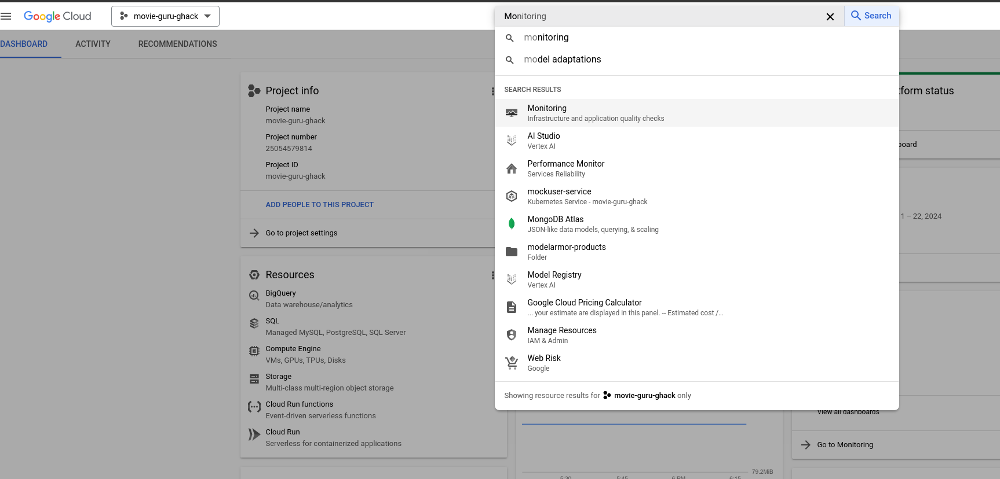
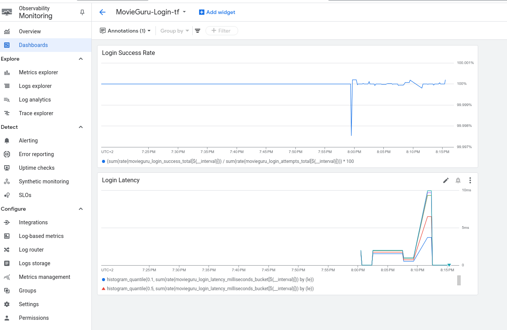

# Practical SRE

Welcome to the Practical SRE (Site Reliability Engineering) Workshop! In this hands-on session, you’ll step into the role of SREs and Product Owners for the **Movie Guru** GenAI app—a cutting-edge application that helps users find movies using natural language queries powered by AI. Your mission is to ensure that Movie Guru delivers a smooth, reliable, and responsive experience for its users.

The Movie Guru app's backend is currently running in your cloud environments and has been pre-instrumented to silently generate a wealth of metrics through the use of a load generator. This means that as you work on these challenges, you’ll have access to valuable data reflecting its performance and user interactions, allowing you to make informed decisions throughout the workshop.

Throughout this session, you’ll analyze how real users interact with the Movie Guru app, and based on those insights, you will:

1. Design User Journeys (UJs): Understand the key workflows and map out user journeys that represent typical interactions with the app, such as logging into the app, chatting with the agent for movie recommendations etc.

1. Define SLIs (Service Level Indicators): Identify measurable signals that reflect the health and performance of the app. These indicators could include response time, query accuracy, and success rates for search results.

1. Set SLOs (Service Level Objectives): Establish concrete performance targets that **Movie Guru** should meet, such as ensuring 99% of user queries return results within 2 seconds or that 95% of responses are relevant.

1. Set up Alerting: Implement a robust alerting system to track your SLIs and SLOs and ensure that when the app's performance falls short of your SLOs, the right people are alerted. You’ll learn how to configure alerts for incidents such as slow response times, degraded search accuracy.

By the end of this workshop, you’ll have developed a comprehensive reliability framework for Movie Guru, gaining practical SRE skills that can be applied to real-world systems. This will include creating actionable alerts, ensuring operational excellence, and building a culture of reliability around AI-powered apps.

## Prerequisites

- Your own GCP project with Editor IAM role.
- Kubectl
- gcloud command line tool

## Contributors

- Manasa Kandula

## Challenge 2: Start Silent Metrics collection

### Introduction

#### Load Testing and Monitoring with Locust

In this challenge, you'll set up and generate application metrics using Locust, a powerful load testing tool. The goal is to simulate user activity on the Movie Guru backend application, which is running on a GKE cluster. Locust is also deployed within the same cluster, and its load generator is pre-configured.

You will be provided with the address of the Locust load generator at the start of the project. It should look like this: http://123.123.123.123:8089.

#### Step 1: Generate Load on the Application

- Open your browser and navigate to the Locust load generator address. You should see a screen similar to the one below:

   

- Fill out the *Start new load test* form with the following values:

  - Number of users at peak: 20
  - Spawn rate: 0.05
  - Host: Leave this field empty. (The Locust service is already pre-configured with the correct backend host address, so this field is ignored.)
  - Runtime: 3 hours (under Advanced options)
  
   This configuration will gradually increase the load on the backend, spawning around 20 simulated users over the course of 3 hours.

- Once the load test begins, Locust will swarm various backend endpoints, simulating traffic as users interact with the application. You should see something similar to this:

  

#### Step 2: Monitor Application Metrics

- Open the Google Cloud Console and navigate to the Monitoring page.

   

- In the Monitoring page, go to Dashboards > Custom Dashboards.

   

- Here, you’ll find 4 custom dashboards. Click on the MovieGuru-Login dashboard.

#### Step 3: Analyze the Login Dashboard

The login dashboard tracks 2 metrics related to the user's login flow.

The MovieGuru-Login dashboard displays two important graphs:

   

- Login Success Rate: This graph tracks the percentage of successful logins. The success rate should ideally be close to 100%.

- Login Latency: This graph tracks the login response times using percentile latency metrics. The graph shows 5 different lines representing the following percentiles:
  - 99th Percentile: The response time for the slowest 1% of requests.
  - 95th Percentile: The response time for the slowest 5% of requests.
  - 90th Percentile: The response time for the slowest 10% of requests.
  - 50th Percentile (Median): The median response time.
  - 10th Percentile: The response time for the fastest 10% of requests.

   For example, in the image above, the 99th percentile latency is approximately 9.93 ms, while the 95th percentile is under 9.65 ms. The 50th percentile (median) response time is around 6.5 ms, and the 10th percentile is below 3.7 ms.

Monitoring these metrics will help you understand how the system performs under load and identify potential bottlenecks or performance issues.

#### Step 4: Analyze the Start-up Dashboard

This dashboard monitors critical metrics related to the post-login startup process. Right after the user logs in, the backend quickly returns the following to the frontend:

- User Preferences: Personalized settings specific to the user.
- Featured Movies: A random curated list of movies.

Since users expect fast load times, ensuring that this process is swift is essential for a smooth experience. Slow responses here can lead to frustration and poor user satisfaction.

This dashboard is very similar to the login dashboard as it tracks the startup success rate and latency.

### Description
*This section should clearly state the goals of the challenge and any high-level instructions you want the students to follow. You may provide a list of specifications required to meet the goals. If this is more than 2-3 paragraphs, it is likely you are not doing it right.*

> **Note** *Do NOT use ordered lists as that is an indicator of 'step-by-step' instructions. Instead, use bullet lists to list out goals and/or specifications.*

> **Note** *You may use Markdown sub-headers to organize key sections of your challenge description.*

*Optionally, you may provide resource files such as a sample application, code snippets, or templates as learning aids for the students. These files are stored in the hack's `resources` sub-folder. It is the coach's responsibility to package these resources and provide them to students in the Google Space's Files section as per [the instructions provided](https://ghacks.dev/faq/howto-host-hack.html#making-resources-available).*

> **Note** *Do NOT provide direct links to files or folders in the gHacks Github repository from the student guide. Instead, you should refer to the "resources in the Google Space Files section".*

*Here is some sample challenge text for the IoT Hack Of The Century:*

In this challenge, you will properly configure the thingamajig for your IoT device so that it can communicate with the mother ship.

You can find a sample `thingamajig.config` file in the Files section of this hack's Google Space provided by your coach. This is a good starting reference, but you will need to discover how to set exact settings.

Please configure the thingamajig with the following specifications:
- Use dynamic IP addresses
- Only trust the following whitelisted servers: "mothership", "IoTQueenBee" 
- Deny access to "IoTProxyShip"

### Success Criteria

*Success criteria go here. The success criteria should be a list of checks so a student knows they have completed the challenge successfully. These should be things that can be demonstrated to a coach.* 

*The success criteria should not be a list of instructions.*

*Success criteria should always start with language like: "Validate XXX..." or "Verify YYY..." or "Show ZZZ..." or "Demonstrate VVV..."*

*Sample success criteria for the IoT sample challenge:*

- Verify that the IoT device boots properly after its thingamajig is configured.
- Verify that the thingamajig can connect to the mothership.
- Demonstrate that the thingamajig will not connect to the IoTProxyShip

### Tips

*This section is optional and may be omitted.*

*Add tips and hints here to give students food for thought. Sample IoT tips:*

- IoTDevices can fail from a broken heart if they are not together with their thingamajig. Your device will display a broken heart emoji on its screen if this happens.
- An IoTDevice can have one or more thingamajigs attached which allow them to connect to multiple networks.

### Learning Resources

*This is a list of relevant links and online articles that should give the attendees the knowledge needed to complete the challenge.*

*Think of this list as giving the students a head start on some easy Internet searches. However, try not to include documentation links that are the literal step-by-step answer of the challenge's scenario.*

> **Note** *Use descriptive text for each link instead of just URLs.*

*Sample IoT resource links:*

- [What is a Thingamajig?](https://www.google.com/search?q=what+is+a+thingamajig)
- [10 Tips for Never Forgetting Your Thingamajig](https://www.youtube.com/watch?v=dQw4w9WgXcQ)
- [IoT & Thingamajigs: Together Forever](https://www.youtube.com/watch?v=yPYZpwSpKmA)

### Advanced Challenges (Optional)

*If you want, you may provide additional goals to this challenge for folks who are eager.*

*This section is optional and may be omitted.*

*Sample IoT advanced challenges:*

Too comfortable?  Eager to do more?  Try these additional challenges!

- Observe what happens if your IoTDevice is separated from its thingamajig.
- Configure your IoTDevice to connect to BOTH the mothership and IoTQueenBee at the same time.
