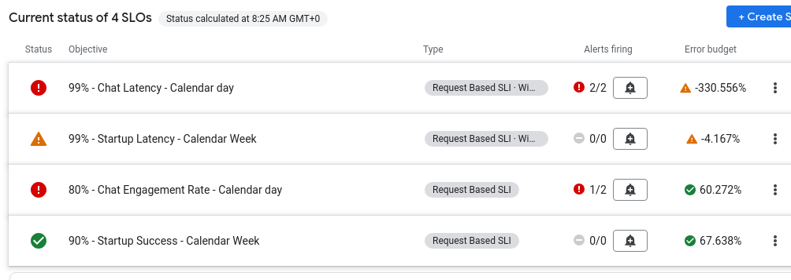

# Practical SRE

## Introduction

Welcome to the coach's guide for The IoT Hack of the Century gHack. Here you will find links to specific guidance for coaches for each of the challenges.

Remember that this hack includes a optional [lecture presentation](resources/lecture.pdf) that features short presentations to introduce key topics associated with each challenge. It is recommended that the host present each short presentation before attendees kick off that challenge.

> **Note** If you are a gHacks student, this is the answer guide. Don't cheat yourself by looking at this guide during the hack!

## Coach's Guides

- Challenge 1: Your first day as SRE
- Challenge 2: There are others
- Challenge 3: Your first set of SLOs
- Challenge 4: Let the monitoring begin
- Challenge 5: Implementing SLOs on the dashboard
- Challenge 6: Stay alert

## Coach Prerequisites

This hack has prerequisites that a coach is responsible for understanding and/or setting up BEFORE hosting an event. Please review the [gHacks Hosting Guide](https://ghacks.dev/faq/howto-host-hack.html) for information on how to host a hack event.

The guide covers the common preparation steps a coach needs to do before any gHacks event, including how to properly setup Google Meet and Chat Spaces.

### Student Resources

Before the hack, it is the Coach's responsibility create and make available needed resources including:

- Files for students
- Lecture presentation
- Terraform scripts for setup (if running in the customer's own environment)

Follow [these instructions](https://ghacks.dev/faq/howto-host-hack.html#making-resources-available) to create the zip files needed and upload them to your gHack's Google Space's Files area.

Always refer students to the [gHacks website](https://ghacks.dev) for the student guide: [https://ghacks.dev](https://ghacks.dev)

> **Note** Students should **NOT** be given a link to the gHacks Github repo before or during a hack. The student guide intentionally does **NOT** have any links to the Coach's guide or the GitHub repo.

## Google Cloud Requirements

This hack requires students to have access to Google Cloud project where they can create and consume Google Cloud resources. These requirements should be shared with a stakeholder in the organization that will be providing the Google Cloud project that will be used by the students.

- Cloud Observability Suite

## Suggested Hack Agenda

- Challenge 1 (45 mins)
- Challenge 2 (20 mins)
- Challenge 3 (30 mins)
- Challenge 4 (30 mins)
- Challenge 5 (45 mins)
- Challenge 6 (30 mins)

## Repository Contents

_The default files & folders are listed below. You may add to this if you want to specify what is in additional sub-folders you may add._

- `README.md`
  - Student's Challenge Guide
- `solutions.md`
  - Coach's Guide and related files
- `./resources`
  - Resource files, sample code, scripts, etc meant to be provided to students. (Must be packaged up by the coach and provided to students at start of event)
- `./artifacts`
  - Terraform scripts and other files needed to set up the environment for the gHack
- `./images`
  - Images and screenshots used in the Student or Coach's Guide

## Environment

- Setting Up the Environment (if not on Qwiklabs)
  - Before we can hack, you will need to set up a few things.
  - Run the instructions on our [Environment Setup](../../faq/howto-setup-environment.md) page.
  - Make sure the students take a note of the **Locust IP** and the **Frontend IP**

## Whats happening in the backend

We have a fully functional Movie Guru app running on the GKE cluster, albeit with simplified authentication and cookie handling. When a student logs into the frontend, they interact with the actual Movie Guru backend components.

For our metrics generation, we utilize a separate backend (henceforth called **fake backend**) specifically designed to simulate conditions that produce metrics without requiring real users. We employ **Locust** as the tool to generate simulated user traffic. This backend mirrors the same API as the real Movie Guru backend but only returns expected response codes while simulating a predefined range of latencies and error rates, as defined in the **/phase** endpoint. This approach enables us to create various failure scenarios and observe system behavior, yielding valuable insights for our workshop. For different challenges, we set distinct probability distributions to generate the required types of metrics.

## Challenge 1: Your first day as SRE

### Notes & Guidance

We're starting the load generator although the students don't need to understand the loadtest at all.
The **fake backend** is primed to create responses that are suboptimal. This is to create the idea that at the start of the workshop, the **Movie Guru** app is performing suboptimally.

#### Getting Started

1. **Start Metrics Collection:** Begin by launching the load tester tool to collect background metrics. This data will be used in later challenges.
2. **Explore the App:**  Each student should access the Movie Guru app on their own machine using the provided frontend IP address. Take 10 minutes to explore the app individually.

#### Identifying User Journeys

1. **Teamwork:**  The team has to work together to identify at least 2 user journeys.  Think about the different ways users might interact with the app to achieve specific goals.
1. **Compare and Contrast:** They need to identified user journeys with the examples provided in the "Success Criteria" section.  Remember that these examples are not the definitive "right answers."  Your team might identify important details or variations that are not captured in the examples.
1. **Structured Documentation:**  Clearly document your user journeys using a structured format that includes:
   1. **Goal:** The user's objective in this journey.
   1. **Steps:** The specific actions the user takes to achieve the goal.

#### Important Reminders

- The goal of this challenge is to familiarize themselves with the Movie Guru app and practice identifying user journeys.
- There is no single "correct" set of user journeys.  Focus on capturing the key interactions and user goals.
- Documenting user journeys in a structured format helps ensure clarity and facilitates future analysis and improvements.

## Challenge 2: Yes, there are others

This challenge focuses on stakeholder management, SRE principles, and gathering information. Here's a guide to help you facilitate the exercise:

**Key takeaways for students:**

- **100% uptime is an unrealistic goal:**  Emphasize the trade-offs between reliability, cost, and innovation.
- **SRE is about balance:**  Help students understand the importance of balancing reliability with user needs and business priorities.
- **Collaboration is key:**  Stress the importance of identifying and collaborating with key stakeholders across different teams.
- **Information gathering is crucial:** Guide students to identify the essential information needed to assess and improve reliability.

**Guiding the discussion:**

- **Challenge the CEO's demand:** Encourage students to critically evaluate the CEO's demand and explain why 100% uptime is not a feasible or desirable goal.
- **Explore SRE principles:**  Use this opportunity to discuss core SRE principles like SLOs, error budgets, and embracing risk.
- **Identify stakeholders:**  Guide students to identify a wide range of stakeholders, including technical teams, product owners, and business stakeholders.
- **Gather essential information:**  Help students determine the specific information needed from each stakeholder group to develop a comprehensive reliability strategy.
- **Facilitate role-play:**  Encourage students to role-play the conversation with the CEO, focusing on clear communication and alignment with SRE principles.

**Remember:** The goal is not to find the "perfect" solution but to encourage critical thinking, collaboration, and a deeper understanding of SRE principles and make them tangible.

## Challenge 3: SLOs: Not Just Another Acronym

## Instructor's Guide: Challenge 3

This challenge focuses on defining and understanding Service Level Objectives (SLOs). Here's a guide to help you facilitate the exercise:

**Key takeaways for students:**

- **SLOs are key to SRE:**  Emphasize the importance of SLOs in defining and measuring service reliability.
- **Align with user needs:**  Help students understand that SLOs should be based on what matters most to users, not arbitrary targets.
- **SMART SLOs:** Guide students to create SLOs that are specific, measurable, achievable, relevant, and time-bound.
- **Components of an SLO:** Ensure students understand the key components of an SLO: objective, SLI, target, time window, and measurement.

**Guiding the discussion:**

- **Review SLO concepts:**  Start by reviewing the definition and purpose of SLOs, using the provided "What are SLOs?" section as a reference.
- **Choose user journeys:**  Help students select relevant user journeys from Challenge 1 or the provided examples.
- **Define SLOs:** Guide students to define appropriate SLOs for each chosen user journey, ensuring they include all the necessary components.
- **Discuss measurement:** Encourage students to think about how they would measure and track the defined SLOs.
- **Provide feedback:** Offer constructive feedback on the students' SLOs, focusing on clarity, relevance, and measurability.

**Example SLO discussion points:**

- **Why is this SLO relevant to the chosen user journey?**
- **How would you measure the SLI?**
- **What tools or data sources would you use?**
- **How would you know if the SLO is being met?**
- **What actions might you take if the SLO is not met?**

**Remember:** The goal is to help students develop a strong understanding of SLOs and their role in SRE. Encourage them to think critically about user needs, business goals, and the technical aspects of measuring and achieving reliability targets.

### Example **Movie Guru** SLOs

#### SLO for Movie Guru App Access

- SLO: 99.95% of users should be able to access the Movie Guru app and view the main interface within 3 seconds, measured over a 7-day rolling window.

- Rationale:

    This SLO focuses on the app's availability and initial load time, which are crucial for a positive first impression.  The 99.95% target ensures high availability, while the 3-second threshold aims for a responsive and quick-loading interface. The 7-day rolling window provides a balance between capturing short-term trends and allowing for some variability in daily traffic patterns.

- Measurement:

  - Availability: Measured as the percentage of successful attempts to access and load the main interface of the Movie Guru app.
  - Latency: Calculated as the combined latency of the login endpoint and the startup endpoint, both measured at the server

#### SLO for Movie Guru Chatbot Responsiveness

**Current SLO:** 70% of user messages should receive a relevant response from the Movie Guru chatbot within 8 seconds, measured over a 24-hour rolling window.

**Aspirational SLO:** 90% of user messages should receive a relevant response from the Movie Guru chatbot within 5 seconds, measured over a 24-hour rolling window.

**Rationale:**

This starting SLO acknowledges that the chatbot is still under development and may not yet be able to provide highly relevant responses in all cases. The 70% target allows for some room for improvement while still ensuring a reasonable level of user satisfaction. The aspirational SLO sets a higher bar for the future, aiming for both improved relevance and reduced latency.

**Measurement:**

- **Relevance:** Measured by the `Chat_Outcome_Counter` metric. A response is considered relevant if the outcome is registered as "engaged"."
- **Latency:**  Calculated as the time difference between the server receiving the user's message and sending the response.

#### SLO for Updating User Preferences in Movie Guru

- SLO: 99.5% of user preference updates should be successfully saved within 1 second, measured over a 24-hour rolling window.

- Rationale:

    This SLO focuses on the performance and reliability of the preference update functionality within Movie Guru. The 99.5% target ensures that users can reliably modify their preferences, while the 1-second threshold aims for a quick and responsive experience. The 24-hour rolling window provides a frequent assessment of this critical function.

- Measurement:

  - Success Rate: Measured as the percentage of successful attempts to update user preferences.
  - Latency: Calculated as the time it takes for the app to successfully save the updated preferences after a user submits the changes.

## Challenge 4: Let the monitoring begin

#### Notes & Guidance

This is the first challenge where students look at the metrics generated thus far.
The **fake backend** is expected to generate metrics that show that the app is behaving suboptimally. Slow responses, frequent errors etc should be seen by looking at the dahsboard.

- The chat latency p99 is around 9 seconds (Very SLOW)
- The chat failure rate is around 30% (HIGH)
- Safety error rate is around 30% (Quite high)
- User engagement rate is around 60% (LOW)
- Startup latency is around p99 1.5 seconds (SLOW)

The students should notice how bad the performance and imagine what the user experience would be like if the metrics are like this. Their goal is to create achievable SLOs based on the current perfomance. For example if the chat latency p99 is around 9 seconds, it is realistic to bring it down to around 5 seconds, and NOT < 1 second.

#### Getting Started

This section helps you address the challenges in defining and achieving SLOs for the Movie Guru app.

SLO 1: App Accessibility and Responsiveness

Current State: 90% availability, p99 latency of 3 seconds.
Target SLO: **99%** of users access the main interface within **1 seconds** over a **7-day** rolling window.

SLO 2: Chatbot Responsiveness

Current State: 50% engagement rate, p99 latency of 9.8 seconds.
Target SLO: **70%** of user messages receive a relevant response, and **99%** of users should recieve responses within **5 seconds** over a **24-hour** rolling window.

## Challenge 5: SLOs on the dashboard

#### Notes & Guidance

At the start of this challenge, the students need to post to the **fake backend** and provide it a new set of probability distribution. This simulates the **Movie Guru** app improving performance to meet achievable SLOs desgined in the previous step.

- The chat latency p99 is around 5 seconds (Better)
- The chat failure rate is around 10% (IMPROVED)
- Safety error rate is around 10% (IMPROVED)
- User engagement rate is around 85% (MUCH Better)
- Startup latency is around p99 1 seconds (Slightly improved)

The students should notice how bad the performance is and create achievable SLOs based on the current perfomance. For example if the chat latency p99 is around 9 seconds, it is realistic to bring it down to around 5 seconds, and NOT < 1 second.

#### Getting Started

This is a challenging exercise. The last SLO needs to be implmenting using the API as the GCP Monitoring UI for SLIs doesn't allow you to define different metrics in the numerator and denominator.
Here is the command for it that needs to be run in a terminal.

- Create Access token and service

```sh
ACCESS_TOKEN=`gcloud auth print-access-token`


CREATE_SERVICE_POST_BODY=$(cat <<EOF
{
  "displayName": "mockserver-service",
  "gkeService": {
    "projectId": "${PROJECT_ID}",
    "location": "europe-west4",
    "clusterName": "movie-guru-gke",
    "namespaceName": "movie-guru",
    "serviceName": "mockserver-service"
  }
}
EOF
)

SERVICE_ID=service-startup

curl  --http1.1 --header "Authorization: Bearer ${ACCESS_TOKEN}" --header "Content-Type: application/json" -X POST -d "${CREATE_SERVICE_POST_BODY}" https://monitoring.googleapis.com/v3/projects/${PROJECT_ID}/services?service_id=${SERVICE_ID}

```

- SLO Startup Success Rate SLO

```sh
STARTUP_SUCCESS_SLO_POST_BODY=$(cat <<EOF
{
  "displayName": "90% - Startup Success - Calendar Week",
  "goal": 0.90,
  "calendarPeriod": "WEEK",
  "serviceLevelIndicator": {
    "requestBased": {
      "goodTotalRatio": {
        "goodServiceFilter": "metric.type=\"prometheus.googleapis.com/movieguru_startup_success_total/counter\" resource.type=\"prometheus_target\"",
        "totalServiceFilter": "metric.type=\"prometheus.googleapis.com/movieguru_startup_attempts_total/counter\" resource.type=\"prometheus_target\""
      }
    }
  }
}
EOF
)
curl  --http1.1 --header "Authorization: Bearer ${ACCESS_TOKEN}" --header "Content-Type: application/json" -X POST -d "${STARTUP_SUCCESS_SLO_POST_BODY}" https://monitoring.googleapis.com/v3/projects/${PROJECT_ID}/services/${SERVICE_ID}/serviceLevelObjectives

```

Chat Engagement Rate SLO (using engaged and acknowledged)

```sh
CHAT_ENGAGEMENT_SLO_POST_BODY=$(cat <<EOF
{
  "displayName": "80% - Chat Engagement Rate - Calendar day",
  "goal": 0.8,
  "calendarPeriod": "DAY",
  "serviceLevelIndicator": {
    "requestBased": {
      "goodTotalRatio": {
        "goodServiceFilter": "metric.type=\"prometheus.googleapis.com/movieguru_chat_outcome_counter_total/counter\" resource.type=\"prometheus_target\" metric.labels.Outcome=monitoring.regex.full_match(\"Engaged|Acknowledged\")",
        "totalServiceFilter": "metric.type=\"prometheus.googleapis.com/movieguru_chat_outcome_counter_total/counter\" resource.type=\"prometheus_target\""
      }
    }
  }
}
EOF
)

curl  --http1.1 --header "Authorization: Bearer ${ACCESS_TOKEN}" --header "Content-Type: application/json" -X POST -d "${CHAT_ENGAGEMENT_SLO_POST_BODY}" https://monitoring.googleapis.com/v3/projects/${PROJECT_ID}/services/${SERVICE_ID}/serviceLevelObjectives

```

- SLO Startup Latency Windowed SLO

```sh
STARTUP_LATENCY_SLO_POST_BODY=$(cat <<EOF
{
  "displayName": "99% - Startup Latency - Calendar Week",
  "goal": 0.99,
  "calendarPeriod": "WEEK",
  "serviceLevelIndicator": {
    "windowsBased": {
      "windowPeriod": "60s",
      "goodTotalRatioThreshold": {
        "performance": {
          "distributionCut": {
            "distributionFilter": "metric.type=\"prometheus.googleapis.com/movieguru_startup_latency_milliseconds/histogram\" resource.type=\"prometheus_target\"",
            "range": {
              "min": -1000,
              "max": 1200
            }
          }
        },
        "threshold": 0.99
      }
    }
  }
}
EOF
)
curl  --http1.1 --header "Authorization: Bearer ${ACCESS_TOKEN}" --header "Content-Type: application/json" -X POST -d "${STARTUP_LATENCY_SLO_POST_BODY}" https://monitoring.googleapis.com/v3/projects/${PROJECT_ID}/services/${SERVICE_ID}/serviceLevelObjectives

```

Chat Latency SLO

```sh
CHAT_LATENCY_SLO_POST_BODY=$(cat <<EOF
{
  "displayName": "99% - CHAT Latency - Calendar DAY",
  "goal": 0.99,
  "calendarPeriod": "DAY",
  "serviceLevelIndicator": {
    "windowsBased": {
      "windowPeriod": "60s",
      "goodTotalRatioThreshold": {
        "performance": {
          "distributionCut": {
            "distributionFilter": "metric.type=\"prometheus.googleapis.com/movieguru_chat_latency_milliseconds/histogram\" resource.type=\"prometheus_target\"",
            "range": {
              "min": -1000,
              "max": 5000
            }
          }
        },
        "threshold": 0.99
      }
    }
  }
}
EOF
)
curl  --http1.1 --header "Authorization: Bearer ${ACCESS_TOKEN}" --header "Content-Type: application/json" -X POST -d "${STARTUP_LATENCY_SLO_POST_BODY}" https://monitoring.googleapis.com/v3/projects/${PROJECT_ID}/services/${SERVICE_ID}/serviceLevelObjectives

```

### Challenge 6: Stay alert

#### Context

At the start of this challenge, the students need to post to the **fake backend** and provide it a probability distribution that determines performance.
The new values posted simulate the **Movie Guru** app suddenly having issues with the **chat** user journey

The students should within a few minutes notice the two chat related SLOs are degrading. The latency SLO is degrading quickly, while the engagement query is degrading slightly less quickly.

The goal is for them to create burn rate alerts for the SLOs (ideally one creates at the SLO creation and not after things start slowly.)

#### Challenge Steps

This challenge focuses on monitoring SLOs and using burn rate alerts to identify and prioritize service issues. Guide students to:

- Verify initial SLO health: Confirm all SLIs are initially within the acceptable range on the dashboard.
Analyze error budget: Discuss the "Startup Success Rate" SLO's error budget, its meaning, and how it allows for feature development and maintenance.
- Observe SLO degradation: Point out the declining performance of the "Chat Latency" and "Chat Engagement Rate" SLOs.
- Create burn rate alerts: Instruct students to create slow (1.5-2.0x) and fast (10x) burn rate alerts for both failing SLOs, emphasizing the importance of proactive alert creation in real-world scenarios.
- Discuss burn rate concept: Explain that burn rate indicates how quickly the error budget is being consumed, like overspending a monthly allowance.
- Monitor alert triggers: Have students observe which alerts fire and discuss how the burn rate helps prioritize issues.
- Highlight the lookback window: Remind students that alerts will trigger only after the lookback period (5 minutes in this case) has elapsed.
- Verify success criteria: Ensure students have created at least four burn rate alerts and that at least one alert fires for the "Chat Latency" SLO.
- Example view of firing alerts
  
  

### Challenge 7: What's Really UP, Doc?

#### Context

  Before diving into this challenge, you'll need to orchestrate a bit of controlled chaos:

    1. **Fake Backend Manipulation:**  Instruct the students to configure the **fake backend** with a probability distribution that simulates excellent performance. This should push all SLOs into the "good" region, creating a false sense of stability.
    2. **Frontend Sabotage:**  Have the students introduce a sneaky change to the frontend code that causes 50% of the calls to the backend to fail. This will create a noticeable impact on user experience while leaving the backend metrics untouched.

- **The Illusion of Perfection**

    With the stage set, the students should observe a perplexing situation: their dashboards are glowing green, signaling perfect health, but their colleagues (and their own attempts to use the app) reveal a harsh reality – the frontend is misbehaving, displaying a blank screen half the time.

- **Unmasking the Blind Spot**

    This challenge encourages students to recognize a critical blind spot in their monitoring strategy: relying solely on backend metrics can create a misleading picture of application health.  The true measure of success lies in understanding the *user experience*, which requires monitoring from the frontend as well.

- **Key Takeaways**

  - **End-to-End Visibility:**  Emphasize the importance of monitoring the entire application flow, from the frontend to the backend, to gain a complete understanding of performance and user experience.
  - **User-Centric Monitoring:**  Highlight the need to prioritize metrics that reflect the user's perspective, even if they don't directly align with backend performance.
  - **Proactive Problem Solving:** Encourage students to think proactively about potential monitoring gaps and explore solutions like synthetic monitoring or real user monitoring (RUM) to gain insights into frontend performance.

- **Note:**  The goal of this challenge is not to debug the frontend issue itself, but to highlight the limitations of relying solely on backend metrics and to encourage a more holistic approach to monitoring.