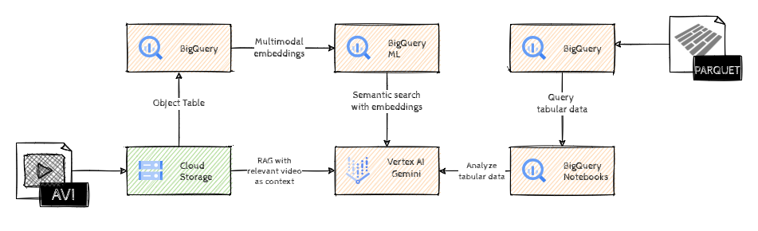

# Crash Course in AI: Formula E Edition

## Introduction

Given the close proximity racing, varying track conditions, and high speeds of electric cars, incidents in Formula E are virtually inevitable. The series' aggressive, unpredictable nature combined with street circuits often leads to crashes and collisions.

In this gHack we'll analyze Formula E CCTV footage and telemetry data to identify crashes and determine the drivers involved using Gemini.

We'll start with loading the video files into BigQuery. Following this, video embeddings will be generated, enabling RAG-based semantic search to pinpoint the precise timestamp of any potential crash. Finally, telemetry data will be ingested, filtered, and aggregated around the crash timestamp to identify the drivers involved in the crash.

## Learning Objectives

During the process we'll learn about

- BigQuery Object tables
- Multimodal embeddings & Vector search in BigQuery
- Retrieval Augmented Generation (RAG)
- BigQuery for analyzing tabular data

## Challenges

- Challenge 1: Getting in gear
- Challenge 2: Formula E-mbed
- Challenge 3: Formula E RAG-ing
- Challenge 4: Telemetry to the rescue!

## Prerequisites

- Basic knowledge of GCP
- Basic knowledge of Python
- Basic knowledge of SQL
- Access to a GCP environment

## Contributors

- Murat Eken
- Michelle Liu
- Deb Lee
- Gino Filicetti

## Challenge 1: Getting in gear

### Introduction

Formula E races are extensively covered with a network of broadcast cameras capturing the on-track action and drama, supplemented by CCTV cameras providing additional views for safety and race control. In this gHack we'll use CCTV footage to detect any incidents.

> **Note**  
> A circuit will have multiple CCTV cameras covering different parts of the track, for the sake of simplicity we'll use the feed from a single camera.

This first step is all about getting started with the source data, which is a collection of 2-minute segments from a CCTV camera.

### Description

Create a new bucket, and copy the sample videos from the bucket `gs://ghacks-genai-fe/cctv/` to the newly created bucket.

> **Note**  
> You should navigate to your Cloud Storage bucket and preview the videos to familiarize yourself with the content.

Once the data is in the bucket, create an *Object table* in BigQuery on that data in a new BigQuery dataset.

### Success Criteria

- There is a new Cloud Storage Bucket with the sample video files.
- There is an Object table that makes the sample video files available in BigQuery.
- There are *14* rows in the newly created Object table.

### Learning Resources

- [Creating new Cloud Storage Buckets](https://cloud.google.com/storage/docs/creating-buckets)
- [Creating Cloud Resource Connections in BigQuery](https://cloud.google.com/bigquery/docs/create-cloud-resource-connection)
- [Object tables in BigQuery](https://cloud.google.com/bigquery/docs/object-tables)

## Challenge 2: Formula E-mbed

### Introduction

Embeddings are high-dimensional numerical vectors representing entities like text, video or audio for machine learning models to encode semantics. These vectors help us to measure distances and find *semantically* similar items. If we want to be able to search within our videos, to find the most relevant one for a given question, we need to generate embeddings as a first step.

### Description

Now the source data is available in BigQuery, use BigQuery ML capabilities to generate multimodal embeddings and store those embeddings in a new BigQuery table. Make sure that there's *only one* embedding vector *per 2 minute segment* with the type `ARRAY<FLOAT64>`.

### Success Criteria

- There is a new BigQuery table with *14 rows* of multimodal embeddings for the sample video files.

### Learning Resources

- [Generate multimodal embeddings](https://cloud.google.com/bigquery/docs/generate-multimodal-embeddings)
- [The ML.GENERATE_EMBEDDING function](https://cloud.google.com/bigquery/docs/reference/standard-sql/bigqueryml-syntax-generate-embedding)

### Tips

- The method for creating multimodal embeddings supports a few different arguments, pay attention to `flatten_json_output` and `interval_seconds`.

## Challenge 3: Formula E RAG-ing

### Introduction

In order to find semantically similar items we need to measure the distance between vectors in the embedding space. We could implement that ourselves by calculating the distance between each embedding, but BigQuery already provides a function, `VECTOR_SEARCH`, that simplifies this process.

Once we have determined the correct segment, we'll use that for RAG. Retrieval augmented generation (RAG) is a popular approach for enabling LLMs to access external data and provides a mechanism to mitigate against hallucinations. The main idea is to provide the LLM more context to get reliable answers. This is typically done by looking up relevant information from a (vector) database and adding that information to the prompt of the LLM.

### Description

Design a SQL query that retrieves the **top result** from the embeddings table given the phrase `car crash`. Once you have found the correct video segment, you'll use Vertex AI Studio to extract the exact timestamp of the crash from that video segment.

Navigate to Vertex AI Studio, *Create Prompt* section, and design a prompt to get the exact timestamp of the crash, using the video segment in your prompt.

> **Note** Have a look at the video segment to confirm when the crash happened. You can preview the videos in the Console, just browse to the specific video through Cloud Storage Bucket browser and there will be a button for *Preview*.

### Success Criteria

- The SQL query returns the uri for `cam_15_07.mp4`.
- Vertex AI Studio outputs the exact timestamp of the crash covered in the video segment in `dd/mm/yyyy * HH:MM:SS` format.

### Learning Resources

- [Generate and search multimodal embeddings](https://cloud.google.com/bigquery/docs/generate-multimodal-embeddings)
- [Using multimodal prompts in Gemini](https://cloud.google.com/vertex-ai/generative-ai/docs/multimodal/video-understanding)
- [What is RAG?](https://cloud.google.com/use-cases/retrieval-augmented-generation)

### Tips

- In Vertex AI Studio you can use different words to describe the crash (e.g. collision), experiment with those as well as different models/settings. And in case you need additional help with your prompt design, consider the [AI-powered prompt writing](https://cloud.google.com/vertex-ai/generative-ai/docs/learn/prompts/ai-powered-prompt-writing).
- The video has the timestamp information in the right format in the top left corner of each frame.

## Challenge 4: Telemetry to the rescue!

### Introduction

Now that we have detected the timestamp of the crash, let's see if we can find out which drivers were involved. Using only visual data can be difficult so we'll use the available telemetry data to determine the drivers. And this time we'll use Python Notebooks from BigQuery Studio to run the analysis.

### Description

The telemetry data is available here: `gs://ghacks-genai-fe/telemetry/`. Go ahead and load that into BigQuery.

We've already designed a [Python notebook](https://raw.githubusercontent.com/meken/gcp-genai-fe/refs/heads/main/notebooks/Formula-E-Challenge-4.ipynb) for this challenge. Upload that to BigQuery, and complete the two cells that have a `TODO` comment:

1. Provide the SQL that returns the average speed and brake information per driver for the timeframe between the second before the crash and the crash timestamp
1. Use the result of that query as part of the prompt to Gemini to get back the drivers involved in the crash.

### Success Criteria

- The telemetry data is available as a table in BigQuery.
- There's a SQL query that returns the average brake and speed from telemetry for each driver, aggregated over the second just before the crash.
- There's a prompt that uses the output of the SQL query as input to Gemini to determine the drivers that were involved in the crash.
- Gemini outputs the correct drivers (Maximilian Günther and Jake Hughes) and a brief explanation of why.

### Learning Resources

- [Loading Parquet data from Cloud Storage](https://cloud.google.com/bigquery/docs/loading-data-cloud-storage-parquet)
- [BigQuery Python Notebooks](https://cloud.google.com/bigquery/docs/create-notebooks#upload_notebooks)

### Tips

- Note that the timestamp from the CCTV footage is in local time (CEST, which is UTC+2) whereas the telemetry data is in UTC.
