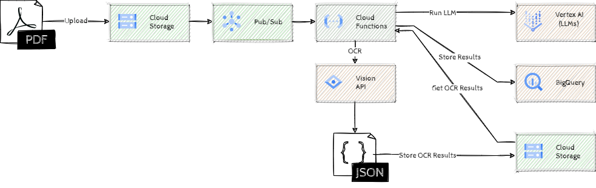

# Introduction to GenAI

## Introduction

Introduction to GenAI will challenge you to build a system that catalogues scientific papers. Whenever a new paper is uploaded to a specific Cloud Storage Bucket, a Cloud Function will be triggered to do OCR, then extract the title and summary of the paper using an LLM and store all that information in BigQuery. Then we'll run an LLM from BigQuery to classify the papers into distinct categories. Next we'll add semantic search capabilities in BigQuery using text embeddings and finally, implement a more scalable version of that using Vector Search.



## Learning Objectives

This hack will help you explore the following tasks:

- Using Vertex AI Foundational models for text understanding
- Prompt engineering 
- Using BigQuery to run LLMs
- How to use text embeddings for semantic search in BigQuery
- Vertex AI Vector Search for storing and searching text embeddings

## Challenges

- Challenge 1: Automatic triggers
- Challenge 2: First steps into the LLM realm
- Challenge 3: Summarizing a large document using chaining
- Challenge 4: BigQuery &#10084; LLMs
- Challenge 5: Simple semantic search
- Challenge 6: Vector Search for scale

## Prerequisites

- Basic knowledge of GCP
- Basic knowledge of Python
- Basic knowledge of SQL
- Access to a GCP environment

## Contributors

- Murat Eken

## Challenge 1: Automatic triggers

### Introduction 

This challenge is all about configuring the pre-requisites for the system we're building.

### Description

Create two Cloud Storage Buckets, one for uploading documents and another one for staging. You can choose any name for the first bucket, but call the staging bucket `{YOUR PROJECT ID}-staging`.

We'll trigger the summary generation automatically when a document is uploaded to the first Cloud Storage Bucket. We've already provided you with a(n incomplete) Cloud Function, make sure that this function is triggered whenever a new document is uploaded to the Cloud Storage Bucket.

### Success Criteria

- There are two Cloud Storage Buckets, one for uploading the documents and another one for staging with the required name.
- The provided Cloud Function is triggered **only** when a file is uploaded.
- No code was modified.

### Learning Resources

- [Creating new Cloud Storage Buckets](https://cloud.google.com/storage/docs/creating-buckets)
- [Pub/Sub notifications for Cloud Storage Notifications](https://cloud.google.com/storage/docs/pubsub-notifications)

### Tips

- Check the provided Cloud Function's configuration to see the details on how it's being triggered
- You can test things by uploading a [PDF file](https://arxiv.org/pdf/2301.02230.pdf) to the first Cloud Storage Bucket and watching the logs of the Cloud Function


## Challenge 2: First steps into the LLM realm

### Introduction

Let's get started with a simple objective; we're going to _extract_ the title of a document using LLMs. In order to work with LLMs we need textual data, so the first step in our process is to extract text data from PDF documents. We've already implemented that functionality for you using Cloud Vision APIs in the provided Cloud Function. Go ahead and have a look at the `extract_text_from_document` function to understand where and how the results are stored. Now, with those results we can look into extracting the title from the text content of the document.

### Description

For this challenge we'll use Gemini to determine what the title (including any subtitle) of the uploaded document is, *in a cost effective way*. We've already provided the skeleton of the function `extract_title_from_text`, all you need to do is come up with the correct prompt and set the right values for the placeholder (in the `format` function) to pass the document content to your prompt.  Once you've made your changes re-deploy the Cloud Function.

> **Warning**  Beware of some of the quirks of Cloud Function source editor UI! When you click on _Save and redeploy_ button, the editor will show the code for the previous version of the function, which looks like your changes were lost. But that's only temporay, when the function is redeployed, the changes will be shown again. If there were any syntax errors though, the changes will be lost, so make a copy of your changes before you save and redeploy the code. Also, before editing the function make sure that you have the latest version of the code. If you're editing a previous version, the editor won't warn you about that.

### Success Criteria

- Less than 2500 tokens are used to determine the title.
- The following papers should yield the corresponding titles, you can see those in the `Logs` section of the Cloud Function. Make sure that only the title is output:

  | Paper                                           | Title |
  | ---                                             | ---   |
  | [LOFAR paper](https://arxiv.org/pdf/2309.00102) | _The LOFAR Two-Metre Sky Survey (LOTSS) VI. Optical identifications for the second data release_|
  | [PEARL paper](https://arxiv.org/pdf/2309.00031) | _PEARLS: Near Infrared Photometry in the JWST North Ecliptic Pole Time Domain Field_ |

### Learning Resources

- Using Python [str.format](https://www.w3schools.com/python/ref_string_format.asp)
- [Prompt Engineering](https://cloud.google.com/vertex-ai/docs/generative-ai/text/text-prompts)

### Tips

- You can edit and redeploy the Cloud Function from the Console.
- You can test your prompts using [Vertex AI Studio](https://cloud.google.com/vertex-ai/docs/generative-ai/text/test-text-prompts#generative-ai-test-text-prompt-console).
- You could get the content from PDF files by opening them in PDF reader and copying the text (or if you're very familiar with the CLI and love experimenting with `jq` you can do that by using `gsutil cat` & `jq` commands from Cloud Shell by accessing the JSON files in the staging bucket).

## Challenge 3: Summarizing a large document using chaining

### Introduction

The objective of this challenge is to try to get a summary of a complete paper. For the title it's okay to just look at a part of the document, but generating a summary for the complete document requires an alternative approach, namely LLM _chains_. 

> **Note**  
> Although the expanding context windows of LLMs are gradually reducing the need for this technique, it remains relevant in specific use cases. In our case there are papers like [this](https://arxiv.org/pdf/1511.08771), with more than 10K pages and 10s of millions of characters, exceeding well beyond the context window of current models. Also keep in mind that in some cases chaining might still be more memory efficient (processing chunks individually instead of whole documents) and more flexible (by integrating data from diverse information sources & tools within a single workflow). So, the optimal approach depends on the specific requirements of the task and the available resources.

There's roughly 3 different approaches we can take; _Stuffing_ is the most basic approach where the full content (possibly from multiple documents) is provided as the context. However this only works with smaller documents due to the context length limits.

The _Map-Reduce_ chain is an alternative approach that's designed to handle large/multiple documents. In essence it makes multiple calls to an LLM for chunks of content (usually in parallel). It first applies an LLM to each document/chunk individually (the _Map_ phase), then the results (outputs of the LLM) are combined and sent to an LLM again to get a single output (the _Reduce_ phase). Typically different prompts are used for the Map and Reduce phases. 

The _Refine_ chain approach also makes multiple calls to an LLM, but it does that in an iterative fashion. It starts with the first document/chunk, passes its content and gets a response, and then gets to the second document/chunk passing that content plus the response from the previous call, iterating until the last document/chunk and then passing the last (rolling) response and getting a final answer.

### Description

In order to get the summaries, we'll implement the _Refine_ approach for this challenge. Most of the code is already provided in the `extract_summary_from_text` method in Cloud Function. Similar to the previous challenge, you're expected to design the prompt and provide the right values to the placeholders.

### Success Criteria

- For this [paper](https://arxiv.org/pdf/2310.01473) we expect a summary like this:

  ```
  The author argues that the standard cosmological model is incorrect and that there is no dark matter. The author provides several arguments for this, including:

  * The observed properties of galaxies are consistent with them being self-regulated, largely isolated structures that sometimes interact.
  * The observed uniformity of the galaxy population is evidence against the standard cosmological model.
  * The large observed ratio of star-forming galaxies over elliptical galaxies is evidence against the standard cosmological model.

  The author concludes that understanding galaxies purely as baryonic, self-gravitating systems becomes simple and predictive.
  ```

  > **Note** By their nature, LLM results can vary, this is something to expect so your exact text may not match the above, but the intent should be the same.

### Learning Resources

- Using Python [str.format](https://www.w3schools.com/python/ref_string_format.asp)
- [Prompt Engineering](https://cloud.google.com/vertex-ai/docs/generative-ai/text/text-prompts)

## Challenge 4: BigQuery &#10084; LLMs

### Introduction

So far we've used the Gemini APIs from the Vertex AI Python SDK. It's also possible to use those through BigQuery, this challenge is all about using BigQuery to run an LLM.

### Description

Before we start using the LLMs you'll need to store the outputs of the Cloud Function in BigQuery. The first step is to create a BigQuery dataset called `articles` (in multi-region US) and a table `summaries` with the following columns, `uri`, `name`, `title` and `summary`.

We've already provided the code in the Cloud Function to store the results in the newly created table, just uncomment the call to `store_results_in_bq`.

Once the table is there, configure BigQuery to use an LLM and run a query that categorizes each paper that's in the `articles.summaries` table using their `summary`. Make sure that the LLM generates one of the following categories: `Astrophysics`, `Mathematics`, `Computer Science`, `Economics` and `Quantitative Biology`. 

Upload the following papers to Cloud Storage Bucket and run your SQL query in BigQuery to show the title and category of each paper
- [Astrophysics](https://arxiv.org/pdf/2310.00044)
- [Astrophysics](https://arxiv.org/pdf/2310.01062)
- [Computer Science](https://arxiv.org/pdf/2310.08243)
- [Computer Science](https://arxiv.org/pdf/2310.09196)
- [Economics](https://arxiv.org/pdf/2310.00446)
- [Economics](https://arxiv.org/pdf/2310.02081)
- [Mathematics](https://arxiv.org/pdf/2310.00245)
- [Mathematics](https://arxiv.org/pdf/2310.01303)
- [Quantitative Biology](https://arxiv.org/pdf/2310.00067)
- [Quantitative Biology](https://arxiv.org/pdf/2310.02553)

> **Warning**  
> Currently GenAI models have a rate limit of 60 calls per minute, since every page from the documents is a single call, if you process more than 60 pages you might run into this limit. None of the provided examples has more than 60 pages, but if you add them all at the same time you'll get to that limit.

### Success Criteria

- Running the SQL query yields the following results

  | Title | Category |
  | ---   | ---      |
  | From particles to orbits: precise dark matter density profiles using dynamical information | Astrophysics |
  | Bayesian inference methodology to characterize the dust emissivity at far-infrared and submillimeter frequencies | Astrophysics |
  | Computing Twin-Width Parameterized by the Feedback Edge Number | Computer Science |
  | A 4-approximation algorithm for min max correlation clustering | Computer Science |
  | Reconstructing supply networks | Economics |
  | Student debt and behavioral bias: a trillion dollar problem | Economics |
  | Singularities and clusters | Mathematics |
  | Dynamics of automorphism groups of projective surfaces: classification, examples and outlook | Mathematics |
  | Solvent constraints for biopolymer folding and evolution in extraterrestrial environments | Quantitative Biology |
  | Full-Atom Protein Pocket Design via Iterative Refinement | Quantitative Biology |

### Learning Resources

- Creating BigQuery [datasets](https://cloud.google.com/bigquery/docs/datasets) and [tables](https://cloud.google.com/bigquery/docs/tables)
- BigQuery [LLM support](https://cloud.google.com/bigquery/docs/generate-text)

### Tips

- You could download and upload the papers manually, but you can also consider  using `wget` and `gsutil` from Cloud Shell.
- If you get errors when using `wget`, change its _user-agent_ parameter.

## Challenge 5: Simple semantic search

### Introduction

Embeddings are a way of representing data as points in space where the locations of those points in space are semantically meaningful. Data could be a word, a piece of text, an image, a video etc. The idea is once these entities are converted to _embedding vectors_, the entities that are similar (for instance in meaning), end up closer to each other in that vector space.

The objective of this challenge is to build a search system that goes beyond keyword search. We'll convert our summaries to text embeddings and then run a query, a natural language sentence, to search within the summaries to find the paper that comes the closest. And all of that is possible within BigQuery.

### Description

Similarly to the previous challenge, create a remote model in BigQuery for text embeddings. Run that model on the `summaries` table and store the results in a new table with the following columns: `uri`, `title`, `summary`, `text_embedding`.

Once the table is there, do a SQL search by `COSINE` distance for every row of the newly generated table and the query _Which paper is about characteristics of living organisms in alien worlds?_ and show only the row with the closest distance.

> **Note**  BigQuery has recently introduced _vector search_ and _vector indexes_ to make these type of searches more efficient. We'll keep to the naive approach for this challenge (as the next challenge will introduce the concepts of vector search and indexes), so **do not** create _vector indexes_ and stick to `ML.DISTANCE` for the search.

### Success Criteria

- Running the SQL query for the provided query returns the following paper: _Solvent constraints for biopolymer folding and evolution in extraterrestrial environments_

### Learning Resources

- BigQuery [text embedding support](https://cloud.google.com/bigquery/docs/text-embedding-semantic-search)
- BigQuery documentation on [ML.GENERATE_EMBEDDING](https://cloud.google.com/bigquery/docs/reference/standard-sql/bigqueryml-syntax-generate-embedding) and [ML.DISTANCE](https://cloud.google.com/bigquery/docs/reference/standard-sql/bigqueryml-syntax-distance)

## Challenge 6: Vector Search for scale

### Introduction

The previous challenge used a naive method for searching through embeddings. As mentioned in that challenge the approach of scanning every row for every query is not very scalable. The better alternative is to index the embeddings intelligently to be able to do approximate nearest neighbor lookups. This process typically involves 3 steps

1. Creating the embeddings; we've already done that through BigQuery.
2. Importing the embeddings and creating an index for efficient lookup.
3. Deploying that index to an endpoint to serve requests.

This challenge is all about implementing the 2nd & 3rd step of this process to build a scalable and fast semantic search system.

### Description

Create a new Cloud Storage bucket and export the embeddings created in previous challenge into that bucket in JSON Lines format. 

> **Note** You'll need to pick an single region for the bucket since Vector Search index needs to be co-located with it and doesn't work with Multi-Region.

Once the embeddings have been exported, create a new Vector Search index. Choose **small** as the _Shard size_, and **5** as the _Approximate neighbours count_, find out the right number of _Dimensions_ to set it, and stick to the defaults for the rest of the parameters.

> **Note** JSON Lines is a text format that stores JSON objects, one per line, with each line terminated by a newline character. Typically the `.jsonl` extension is used to denote these files, but both BigQuery and Vector Search use and expect the `.json` extension.

Once the index is ready (should take less than a minute; refresh the page if _Status_ is not _Ready_ yet), create a new endpoint and deploy the index to that endpoint (use a machine type with 2 vCPUs and stick to the defaults for the rest). Deploying the index to the endpoint will take about 15 minutes (start working on how to use the endpoint while the index is being deployed).

Now run the same query as the previous challenge, _Which paper is about characteristics of living organisms in alien worlds?_ through the REST API. You should get the `uri` of the corresponding paper.

### Success Criteria

- Running the query returns the `uri` of the paper with the title _Solvent constraints for biopolymer folding and evolution in extraterrestrial environments_ (the document name should be _2310.00067.pdf_) as the _datapointId_.

### Learning Resources

- [BQ Exporting Data](https://cloud.google.com/bigquery/docs/exporting-data#sql)
- [Vector Search overview](https://cloud.google.com/vertex-ai/docs/vector-search/overview)
- [Vector Search index data requirements](https://cloud.google.com/vertex-ai/docs/vector-search/setup/format-structure)
- [Running a REST query against a public index endpoint](https://cloud.google.com/vertex-ai/docs/vector-search/query-index-public-endpoint)
- [Quickstart: Build a Python program to query a public index endpoint](https://cloud.google.com/vertex-ai/docs/vector-search/quickstart#run-query)

### Tips

- Just as the previous challenge you'll need to convert the query to text embeddings before you can query the endpoint. You can use the same methods as the previous challenge to do that.
