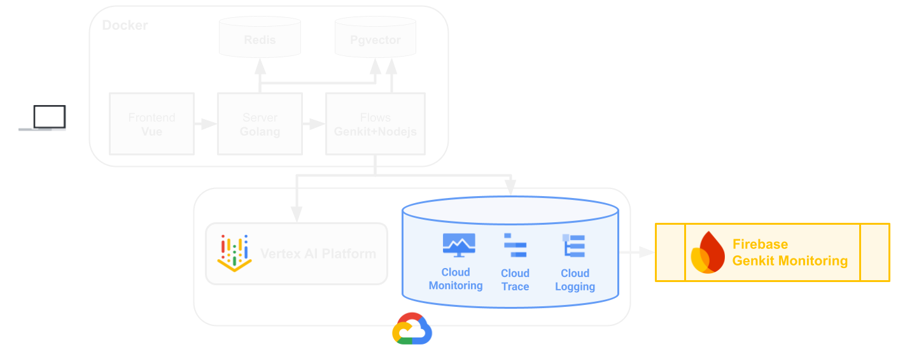

# Monitor GenAI apps with Firebase Genkit

## Introduction

Want to master the art of keeping Firebase Genkit LLM applications alive and thriving in the real world? This hackathon puts you in the driver's seat of production monitoring for Large Language Model (LLM) powered applications. Assuming the role of a Site Reliability Engineer (SRE) on a fictional Movie Guru app team, you will use Firebase Genkit Monitoring to tackle the critical challenges of ensuring LLMs perform flawlessly in production. You'll dive deep into troubleshooting live issues, optimizing performance bottlenecks, and guaranteeing a smooth user experience for a movie recommendation app.

Why is this crucial? Because in the age of AI, those who can effectively monitor and manage LLM applications in production are the ones who will build the future. The GenAI monitoring, debugging, and optimization skills you'll gain are universally applicable for a modern SRE and are transferable to a wide range of systems beyond Genkit Monitoring.

“GenAI App Development with Genkit” is a recommended pre-requisite.

## Learning Objectives

This is going to be an introduction to running apps on Cloud Run. We'll dive into various aspects of app development using cloud native tooling on GCP.

- Understand your GenAI app health in production.
- Troubleshoot different types of GenAI issues that might arise like model limitations, latency, etc
- Find and address issues associated with the quality of your generated content

## Challenges

- Challenge 1: Set up your environment and interact with the app
- Challenge 2: Explore Monitoring dashboard
- Challenge 3: Troubleshoot failures
- Challenge 4: Improve Performance
- Challenge 5: Improve search quality

## Contributors

Manasa Kandula Esther Lloyd Cleo Schneider Polina Govorkova

## Challenge 1: Set up your environment and interact with the app

### Introduction

Welcome to the Movie Guru team! In your role as a Site Reliability Engineer on this team, you will work through the challenges to ensure that the app is reliable and performant.
Your first task is to get the application running smoothly in your local environment. You'll set up your development environment using the Cloud Shell editor and interact with the initial version of the Movie Guru application, ensuring a stable starting point for the system.

### Firebase setup

To use Firebase Genkit and Genkit Monitoring, you'll need to set up a web app in Firebase.

- Go to the **Firebase Console** and create a new Firebase Web App in the *existing* project.

### Clone the Repository and set the environment variables

> **Note** Run this step on the computers of **all** your team mates.

- Open the **Cloud Shell Editor** and type the following commands.

```sh
git clone https://github.com/MKand/movie-guru.git
cd movie-guru
git checkout ghack-genkit-monitoring
```

### Cloud setup

The following script enables the required APIs, creates the necessary service account with roles, and uploads movie poster images to a GCP bucket on your behalf.

- Edit the **set_env_vars.sh** to replace *project_id*, and *firebase config* values.

- Run setup script.

    ```sh
    chmod +x setup_cloud.sh
    ./setup_cloud.sh
    ```

### Local Environment Setup

- Start the application services that run locally in a set of docker containers. This can take a few minutes as we are building many docker images for all the application containers (frontend, webserver, Genkit flows).

    ```sh
    chmod +x setup_local.sh
    ./setup_local.sh    
    source set_env_vars.sh
    docker compose up --build
    ```

- In the meantime, explore how the application operates by examining this architecture diagram and corelating it with the codebase contents.



- Open the *js/flows* folder within the codebase. Find where the application (1) establishes connection with the database, (2) configures Genkit, (3) defines prompts for interacting with the LLM.

### Test the app

- Once all the containers are running, access it by opening <http://localhost:8080> in your browser. If you are using the Cloud Shell editor, view the website by clicking on the **WebPreview** button on the top right of the editor and selecting port **8080**.

- Login using your name.

- Interact with the app and get your first movie recommendation. Then spend time getting to know the **Movie Guru** application by sending it different prompts.

> **Note** Please note that we are running this in the lab environment which makes the application a lot slower and more unpredictable due to the rate limits.

### Success Criteria

- Your local environment is set up in Cloud Shell.
- All your teammates have cloned the code repo into their own enviroments.
- You are able interact with the **Movie Guru** app running on your local Cloud Shell instance.

### Learning Resources

- [Genkit](https://firebase.google.com/docs/genkit)
- [Setting up firebase web app](https://firebase.google.com/docs/projects/use-firebase-with-existing-cloud-project#how-to-add-firebase_console)
- **MovieGuru Application Architecture**:

  - The user interface: A Vue frontend (code found in **frontend**).
  - The application logic layer: A GoLang backend server (code found in **chat_server_go**).
  - The GenAI core: Genkit flows, which handle the conversational and recommendation logic. These flows communicate directly with Gemini models on Vertex AI to leverage large language model capabilities (code found in **js/flows**).
  - Data Storage: PostgreSQL with the pgvector extension, used for storing both structured movie data (title, plot, etc.) and vector embeddings for semantic search.
  - Session Management: A Redis cache for storing user session information and conversation history.

## Challenge 2: Explore Monitoring dashboard

### Prerequisites

On the cloud shell environment running this challenge:


- *Local Environment Setup* from *Challenge 1*.

### Introduction

As SREs, maintaining the reliability and performance hinges hinges on having a clear and comprehensive understanding of its behavior in the live, production environment. In this challenge, you'll explore the Genkit monitoring dashboard. This will involve navigating its different sections, understanding the types of data it displays, and learning how to interpret the information presented. This foundational knowledge is crucial for effectively diagnosing and resolving issues in the subsequent challenges.

### Description

The Genkit monitoring dashboard provides essential insights into your application's performance and execution. This challenge asks you to explore the dashboard and achieve specific goals based on your discoveries.

Your **objective** is to explore the Genkit monitoring dashboard and understand application performance and execution.

- **Assess Overall Health**: Review key aggregate stability metrics across the project. Based on this high-level view, what potential areas look like they might need attention?
- **Deconstruct by Feature**: Identify individual GenAI *features* in the app. Examine their specific performance indicators (success rate, latency, etc.). Which features stand out as potential hotspots or areas for optimization?
- **Focus Critical Path**: Isolate the feature handling core user interactions (the main chat flow). Deeply analyze its metrics. How healthy is our primary user path, and where might bottlenecks exist?
- **Inspect Individual Requests**: Interact with the app to generate fresh traces. Select representative traces and examine their details. Examine a user interaction trace. Identify the specific GenAI steps performed (e.g., model calls, data retrieval) and their sequence?
- **Leverage Integrated Observability**: From detailed traces, access related logs and traces in *Google Cloud Logging* and *Google Cloud Trace*. Compare the depth and presentation of information. What additional context do these tools provide that helps pinpoint improvement areas?

### Success Criteria

- You are now familiar with key sections of Firebase Genkit Monitoring dashboard
- You know the different features that comprise the **Movie Guru** app and what they do.
- You know the different steps that the app takes to answer a user's query.
- You can correlate data in the monitoring dashboard with data in Cloud

### Learning Resources

- [Genkit Monitoring](https://firebase.google.com/docs/genkit/observability/getting-started)
- [Tracing](https://opentelemetry.io/docs/concepts/signals/traces/)
- [Observability on Google Cloud](https://cloud.google.com/stackdriver/docs)
- **Genkit Feature**

    In the context of Genkit monitoring and observability, a **feature** represents a distinct, identifiable functional component or capability within your Genkit application.

    These features serve as logical units for which performance metrics (such as request count, success rate, and latency) and execution traces are aggregated and displayed in the Genkit monitoring dashboard.

    Think of a feature as a specific task or workflow segment that you want to observe and analyze independently. Examples in an application could include:

  - Handling a specific type of user query (e.g., "Movie Search").
  - Executing a particular agentic step or tool use.
  - Processing a specific data loading or transformation task.

    By breaking down your application's execution into features, the monitoring dashboard allows you to quickly assess the health and performance of individual components.

## Challenge 3: Troubleshoot failures

### Prerequisites

On the cloud shell environment running this challenge:

- *Local Environment Setup* from *Challenge 1*.

### Introduction

Users are reporting that the **MovieGuru** app is experiencing issues: *User preferences aren't being saved*.

To see how preference saving is expected to work, watch this video:

[](https://youtu.be/l_KhN3RJ8qA)

### Description

While exploring stability metrics earlier, you might have observed a specific feature with a concerningly low success rate. This incident confirms users are experiencing problems potentially related to that instability.

Your task is to use the Genkit monitoring dashboard and the application code to pinpoint and resolve the root cause of these preference saving failures.

Follow these steps:

- Examine the failed traces for this feature. What do the error messages and trace details reveal?
- Identify commonalities among the failures. Hint: The **Failed Features** table can help reveal common error patterns.
- Determine the underlying cause of the failures based on your trace analysis by exploring the code for the **UserProfile flow**.

  - Find the hints in the code files *js/flows/src/userProfileFlow.ts* and *js/flows/src/userProfileTypes.ts*.
  - If you're really stuck, check the **Learning Resources** for more hints.
  
- Apply the necessary code fix and restart the application.
  
  - Stop the application.

    ```sh
    docker compose down
    ```
  
  - Restart the application after fixing it.
  
    ```sh
    docker compose up --build
    ```

### Success criteria

- You have idenfified the feature with the most failures.
- You understand the root case of these failures.
- You have implemented a fix, restarted the application.
- Queries such as "I love horror movies" ensure that "horror" is added to your preferences in the app.

### Learning resources

- [Prompts and dotPrompts](https://firebase.google.com/docs/genkit/dotprompt)
- [Input and Output schemas in genkit prompts](https://firebase.google.com/docs/genkit/dotprompt#schemas)
- [Input and Output schemas in genkit flows](https://firebase.google.com/docs/genkit/flows#input_and_output_schemas)

- **Prompts and Flows in Genkit**:
  
    A *flow* is the executable unit – it defines and orchestrates a sequence of steps (the process) and can contain multiple sub-steps like other flows, prompts, retrievers, tools, etc.

    A *prompt* is data – the input sent to an AI model plugin within a step of that flow, and the output received from the model in that step.

    So, you execute a flow, and within the flow's steps, prompts are used to interact with AI models. They differ because the flow is the action that runs, while the prompt is the content exchanged during a specific step involving an AI model.

    Both flows and prompts can have their own input and output data schemas.

- **Useful docker compose commands**
  - To build and run containers defined in a dockercompose.yaml file, use `docker compose up --build`. Find more info [here](https://docs.docker.com/compose/reference/up/).

  - To bring down running containers defined in a dockercompose.yaml file, use `docker compose down`. Find more info [here](https://docs.docker.com/compose/reference/down/).

- **Hints for finding the error cause**
  The error you're seeing is a *schema mismatch error*. This indicates a discrepancy between the data structure the *userProfileFlow* expects to receive from the model, and the structure the model is *actually* producing based on the prompt's (*userProfile.prompt*) instructions.

  The *userProfileFlow* uses the output schema definition found in *userProfileTypes.ts*. Compare the output schema defined in *userprofiletypes.ts* with the output specified in *userprofile.prompt*. Pay close attention to both the formal schema definitions of the prompt file and the *system instructions* given to the model in the prompt text.

  To fix the issue you can do one of the following:

  - Fix the prompt and add an output schema definition to the prompt (*userProfile.prompt*). OR
  - Upgrade the flow to use *userProfile.v2.prompt*.
  
  If you are unsure of the difference between a *flow* and a *prompt*, check out the section **Prompts and Flows in Genkit**.

## Challenge 4: Improve performance

### Prerequisites

On the cloud shell environment running this challenge:


- *Local Environment Setup* from *Challenge 1*.

### Introduction

You've fixed a major problem, but your work isn't done yet. Users are still complaining that the chat experience is slow. Let's fix this issue here.

### Description

Let's inspect the performance of the Movie Guru app using Firebase Genkit Monitoring.

- **Analyze Feature Latency**: Check P50 and P90 latency for the **chatFlow** feature. Interpret what these metrics indicate about typical and worst-case performance.
- **Inspect Trace Spans**: Inspect traces and analyze individual spans (stages) within the chatFlow. Identify the longest-running spans.
- **Pinpoint Bottlenecks**: Pinpoint which spans are the primary performance bottlenecks.
  - Hint: As you analyze span durations, look for any step that seems unusually slow compared to the simplicity of the task it performs.
- **Identify Optimization**: Identify one specific way to improve overall latency for the flow.
  - Hint: If you identified a disproportionately slow span for a simple task, consider if there is a way to speed it up with a small change.
- **Implement & Test**: Implement your optimization in the code. Use the **Genkit Developer UI** for local testing before you deploy the fixed app 

Follow the instructions to set up the developer UI.

- Navigate in the *terminal* to the *flows* folder.
- Run the following command

  ```sh
  npm install .
  npx genkit start -- npm run dev
  ```

- Navigate to <http://localhost:4000> (using the **WebPreview** feature of cloudshell).
- Implement your potential fix. Then, use the Genkit developer UI to run the flow locally and verify the change.
  
> **Note**: Changes made directly within the Genkit Developer UI (like editing model parameters for) are ephemeral for that test-run only and do not save back to your source code files, or effect the flows the use those prompts. Make your actual code changes in your code editor and restart the **Genkit Developer UI** and application.

### Success criteria

- You found a span that is much slower than its peers.
- You examined and tested out potential fixes using the **Genkit Developer UI**.
- You applied the fix in the code and redeployed the app.
- Interactions with the updated app are faster.

### Learning resources

- [Genkit Developer Tools and Developer UI](https://firebase.google.com/docs/genkit/devtools)
- [Gemini Models on VertexAI](https://cloud.google.com/vertex-ai/generative-ai/docs/models)

## Challenge 5: Improving search quality

### Prerequisites

On the cloud shell environment running this challenge:

- *Clone the Repository and set* the environment variables* from *Challenge 1*.
- Setup the **Genkit Developer UI**.

### Introduction

TThe **MovieGuru** team is evolving the app's search capabilities. To potentially reduce operational costs, we're moving towards a more streamlined approach. The current system utilizes a mixed search strategy, combining traditional keyword search with vector (semantic) search.

The new "V2" configuration switches to purely vector-based search.

As SREs, your task is to manage the rollout of this change, observe its effect on search quality, and investigate the underlying technical reasons for any observed degradation.

### Description

To isolate the effect of this change, you will perform controlled tests using the **Genkit Developer UI**.

- **Baseline Test (Mixed Search)**: In the **Genkit Developer UI**, navigate to the *chatFlow* flow.
  - Run the following queries and note down the results: "Show me movies with ratings greater than 3". And "Show me some funny films"."
- **Implement Search Switch**: Modify the application code to adopt the new search strategy.
  - Update the **MovieSearchPromptFlow** (defined in the **docRetriever.ts** file) to use the **v2** version of the **docSearch.prompt**, which implements the vector-only search logic.
- **Reload Genkit UI**: Restart the **Genkit Developer UI** to allow it to pick up the updated code changes.
- **Post-Change Test (Vector Search)**: In the **Genkit Developer UI**, re-run the two queries in the **chatFlow** flow.
- **Analyze Impact & Diagnose**: Compare the number of recommendations from your two test runs. Then, examine the traces generated in the **Genkit Developer UI** (focusing on the retriever output) and review the differences between the original and v2 prompt instructions to determine why the vector-only search impacted quality for *some* queries and not others.

### Success Criteria

- Successfully update the application code to use the new version of the search prompt.
- Observe and compare the search results from before and after implementing the change.
- Identify which types of queries result in degraded search quality after the switch and which remain unaffected.
- Articulate the technical reason behind the quality impact.
- Demonstrate to the **Product Team** the reason for the quality degradation by referencing specific differences observed in the monitoring traces.

### Learning Resources

- [Managing prompt versions](https://firebase.google.com/docs/genkit/dotprompt#prompt_variants)
- [Search Strategies](https://cloud.google.com/vertex-ai/docs/vector-search/about-hybrid-search#why-does-hybrid-search-matter)