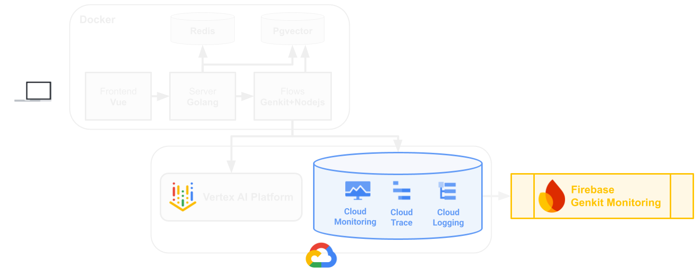

# Monitor GenAI apps with Firebase Genkit

## Introduction

Want to master the art of keeping Firebase Genkit LLM applications alive and thriving in the real world? This hackathon puts you in the driver's seat of production monitoring for Large Language Model (LLM) powered applications. Assuming the role of a Site Reliability Engineer (SRE) on a fictional Movie Guru app team, you will use Firebase Genkit Monitoring to tackle the critical challenges of ensuring LLMs perform flawlessly in production. You'll dive deep into troubleshooting live issues, optimizing performance bottlenecks, and guaranteeing a smooth user experience for a movie recommendation app.

Why is this crucial? Because in the age of AI, those who can effectively monitor and manage LLM applications in production are the ones who will build the future. The GenAI monitoring, debugging, and optimization skills you'll gain are universally applicable for a modern SRE and are transferable to a wide range of systems beyond Genkit Monitoring.

“GenAI App Development with Genkit” is a recommended pre-requisite.

## Learning Objectives

- Understand your GenAI app health in production.
- Troubleshoot different types of GenAI issues that might arise like model limitations, latency, etc
- Find and address issues associated with the quality of your generated content

## Challenges

- Challenge 1: Set up your environment
- Challenge 2: Explore Firebase Genkit Monitoring
- Challenge 3: Troubleshoot failures
- Challenge 4: Improve performance
- Challenge 5: Improve search quality

## Contributors

Manasa Kandula Esther Lloyd Cleo Schneider Polina Govorkova

## Challenge 1: Set up your environment

### Introduction

Welcome to the Movie Guru team! In your role as a Site Reliability Engineer on this team, you will work through the challenges to ensure that the app is reliable and performant.
Your first task is to get the application running smoothly in your local environment. You'll set up your development environment using the Cloud Shell editor and interact with the initial version of the Movie Guru application, ensuring a stable starting point for the system.

### Clone the Repository and set the environment variables

> **Note** Run this step on the computers of **all** your team mates.

- Open the **Cloud Shell Editor** and type the following commands.

```sh
git clone https://github.com/MKand/movie-guru.git
cd movie-guru
git checkout ghack-genkit-monitoring
```

### Firebase setup

To use Firebase Genkit and Genkit Monitoring, you'll need to set up a web app in Firebase.

- Go to the **Firebase Console** and create a new Firebase Web App in the _existing_ project.
- Edit the **set_env_vars.sh** to replace _PROJECT_ID, _FIREBASE_API_KEY, and _FIREBASE_APP_ID_ values.

### Local Environment Setup

- Start the application

  > **Note**: This script will need to be run by each person if sharing with a group.

  ```sh
  chmod +x start_app.sh

  # This step takes several minutes to spin up all docker
  # images for the application containers (frontend, webserver,
  # and Genkit flows).
  ./start_app.sh
  ```

- While waiting for services to start, explore the application architecture and connect it to what you see in the codebase.



- Open the _js/flows_ folder within the codebase. Find where the application -

  1. Establishes connection with the database
  1. Configures Genkit.
  1. Defines prompts for interacting with the LLM.

### Test the app

- Access the Movie Guru app on <http://localhost:8080> by clicking the **Web Preview** button on the top right of the Cloud Shell window and selecting "Preview on port 8080". The icon for Web Preview looks like the following.

  

- Login using your name.
- Get to know the **Movie Guru** application by chatting with it.

### Success Criteria

- Your cloud environment is set up with the correct service accounts and credentials.
- Your local environment is set up in Cloud Shell for all group members.
- You are able interact with the **Movie Guru** app running on your local Cloud Shell instance.

### Learning Resources

- [Genkit](https://firebase.google.com/docs/genkit)
- [Setting up firebase web app](https://firebase.google.com/docs/projects/use-firebase-with-existing-cloud-project#how-to-add-firebase_console)
- **MovieGuru Application Architecture**:

  - The user interface: A Vue frontend (code found in **frontend**).
  - The application logic layer: A GoLang backend server (code found in **chat_server_go**).
  - The GenAI core: Genkit flows, which handle the conversational and recommendation logic. These flows communicate directly with Gemini models on Vertex AI to leverage large language model capabilities (code found in **js/flows**).
  - Data Storage: PostgreSQL with the pgvector extension, used for storing both structured movie data (title, plot, etc.) and vector embeddings for semantic search.
  - Session Management: A Redis cache for storing user session information and conversation history.

  > **Hint**: You can find the firebase config values in the `Project Settings` page by clicking the settings cog next to `Project Overview` in the left-hand nav of the firebase console.

  > **Hint**: The Movie Guru App uses [dotprompt](https://firebase.google.com/docs/genkit/dotprompt#creating_prompt_files) to manage its prompt variants.

  > **Hint**: The Movie Guru app uses [flows](https://firebase.google.com/docs/genkit/flows) to encapsulate AI workflows.

## Challenge 2: Explore Firebase Genkit Monitoring

### Prerequisites

You are running the application in Cloud Shell by completing _Local Environment Setup_ from _Challenge 1_.

### Introduction

As SREs, maintaining the reliability and performance of your application hinges on having tooling to give you visibility into the behavior of a live, production environment.

In this challenge, you'll explore Firebase Genkit Monitoring to understand the reliability and performance of the Movie Guru app by navigating to different sections, understanding the types of data each of them displays, and learning how to interpret the information presented. This foundational knowledge is crucial for effectively diagnosing and resolving issues in the subsequent challenges.

### Description

Explore the Firebase Genkit Monitoring and understand the application's performance and execution. Navigate to the Genkit monitoring dashboard by selecting "Genkit" in the left-side panel under "AI" product categoty.

1. **Assess overall health**: Based on this high-level view, what potential areas look like they might need attention?
1. **Inspect by feature**: Identify individual GenAI _features_ in the app.
1. **Find the critical path**: Isolate the feature that handles core user interactions. Analyze its metrics.
   - How healthy is this feature?
   - Where might bottlenecks exist?
1. **Inspect individual requests**: Interact with the app to generate a fresh trace.
   - Find the specific trace for this new interaction.
   - Identify the specific steps that were performed to respond to a user (e.g., model calls, data retrieval). Where is the code for each step?
1. **Leverage integrated observability**: From the trace details, use the tri-dot menu to access related logs and traces in _Google Cloud Logging_ and _Google Cloud Trace_.
   - What additional context do these tools provide?

### Success Criteria

- You are now familiar with key sections of Firebase Genkit Monitoring dashboard
- You know the different features that comprise the **Movie Guru** app and what they do.
- You know the different steps that the app takes to answer a user's query.
- You can correlate data in the monitoring dashboard with data in Cloud

### Learning Resources

- [Genkit Monitoring](https://firebase.google.com/docs/genkit/observability/getting-started)
- [Tracing](https://opentelemetry.io/docs/concepts/signals/traces/)
- [Observability on Google Cloud](https://cloud.google.com/stackdriver/docs)
- **Genkit Feature**

  In the context of Genkit monitoring and observability, a **feature** represents a distinct, identifiable functional component or capability within your Genkit application.

  These features serve as logical units for which performance metrics (such as request count, success rate, and latency) and execution traces are aggregated and displayed in the Genkit monitoring dashboard.

  Think of a feature as a specific task or workflow segment that you want to observe and analyze independently. Examples in an application could include:

  - Handling a specific type of user query (e.g., "Movie Search").
  - Executing a particular agentic step or tool use.
  - Processing a specific data loading or transformation task.

    By breaking down your application's execution into features, the monitoring dashboard allows you to quickly assess the health and performance of individual components.

## Challenge 3: Troubleshoot failures

### Prerequisites

You are running the application in Cloud Shell by completing _Local Environment Setup_ from _Challenge 1_.

### Introduction

The Movie Guru team just released a new version of the app, and since that release, we have gotten several customer reports that the **MovieGuru** app is experiencing issues. In particular, _user preferences aren't being saved_ (eg: "I love horror movies", "I hate drama films etc").

To see how preference saving is expected to work, watch this video:

[](https://youtu.be/l_KhN3RJ8qA)

### Description

Your task is to use Firebase Genkit Monitoring and the application code to pinpoint and resolve the root cause of these preference saving failures.

1. Identify the feature and corresponding Genkit flow that is responsible for handling user preference updates.
1. Examine the failed traces for this feature and identify common patterns. What do the error messages and trace details reveal?
1. Determine the underlying cause of the failures based on your trace analysis by exploring the code for the feature you identified.
   - Find the hints in the code files _js/flows/src/userPreferenceFlow.ts_ and _js/flows/src/userPreferenceTypes.ts_.
   - If you're _really_ stuck, check the **Learning Resources** for more hints.
1. Apply the necessary code fix and restart the application.

   - Stop the application. Press Ctrl+C to stop the running containers in the terminal where they are running.

     ```sh
     # Optional: Required if first time running the script
     chmod +x stop_app.sh

     ./stop_app.sh
     ```

   - Restart the application after fixing it.

     ```sh
     # Optional: Required if first time running the script
     chmod +x start_app.sh

     ./start_app.sh
     ```

### Success criteria

- You have idenfified the feature with the most failures.
- You understand the root case of these failures.
- You have implemented a fix and restarted the application.
- Queries such as "I love horror movies" consistently adds "horror" to your preferences in the app.

### Learning resources

- [Prompts and dotPrompts](https://firebase.google.com/docs/genkit/dotprompt)
- [Input and Output schemas in genkit prompts](https://firebase.google.com/docs/genkit/dotprompt#schemas)
- [Input and Output schemas in genkit flows](https://firebase.google.com/docs/genkit/flows#input_and_output_schemas)

- **Prompts and Flows in Genkit**:

  A _flow_ is the executable unit – it defines and orchestrates a sequence of steps (the process) and can contain multiple sub-steps like other flows, prompts, retrievers, tools, etc.

  A _prompt_ is data – the input sent to an AI model plugin within a step of that flow, and the output received from the model in that step.

  So, you execute a flow, and within the flow's steps, prompts are used to interact with AI models. They differ because the flow is the action that runs, while the prompt is the content exchanged during a specific step involving an AI model.

  Both flows and prompts can have their own input and output data schemas.

- **Useful docker compose commands**

  The application runs inside docker containers. The start_app.sh and stop_app.sh scripts wrap docker compose commands (and other boilerplate code):

  - To build and run containers defined in a dockercompose.yaml file, use `docker compose up --build`. Find more info [here](https://docs.docker.com/compose/reference/up/).

  - To bring down running containers defined in a dockercompose.yaml file, use `docker compose down`. Find more info [here](https://docs.docker.com/compose/reference/down/).

- **Hints for finding the error cause**
  We introduced a regression in this release.
  The error you're seeing is a _schema mismatch error_. This indicates a discrepancy between the data structure the _userPreferenceFlow_ expects to receive from the model, and the structure the model is _actually_ producing based on the prompt's (_userPreference.prompt_) instructions.

The error you're seeing is a _schema mismatch error_. This indicates a discrepancy between the data structure the _userPreferenceFlow_ expects to receive from the model, and the structure the model is _actually_ producing based on the prompt's (_userPreference.prompt_) instructions.

  The _UserPreferenceFlow_ uses the output schema definition found in _userProfileTypes.ts_. Compare the output schema defined in _UserPreferenceTypes.ts_ with the output specified in _userPreference.prompt_ and its variants. Pay close attention to both the format schema definitions of the prompt file and the _system instructions_ given to the model in the prompt text.

  To fix the issue, you can do one of the following:

  1. Fix the prompt and add an output schema definition to the prompt (_userProfile.v2.prompt_).
  1. **OR**, Downgrade the flow to use _userProfile.prompt_.

  If you are unsure of the difference between a _flow_ and a _prompt_, check out the section **Prompts and Flows in Genkit**.
  
  > **Hint**: The **Failed paths** table can help reveal common error patterns.

## Challenge 4: Improve performance

### Prerequisites

You are running the application in Cloud Shell by completing _Local Environment Setup_ from _Challenge 1_.

### Introduction

You've fixed a major problem, but your work isn't done yet. Users are complaining that the chat experience is slow. Let's see if we can find the root cause of this issue.

### Description

Inspect the performance of the **MovieGuru** app using **Firebase Genkit Monitoring**.

1. **Analyze feature latency**: Check P50 and P90 latency for the **chatFlow** feature. Interpret what these metrics indicate about typical and worst-case performance.
1. **Inspect trace spans**: Inspect traces and analyze individual spans (stages) within the chatFlow. Identify the longest-running spans.
1. **Pinpoint bottlenecks**: Pinpoint which spans are the primary performance bottlenecks.
1. **Optimize**: Identify one specific way to improve overall latency for the flow.
   - Model interactions usually will take the bulk of execution time and bigger models will take longer to respond. How long are we spending waiting for the model and what models are we using?
1. **Implement & Test**: Implement your optimization in the code and restart your app.
   > Extra: Genkit provides local tooling called the Developer UI to help you iterate on prompts and flows more quickly. See the learning resources below to give it a try.

### Success criteria

- You found a span that is much slower than its peers.
- You examined and tested out potential fixes (maybe using the **Genkit Developer UI**).
- You applied the fix in the code and redeployed the app.
- Interactions with the updated app are faster.

### Learning resources

- [Genkit Developer Tools and Developer UI](https://firebase.google.com/docs/genkit/devtools)
- [Gemini Models on VertexAI](https://cloud.google.com/vertex-ai/generative-ai/docs/models)
- **Genkit Developer UI**: Testing locally with the Genkit Developer UI can help you iterate more quickly on prompts and flows. If you want to set this up, follow the instructions below:

  - Navigate in the _terminal_ to the _flows_ folder.
  - Run the following command

    ```sh
    cd movie-guru/js/flows
    npm install .
    npx genkit start -- npm run dev
    ```

  - Navigate to <http://localhost:4000> (using the **WebPreview** feature of cloudshell).
  - Change the code. Then, use the Genkit developer UI to run the flow locally and verify the change.

> **Hint**: As you analyze span durations, look for any step that seems unusually slow compared to the simplicity of the task it performs.

> **Note**: Changes made directly within the Genkit Developer UI (like editing model parameters for) are ephemeral for that test-run only and do not save back to your source code files, or effect the flows the use those prompts. Make your actual code changes in your code editor and restart the **Genkit Developer UI** and application.

## Challenge 5: Improve search quality

### Prerequisites

On the cloud shell environment running this challenge:

- _Local Environment Setup_ from _Challenge 1_.
- (Optional) Setup the **Genkit Developer UI** in _Challenge 4_.

### Introduction

The **MovieGuru** Product team is evolving the app's search capabilities. To potentially reduce operational costs, we're moving towards a more streamlined approach. The current system utilizes a mixed search strategy, combining traditional keyword search with vector (semantic) search.

The new "V2" configuration switches to purely vector-based search.

### Description

Your task is to manage the rollout of this change, observe its effect on search quality, and investigate the underlying technical reasons for any observed degradation in performance.

> Note: If using the **Genkit Developer UI**, navigate to the _chatFlow_ in the flows section of the left nav.

#### Find the relevant code

**chatFlow** uses several other flows to create a complex AI workflow.

- Where does document search happen in the **chatFlow**?
- Where are the results of that document search used?
- Find the corresponding code.

#### Perform comparative analysis

Now you are ready to do some comparative analysis of the existing version and the new version of the prompt.

1. **Baseline Test (Mixed Search)**: Establish baseline performance for the existing mixed search by running the following queries and note down the results:
   - "Show me movies with ratings greater than 3"
   - "Show me movies that are shorter than 2 hours"
   - "Show me some funny films"
   - "Show me some movies with dogs in them"
1. **Examine retrieval performance**: How many movies were returned and used as context in the input to the model call?
1. **Implement Search Switch and restart the app**: Modify the application code to adopt the new search strategy.
   - Update the **DocSearchFlow** (defined in the **docRetriever.ts** file) to use the **v2** version of the **docSearch.prompt**, which implements the vector-only search logic.
   - Restart the app (or the **Genkit Developer UI**) to allow it to pick up the updated code changes.
1. **Post-Change Test (Vector Search)**: Re-run the test queries above and note down the results.
1. **Analyze Impact & Diagnose**: Compare the results of the two tests and their traces.
   - Review the differences between the prompt instructions to better understand what the LLM is being asked.
   - Determine why the vector-only search impacted quality for _some_ queries and not others.
1. **Make a recommendation**: Form a recommendation for the product team as to whether we should roll out this change or stick with the current mixed search.

### Success Criteria

- You successfully update the application code to use the new variant of the search prompt.
- You can compare the quality and performance before and after making a change to the prompt.
- You identified which types of queries resulted in degraded search quality and can articulate the likely cause.
- You have evidence for the **Product Team** to support or nor support rolling out the change in prompt variant.

### Learning Resources

- [Managing prompt versions](https://firebase.google.com/docs/genkit/dotprompt#prompt_variants)
- [Search Strategies](https://cloud.google.com/vertex-ai/docs/vector-search/about-hybrid-search#why-does-hybrid-search-matter)

 > **Hint**: focus on the **docSearchFlow** > **Hint**: to see the documents that are relevant in the Firebase Genkit Monitoring trace viewer, look at the input in the model interaction of **movieQAFlow**.
 