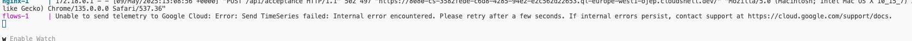
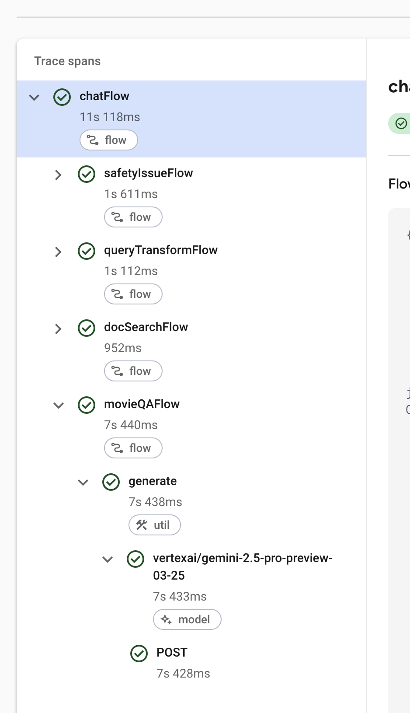

# Monitor GenAI apps with Firebase Genkit

## Introduction

Welcome to the coach's guide for Monitor GenAI apps with Firebase Genkit. Here you will find links to specific guidance for coaches for each of the challenges.

> **Note** If you are a gHacks participant, this is the answer guide. Don't cheat yourself by looking at this guide during the hack!

## Coach's Guides

- Challenge 1: Set up your environment and interact with the app
- Challenge 2: Explore Monitoring dashboard
- Challenge 3: Troubleshoot failures
- Challenge 4: Improve performance
- Challenge 5: Improve search quality

## Suggested Hack Agenda

- Day 1
  - Challenge 1 (~10 minutes)
  - Challenge 2 (~20 minutes)
  - Challenge 3 (~30 minutes)
  - Challenge 4 (~30 minutes)
  - Challenge 5 (~20 minutes)

## Challenge 1: Set up your environment and interact with the app

### Notes & Guidance

This goal of this challenge is to set up the app locally and test it out.

All studetns should execute the step **Clone the Repository and set the environment variables** in their own Cloud accounts.

There are couple of points where students may ask for your guidance:

1. After cloning the repo, ensure Google Cloud credentials are set up correctly in each student's environment. The credentials are specified within `key.json` (this is configured by the `setup_local.sh` script).
1. Please be aware that the application's performance may be slow, particularly within the Quicklab environment. We recommend that users do not concurrently interact with the same app.
1. If you encounter issues such as no response or an extremely slow response, please try submitting the query again.
1. Movie suggestions are _intentionally_ not saved. This functionality will be fixed in Challenge 2.

## Challenge 2: Exploring Monitoring dashboard

### Notes & Guidance

In this challenge, users will use the Firebase Genkit monitoring dashboard to understand the reliability and performance of the Movie Guru app.

To access the dashboard:

1. Go to the [Firebase console](https://console.firebase.google.com/).
1. Select your Qwiklab project.
1. In the left-side panel, under **Product categories**, click on **AI**.
1. Select the **Genkit** tab.

Here's an example of where to find it:


Once the metrics start trickling in, the dashboard should look similar to this:


> **Warning** Until the metrics come in, the **Genkit Monitoring** page might show zero state like this:
> 
>
> Don't panic. Give it a few minutes and then refresh.

> **Warning** If even after 5 minutes there are no traces, check the docker compose log for the following error:
> 
>
> Then navigate to js/flows/src/genkitConfig.ts and update remove the settings for
> **metricExportIntervalMillis** and **metricExportTimeoutMillis** in the **enableFirebaseTelemetry**
> section of the code and restart the app.

The following points correspond to the exploration steps in the challenge description:

**1. Assess overall health:**
The main dashboard displays three project-level metrics:

- **Requests**: Total number of invocations.
- **Success Rate**: Percentage of successful invocations.
- **Latency**: Time taken for invocations (e.g., P50, P90).

The **Success Rate** chart might highlight that a specific feature (e.g., `userPreferenceFlow`) has a notably low success rate, indicating an area needing attention.

**2. Inspect by feature:**
The dashboard lists several Genkit _features_. The exact list might vary based on app interaction during Challenge 1, but typically includes:

- `chatFlow`
- `docSearchFlow`
- `userPreferenceFlow`
- `qualityFlow`

While `chatFlow` is central to user interaction, all listed features are important to monitor. In Genkit, a "feature" acts as a monitoring scope, meaning each independently invoked Genkit flow (orchestration) appears as a distinct feature.

**3. Find the critical path (chatFlow):**
The `chatFlow` feature handles the core user interactions. Clicking on this feature in the dashboard will display its specific metrics, such as its own request count, success rate, and latency distribution.
!chatFlow specific dashboard

**4. Inspect individual requests (traces):**
Individual traces offer a detailed breakdown of a single flow's execution. For example, when a user requests movie recommendations, a trace for `chatFlow` might include these steps (spans):

- `safetyIssueFlow`
- `queryTransformFlow`
- `docSearchFlow` (this span will be absent if no document search was needed for the query)
- `movieQAFlow`

Each step (span) within the trace displays its individual latency, helping to pinpoint bottlenecks.
!Example of a chatFlow trace with spans

**5. Leverage integrated observability:**
By clicking the tri-dot menu (⋮) next to any trace or a specific span within a trace, users can directly navigate to:

- **Google Cloud Logging**: To view detailed logs associated with that execution.
- **Google Cloud Trace**: To see a distributed trace view, which can be helpful for understanding interactions across multiple services if applicable.
These integrations provide deeper context for troubleshooting.

## Challenge 3: Troubleshoot failures

### Notes & Guidance

In this challenge we see that the **MovieGuru** app doesn't always store the user's strong preferences when they express it (eg: I love horror movies, I hate drama films etc).

To see how preference saving is expected to work, watch this video:

[](https://youtu.be/l_KhN3RJ8qA)

1. The participants should interact with the app to make sure the monitoring tool captures the (silent) error. Have the users try this out a few times by trying various statements (the error is sporadic, so sometimes the preferences may be captured correctly, sometimes not). Then, the users should inspect the monitoring dashboard, looking for features with **low success rate**. Even if they haven't identified it already via Step 1 of Challenge 2, by now the participants should see that userPreferenceFlow is failing a lot. The flow is defined in  _js/flows/src/userPreferenceFlow.ts_.

1. Participants should find a failed trace for this feature and inspect the output. They can use the **Failed paths** table (aggregates failures of the same nature within a feature) to understand the impact and help filter to failing traces. Alternatively, they could filter to failed traces directly and compare trace outputs. They would notice that failed traces have the same error message in the output. The dashboard should look like the following:


Clicking on a individual failed trace shows more details about the error in the trace viewer:


```text
ZodError: [
  {
    "code": "unrecognized_keys",
    "keys": [
      "justification",
      "safetyIssue",
      "items"
    ],
    "path": [],
    "message": "Unrecognized key(s) in object: 'justification', 'safetyIssue', 'items'"
  }
]
```

1. The error is a _type mismatch error_. This indicates a discrepancy between the data structure the _userPreferenceFlow_ expects to receive from the model, and the structure the model is _actually_ producing based on the prompt's instructions.

1. The app currently uses a canary strategy for this flow and switches between a stable prompt (_userProfile.prompt_) and an experimental prompt (_userPreference.experimental.prompt_). This experimental prompt has an error as it provides conficting information. In the prompt text, it asks the model to return a list of items of type **string**, while the flow expects a list of items of type **profileChangeRecommendations**. Also the fields **justification** and **safetyIssue** are expected to be nested properties in the **modelOutputMetadata** field and are not expected to be present in the root of the object.

  To fix the issue, the participants can do one of the following:

- Fix the prompt and add an output schema definition to the prompt (_userPreference.experimental.prompt_).

    ```text
    ---
    model: vertexai/gemini-2.0-flash
    config:
      safetySettings:
        - category: HARM_CATEGORY_HARASSMENT
          threshold: BLOCK_MEDIUM_AND_ABOVE
        - category: HARM_CATEGORY_HATE_SPEECH
          threshold: BLOCK_MEDIUM_AND_ABOVE
        - category: HARM_CATEGORY_SEXUALLY_EXPLICIT
          threshold: BLOCK_ONLY_HIGH
        - category: HARM_CATEGORY_DANGEROUS_CONTENT
          threshold: BLOCK_NONE
    input:
      schema: UserPreferenceFlowInputSchema
    ---

    {{ role "system" }}

    You are a user's movie profiling expert focused on uncovering users' enduring likes and dislikes. 

    Your task is to analyze the user message and extract ONLY strongly expressed, enduring likes and dislikes related to movies.

    Once you extract any new likes or dislikes from the current query respond with the items you extracted with:
        1. the item value
        2. your reason behind the choice
      
    Guidelines:
    1. There are some examples given below. Do not take the examples literally, but use them to create a general method for parsing the input and constructing the right output.
    2. Medium to Strong likes and dislikes: Add or Remove ONLY items expressed with medium to strong language indicating enjoyment or aversion.
    3. Distinguish current state of mind vs. Enduring likes and dislikes:  Be very cautious when interpreting statements. Focus only on long-term likes or dislikes while ignoring current state of mind. If the user expresses wanting to watch a specific type of movie or actor NOW, do NOT assume it's an enduring like unless they explicitly state it. For example, "I want to watch a horror movie movie with Christina Appelgate" is a current desire, NOT an enduring preference for horror movies or Christina Appelgate.
    4. Only persist likes and dislikes that pertain to the user (e.g. "I love", "I hate", "enjoyable for me"). Ignore statements that are made about other people (e.g. "my brother loves", "my friend hates")
    5. Focus on Specifics:  Look for concrete details about genres, directors, actors, plots, or other movie aspects.
    6. Give an explanation as to why you made the choice.

    Respond with the following:

      *   a *justification* about why you created the query this way.
      *   a *safetyIssue* returned as true if the query is considered dangerous. A query is considered dangerous if the user is asking you to tell about something dangerous. However, asking for movies with dangerous themes is not considered dangerous.
      *   a list of *items* that the user expresses strong likes or dislikes.

    {{ role "user" }}

    * Optional Message 0 from agent: {{agentMessage}}
    * user message: {{query}}
    ```

- OR: Downgrade the flow to use only _userPreference.prompt_.

  ```ts
  // Partial code
  async (input) => {
      const defaultOutput = UserPreferenceFlowOutputSchema.parse({})
      try {
        var output: UserPreferenceFlowOutput;
          console.info("Routing request to default userPreference query.");
          const response = await extractUserPreferencesV1({ 
            query: input.query, 
            agentMessage: input.agentMessage });
          output = UserPreferenceFlowOutputSchema.parse(response.output)
        return output
      } catch (error) {...
  ```

Then the application needs to be restarted.

## Challenge 4: Improve performance

### Notes & Guidance

In this challenge we see that the **MovieGuru** app's performance is quite slow and work on improving it.

The participants should look at the latency chart for **chatFlow**. P50, also known as the median, represents the response time below which 50% of requests are completed. P90 indicates the response time below which 90% of requests are completed. Participants will likely notice that both their P50 and P90 latency are _really_ high, meaning that the experience is consistently slow for all users. Using an app with such a high latency can be very frustrating and should be improved.

Upon inspecting individual traces with high latency in the trace viewer, participants will see that the bulk of execution time is spen on the model interactions, specifically the ones that include the usage of the gemini-2.5-pro-preview-03-25 model. While newer and "bigger" models can boost the quality of the output, there is a tradeoff between the size of the model and the latency of the interaction. Participants should inspect the codebase to understand where and how this model is being used.



**gemini-2.5-pro-preview-03-25** is used in the _movie.v2.prompt_ file, which is used in the **movieQAFlow**. Participants may further explore that chatFlow uses movieFlow to take the original user input, user preferences, relevant documents, and conversation history to make the final recommendation to the user.

Currently app uses _movie.v2.prompt_, which is a variant of the movie.prompt for making movie recommendations. _movie.v2.prompt_ is using **gemini-2.5-pro-preview-03-25**, while the original movie.prompt is defined with **gemini-2.0-flash-lite**, a much lighter and faster version. Considering poor performance of the v2 variant, the participants should roll back the prompt update by setting the prompt in the _movieFlow.ts_ file as follows:

```ts
  export const makeMovieRecommendation = ai.prompt('movie'); # will use movie.prompt
```

> **Note** Participants may attempt to manually override model in the prompt file directly. It will not result in a good model response. Every model interacts uniquely, and updating a model typically also requires adjustments to the prompting. Participants may explore the difference in the prompt definitions between movie.v2.prompt and movie.prompt driven by the model change.

## Challenge 5: Improve performance

### Notes & Guidance

In this challenge, we simulate that the product team has decided to reduce operational costs of the app by switching from a _hybrid search_ strategy to a to purely _vector-based_ search within **chatFlow**. Participants (acting as SREs) should notice the impact of the change and make recommendations as to either keep the change or roll it back.

Participants should examine _docSearch.prompt_ and _docSearch.v2.prompt_ files to understand what role docSearch plays chatFlow. DocSearchFlow and its corresponding prompt are used to analyze user's query, and convert it to a query that is then passed to the the database. After the results are returned from the database, the MovieQAFlow then takes these movies and uses them to craft a response to the user (RAG).

In the original version, the app used a **hybrid search model** where queries could either be **vector** queries (eg: I want to watch a fun movie -> **fun movies**), or **keyword** queries (eg: find me movies that were released after 2000 -> **WHERE release_year > 2000**), or mixed queries (eg: Find me fun movies that were released after 2000).

In the new version, all queries are forced to be **vector** queries.

After evaluating existing functionality by querying the app, participants should roll out the **new** version by updating the _docRetriever.ts_ file to use the new prompt variant:

```ts
  export const makeMovieRecommendation = ai.prompt('docSearch', {variant: 'v2'});
```

After testing the new version, the participants should notice that the app's vector search functionality works best with **genre**-based (semantic) queries, which leverages its vector search capabilities to find relevant recommendations efficiently. Queries based on specific values, such as **ratings** (are not semantic) are less suited for this vector approach. For any query, the _retriever_ fetches potential results. However, with **rating** queries, the vector search often retrieves many irrelevant movies that are then filtered out by the _MovieQAFlow_ before being returned to the user. This is why there are fewer **rating** based results than **genre** based results. The students only need to notice that there are fewer **rating**-based results than **genre**-based results.

Participants recommend to the Product team that they should roll back to the original version because transitioning purely to the vector-based search significantly impedes the quality of the results returned by the app and will likely impact user experience.
