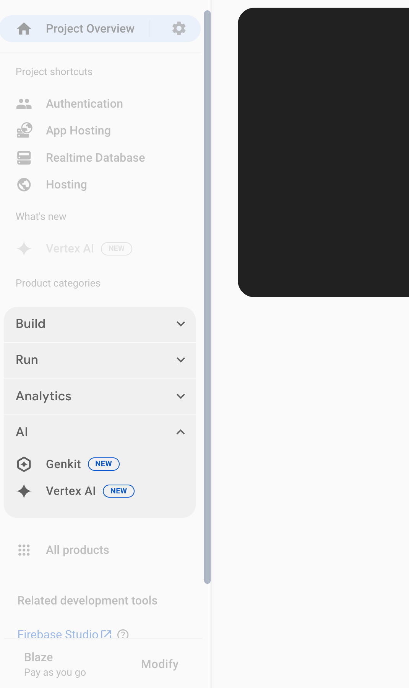
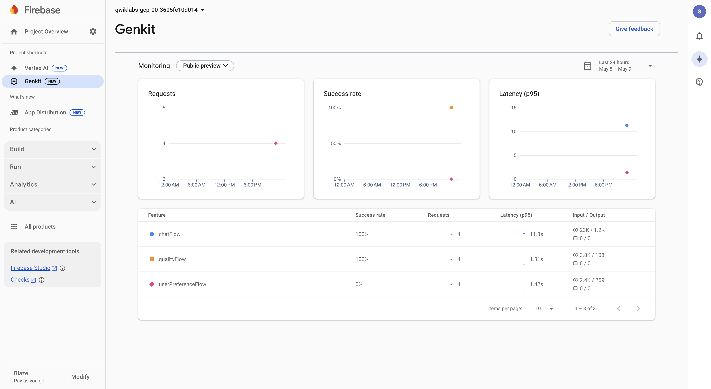
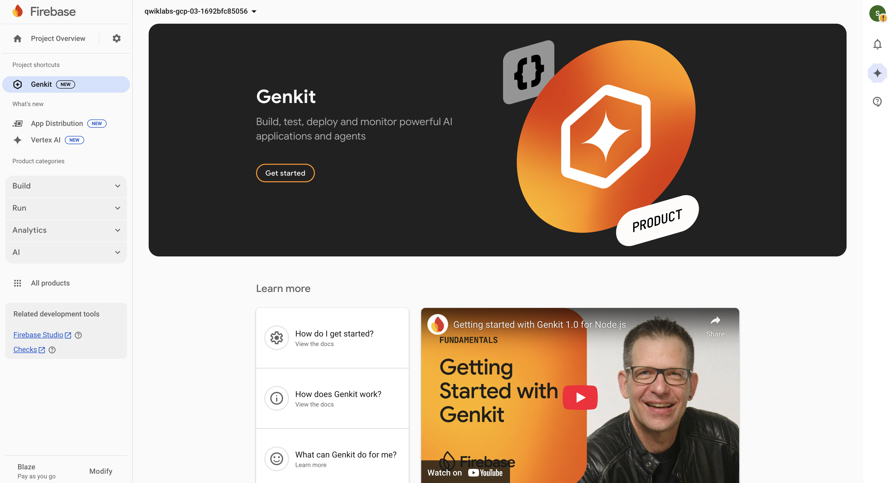
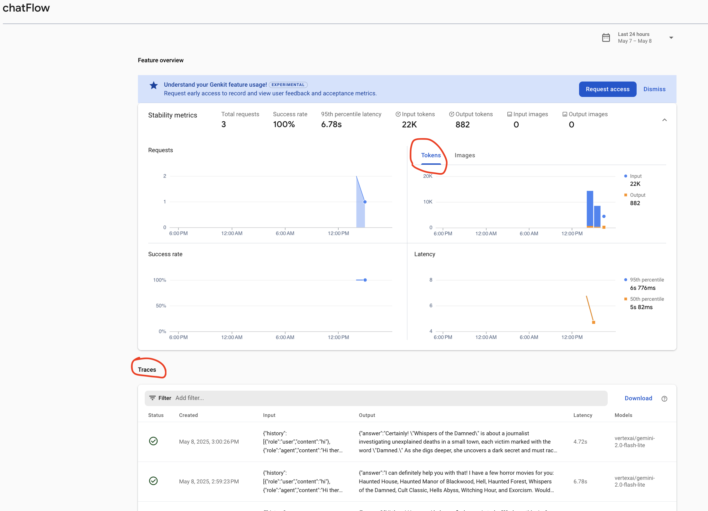
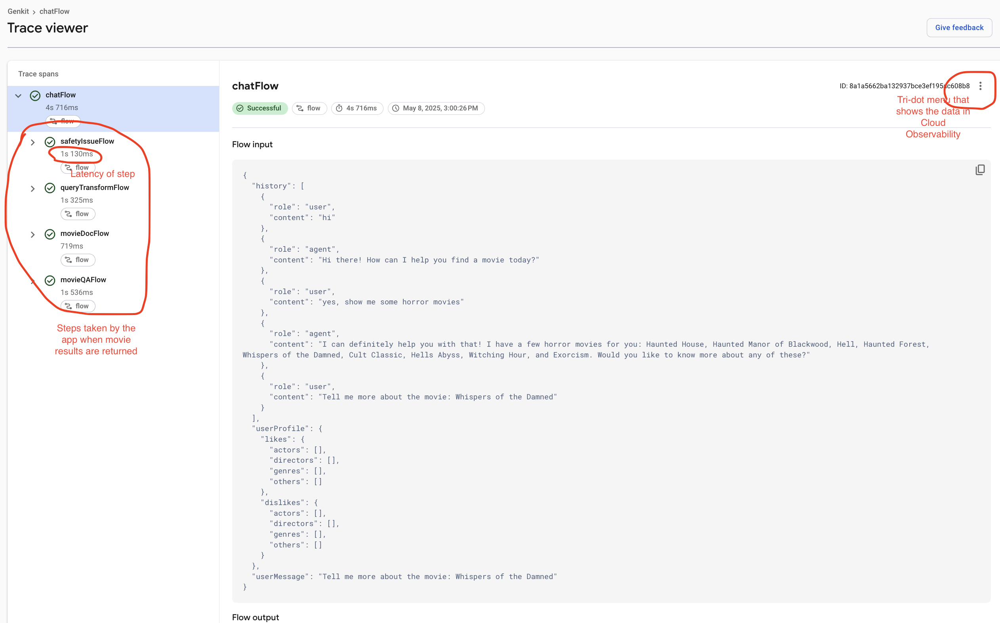
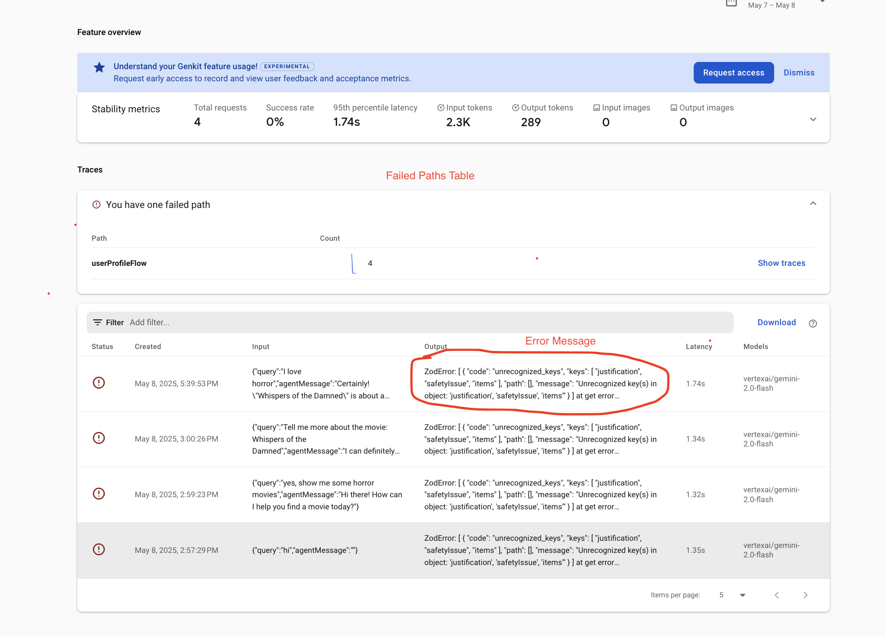
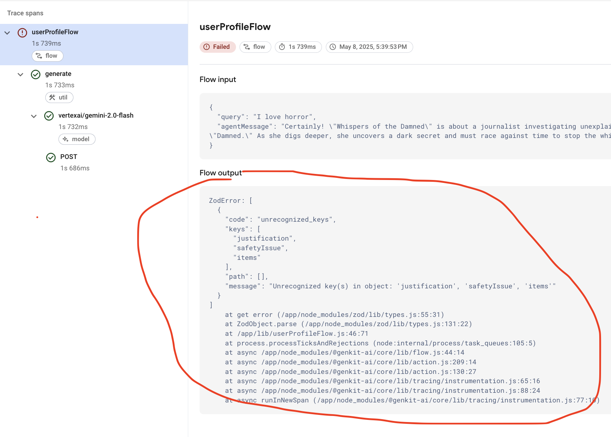

# Genkit AI Monitoring

## Introduction

Welcome to the coach's guide for The IoT Hack of the Century gHack. Here you will find links to specific guidance for coaches for each of the challenges.

> **Note** If you are a gHacks participant, this is the answer guide. Don't cheat yourself by looking at this guide during the hack!

## Coach's Guides

- Challenge 1: Set up your environment and interact with the app
- Challenge 2: Explore Monitoring dashboard
- Challenge 3: Troubleshoot failures
- Challenge 4: Improve performance
- Challenge 5: Improve search quality

## Suggested Hack Agenda

- Day 1
  - Challenge 1 (~20 minutes)
  - Challenge 2 (~20 minutes)
  - Challenge 3 (~30 minutes)
  - Challenge 4 (~30 minutes)
  - Challenge 5 (~20 minutes)

## Challenge 1: Set up your environment and interact with the app

### Notes & Guidance

This goal of this challenge is to set up the app locally and test it out.

All studetns should execute the step **Clone the Repository and set the environment variables** in their own Cloud accounts.

There are couple of points where students may ask for your guidance:

1. After cloning the repo, ensure Google Cloud credentials are set up correctly in each student's environment. The credentials are specified within `key.json` (this is configured by the `setup_local.sh` script).
1. Please be aware that the application's performance may be slow, particularly within the Quicklab environment. We recommend that users do not concurrently interact with the same app.
1. If you encounter issues such as no response or an extremely slow response, please try submitting the query again.
1. Movie suggestions are _intentionally_ not saved. This functionality will be fixed in Challenge 2. 
1. The app's vector search functionality works best with *genre*-based (semantic) queries, which leverages its vector search capabilities to find relevant recommendations efficiently. Queries based on specific *ratings* (are not semantic) are less suited for this vector approach. For any query, the *retriever* fetches potential results. However, with *rating* queries, the vector search often retrieves many irrelevant movies that must then be filtered out by the RAG portion of the application before being displayed. This is why there are fewer *rating* based results. The students only need to notice that there are fewer *rating*-based results than *genre*-based results. They will understand the reason behind this in a later challenge.

## Challenge 2: Exploring Monitoring dashboard

### Notes & Guidance

In this challenge, users will use Firebase Genkit Monitoring to understand the reliability and performance of the app.

The dashboard can be found in the [Firebase console](https://console.firebase.google.com/) by navigating to:
Your Qwiklab project > **Product categories** (left-side panel) > **AI** > **Genkit** tab.

Here's an example of where to find it:



Once the metrics start trickling in, the dashboard should look similar to this:



> **Note** Until the metrics come in, the **Genkit Monitoring** page might show zero state like this:
> 
>
> Don't panic. Give it a few minutes and then refresh.

1. The dashboard shows three project-level metrics:
- **Requests**
- **Success Rate**
- **Latency**
The **Success Rate** dashboard might show that one feature (e.g., `userPreferenceFlow`) has a low success rate.

2. There are approximately four key features displayed in the dashboard (depending how much each student interacted with the app in Challenge 1):
- `chatFlow`
- `docSearchFlow`
- `userPreferenceFlow`
- `qualityFlow`

While `chatFlow` is a critical feature that's responsible for the main interaction, the others also require monitoring. Features can be thought of as monitoring scopes, so every independently invoked Genkit flow (orchestration) creates a new feature entry.

3. The **chatFlow** handles core user interactions. Clicking on this feature will display its individual metrics.


4. Individual traces will provide a detailed breakdown of a flow's execution, similar to the example below.

When a user gets recommendations, a trace might typically include the following steps (or spans):
- `safetyIssueFlow`
- `queryTransformFlow`
- `docSearchFlow`
- `movieQAFlow`

If no search is required for a particular query, the `docSearchFlow` span will be absent.
Each step (or span) in the trace will show its latency.

 
5. By clicking on the tri-dot menu (three vertical dots) next to a trace or span, users can access related logs and traces in Google Cloud Logging and Google Cloud Trace for more in-depth observability.

## Challenge 3: Troubleshoot failures

### Notes & Guidance

In this challenge we see that the **MovieGuru** app doesn't always store the user's strong preferences when they express it (eg: I love horror movies, I hate drama films etc).

To see how preference saving is expected to work, watch this video:

[](https://youtu.be/l_KhN3RJ8qA)

1. The participants should interact with the app to make sure the monitoring tool captures the misbehavior. Then, the users should inspect the monitoring dashboard, looking for features with **low success rate**. Even if they haven't identified it already via Step 1 of Challenge 2, by now the participants should see that userPreferenceFlow is failing a lot. The flow is defined in  _js/flows/src/userPreferenceFlow.ts_. 

2. Participants should find a failed trace for this feature and inspect the output. They can use the **Failed paths** table (aggregates failures of the same nature in a feature) to understand the impact and help filter to failing traces. Alternatively, they could filter to failed traces directly and compare trace outputs. They would notice that failed traces have the same error message in the output. The dashboard should look like the following:



Clicking on a individual failed trace shows more details about the error in the trace viewer: 



```
ZodError: [
  {
    "code": "unrecognized_keys",
    "keys": [
      "justification",
      "safetyIssue",
      "items"
    ],
    "path": [],
    "message": "Unrecognized key(s) in object: 'justification', 'safetyIssue', 'items'"
  }
]
```

3. The error is a _type mismatch error_. This indicates a discrepancy between the data structure the _userPreferenceFlow_ expects to receive from the model, and the structure the model is _actually_ producing based on the prompt's instructions. 

4. The app is currently using the experimental prompt (_js/flows/prompts/userPreference.experimental.prompt_). This prompt has an error as it provides conficting information. In the prompt text, it asks the model to return a list of items of type **string**, while the flow expects a list of items of type **profileChangeRecommendations**.

  To fix the issue, the participants can do one of the following:

  - Fix the prompt and add an output schema definition to the prompt (_userProfile.v2.prompt_). OR
  - Downgrade the flow to use _userProfile.prompt_.

To fix the issue with the current prompt, the participants need to 

[TODO]

To downgrade the flow, the participants need to open the _userPreferencesFlow.ts_ file (in _js/flows/src_) and modify line 60 to replace _extractUserPreferencesExperimental_ with _extractUserPreferencesV1_.
```
  const response = await extractUserPreferencesV1({...});
```
## Challenge 4: Improve performance

### Notes & Guidance

In this challenge we see that the **MovieGuru** app's performance is quite slow and work on improving it.

The participants should look at the latency chart for **chatFlow**. P50, also known as the median, represents the response time below which 50% of requests are completed. P90 indicates the response time below which 90% of requests are completed. [TODO what do the users actually see?]

Upon inspecting individual traces with high latency in the trace viewer, participants will see that the bulk of execution time is spen on the model interactions, specifically the ones that include the usage of the gemini-2.5-pro-preview-03-25 model. While newer and "bigger" models can boost the quality of the output, there is a tradeoff between the size of the model and the latency of the interaction. Participants should inspect the codebase to understand where and how this model is being used. 

**gemini-2.5-pro-preview-03-25** is used in the _movie.v2.prompt_ file, which is used in the **movieFlow**. Participants may further explore that chatFlow uses movieFlow to take the original user input, user preferences, relevant documents, and conversation history to make the final recommendation to the user. 

Currently the setting for making the movie recommendation in the movieFlow on _movie.v2.prompt_, which is a variant of the movie.prompt. movie.v2.prompt is using **gemini-2.5-pro-preview-03-25**, while the original movie.prompt is defined with **gemini-2.0-flash-lite**, a much lighter and faster version. Considering poor performance of the v2 variant, the participants should roll back the prompt update by setting the prompt on line 37 of the _movieFlow.ts_ file as follows:
```
  export const makeMovieRecommendation = ai.prompt('movie');
```
> **Note** Participants may attempt to manually override model in the prompt file directly. It will not result in a good model response. Every model interacts uniquely, and updating a model typically also requires adjustments to the prompting. Participants may expore the difference in the prompt definitions between movie.v2.prompt and movie.prompt driven by the model change.

## Challenge 5: Improve performance

### Notes & Guidance

In this challenge we attempt to reduce operational costs of the app by switching from a mixed search strategy to a to purely vector-based search within chatFlow.

chatFlow uses 

Where does document search happen in the chatFlow?
Where are the results of that document search used?
Find the corresponding code
Hint: Both the prompt and the flow include the term "docSearch" in them

Perform comparative analysis
Now you are ready to do some comparative analysis of the existing version and the new version of the prompt.

Baseline Test (Mixed Search): Establish baseline performance for the existing mixed search by running the following queries and note down the results:
"Show me movies with ratings greater than 3"
"Show me movies that are shorter than 2 hours"
"Show me some funny films"
"Show me some movies with dogs in them"
Examine retrieval performance: How many movies were returned and used as context in the input to the model call?
Implement Search Switch: Modify the application code to adopt the new search strategy.
Update the DocSearchFlow (defined in the docRetriever.ts file) to use the v2 version of the docSearch.prompt, which implements the vector-only search logic.
Restart: Restart the app (or the Genkit Developer UI) to allow it to pick up the updated code changes.
Post-Change Test (Vector Search): Re-run the test queries above and note down the results.
Analyze Impact & Diagnose: Compare the results of the two tests and their traces.
Review the differences between the prompt instructions to determine why the vector-only search impacted quality for some queries and not others.
Review the differences between the prompt instructions to better understand what the LLM is being asked.
Hint: focus on the docSearchFlow > Hint: to see the documents that are relevant in the Firebase Genkit Monitoring trace viewer, look at the input in the model interaction of movieQAFlow

Make a recommendation: Form a recommendation for the product team as to whether we should roll out this change or stick with the current mixed search.
Success Criteria
You successfully update the application code to use the new variant of the search prompt.
You can compare the quality and performance before and after making a change to the prompt.
You identified which types of queries resulted in degraded search quality and can articulate the likely cause.
You have evidence for the Product Team to support or nor support rolling out the change in prompt variant.
Learning Resources
Managing prompt versions
Search Strategies
