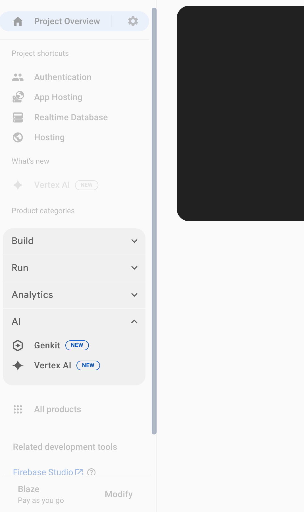

# Genkit AI Monitoring

## Introduction

Welcome to the coach's guide for The IoT Hack of the Century gHack. Here you will find links to specific guidance for coaches for each of the challenges.

Remember that this hack includes a optional [lecture presentation](resources/lecture.pdf) that features short presentations to introduce key topics associated with each challenge. It is recommended that the host present each short presentation before attendees kick off that challenge.

> **Note** If you are a gHacks participant, this is the answer guide. Don't cheat yourself by looking at this guide during the hack!

## Coach's Guides

- Challenge 1: Set up your environment and interact with the app
- Challenge 2: Explore Monitoring dashboard
- Challenge 3: Troubleshoot failures
- Challenge 4: Improve performance
- Challenge 5: Improve search quality

## Suggested Hack Agenda

- Day 1
  - Challenge 1 (~20 minutes)
  - Challenge 2 (~20 minutes)
  - Challenge 3 (~30 minutes)
  - Challenge 4 (~30 minutes)
  - Challenge 5 (~20 minutes)

## Challenge 1: Set up your environment and interact with the app

### Notes & Guidance

This goal of this challenge is to set up the app locally and test it out.

All studetns should execute the step **Clone the Repository and set the environment variables** in their own Cloud accounts.

There are couple of points where students may ask for your guidance:

1. After cloning the repo, ensure Google Cloud credentials are set up correctly in each student's environment. The credentials are specified within `key.json` (this is configured by the `setup_local.sh` script).
1. Please be aware that the application's performance may be slow, particularly within the Quicklab environment. We recommend that users do not concurrently interact with the same app.
1. If you encounter issues such as no response or an extremely slow response, please try submitting the query again.
1. Movie suggestions are _intentionally_ not saved. This functionality will be fixed in Challenge 2. 
1. The app's vector search functionality works best with *genre*-based (semantic) queries, which leverages its vector search capabilities to find relevant recommendations efficiently. Queries based on specific *ratings* (are not semantic) are less suited for this vector approach. For any query, the *retriever* fetches potential results. However, with *rating* queries, the vector search often retrieves many irrelevant movies that must then be filtered out by the RAG portion of the application before being displayed. This is why there are fewer *rating* based results. The students only need to notice that there are fewer *rating*-based results than *genre*-based results. They will understand the reason behind this in a later challenge.

## Challenge 2: Exploring Monitoring dashboard

### Notes & Guidance

In this challenge, users will use Firebase Genkit Monitoring to understand the reliability and performance of the app.

The dashboard can be found in the [Firebase console](https://console.firebase.google.com/) by navigating to:
Your Qwiklab project > **Product categories** (left-side panel) > **AI** > **Genkit** tab.

Here's an example of where to find it:



Once the metrics start trickling in, the dashboard should look similar to this:


> **Note** Until the metrics come in, the **Genkit Monitoring** page might look like a documentation page without any dashboards. Don't panic. Give it a few minutes and refresh.

Users might notice three main dashboards:
- **Requests**
- **Success Rate**
- **Latency**
The **Success Rate** dashboard might show that one feature (e.g., `UserProfileFlow`) has a low success rate.

There are approximately four key features displayed in the dashboard:
- `chatFlow`
- `docSearchFlow`
- `userPreferenceFlow`
- `qualityFlow`
While `chatFlow` is a critical feature, the others also require monitoring. Features can be thought of as monitoring scopes, so every independently invoked Genkit flow (orchestration) creates a new feature entry.

The **chatFlow** handles core user interactions. Clicking on this feature will display individual metrics for that specific flow.
!chatFlow Dashboard

Individual traces will provide a detailed breakdown of a flow's execution, similar to the example below.

When a user gets recommendations, a trace might typically include the following steps (or spans):
- `safetyIssueFlow`
- `queryTransformFlow`
- `docSearchFlow`
- `movieQAFlow`
If no search is required for a particular query, the `docSearchFlow` span will be absent.
Each step (or span) in the trace will show its latency.
 !chatFlow Trace
 
 By clicking on the tri-dot menu (three vertical dots) next to a trace or span, users can access related logs and traces in Google Cloud Logging and Google Cloud Trace for more in-depth observability.

## Challenge 3: Troubleshoot failures

### Notes & Guidance

In this challenge we see that the **MovieGuru** app doesn't always store the user's strong preferences when they express it (eg: I love horror movies, I hate drama films etc).

To see how preference saving is expected to work, watch this video:

[](https://youtu.be/l_KhN3RJ8qA)

The user's need to identify that the flow that has issues is the userPreferencesFlow defined in  _js/flows/src/userPreferenceFlow.ts_. 

The user's will see the following error message if they inspect a failed trace in the dashboard. Users can use the **failed paths** table (aggregates failures of the same nature in a feature) to find the reason. The dashboard should look like the following.


Clicking on a individual failed trace also shows the error. 


```
ZodError: [
  {
    "code": "unrecognized_keys",
    "keys": [
      "justification",
      "safetyIssue",
      "items"
    ],
    "path": [],
    "message": "Unrecognized key(s) in object: 'justification', 'safetyIssue', 'items'"
  }
]
```

The error is a _type mismatch error_. This indicates a discrepancy between the data structure the _userPreferenceFlow_ expects to receive from the model, and the structure the model is _actually_ producing based on the prompt's instructiSons. 

The app is currently using the experimental prompt (_js/flows/prompts/userPreference.experimental.prompt_). This prompt has an error as it provides conficting information. In the prompt text, it asks the model to return a list of items of type **string**, while the Flow expects a list of items of type **profileChangeRecommendations**

```

