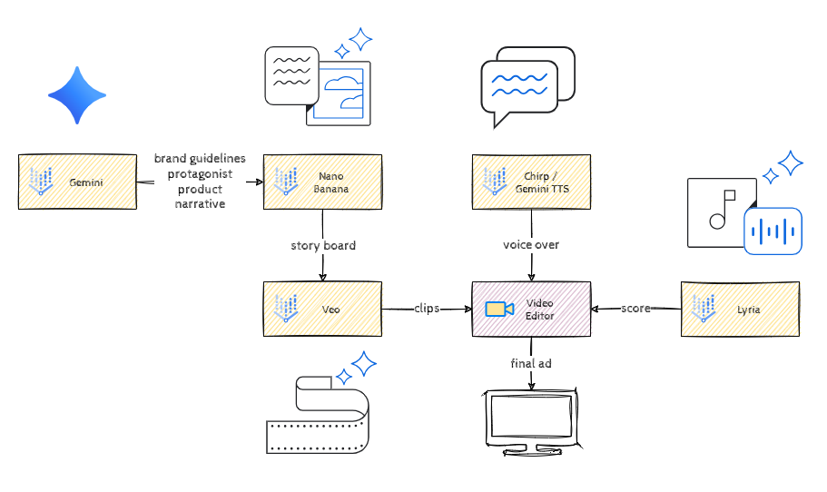

# Easy Ads: From Concept to Creation with GenMedia

## Introduction

Welcome to the future of advertising! In this workshop, you'll step into the role of a creative director at a cutting-edge ad agency. Your mission is to create a compelling 20-30 second video advertisement for a revolutionary new product.

This isn't about writing code. It's about mastering the art of the prompt. You will use Google Cloud's generative AI tools within Vertex AI Studio to bring your vision to life. The challenge lies in guiding these models to produce a final ad that is not just aesthetically pleasing, but also **coherent, consistent,** and **on-brand,** complete with **multilingual voice-over**, graphic overlays and a **custom soundtrack**.

## Learning Objectives

This hack will help you master the following skills:

- Advanced Prompt Engineering  
  - Crafting detailed prompts to control style, composition, and object consistency.  
- Consistent Generation  
  - Creating a believable product and protagonist and maintaining their appearance across different shots.  
- Text-to-Image Generation  
  - Composing a set of graphical elements to enhance the visual appeal of the ad and convey brand information: logos, taglines, etc.  
- Text-to-Video Generation  
  - Directing AI to create dynamic, high-quality video clips from text and image prompts.  
- Text-to-Speech Generation  
  - Creating a professional voice-over in multiple languages.  
- Text-to-Music Generation
  - Composing a custom soundtrack that matches the mood of the ad.  
- Video Assembly  
  - Stitching generated visual and audio assets into a final, polished video.

## Challenges

- Challenge 1: From Product to Narrative  
- Challenge 2: The Visual Blueprint  
- Challenge 3: From Stills to Motion  
- Challenge 4: The Assembly  
- Challenge 5: Giving It a Voice  
- Challenge 6: The Soundtrack  

## Prerequisites

- Basic understanding of generative AI concepts (text-to-image, text-to-video, text-to-speech).  
- Access to a Google Cloud project with Vertex AI Studio enabled, including access to Imagen, Veo, Chirp, and Lyria models.  
- Access to a basic video editing tool (e.g., Google Vids, DaVinci Resolve, Adobe Premiere Pro, CapCut, iMovie, or any online editor).

## Contributors

- Murat Eken  
- Gino Filicetti  
- Jeff Katzen  
- Justin Grayston

## Challenge 1: From Product to Narrative

### Introduction

Every ad starts with a product and tells a story to sell that product. In this challenge we'll introduce the product and come up with brand guidelines for the product, design a story and a character while making sure everything stays coherent.

#### The Product

The **Cymbal Pod** is a single person, urban transport vehicle that hovers silently and moves quietly through the world.

> [!NOTE]  
> This challenge is all about building our story and characters, we're expecting you to craft descriptions, which we'll use in the subsequent challenges to create prompts. So, your descriptions should be detailed enough to capture the essence of your story, but keep in mind that we're not designing prompts yet.

### Description

Start by designing the **brand guidelines**, these should include:

- *Aesthetics* (e.g. 1920s art deco)  
- *Values* (e.g. sustainable farming)
- *Mood / Color Palette* (e.g. film noir)  
- *Target Audience* (e.g. 20-35 year old farmers)

These characteristics will guide all the visuals we create for the product.

Next, create a description of your **protagonist** who is the main character of your ad. This description needs to be detailed enough so that we can achieve consistency from shot to shot in the ad.

Now, we'll craft an **overall narrative** to tell the story of the *Cymbal Pod* and what makes it compelling. We will do this by creating textual descriptions of at least **three scenes** describing what happens in each scene and how they tie together to tell your story.

And finally, create **a tagline or call to action** that meets the brand guidelines (e.g Available for pre-order now*)*. We'll use that text in our final ad video.

> [!NOTE]  
> Using Gemini in this challenge is fair game, but if you want to flex your creative muscles and do your own writing, please feel free to.

We've created a storage bucket with the same name as your project id, navigate there, and upload a text document with all this information into that bucket.

### Success Criteria

- You have created a set of brand guidelines describing the *aesthetics*, *values*, *mood/color palette* and *target audience* for the brand.
- You have created a detailed text description of the protagonist of your narrative.
- You have created a text description/script for at least three scenes that seamlessly tell your story.
- You have created a tagline or call to action that meets the brand guidelines.
- You've stored all of this information in a text document in the provided storage bucket.

### Learning Resources

- [Storytelling in the Ad Creative Process](https://mailchimp.com/resources/storytelling-in-marketing)  
- [Gemini Prompts for Ad Copy](https://felloai.com/2025/08/7-effective-gemini-prompts-for-ad-copy-that-actually-bring-results/)

## Challenge 2: The Visual Blueprint

### Introduction

Now that we have our brand guidelines, our protagonist and our narrative, it's time to create our visuals. This is the **storyboard** of your ad, which visually shows the flow of your narrative and your protagonist within it.

### Description

First we will create our **protagonist**. Using *Imagen* and/or *Nano Banana*, generate a representative image of your protagonist using your description of them and your brand guidelines. Once you have your protagonist images, generate more images that depict the protagonist at different angles (front, side, back, 3/4, etc).

Once you have your protoganist, generate the same set of images for the **product**.

Next, create images for your **storyboard** visualizing the scenes crafted in the previous challenge. These storyboard images should contain *accurate* and *consistent* depictions of the product and protagonist when they are shown.

We also need a **final closing frame** that will inform Veo on how to end the video. It should include space for a Cymbal Pod logo and space for the text of the tagline or call to action.

Finally, use *Imagen* to generate **a logo** for the Cymbal Pod that conveys the brand.

> [!IMPORTANT]  
> The storyboard images must be in 16:9 format because we'll use them as references for the video clips we'll create in the next challenge

Make sure that all of this work is stored in the storage bucket that has been created for you, as we'll use these assets when we compose our final video.

### Success Criteria

- Multiple consistent images are generated that clearly define the **protagonist's appearance** from various angles.
- Multiple consistent images are generated that clearly define the **Cymbal Pod's appearance** from various angles.
- You have generated **distinct storyboard images** and a **final closing frame image**.
- The *Cymbal Pod*'s design is *visibly consistent* across all storyboard images.
- The protagonist's appearance is *visibly consistent* across all storyboard images.
- The overall aesthetic, mood and color palette is *consistent* and conforms to your brand guidelines.
- Your coach approves of the visual consistency of your images.
- The images are stored in the storage bucket that has been provided to you.

### Learning Resources

- [Introduction to Vertex AI Studio](https://cloud.google.com/vertex-ai/docs/studio/introduction)
- [Generate images with Imagen](https://cloud.google.com/vertex-ai/docs/generative-ai/image/generate-images)

### Tips

- Keep in mind that some models will have limitations with respect to how many reference images you can include in a prompt and the maximum size. See for example the *Technical Spacifications* for [Nano Banana](https://cloud.google.com/vertex-ai/generative-ai/docs/models/gemini/2-5-flash-image)
- There are also limits in the Media Studio UI, you might want to use the Import from Cloud Storage options instead of uploading your images in your prompt

## Challenge 3: From Stills to Motion

### Introduction

With your storyboard and protagonist created, it's time to bring your vision to life. This challenge is about converting your static scenes into dynamic video clips.

### Description

Using the *Veo* family of models in Vertex AI Studio, generate video clips for each of your storyboard scenes from Challenge 2. Make sure you use your generated images as references in your prompts to guide the model.

> [!IMPORTANT]  
> It's fine to have background sound or noises for some parts of your video, but keep in mind that you'll be generating voice-over in a later challenge. So you might want to turn off audio generation for those sections.

You know the drill, once finished, store the resulting clips in the storage bucket provided to you.

### Success Criteria

- High-quality video clips for each of the storyboard scenes are generated.
- The total runtime for the video clips should be around ~30 seconds (min: 20 seconds and max: 1 minute).
- The video aesthetics, mood and color palette are *highly consistent* with the corresponding static images.
- The motion depicted is *smooth* and *realistic*.
- When viewed in sequence, the clips form a coherent narrative, with logical transitions.
- Your coach approves of the visual consistency of your videos and their fidelity to your storyboard images.
- The videos have been stored in the storage bucket that has been provided to you.

### Learning Resources

- [Generate videos with Veo](https://cloud.google.com/vertex-ai/docs/generative-ai/video/generate-videos)
- [Detailed Prompting Guide for Veo](https://medium.com/google-cloud/veo-3-a-detailed-prompting-guide-867985b46018)
- [Veo Technical Deep Dive](https://medium.com/google-cloud/google-veo-a-technical-deep-dive-for-the-ai-director-a6fdf6438a3f)
- [Veo 3 Prompting Guide](https://github.com/snubroot/Veo-3-Prompting-Guide)

## Challenge 4: The Assembly

### Introduction

You have all your visual components. Now it's time for post-production. In this challenge, you'll act as the editor, assembling the generated clips into a single, seamless advertisement.

### Description

Using a video editor of your preference, stitch together the video clips you created in Challenge 3. The goal is to create a single, cohesive video file that flows logically and tells the intended story.

To close out the ad, add in the Cymbal Pod logo and any other static graphics you created in Challenge 2. Don't forget to add your tagline or call to action here as well.

> [!NOTE]  
> You could use Imagen for generating text as well, but in case you're not getting what you want, you can just use text elements within your video editor.

### Success Criteria

- The video is around 20-30 seconds long (min: 20 seconds and max: 1 minute).
- The video tells a coherent story, using the shots generated in the previous challenge.
- The final assembled video is free of jarring cuts, ridiculous transitions (no star wipes!) or continuity errors.

### Tips

- [Google Vids](http://vids.google.com) is a great and free service for editing videos.

## Challenge 5: Giving It a Voice

### Introduction

A silent film can be powerful, but a voice-over can deliver a targeted message. In this challenge, we'll generate a set of professional-sounding voice-overs for your ad with at least one voice-over in a foreign language, making your campaign global-ready.

### Description

First, write a short, compelling script for your ad. The script should consist of multiple pieces of voice-over audio to be inserted into your ad in different spots. The script should align with the brand guidelines you've defined.

> [!NOTE]  
> Once again, Gemini is fair game to generate the script, but you're also free to use your own writing creativity.

Next, use the *Chirp* model in Vertex AI or the *Gemini TTS* to generate the voice-overs from your script. Choose one of the voice-overs and generate it in a foreign language, (e.g. Italian, Afrikaans, Turkish).

Finally, add these audio tracks to the video you assembled in Challenge 4 in the proper places in your video sequence timeline.

### Success Criteria

- A short, on-brand script is written describing multiple voice-overs needed in the ad.
- Multiple high-quality voice-overs are generated with at least **one** in a foreign language.
- The voice-overs are successfully added to the video file, with timing that matches the visuals.

### Learning Resources

- [Gemini Text to Speech](https://cloud.google.com/text-to-speech)  

## Challenge 6: The Soundtrack

### Introduction

Music is an important layer of emotion in your ad. To complete your masterpiece, you will use Google's *Lyria* model to compose a custom piece of background music that complements the visuals and voice-over.

### Description

Using the *Lyria* model in Vertex AI, generate a music track for the entire ad. Remember to adhere to your brand guidelines.

Once you have a track you're happy with, add it as a final audio layer to your video sequence timeline. Make sure to balance the volume so that the music complements the voice-overs without overpowering them.

### Success Criteria

- A music track is generated for the entire length of the ad.
- The music's mood and style align with the brand guidelines.
- The music is successfully added to the video, creating a final, polished ad with visuals, voice-over, and a soundtrack.  
- You've exported your final ad as an **MP4** file.

### Tips

- Keep in mind that Gemini itself can be a helping hand here. If you give it your brand guidelines and/or your video, it can give you a recommendation for a good soundtrack to use.
- The Lyria model is trained from the point of view of a musician and their instrument. You'll get better results if your prompt speaks in the language of instruments.
