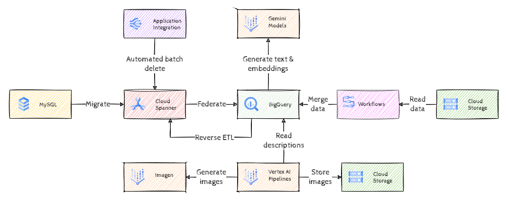

# Hack to the Future: Data Track

## Introduction

Cymbal Shops, a thriving online retailer, found itself at a crossroads. Its existing e-commerce platform, while functional, was struggling to keep up with rapid growth and increasing customer demands. Additionally, a recent mandate from the board to implement generative AI capabilities added a new layer of complexity. The company's CTO recognized the need for a significant transformation to stay competitive and relevant in the fast-paced industry. The CTO has looked to Google Cloud to provide a solution to the organization's business and technology strategy going forward.

Cymbal Shops chose Google Cloud as its strategic partner for this transformative journey. The company was particularly drawn to Google Cloud's expertise in Gen AI, its commitment to open source technologies, and its robust suite of managed services.

In this gHack we'll help Cymbal bring this plan forward as much as possible, primarily focusing on the migration of the legacy application MySQL database to Spanner. From that point we'll create BigQuery analytics datasets to handle both historical and live data using federation, use advanced generative AI to enhance the existing dataset with descriptions and images, and finally implement semantic search on this dataset.

## Learning Objectives

During the process we'll learn about

- Cloud Spanner and how to migrate from a legacy database
- BigQuery for analytics workloads on federated data from Spanner
- Application integration for automating certain tasks
- GenAI capabilities on BigQuery

## Challenges

- Challenge 1: Migration
- Challenge 2: Federation
- Challenge 3: Automation
- Challenge 4: Generating text and embeddings
- Challenge 5: Semantic search
- Challenge 6: Generating images

## Prerequisites

- Basic knowledge of GCP
- Basic knowledge of Python
- Basic knowledge of SQL
- Access to a GCP environment

## Contributors

- Murat Eken
- Gino Filicetti

## Challenge 1: Migration

### Introduction

This first challenge is all about migrating the legacy database containing the historical store data to Cloud Spanner, an always on database with virtually unlimited scale.

### Description

The legacy MySQL database has already been migrated to Google Cloud as a MySQL instance in your project. Find it and explore its details & contents.

Create a new *Spanner Enterprise edition* instance called `onlineboutique` with *100 Processing Units* in the same region as the MySQL instance. Then create a new Spanner database with the name `ecom` in the new instance. Once the Spanner database is created, migrate the `ecom` *schema and data* from the MySQL instance to the new Spanner database using the Spanner Migration Tool. Make sure to choose *POC Migration* as the migration type.

### Success Criteria

- There is a new Cloud Spanner instance, `onlineboutique` with *100 PU* and a new database, `ecom`.
- All the data from the MySQL database `ecom` is migrated to the new Spanner database.
- Verify that the following tables with the corresponding row counts exist in the new Spanner database:

  | Table | #Rows |
  | ---   | ---   |
  | distribution_centers | 10  |
  | products             | 29120 |
  | users                | 100000 |
  | events               | 2438862 |
  | inventory_items      | 494254 |
  | orders               | 125905 |
  | order_items          | 182905 |

### Learning Resources

- [Spanner Migration Tool](https://googlecloudplatform.github.io/spanner-migration-tool/)

### Tips

- If there's nothing mentioned in the instructions about a parameter, stick to the defaults (this applies to all of the challenges).
- In principle you could install the Spanner Migration Tool on any VM, but the Cloud Shell is the easiest option.
- The Spanner Migration Tool will need network access to the MySQL database, so you'll need to add the IP address of the Cloud Shell (or any other VM where you're running the tool from) to the authorized networks of the MySQL instance.

## Challenge 2: Federation

### Introduction

Although you could run analytics queries also on Spanner, it's mainly an OLTP database. We'll export historical application data to BigQuery for advanced analytics and as a foundation for GenAI use cases. Tight integrations between BigQuery and the source databases can then be used for unified querying across analytics and transactional databases, and AI/ML integrations can then be leveraged to enhance customer insights

### Description

Create a new BigQuery dataset `cymbal_analytics` in the multi-region `US`. Create a new external (federated) dataset `spanner_external_dataset` linked to the Spanner `ecom` database you've created in the previous challenge.

Copy each table from the Spanner database to the newly created BigQuery dataset.

### Success Criteria

- All the data from the Spanner database `ecom` is exported to the new BigQuery dataset.
- Verify that the following tables with the corresponding row counts exist in the new BigQuery dataset:

  | Table | #Rows |
  | ---   | ---   |
  | distribution_centers | 10  |
  | products             | 29120 |
  | users                | 100000 |
  | events               | 2438862 |
  | inventory_items      | 494254 |
  | orders               | 125905 |
  | order_items          | 182905 |

### Learning Resources

- [Creating BigQuery datasets](https://cloud.google.com/bigquery/docs/datasets)
- [Creating Spanner external datasets](https://cloud.google.com/bigquery/docs/spanner-external-datasets) in BigQuery
- [Creating BigQuery tables from a query result](https://cloud.google.com/bigquery/docs/tables#create_a_table_from_a_query_result)

## Challenge 3: Automation

### Introduction

As all of the historical data has now been copied over to BigQuery, we can optimize the Spanner environment by deleting the data that is more than a year old from the Spanner database, as that is only needed for analytics. However Spanner has some limits on the number of mutations that can be done in a single transaction, so we'll have to batch the removal of the data and script it. There's a plethora of different tools but we'll use [Application Integration](https://cloud.google.com/application-integration/docs/overview) for that purpose.

Application Integration is an Integration-Platform-as-a-Service (iPaaS) solution in Google Cloud that offers a comprehensive set of core integration tools to connect and manage the multitude of applications (Google Cloud services and third-party SaaS) and data required to support various business operations.

### Description

We'll use the `integrationcli` tool to configure the pipeline for removing the historical data from Spanner. Go ahead and follow the [instructions](https://github.com/GoogleCloudPlatform/application-integration-management-toolkit) to install it.

We've already prepared the *Application Integration* pipeline for you at `TBD`, download that to the VM where you installed the `integrationcli` and publish it. Use the same region as the Spanner instance and make sure to set the environment name for the scaffolding to `dev`.

Once the *Application Integration* is available in the Google Cloud Console, open it and run it by clicking on the *Test* button, and choosing the *Delete Order Items* task (keep the default parameters).

> **Note**  The pipeline will delete the rows in multiple batches asynchronously, give it a few minutes before verifying that all the historical data is removed.

### Success Criteria

- The *Application Integration* pipeline has been successfully run.
- All the historical data (anything older than `2024-01-31`) has been removed from the Spanner database.

### Learning Resources

- [Publishing an Application Integration pipeline with the `integrationcli` tool](https://github.com/GoogleCloudPlatform/application-integration-management-toolkit/blob/main/docs/integrationcli_integrations_apply.md)

### Tips

- In principle you could install the `integrationcli` tool on any VM, but the Cloud Shell is the easiest option.
- If you've installed the tool on Cloud Shell, you can use the `--default-token` option to authenticate.

## Challenge 4: Generating text and embeddings

### Introduction

In this challenge we'll create enhanced product descriptions and text embeddings for the products table in BigQuery to prepare for semantic search.

### Description

Add the following two columns `product_description (STRING)` and `product_description_embeddings (ARRAY<FLOAT64>)` to the `products` table in BigQuery. Using an LLM from BigQuery, generate product descriptions based on the product `name`, `brand`, `category`, `department` and `retail_price` information for at least 100 products and store that in the new `product_descriptions` column.

> **Note** We're only generating the descriptions for 100 products, as doing it for the complete dataset would take too long.

Then using an embeddings model again from BigQuery, generate embeddings for the `product_description` column (for the 100 product descriptions that have been generated) and store it in the new `product_description_embeddings` column.

### Success Criteria

- There are two new columns in the BigQuery `products` table: `product_descriptions` and `product_description_embeddings`.
- The column `product_description` contains the LLM generated product descriptions for at least 100 products.
- The column `product_description_embbedings` contains the embeddings for the product descriptions.
  
### Learning Resources

- [Modifying table schemas in BigQuery](http://cloud.google.com/bigquery/docs/managing-table-schemas)
- [Generating text using an LLM from BigQuery](https://cloud.google.com/bigquery/docs/generate-text)
- [Generating text embeddings from BigQuery](https://cloud.google.com/bigquery/docs/generate-text-embedding)

## Challenge 5: Semantic search

### Introduction

In this challenge we'll use reverse ETL to transfer the product descriptions and embeddings over to Spanner. Once the information is available in Spanner we'll implement semantic search through Spanner's embddings capabilities.

### Description

Before we start copying the data from BigQuery to Spanner, let's complete the product descriptions for the whole table. We've prepared a *Worfklow* called `prep-semantic-search`, look it up, execute it with the parameter `embeddings_model_name` value set to the name of the *embeddings model* that was created in the previous challenge. Once this workflow succesfully completes, all products should have descriptions and embeddings.

Now, add the following two columns `product_description` of type `STRING(MAX)` and `product_description_embeddings` of type `ARRAY<FLOAT64>` to the `products` table in Spanner. Export the data from BigQuery to Spanner through *reverse ETL*, and create the same embeddings model in Spanner.

Using the embeddings model in Spanner do a search for the query *Luxury items for women* and return back top 5 items.

### Success Criteria

- There are two new columns in the Spanner `products` table: `product_descriptions` and `product_description_embeddings`.
- The column `product_description` contains the LLM generated product descriptions for all products.
- The column `product_description_embbedings` contains the embeddings for the product descriptions for all products.
- The semantic search for *Luxury items for women* on Spanner returns the following products:

  - P1
  - P2
  - P3
  - P4
  - P5
  
### Learning Resources

- [Executing a Workflow](https://cloud.google.com/workflows/docs/executing-workflow#execute_a_workflow)
- [Making schema updates in Spanner](https://cloud.google.com/spanner/docs/schema-updates)
- [Exporting data to Spanner (reverse ETL)](https://cloud.google.com/bigquery/docs/export-to-spanner)
- [Text embeddings in Spanner](https://cloud.google.com/spanner/docs/ml-tutorial-embeddings)

## Challenge 6: Generating images

### Introduction

Now we have product descriptions, we can generate images based on these descriptions using GenAI. This will involve running a Vertex AI Pipeline to orchestrate a few things, such as iterating over the data, preparing the prompt based on the product description, running *Imagen* to generate the images, pick one of the results (randomly), store the image in Cloud Storage and record the URI in BigQuery.

### Description

Create a new Cloud Storage bucket and name it `{YOUR PROJECT ID}-images`.  Update the BigQuery `products` table to include `image_uri` and `image_url` columns.

We've already prepared a the Vertex AI Pipeline code, download it from `TBD` and install its dependencies. Then run the code, it will create a `yaml` file. Navigate to Vertex AI Pipelines and *Create run* with that `yaml` file, provide the required parameters and submit the job.

### Success Criteria

- There's a new Cloud Storage bucket called `{YOUR PROJECT ID}-images`.
- The BigQuery `products` table has the new columns `image_uri` and `image_url`.
- The provided Vertex AI Pipeline has been successfully run.
- There are product images generated for the `products` and the corresponding urls are in the BigQuery table.

### Learning Resources

- [Creating new Cloud Storage Buckets](https://cloud.google.com/storage/docs/creating-buckets)
- [Modifying table schemas in BigQuery](http://cloud.google.com/bigquery/docs/managing-table-schemas)
- [Vertex AI Pipelines](https://cloud.google.com/vertex-ai/docs/pipelines/introduction)
