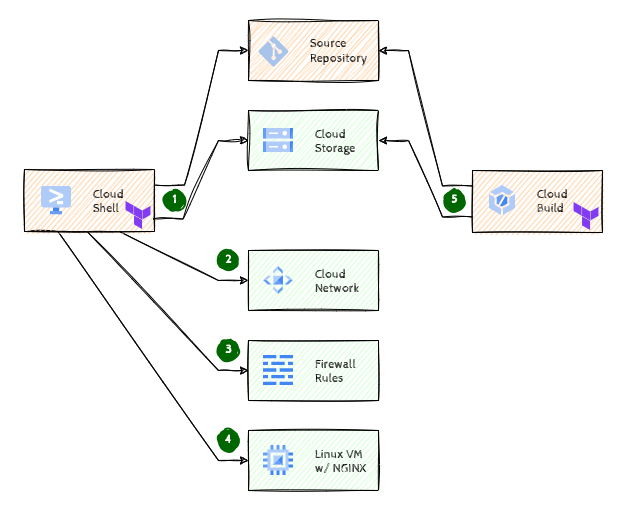

# Infrastructure as Code with Terraform

## Introduction

This hack is intended as an introduction to provisioning GCP resources using Terraform. We'll start with the basics of Infrastructure as Code (IaC) and help you automate the process of infrastructure provisioning.

> **Warning** As of June 2024 *Cloud Source Repositories* is [end of sale](https://cloud.google.com/source-repositories/docs/release-notes#June_17_2024). However, any organization that has created at least one CSR repository in the past, will still have access to existing repositories and will be able to create new ones. If you're running this in a Qwiklabs environment you're good to go, but if you're running this in **your** own environment, please verify that you have access to *Cloud Source Repositories* in your organization.

## Learning Objectives

In this hack you will be exploring the following tasks

1. Setting up a version control system to hold your assets
1. Setting up a Terraform backend
1. Provisioning a few basic resources on GCP with Terraform
1. Automating the process using Cloud Build

## Challenges

- Challenge 1: Bootstrapping
  - Terraform backend & version control
- Challenge 2: Your very first provisioning
  - Let's start with networking
- Challenge 3: Open the gates!
  - Opening the Firewall ports
- Challenge 4: Hello HTTP server
  - NGINX on a Linux VM
- Challenge 5: Automation
  - Enable GitOps by running Terraform through Cloud Build

## Prerequisites

- Your own GCP project with Owner IAM role
- Basic knowledge of GCP
- Knowledge of Git & Terraform
- Access to an environment to install & run CLI commands (e.g. Cloud Shell)

## Contributors

- Murat Eken
- Mohammed Fawzi

## Challenge 1: Bootstrapping

### Introduction

In this challenge we'll set up a few prerequisites for the hack. Since we'll be working in a team, we'll need to share the assets with each other and keep track of the changes. For that purpose we'll create and configure a Git version control system. In addition, Terraform needs to store its state somewhere. By default it does that on the local file system, but that's not practical if multiple people would need access to the same state. So, we'll have to configure a remote *backend*.

> **Warning** As of June 2024 *Cloud Source Repository* is [end of sale](https://cloud.google.com/source-repositories/docs/release-notes#June_17_2024). However, any organization that has created at least one CSR repository in the past, will still have access to existing repositories and will be able to create new ones. So, if you've made it so far, and your coaches have done their due diligence, you're lucky and can use CSR for this challenge.

### Description

For this challenge you could use any external Git repository (Github/Bitbucket/Gitlab etc.), however the easiest option is to use a Cloud Source Repository on GCP. We've already created a Cloud Source Repository with the name `iac-with-tf` in *your project*. Create an SSH key and register that with your Cloud Source Repository (everyone on the team should complete this task).

We've prepared a [sample project](https://github.com/meken/gcp-iac-with-tf/archive/refs/heads/main.zip) for you, download it and extract the contents. Make sure that code is pushed to the external repository.

Create a new bucket to hold the Terraform state using best practices and configure Terraform to use that as the backend.

> **Note**  
> For the sake of simplicity we'll stick to a single environment for this challenge. But in real world you'll probably have to deal with multiple environments (dev/test/acc/prod) and might need to track the state for these environments separately.

### Success Criteria

1. There's a new bucket for the Terraform state following best practices
1. Terraform is configured to use that bucket as the backend
1. All of this configuration is in the Cloud Source Repository

### Learning Resources

- Cloud Source Repository [authentication](https://cloud.google.com/source-repositories/docs/authentication)
- Terrafom GCS [backend](https://developer.hashicorp.com/terraform/language/settings/backends/gcs)

### Tips

- You'll need a CLI environment to run Git and Terraform commands, [Cloud Shell](https://cloud.google.com/shell) has all of that pre-installed

## Challenge 2: Your very first provisioning

### Introduction

We'll need to create a VM in one of the next challenges, and that requires a network & subnet.

### Description

Create a new network through Terraform with a single subnet in a region that's close to you using the CIDR block `10.0.10.0/24`. Make sure that the project and the CIDR block are variables named `gcp_project` and `cidr_block`.

### Success Criteria

1. There's a single subnet with the provided CIDR block in a new network, created by Terraform
1. Both the project and CIDR block are passed through as variables
1. All of this configuration is in the Cloud Source Repository

## Challenge 3: Open the gates!

### Introduction

By default all ports are closed, but we'll need to open some for serving HTTP requests.

### Description

Configure a firewall rule for allowing HTTP/HTTPS requests for all VMs having the tag `http`.

### Success Criteria

1. There's a new firewall rule that allows HTTP/HTTPS communication for the tag `http`, created by Terraform
1. All of this configuration is in the Cloud Source Repository

## Challenge 4: Hello HTTP server

### Introduction

Now we're done with the prerequisites we can finally roll out a VM as an HTTP server.

### Description

Create a new Linux VM and make sure that NGINX is installed and configured to serve HTTP requests.

> **Note**  
> For this challenge we'll be using Terraform to handle NGINX installation, but keep in mind that there are alternatives, such as Ansible, Chef/Puppet etc. that can be used to augment Terraform capabilities.

### Success Criteria

1. There's a new Linux VM with NGINX serving public HTTP requests, created by Terraform
1. The external IP of the VM is output when the Terraform command is run
1. All of this configuration is in the Cloud Source Repository

## Challenge 5: Automation

### Introduction

We can run the Terraform commands locally but ideally they should be executed in a headless fashion so the configuration is reproducable. This task will introduce you to Cloud Build to automate the process of Terraform provisioning.

### Description

Create a new Cloud Build push trigger using the `cloudbuild.yaml` in the provided sample project. Make sure that the variables for the build are configured properly. Note that you might need to edit this file to get a successful build.

> **Warning**  
> For the sake of simplicity we'll stick to the `Compute Engine Default Service Account`, but typically you'd want to create a specific service account for the build with limited permissions.

### Success Criteria

1. There's a new Cloud Build push trigger using the provided `cloudbuild.yaml`
2. The trigger is connected to the Cloud Source Repository created in the first challenge
3. The trigger uses the provided (fully configured) build configuration from the repository
4. And there's at least one successful build

### Tips

- Did you consider the permissions?
