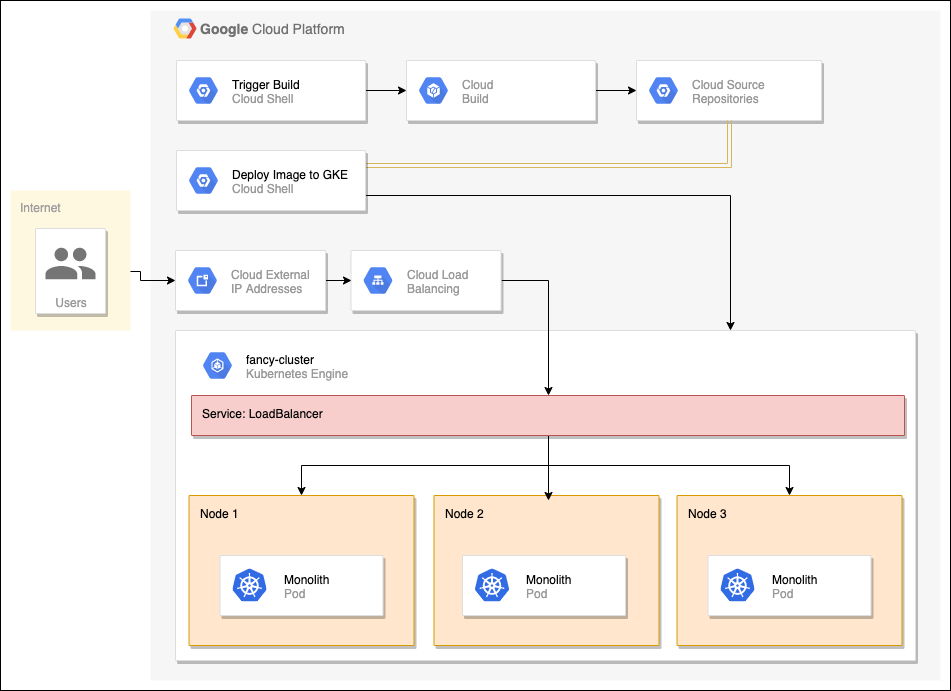

# Intro to GKE: Deploy, Scale and Update

## Introduction

Running websites and applications is hard.

Things go wrong when they shouldn't, servers crash, increase in demand causes more resources to be utilized, and making changes without downtime is complicated and stressful.

Imagine a tool that could help you do all that and even allow you to automate it! With GKE, all of that is not only possible, it's easy! In this gHack, you assume the role of a developer running an eCommerce website for a fictional company named Fancy Store. Due to problems with scaling and outages, you're tasked with deploying your application to GKE!



## Learning Objectives

In this gHack you will experience what a cloud developer needs to go through to successfully deploy an application. You will learn to:

- Create a GKE cluster.
- Create a Docker container.
- Deploy the container to GKE.
- Expose the container via a service.
- Scale the container to multiple replicas.
- Modify the application.
- Perform a zero downtime rolling update on Kubernetes

## Challenges

- Challenge 1: Provision a GKE Cluster
   - Create a new GKE cluster that you'll use to deploy, scale and update your application
- Challenge 2: Containerizing your Application
   - Run your application in a stand alone fashion and then containerize it to prepare it for deployment to GKE
- Challenge 3: Deploy and Expose the Application
   - Using your containerized app in Artifact Registry, deploy it to GKE and expose it to the public internet
- Challenge 4: Scale the Application to Handle Increased Traffic
   - Now that the application is deployed and out there, we've noticed an increase in traffic and need to scale out to handle the new load
- Challenge 5: Update and Release with Zero Downtime
   - Change is inevitable, but new releases need to be deployed smoothly. Here we learn how to do that with zero downtime

## Prerequisites

- Your own GCP project with Owner IAM role
- A basic understanding of Docker and Kubernetes 
   - If you lack a basic understanding, you can review [Docker](https://docs.docker.com/) and [Kubernetes](https://kubernetes.io/docs/home/) now.
- Access to an environment with the following 
  - gcloud (>= 410.0.0)
  - node.js (>= v19.1.0)
  - **Note** Cloud Shell has these pre-installed

## Contributors

- Gino Filicetti

## Challenge 1: 

### Introduction

We begin our journey by creating the Kubernetes cluster that will run our new containerized application. We'll be using GKE: Google Kubernetes Engine and will show you how quick and simple it is to create a fully managed Kubernetes cluster.

### Description

In this challenge, you will create a single *Standard* GKE cluster as per these specifications:

- An initial node pool of machine type: `n1-standard-2`
- An initial node pool size of 3
- Located in a GCP zone near you

> **Note** Although you can create this cluster using the Google Cloud Console UI, we encourage you to explore and figure out how to create clusters using the `gcloud` CLI tool.

> **Note** Creating a cluster will take 5-7 minutes.

### Success Criteria

- Show your coach that you're using the correct machine sizes in your node pool
- Verify that you can connect to your cluster with the `kubectl` CLI tool and output a list of all nodes.

### Learning Resources

- [GKE Overview](https://cloud.google.com/kubernetes-engine/docs/concepts/kubernetes-engine-overview)
- [Zonal Clusters](https://cloud.google.com/kubernetes-engine/docs/how-to/creating-a-zonal-cluster)

## Tips

- Keep in mind that you need to get the credentials to connect `kubectl` to your cluster.

## Challenge 2: 

### Introduction

Now that our cluster is ready for action, we need to work on our monolithic application. Currently it is a stand alone node.js/React application that runs on the command line. We will be going through the steps to make this ready to deploy onto our Kubernetes cluster.

### Description

In this challenge, you will begin by installing the application and making sure it works standalone first, before starting any work on it.

We've made the application available on github as a [zip file at this link](https://github.com/gfilicetti/monolith-to-microservices/archive/refs/heads/master.zip). Download the zip and extract its contents into your Cloud Shell (or local dev) environment. 

To set up required node.js libraries in a fresh download, run the `setup.sh` script. Afterwards, you need to start the node.js application in the `monolith` folder and pull up the home page of your app to make sure it is working.

Now that we've confirmed it is working, we need to containerize the application and deploy it to a Docker repository.

You'll need to do the following:
- Create a new standard Artifact Registry to store docker containers (choose a region near you)
- Using Google Cloud Build, issue a single `gcloud` command that will build a container and push it up to your new Artifact Registry.
   - **NOTE:** You will need to run this command in the global region

### Success Criteria

- You successfully started the application and were able to navigate to its home page on port 8080
- You have a new Artifact Registry docker repository provisioned in a region near you
- With one command, you built the container and pushed it to your new Artifact Registry using Cloud Build in the global region.

### Learning Resources

- [Github Repo for Monolith Application](https://github.com/gfilicetti/monolith-to-microservices)
- [Artifact Registry Overview](https://cloud.google.com/artifact-registry/docs/overview)
- [Docker build using Cloud Build](https://cloud.google.com/build/docs/build-push-docker-image)

### Tips

- If using the Cloud Shell as recommended, there is an easy way to open a browser window to a port of your choice running in the Cloud Shell.
- A `Dockerfile` is already provided for you in the git repository you cloned.

## Challenge 3: 

### Introduction

Now that you containerized your website and pushed the container to your docker repository in Artifact Registry, you can deploy it to Kubernetes.

To deploy and manage applications on a GKE cluster, you must communicate with the Kubernetes cluster-management system. You typically do this by using the `kubectl` command-line tool.

Kubernetes represents applications with the **Pod** resource. Pods are units that represent a container (or group of tightly coupled containers). The Pod is the smallest deployable unit in Kubernetes and it is the unit of scale. In our application, each Pod will only contain your monolith container.

Deploying applications in Kubernetes is done using the **Deployment** resource. A Deployment manages multiple copies (aka Replicas) of your application and schedules them to run on the individual nodes in your cluster. To begin with, the Deployment will run only one Pod of your application. Deployments manage replicas by creating a **ReplicaSet** resource.  The ReplicaSet is responsible for making sure that the number of replicas specified are always running.

Once you've deployed an application in Kubernetes you will need a way of accessing it outside of the cluster. By default, the containers you run on Kubernetes are not accessible from the internet because they do not have external IP addresses. You must explicitly expose your application to traffic from the internet via a Service Resource. A Service provides networking and IP support for your Pods. GKE creates an external IP and a load balancer for your application when a Service is created.

Resources in Kubernetes are created using files in yaml format that describe the items and state that you want to deploy to the cluster. This is called **declarative instantiation**, where we describe **WHAT** we want to see, not procedural steps in a script describing **HOW** to build what we need.

### Description

In this challenge you will create a Deployment resource for your application and then a Service resource to expose it to your customers.

We will create yaml files describing the Deployment and Service resources you will need to create to achieve this.

Your Deployment resource will need to:
- Use the container image that we built and pushed to your docker repository in Artifact Registry.
- Deploy only 1 replica of our container
- Expose the container on port 8080
- Use an appropriate label to identify the pod

Your Service resource will need to:
- Be exposed externally on port 80
- Send requests to the application on the port it uses
- Use a selector that matches the label on the application's pod

Issue a `kubectl` command to look at all the Kubernetes resources created to make sure that the Deployment, Pod, ReplicaSet and Service resources are there.

In a browser, access your application on the Service's external IP.

Lastly, simulate a Pod crash by deleting a Pod with a `kubectl` command. Immediately after deleting, issue the command to see all resources and notice a new Pod being created by the ReplicaSet.

### Success Criteria

- You've created yaml files with definitions of a Deployment and a Service
- Your deployment uses the container image built and pushed to your Artifact Registry docker repository.
- Your deployment creates 1 replica of the pod
- Your service is available externally
- Your application can be accessed and used in a browser
- You've demonstrated to your coach that deleting a Pod results in a new one being created immediately.

### Learning Resources

- [Pods Overview](https://kubernetes.io/docs/concepts/workloads/pods/pod)
- [Deployments Overview](https://kubernetes.io/docs/concepts/workloads/controllers/deployment/)
- [ReplicaSet Overview](https://kubernetes.io/docs/concepts/workloads/controllers/replicaset/).
- [Service Overview](https://kubernetes.io/docs/concepts/services-networking/service/)

### Tips
- You can view your Kubernetes deployments, pods and services via the Cloud Console. 
- If you see unexpected errors or statuses, then you can debug your resources by using the `describe` command in `kubectl` for the various resources.

## Challenge 4: 

### Introduction

Now that you have a running instance of your app in GKE and exposed it to the internet, your website has become extremely popular. You need a way to scale your app to multiple instances so that you can handle the traffic. In this challenge we'll learn how to scale your application to up to 3, and then 5 replicas to meet the demand.

### Description

Using `kubectl`, issue a command to scale your deployment from 1 to 3 instances. Confirm that new Pods were created by looking at all resources.

Although we can issue `kubectl` commands like the above to scale our deployment, it is better practice to do this declaratively. Update your Deployment yaml file and change it to deploy **5** instances. 

Apply the new yaml file and confirm that new Pods were created by looking at all resources.

### Success Criteria

- Show your coach that you've started with 1 instance
- Show your coach that you've scaled to 3 instances by using a `kubectl` command
- Show your coach that you've scaled to 5 instances by modifying your Deployment yaml file

## Challenge 5: 

### Introduction

Your marketing team has asked you to change your application's homepage. They think that it should be more informative by explaining what your company is and what you actually sell. In this section, you'll add some text to the homepage to make the marketing team happy. 

To ensure seamless and uninterrupted service to your customers, we need to update your application with zero downtime using Kubernetes' rolling updates functionality.

### Description

It looks like one of our helpful developers has already created the changes with the file name `index.js.new`. You can copy this file to `index.js` and your changes will be reflected in the application.

Now that we've changed the application it needs to be rebuilt and a new container image needs to be created and pushed to the Artifact Registry with a new label to distinguish it from the original image.

> **Note** Since this isn't a ReactJS gHack, we will give you the command to run from the root folder of the React app (ie: `./react-app`):
> ```bash
>  npm run build:monolith
> ```

Now that the React app has been rebuilt, you can build and push a new container image. 

Once we have a new container image ready, we need to roll it out to production.

> **Note** If you list your pods after rolling out the update, you will see new Pods being created before the old Pods are deleted (look at their ages). This ensures zero downtime.

Navigate to your external IP and confirm the new changes are visible.

### Success Criteria

- You've updated the application's homepage
- You've deployed a new container image to your Artifact Registry docker repository
- You've successfully rolled out the update to your pods and the external website is showing the changes.
