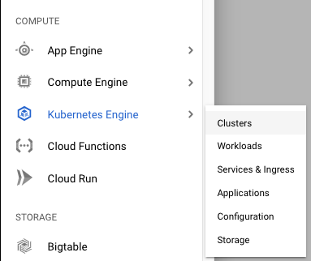
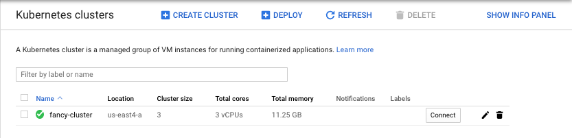
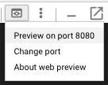
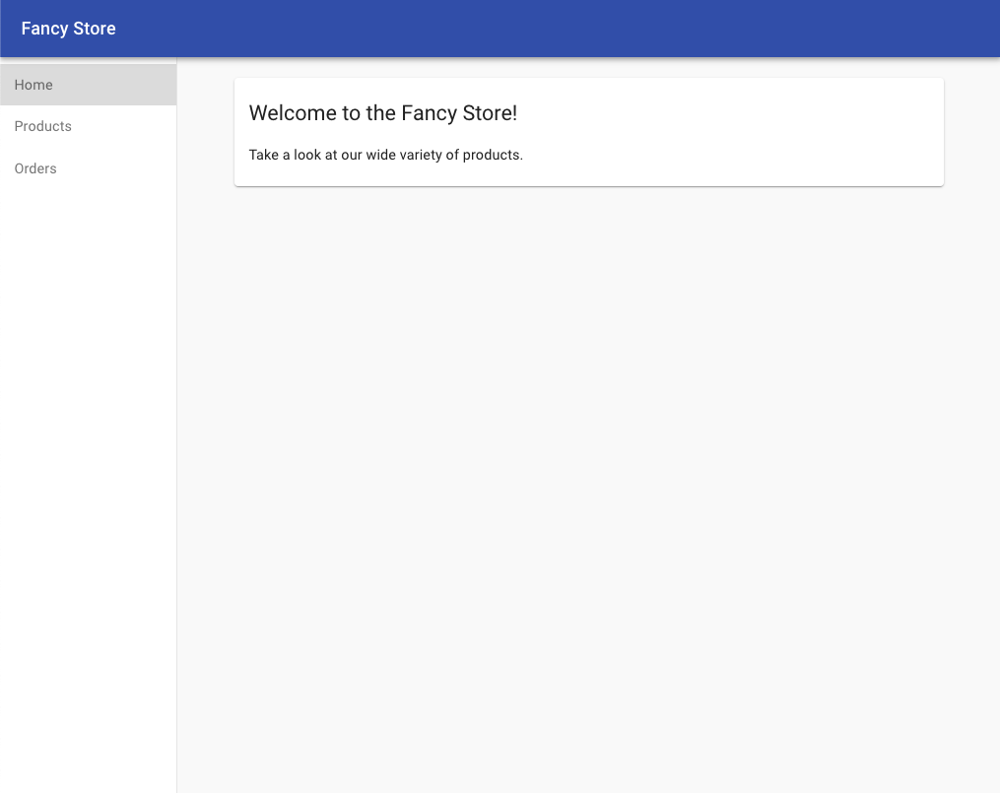
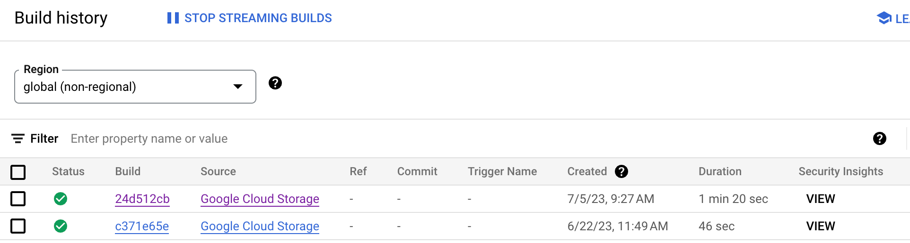
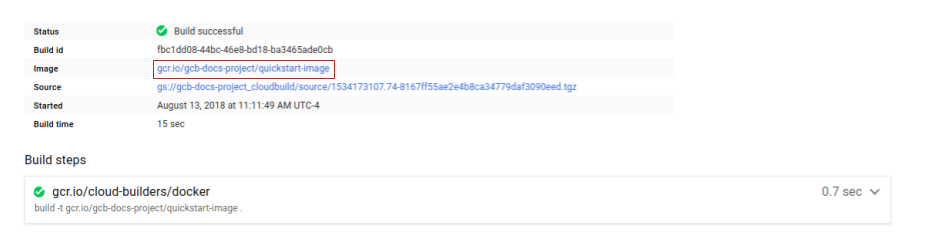

# Intro to GKE: Deploy, Scale and Update

## Introduction

Welcome to the coach's guide for the Intro to GKE gHack. Here you will find links to specific guidance for coaches for each of the challenges.

> **Note** If you are a gHacks participant, this is the answer guide. Don't cheat yourself by looking at this guide during the hack!

## Coach's Guides

- Challenge 1: Provision a GKE Cluster
   - Create a new GKE cluster that you'll use to deploy, scale and update your application
- Challenge 2: Containerizing your Application
   - Run your application in a stand alone fashion and then containerize it to prepare it for deployment to GKE
- Challenge 3: Deploy and Expose the Application
   - Using your containerized app in Artifact Registry, deploy it to GKE and expose it to the public internet
- Challenge 4: Scale the Application to Handle Increased Traffic
   - Now that the application is deployed and out there, we've noticed an increase in traffic and need to scale out to handle the new load
- Challenge 5: Update and Release with Zero Downtime
   - Change is inevitable, but new releases need to be deployed smoothly. Here we learn how to do that with zero downtime

## Coach Prerequisites

This hack has pre-reqs that a coach is responsible for understanding and/or setting up BEFORE hosting an event. Please review the [gHacks Hosting Guide](https://ghacks.dev/faq/howto-host-hack.html) for information on how to host a hack event.

The guide covers the common preparation steps a coach needs to do before any gHacks event, including how to properly setup Google Meet and Chat Spaces.

### Student Resources

Before the hack, it is the Coach's responsibility create and make available needed resources including: 
- Files for students
- Terraform scripts for setup (if running this gHack in a customer's environment)

Follow [these instructions](https://ghacks.dev/faq/howto-host-hack.html#making-resources-available) to create the zip files needed and upload them to your gHack's Google Space's Files area. 

Always refer students to the [gHacks website](https://ghacks.dev) for the student guide: [https://ghacks.dev](https://ghacks.dev)

> **Note** Students should **NOT** be given a link to the gHacks Github repo before or during a hack. The student guide intentionally does **NOT** have any links to the Coach's guide or the GitHub repo.

## Challenge 1: Provision a GKE Cluster

### Notes & Guidance

This is a pretty simple challenge, students just need to create a 3 node cluster, nothing special on top of it.

You might want to suggest that they try to use the `gcloud` CLI to get a taste of how it would be done for real. 

> **Warning** We have seen capacity issues creating clusters or kicking off Cloud Builds in this gHack. It seemed to affect certain regions so if you run into issues, try different regions. Also if SSD disks were used in creating the clusters, this will probably fail. Finally, make sure students don't create more than 3 nodes.

### Step By Step Walk-through
Follow the steps below to create a cluster named **fancy-cluster** with **3** nodes of VM type: `n1-standard-2`:

```bash
gcloud container clusters create fancy-cluster --num-nodes 3 --machine-type n1-standard-2 --zone us-central1-c
```

It may take several minutes for the cluster to be created. Afterward, run the following command and see the cluster's three worker virtual machine (VM) instances:

```bash
gcloud compute instances list
```

**Output:**

```
NAME: gke-fancy-cluster-default-pool-ca5667e3-89zl
ZONE: us-central1-c
MACHINE_TYPE: e2-medium
PREEMPTIBLE: 
INTERNAL_IP: 10.128.0.12
EXTERNAL_IP: 34.29.34.51
STATUS: RUNNING

NAME: gke-fancy-cluster-default-pool-ca5667e3-htkm
ZONE: us-central1-c
MACHINE_TYPE: e2-medium
PREEMPTIBLE: 
INTERNAL_IP: 10.128.0.11
EXTERNAL_IP: 34.29.157.176
STATUS: RUNNING

NAME: gke-fancy-cluster-default-pool-ca5667e3-w63z
ZONE: us-central1-c
MACHINE_TYPE: e2-medium
PREEMPTIBLE: 
INTERNAL_IP: 10.128.0.10
EXTERNAL_IP: 104.198.63.85
STATUS: RUNNING
```

You can also view your cluster and related information in the Cloud Console. Click the menu button in the top-left corner, scroll down to Kubernetes Engine and click Clusters. You should see your cluster named `fancy-cluster`.




Congratulations! You created your first cluster!

> **Note** If you're using an existing GKE cluster or if you created a cluster through Cloud Console, then you need to run the following command to retrieve the cluster's credentials and configure the kubectl command-line tool with them:
>
> `gcloud container clusters get-credentials fancy-cluster --zone us-central1-c`
>
> If you already created a cluster with the `gcloud container clusters create` command listed above, then you do not need to complete this step.

## Challenge 2: Containerizing your Application

### Notes & Guidance

Knowing/learning the ins and outs of node.js isn't the purpose of this challenge. Don't let them struggle for too long with the `npm` commands.

It might be worth explaining to the students why the Artifact Registry has superseded Container Registry.

> **Note** In the terraform scripts that were run, the GKE Service Account was given Artifact Registry Reader IAM permissions. If there are issues with getting Pods to start, begin your debugging here.

> **Note** The docs for Cloud Build will have an example where a specific region is specified in the command. This can be problematic because we don't have quota in some regions. If it causes an error, have them change the region.

### Step By Step Walk-through
Because this is an existing website, you only need to clone the source from the repository so that you can focus on creating Docker images and deploying to GKE.

Run the following commands to download the application to your home directory and unzip it and run the setup script to install the Node.js dependencies so that you can test your application before deploying it. It may take a few minutes for the setup script to run.

```bash
cd ~
wget https://github.com/gfilicetti/monolith-to-microservices/archive/refs/heads/master.zip -O monolith.zip
unzip monolith.zip
cd ~/monolith-to-microservices-master
./setup.sh
```

Do your due diligence and test your application. Run the following command to start your web server:

```bash
cd ~/monolith-to-microservices-master/monolith
npm start
```

**Output:**

```
Monolith listening on port 8080!
```

You can preview your application by clicking the web preview icon in the Cloud Shell menu and selecting Preview on port 8080.



That should open a new window where you can see your Fancy Store in action!



You can close that window after viewing the website. Press `Control+C` (Windows or Mac) in the terminal window to stop the web server process.

Now that your source files are ready to go, it's time to Dockerize your application.

Normally, you would have to take a two-step approach that entails building a Docker container and pushing it to a registry to store the image that GKE pulls from. However, you can make life easier by using Cloud Build to create the Docker container and put the image in an Artifact Registry with a single command. (To view the manual process of creating a docker file and pushing it, see [Quickstart for Artifact Registry](https://cloud.google.com/artifact-registry/docs/docker/store-docker-container-images).)

The first step is to create a new Docker repository in Artifact Registry that we'll use for storing our docker containers:

```bash
gcloud artifacts repositories create dev \
    --repository-format=docker \
    --location=us-central1 \
    --description="Fancy Containers"
```

This will create a repository for docker containers named `dev` with a path of `us-central1-docker.pkg.dev/codelab-gke-1/dev`.

> **Note** The url used for the repository corresponds to the region you used when creating it as well as the project name in which it lives.

Now that we have a docker repository ready, we can run Cloud Build to containerize our application. Cloud Build compresses the application files and moves them to a Cloud Storage bucket. The build process then takes the files from the bucket and uses the Dockerfile to run the Docker build process. Because you specified the `--tag` flag and are using our new Artifact Registry repository path above for the Docker image, the resulting Docker image gets pushed to that docker repository.

Run the following command in Cloud Shell to start the build process:

```bash
cd ~/monolith-to-microservices-master/monolith
gcloud builds submit --region global --tag us-central1-docker.pkg.dev/${GOOGLE_CLOUD_PROJECT}/dev/monolith:1.0.0 .
```

> **Note** The student guide explicitly states that "the global region" should be used for the build. That means the above command needs to be issued without a region specified or with `--region global`

This process takes a few minutes, but after it's completed, you can see the following output in the terminal:

```
ID: 24d512cb-dbeb-40d2-8e45-21fa7a129137
CREATE_TIME: 2023-07-05T13:27:13+00:00
DURATION: 1M21S
SOURCE: gs://codelab-gke-1_cloudbuild/source/1688563633.072438-5dd05860306845bd896733db27082f53.tgz
IMAGES: us-central1-docker.pkg.dev/codelab-gke-1/dev/monolith:1.0.0
STATUS: SUCCESS
```

To view your build history or watch the process in real time, you can go to the Cloud Console. Click the menu button in the top-left corner, scroll down to CI/CD, then click Cloud Build, and finally click History. There, you can see a list of your previous builds, but there should only be the one that you created:



If you click on Build id, then you can see all the details for that build, including the log output.

On the build details page, you can see the tarball that was created and moved to Cloud Storage and used during the build:




## Challenge 3: Deploy and Expose the Application

### Notes & Guidance

You'll need to gauge if your students are Kubernetes experts or completely new to it. There will be some minimal text about Pods and Deployments and Services but you should think about supplementing this with even more explanation about how K8S works. 

Encourage students to use the Learning Resources. This is where they will find examples for all YAML files needed.

### Step By Step Walk-through

Now that you containerized your website and pushed the container to your docker repository in Artifact Registry, you can deploy it to Kubernetes.

To deploy and manage applications on a GKE cluster, you must communicate with the Kubernetes cluster-management system. You typically do that by using the `kubectl` command-line tool.

Kubernetes represents applications as [Pods](https://kubernetes.io/docs/concepts/workloads/pods/pod), which are units that represent a container (or group of tightly coupled containers). The Pod is the smallest deployable unit in Kubernetes. Here, each Pod only contains your monolith container.

To deploy your application, you need to create a [Deployment](https://kubernetes.io/docs/concepts/workloads/controllers/deployment/).  A Deployment manages multiple copies of your application—called replicas—and schedules them to run on the individual nodes in your cluster. In this case, the Deployment will run only one Pod of your application. Deployments ensure that by creating a [ReplicaSet](https://kubernetes.io/docs/concepts/workloads/controllers/replicaset/).  The ReplicaSet is responsible for making sure that the number of replicas specified are always running.

Resources in Kubernetes are created using files in yaml format that describe the items and state that you want to deploy to the cluster. This is called **declarative instantiation**, where we describe **WHAT** we want to see, not procedural steps in a script for **EXPLICITLY** creating what we want to see.

The following yaml file instructs Kubernetes to create a Deployment named **monolith-deployment** on our cluster with **1** replica.

```yaml
apiVersion: apps/v1
kind: Deployment
metadata:
  name: monolith-deployment
  labels:
    app: monolith
spec:
  replicas: 1
  selector:
    matchLabels:
      app: monolith
  template:
    metadata:
      labels:
        app: monolith
    spec:
      containers:
      - name: monolith
        image: us-central1-docker.pkg.dev/my-project/dev/monolith:1.0.0
        ports:
        - containerPort: 8080
```

> **Note** Make sure that you replace the image path with the exact one from your Artifact Registry docker repository.

Save this to a file named `monolith-deploy.yaml` and run the following command to apply the yaml and deploy your application:

```bash
kubectl apply -f monolith-deploy.yaml
```

#### Verify deployment

To verify that the Deployment was created successfully, run the following command (It may take a few moments for the Pod status to be "Running"):

```bash
kubectl get all
```

**Output:**

```
NAME                            READY   STATUS    RESTARTS   AGE
pod/monolith-675bff5d7b-d46zv   1/1     Running   0          12m

NAME                 TYPE        CLUSTER-IP   EXTERNAL-IP   PORT(S)   AGE
service/kubernetes   ClusterIP   10.68.0.1    <none>        443/TCP   5h13m

NAME                       READY   UP-TO-DATE   AVAILABLE   AGE
deployment.apps/monolith   1/1     1            1           12m

NAME                                  DESIRED   CURRENT   READY   AGE
replicaset.apps/monolith-675bff5d7b   1         1         1       12m
```

This output shows us several things. You can see your Deployment, which is current; your ReplicaSet, with a desired Pod count of one; and your Pod, which is running. Looks like you successfully created everything!

> **Note** You can also view your Kubernetes deployments via the Cloud Console. Navigate to the top-left menu, then click **Kubernetes Engine**.

> **Note** If you see unexpected errors or statuses, then you can debug your resources by using the following commands to see detailed information about them:
>
> `kubectl describe pod monolith`
>
> `kubectl describe pod/monolith-675bff5d7b-d46zv`
>
> `kubectl describe deployment monolith`
>
> `kubectl describe deployment.apps/monolith`
>
> At the very end of the output, you will see a list of events that give errors and detailed information about your resources.

To individually view your resources, you can run the following commands:

```bash
# Show pods
kubectl get pods

# Show deployments
kubectl get deployments

# Show replica sets
kubectl get rs

# You can also combine them
kubectl get pods,deployments
```

To see the full benefit of Kubernetes, you can simulate a server crash, delete the Pod, and see what happens.

Copy your pod name (including the unique identifier suffix) from the previous command and run the following command to delete it:

```bash
kubectl delete pod/<POD_NAME>
```

If you are fast enough, you can run the previous command to see all again and you should see two Pods, one terminating and the other creating or running:

```bash
kubectl get all
```

**Output:**

```
NAME                            READY   STATUS        RESTARTS   AGE
pod/monolith-675bff5d7b-qqw4t   1/1     Running       0          2s
pod/monolith-675bff5d7b-w5zgf   1/1     Terminating   0          71s

NAME                 TYPE        CLUSTER-IP   EXTERNAL-IP   PORT(S)   AGE
service/kubernetes   ClusterIP   10.68.0.1    <none>        443/TCP   5h17m

NAME                       READY   UP-TO-DATE   AVAILABLE   AGE
deployment.apps/monolith   1/1     1            1           16m

NAME                                  DESIRED   CURRENT   READY   AGE
replicaset.apps/monolith-675bff5d7b   1         1         1       16m
```

Why did that happen? The ReplicaSet saw that the pod was terminating and triggered a new pod to keep up the desired replica count. Later on, you'll see how to scale to ensure that you have several instances running so that if one goes down, your users won't see any downtime!

#### Expose the GKE deployment with a Service

You deployed your application to GKE, but you don't have a way of accessing it outside of the cluster. By default, the containers you run on GKE are not accessible from the internet because they do not have external IP addresses.  You must explicitly expose your application to traffic from the internet via a [Service](https://kubernetes.io/docs/concepts/services-networking/service/) resource. A Service provides networking and IP support for your app's Pods. GKE creates an external IP and a load balancer ([subject to billing](https://cloud.google.com/compute/all-pricing#lb)) for your app.

As with the Deployment, we will create a yaml file to describe the Service we want to create, which pods it corresponds to and if we want it exposed publicly.

The following yaml file instructs Kubernetes to create an externally exposed service (ie: type LoadBalancer) on port 80 which will redirect to port 8080 on the containers in pods with the selector `app: monolith`:

```yaml
apiVersion: v1
kind: Service
metadata:
  name: monolith-service
spec:
  type: LoadBalancer
  selector:
    app: monolith
  ports:
    - protocol: TCP
      port: 80
      targetPort: 8080
```

Save this to a file named `monolith-service.yaml` and run the following command to apply the yaml and create the service for your application:

```bash
kubectl apply -f monolith-service.yaml
```

#### Accessing the service

GKE assigns the external IP address to the Service resource—not the Deployment.  If you want to find the external IP that GKE provisioned for your application, you can inspect the Service with the kubectl get service command:

```bash
kubectl get service
```

**Output:**

```bash
NAME         CLUSTER-IP      EXTERNAL-IP     PORT(S)          AGE
monolith     10.3.251.122    203.0.113.0     80:30877/TCP     3d
```

After you determine the external IP address for your app, copy it. Point your browser to that URL (such as http://203.0.113.0) to check whether your app is accessible.


You should see the same website that you tested earlier. Congratulations! Your website is now fully running on Kubernetes!

## Challenge 4: Scale the Application to Handle Increased Traffic

### Notes & Guidance

This is a short challenge.

Reiterate with the students that even though we wanted them to figure out the command to scale replicas, it's the yaml file that should be the source of truth and can be applied over and over again to update the desired state.

### Step By Step Walk-through

Now that you have a running instance of your app in GKE and exposed it to the internet, your website has become extremely popular. You need a way to scale your app to multiple instances so that you can handle the traffic. In this challenge we'll learn how to scale your application to up to three replicas to meet that demand.

Run the following command to scale your deployment up to three replicas:

```bash
kubectl scale deployment monolith-deployment --replicas=3
```

**Output:**

```bash
deployment.apps/monolith scaled
```

#### Verify scaled deployment

To verify that the Deployment was scaled successfully, run the following command:

```bash
kubectl get all
```

**Output:**

```bash
NAME                            READY   STATUS    RESTARTS   AGE
pod/monolith-7d8bc7bf68-2bxts   1/1     Running   0          36m
pod/monolith-7d8bc7bf68-7ds7q   1/1     Running   0          45s
pod/monolith-7d8bc7bf68-c5kxk   1/1     Running   0          45s

NAME                 TYPE           CLUSTER-IP     EXTERNAL-IP    PORT(S)        AGE
service/kubernetes   ClusterIP      10.27.240.1    <none>         443/TCP        25h
service/monolith     LoadBalancer   10.27.253.64   XX.XX.XX.XX   80:32050/TCP   6m7s

NAME                       DESIRED   CURRENT   UP-TO-DATE   AVAILABLE   AGE
deployment.apps/monolith   3         3         3            3           61m

NAME                                  DESIRED   CURRENT   READY   AGE
replicaset.apps/monolith-7d8bc7bf68   3         3         3       61m
```

You should see three instances of your Pod running. Also, note that your Deployment and ReplicaSet now have a desired count of three.

#### Scaling Declaratively
Although we can issue `kubectl` commands like the above to scale our deployment, it is better practice to do this declaratively. We will update our Deployment yaml file and change it to the new desired number of replicas that we want and then feed it into Kubernetes so that it can make the necessary changes.

In this case we will increase the number of replicas again, from 3 to 5 by editing our `monolith-deploy.yaml` yaml file and increasing the `replicas` to `5`:

```yaml
apiVersion: apps/v1
kind: Deployment
metadata:
  name: monolith-deployment
  labels:
    app: monolith
spec:
  replicas: 5
  selector:
    matchLabels:
      app: monolith
  template:
    metadata:
      labels:
        app: monolith
    spec:
      containers:
      - name: monolith
        image: us-central1-docker.pkg.dev/my-project/dev/monolith:1.0.0
        ports:
        - containerPort: 80
```

Save the file and run the following command to apply the yaml:

```bash
kubectl apply -f monolith-deploy.yaml
```

To verify that the Deployment was scaled successfully again, run the following command:

```bash
kubectl get pods
```

**Output:**

```
NAME                        READY   STATUS              RESTARTS   AGE
monolith-675bff5d7b-9qtlk   0/1     ContainerCreating   0          13s
monolith-675bff5d7b-gxmxg   1/1     Running             0          13s
monolith-675bff5d7b-qqw4t   1/1     Running             0          35m
monolith-675bff5d7b-sxdqk   1/1     Running             0          13s
monolith-675bff5d7b-wjv2c   0/1     ContainerCreating   0          13s
```

Once all the containers start then you'll see `STATUS: Running` for all the pods.


## Challenge 5: Update and Release with Zero Downtime

### Notes & Guidance

Another pretty easy challenge here. Once they figure out where to make the update.

Be clear WHY a rolling update means you'll have zero downtime. Explain how selectors work, how Kubernetes only routes traffic once a new container is ready to service traffic, etc.

### Step By Step Walk-through

Your marketing team asked you to change your website's homepage. They think that it should be more informative by explaining what your company is and what you actually sell. In this section, you'll add some text to the homepage to make the marketing team happy. It looks like one of our developers already created the changes with the file name `index.js.new`. You can copy the file to `index.js` and your changes should be reflected. Follow the instructions below to make the appropriate changes.

Run the following commands, copy the updated file to the correct file name, and print its contents to verify the changes:

```bash
cd ~/monolith-to-microservices-master/react-app/src/pages/Home
mv index.js.new index.js
cat ~/monolith-to-microservices-master/react-app/src/pages/Home/index.js
```

The resulting code should look like this:

```bash
/*
Copyright 2019 Google LLC

Licensed under the Apache License, Version 2.0 (the "License");
you may not use this file except in compliance with the License.
You may obtain a copy of the License at

    https://www.apache.org/licenses/LICENSE-2.0

Unless required by applicable law or agreed to in writing, software
distributed under the License is distributed on an "AS IS" BASIS,
WITHOUT WARRANTIES OR CONDITIONS OF ANY KIND, either express or implied.
See the License for the specific language governing permissions and
limitations under the License.
*/

import React from "react";
import { makeStyles } from "@material-ui/core/styles";
import Paper from "@material-ui/core/Paper";
import Typography from "@material-ui/core/Typography";
const useStyles = makeStyles(theme => ({
  root: {
    flexGrow: 1
  },
  paper: {
    width: "800px",
    margin: "0 auto",
    padding: theme.spacing(3, 2)
  }
}));
export default function Home() {
  const classes = useStyles();
  return (
    <div className={classes.root}>
      <Paper className={classes.paper}>
        <Typography variant="h5">
          Fancy Fashion &amp; Style Online
        </Typography>
        <br />
        <Typography variant="body1">
          Tired of mainstream fashion ideas, popular trends and societal norms?
          This line of lifestyle products will help you catch up with the Fancy trend and express your personal style.
          Start shopping Fancy items now!
        </Typography>
      </Paper>
    </div>
  );
}
```

You updated the React components, but you need to build the React app to generate the static files. Run the following command to build the React app and copy it into the monolith public directory:

```bash
cd ~/monolith-to-microservices-master/react-app
npm run build:monolith
```

Now that your code is updated, you need to rebuild your Docker container and publish it to the Container Registry. You can use the same command as earlier, except this time, you'll update the version label.

Run the following command to trigger a new Cloud Build with an updated image version of 2.0.0:

```bash
cd ~/monolith-to-microservices-master/monolith
gcloud builds submit --tag us-central1-docker.pkg.dev/${GOOGLE_CLOUD_PROJECT}/dev/monolith:2.0.0 .
```

The changes are completed and the marketing team is happy with your updates. It's time to update the website without interruption to the users. Follow the instructions below to update your website.

Kubernetes' rolling updates feature ensures that your application remains up and available even when the system replaces instances of your old container image with your new one across all the running replicas.

Although we can use `kubectl` to directly tell the deployment to update to a new version, as before the best practice is to update your Deployment yaml file and re-apply it. 

In this case we will change the `image` line to point to the new version tag of our container in the docker repository: `monolith:2.0.0`:

```yaml
apiVersion: apps/v1
kind: Deployment
metadata:
  name: monolith-deployment
  labels:
    app: monolith
spec:
  replicas: 5
  selector:
    matchLabels:
      app: monolith
  template:
    metadata:
      labels:
        app: monolith
    spec:
      containers:
      - name: monolith
        image: us-central1-docker.pkg.dev/my-project/dev/monolith:2.0.0
        ports:
        - containerPort: 80
```

Save the file and run the following command to apply the yaml:

```bash
kubectl apply -f monolith-deploy.yaml
```

#### Verify Deployment

You can validate your Deployment update by running the following command:

```bash
kubectl get pods
```

Output:

```
NAME                        READY   STATUS        RESTARTS   AGE
monolith-675bff5d7b-9qtlk   1/1     Terminating   0          21m
monolith-675bff5d7b-gxmxg   1/1     Terminating   0          21m
monolith-675bff5d7b-qqw4t   1/1     Terminating   0          56m
monolith-675bff5d7b-sxdqk   1/1     Terminating   0          21m
monolith-675bff5d7b-wjv2c   1/1     Terminating   0          21m
monolith-799b4bf977-4s684   1/1     Running       0          4s
monolith-799b4bf977-cd5dm   1/1     Running       0          6s
monolith-799b4bf977-fv2qq   1/1     Running       0          6s
monolith-799b4bf977-pdpb5   1/1     Running       0          4s
monolith-799b4bf977-smhft   1/1     Running       0          6s
```

You see five new Pods being created and your old pods being shut down. You can tell by the ages which are new and which are old. Eventually, you will only see five Pods again, which will be your five updated Pods.

To verify your changes, navigate to the external IP of the load balancer again and notice that your app has been updated.

Run the following command to list the services and view the IP address if you forgot it:

```bash
kubectl get services
```

Your website should display the text that you added to the homepage component!


