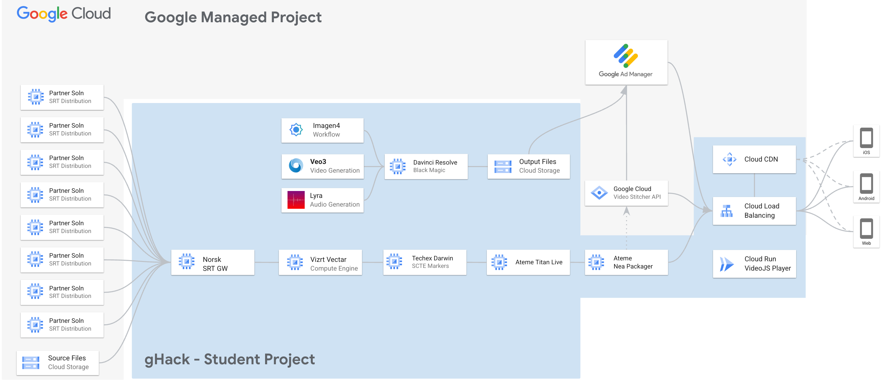

# Media & Entertainment on Google Cloud

## Introduction

The Media & Entertainment on Google Cloud gHack will take you on a whirlwind tour in the world of media technology and how it is being used in the modern world of cloud based and AI services.



In this gHack we will be ingesting feeds from a variety of sources: live SRT feeds, camera feeds, stored files and running it through a media switching workflow where you will collect the feeds, send them to a switcher, set up the playout on a FAST channel, setup HLS/DASH encoding for mobile and make it available to users over a CDN.

In addition to this, there will be a creative portion to this gHack where you will be using Google Clouds AI creation tooling: Veo, Imagen and Lyra to create shots and then edit them together in a video editor to create an advertisement. This will then be sent to Google Ad Manager and consequently using the Google Video Stitcher API the advert will be added to your FAST channel at various points.

## Learning Objectives

In this hack you will get hands on experience with both first party Google Cloud tooling for media as well as third party tools that are industry standards and used extensively in the ecosystem:

#### Google Cloud First Party
- Veo for AI driven video generation
- Imagen for AI driven image generation
- Lyra for AI driven music generation
- Gemini Live API for inference on live streams
- Google Ad Manager & Video Stitcher API for ad insertion and delivery
- Google Cloud CDN for delivery of video feeds to end users
- Google Cloud Compute & Storage for the backbone of everything

#### Media Technology Partners
- Norsk for Routing SRT Video Streams
- Vizrt Vectar for video switching / Vision mixing
- TechEx Darwin for inserting SCTE-35 Ad Markers
- Ateme Titan Live for Encoding
- Ateme Nea Live for ABR Packaging
- Davinci Resolve for remote video editing

## Challenges

- Challenge 1: Get creative with the help of AI
- Challenge 2: Gather up those feeds and spit 'em out
- Challenge 3: Get in the Mix
- Challenge 4: Ready for some Ads?
- Challenge 5: Let's Play Out!
- Challenge 6: Get your channel to the masses
- Challenge 7: Sit back, relax, and watch TV

## Prerequisites

- Basic knowledge of GCP
- Access to a GCP environment (will be provided in this gHack)
- Licenses for the third party software (will be provided in this gHack)

## Contributors

- Chris Hampartsoumian
- Jorge Sanchez
- Chanka Perera
- Gino Filicetti
- Michael Bychkowski

## Challenge 1: Get creative with the help of AI

### Overview
- Log into the Google Cloud Console with your student account
- Use Vertex AI and Media Studio to generate some ad creative
- Save/Upload your videos to a cloud bucket

### Details
- Log into the [Google Cloud Console](https://console.cloud.google.com/) with your student account 
- Your coach will provide your Student ID and password. Each Student ID uses the same password. We recommend using incognito mode in Chrome for the student account.
- Your coach will help you get logged into Google Cloud Console
- Locate Vertex AI and Media Studio or use [this link](https://console.cloud.google.com/vertex-ai/studio/media).
- You can find the Veo [documentation here](https://cloud.google.com/vertex-ai/generative-ai/docs/video/overview). 
- Try to complete this challenge in 90 minutes. Each team should upload a maximum of two 'ad' videos to the following Google Cloud Storage Bucket:
    - `gs://hackfest-ad-creative/`
- You should see 10 folder teams in there, place two ads for your team in the respective folder.
- Your coach can help you get the videos uploaded

## Challenge 2: Gather up those feeds and spit 'em out

### Overview
- Load Norsk Studio. (blank canvas)
- Drag an SRT Ingest component to the canvas, connect to camera source1
- Repeat for camera source 2, 3 and 4.
- Create an SRT Egest component set x,y,z (if req'd, TBD).
- Note down SRT locations, you'll need them in the next step.

### Details
[Norsk Documentation](https://norsk.video/)

Find the Norsk server on your environment, use the public ipaddress to access the norsk-studio 

Example: `https://<publicip_of_norsk_instance>/`
Your coach will provide login credentials 

First, we'll add the four input sources. These are all **SRT Ingest (Caller)** , meaning Norsk will "call" a remote source to pull the stream.

We have 12 SRT sources running on following instances. 

```
IP: 34.147.220.43 port 5121-5126
IP: 35.246.1.71 port 5121-5126
```

So distribute the load between these servers 

1.  In the **Component Library** on the left, find the **Inputs** section.
2.  Click and drag the **SRT Ingest (Caller)** component onto the main canvas. Repeat this three more times, so you have four input nodes in total.
3.  Click on each node to open its configuration panel and enter the details as follows, 
    - **Input 1:**
        - `displayName`: camera1
        - `host`: 34.147.220.43 
        - `port`: 5121
        - `streamId`: camera1
        - Click Save
    - **Input 2:**
        - `displayName`: camera2
        - `host`: 34.147.220.43 
        - `port`: 5122
        - `streamId`: camera2
        - Click Save
    - **Input 3:**
        - `displayName`: camera3
        - `host`: 35.246.1.71 
        - `port`: 5123
        - `streamId`: camera3
        - Click Save
    - **Input 4:**
        - `displayName`: camera6
        - `host`: 35.246.1.71
        - `port`: 5126
        - `streamId`: camera4
        - Click Save

#### Step 2: Add Your Output Destinations 

Next, you'll add the four output destinations. The configuration specifies these should be **SRT Listener (Egest)** nodes. This means Norsk will "listen" for a remote player or device to connect and receive the stream.

1.  In the **Component Library**, find the **Outputs** section.
2.  Click and drag the **SRT Listener (Egest)** component onto the canvas. Repeat this three more times. It's good practice to place them to the right of your input nodes.
3.  Configure each listener with its unique port:
    - **Output 1:**
        - `displayName`: srt-listener-camera1
        - `port`: 5111
    - **Output 2:**
        - `displayName`: srt-listener-camera2
        - `port`: 5112
    - **Output 3:**
        - `displayName`: srt-listener-camera3
        - `port`: 5113
    - **Output 4:**
        - `displayName`: srt-listener-camera6
        - `port`: 5116

#### Step 3: Connect the Nodes

The final step is to connect your inputs to your outputs. This tells Norsk where to send the media from each source. Your goal is to create four parallel, independent streams.

1.  Hover your mouse over the **camera1** node until a small circle appears on its right side. This is the **output handle**.
2.  Click and drag from the output handle of the **camera1** node to the input handle (the circle on the left) of the **srt-listener-camera1** node. A line will appear, showing the connection.
3.  Repeat this process for the remaining pairs, Now you can save your config as a YAML file for future use. 
    - Connect **camera2** to **srt-listener-camera2**.
    - Connect **camera3** to **srt-listener-camera3**.
    - Connect **camera4** to **srt-listener-camera4**.

## Challenge 3: Get in the Mix

### Overview
- Connect to Vizrt using either Teamviewer or HP Anywhere
- Configure inputs as the SRT sources from Challenge 1
- Verify you can transition (video mix) between sources, 1,2,3 and 4
- Configuire an SRT output from Vectar, note down the details, you'll need them in the next challange

### Details
[VizRT Vectar Product Guide](https://www.vizrt.com/vizrt/remote/viz-vectar-plus/)

In this challenge, participants will work with a professional video mixing tool, Vizrt Vectar. The main tasks are configuring inputs from the previous step and creating a new output stream.

Pre-requisite: One or two team members will need to download and install the HP Anywhere PCoIP Client (formerly known as Teradici)
You can find the download for Mac, Windows, Linux and Chromebooks [here](https://anyware.hp.com/find/product/hp-anyware). 
You will need to register with hp.com to download this software. This software is needed for anyone who wants to use Vizrt Vectar Vision mixing software or Black magic Davinci Resolve post production software. 

Your coach will provide the Windows Username & Password for the Vizrt Vectar. You will need this when you connect to the machine.

1.  **Connect to Vizrt Using HP Anywhere:** Get the Windows username and password from the coach
2.  **Configure Inputs:**
    - Within the Vectar interface Press the Setup button at the top of the screen
    - Configure Input 1 but locating input 1 in the setup screen and clicking the 'Configure' wheel at the end of the row.
    - In the dialoug box that opens, from the source drop down menu chooses Local -> Add IP Source....
    - In the Soure Manager Dialog that opens, click the configure wheel next to camera1
    - In the Configure SRT Input Connection dialog box that opens, enter Camera1 in the Connection Name field
    - In order to know the server URL, check the internal IP address of the ibc-ghack-norsk-gw-vm in Compute Engine. In this example, it is 10.164.0.5, yours may be different.
    - In the Server URL enter srt://10.164.0.5
    - In the port Number enter 5111 which was the port number allocated to camera1 in Norsk.
    - Press Okay. (You will see a message about resetting your session, but we will add the other cameras first)
    - Repeat the process for Camera 2, Camera 3 and Camera 4
    - Now we need reset vizrt to receive the steams.
    - Go to File -> Exit (you may need to position your mouse at the top of the screen to get the File Menu to appear.
    - Press Exit - when asked are you sure you want to exit.
    - This takes you to Kiosk mode, now click start Live Production in the bottom Right Corner.
    - Viz takes a while to come back, when it's back you still need to configure the inputs.
    - For Input1 Thumbnail, click the configure wheel in the bottom right of the thumbnail
    - In the Input1 Dialog box, select Source -> Local -> Camera1
4.  **Verify Transitions:**
    - After configuring the inputs, the four camera sources should appear in Vectar's source preview monitors.
    - Guide them to use the Vectar's switcher controls (e.g., clicking on sources to put them in 'Preview' and using a T-bar or 'Cut'/'Auto' buttons to transition them to 'Program'). This confirms that the streams are correctly ingested and that Vectar is operational.
5.  **Configure SRT Output:**
    - Similar to Norsk, they now need to configure an output stream. This is typically done in the 'Output' or 'Streaming' settings.
    - To Configure the output Locate the button that says 'STREAM' in the top menu, press the configure wheel next to that button
    - Locate the output labelled SRT Stream that has a tick mark next to it, click the Configure wheel to the right
    - In the Configure SRT Connection Dialog box, choose Connection Type drop down -> Host Local SRT Stream
    - Leave the Server Port at 10000
    - Note the Access URL, this will  be used downstream
    - Press Close, twice.
    - Now press the Stream button at the top of the screen. 
    - They must set the output type to **SRT**. Vectar will provide a new SRT URL for its program output.
    - **Participants must note down this new SRT output URL** for the next challenge.

## Challenge 4: Ready for some Ads?

### Overview
- Connect to Techex Darwin
- Connect the SRT ingest point to the output from Vizrt Vectar in the previous step
- Press the button in Techex Darwin to insert a scte-35 marker into the program out stream
- Configure the SRT output

### Details
[Techex Darwin Documentation](https://www.techex.tv/technologies/txdarwin)

1.  **Connect to Techex Darwin:** Participants will connect to the Darwin UI via its web interface.
2.  **Configure SRT Ingest:**
    - Create a new input and configure it to be an **SRT source**.
    - Paste the SRT output URL from Vizrt Vectar (Challenge 2) into the ingest configuration. The program feed from Vectar should now be flowing into Darwin.
3.  **Insert SCTE-35 Marker:**
    - The Darwin interface has a feature for live stream manipulation. Guide participants to find the button or control labeled **"Insert SCTE-35 Marker"** or similar.
    - Pressing this button injects the ad signaling marker into the transport stream in real-time. This doesn't change the video content itself but adds metadata that downstream systems will use.
4.  **Configure SRT Output:**
    - Create a new SRT output for the stream that now contains the SCTE-35 marker.
    - **Ensure participants copy the SRT output URL from Darwin**, as it will be the input for Ateme Titan Live.

## Challenge 5: Let's Play Out!

### Overview
- For Ateme Titan Live and Nea follow [this guide](https://docs.google.com/document/d/1atvTkXzYpa7SpYjcBd2A7WnF2uO9oE-P2DS8ClY12y4/edit?tab=t.0).

### Details
[Ateme Titan Live Documentation](https://www.ateme.com/product-titan-software/)

Ateme Titan Live is a broadcast-grade encoder. In this step, participants will configure it to receive the final produced stream and prepare it for delivery over the web. As shown in the architecture diagram, Titan Live is the final step before the stream is handed off to Google Cloud's media services.

1.  **Connect to Titan Live:** Participants should log in to the Titan Live web interface.
2.  **Configure New Input:**
    - They need to create a new input channel.
    - Set the input source type to **SRT**.
    - In the configuration, they will paste the **SRT output URL from Techex Darwin** (from Challenge 3).
3.  **Configure Output/Profile:**
    - The primary goal is to have Titan Live process the stream. A default encoding profile (e.g., H.264/AAC in an HLS format) should be sufficient.
    - The crucial part of the configuration is setting up the destination. In our architecture, Titan Live will hand off to the **Ateme Nea Packager**, which then interfaces with the **Google Cloud Video Stitcher API**. This may be a pre-configured output profile in Titan Live that participants just need to select. The output should be configured to create HLS manifests.

## Challenge 6: Get your channel to the masses

### Overview
- Clone Git hub repo for VideoJS Player
- Publish to Cloud Run
- Edit the code of the website and deploy the updated version (optional)

### Details

This challenge moves from broadcast-specific tooling to a standard cloud workflow: deploying a web application using a containerized service.

1.  **Clone Git Repository:**
    - Participants need to use a terminal with `gcloud` and `git` installed.
    - They should clone the provided repository for the VideoJS Player.

    ```shell
    git clone https://github.com/JorgeRSG/sample-video-player.git
    cd sample-video-player
    ```
2.  **Publish to Cloud Run:**
    - The easiest way to deploy is using the `gcloud run deploy` command from the root of the cloned repository. This command will build the container image from the source and deploy it. You can find more information [here](https://cloud.google.com/run/docs/deploying-source-code) 
    - Participants can name their service whatever they like (e.g., `ghack-player`).
    - The `--allow-unauthenticated` flag is important to make the player publicly accessible for testing.

    ```shell
    gcloud run deploy ghack-player --source . --region europe-west1 --allow-unauthenticated
    ```

    > **NOTE**: After the deployment succeeds, the command line will output the service URL. **This is the URL for the live channel player.**
3.  **Edit the code of the website and deploy the updated version (optional):**
    - Participants can change the look and feel of the published service if they want to. Open the code of the repository in the IDE of your choice and make some edits. Changing the title of the website and the main header are good options.
    - Once the changes are made, save the files and the new version of the service.

## Challenge 7: Sit back, relax, and watch TV

### Details

This is the final step where everything comes together. Participants will see their live stream, complete with an advertisement inserted via the Google Cloud Video Stitcher API, triggered by the SCTE-35 marker they inserted earlier.

1.  **Open the Player:**
    - Participants should navigate to the **Cloud Run service URL** they obtained in the previous challenge.
2.  **Verify the Stream:**
    - The VideoJS player should load and start playing the live video feed originating from the Norsk sources, mixed in Vectar, and processed by Darwin and Titan.
3.  **Look for the Ad:**
    - The key to success for this entire hack is seeing an advertisement. The SCTE-35 marker inserted in Challenge 3 signals the Google Cloud Video Stitcher API (via the Ateme components) to insert an ad from Google Ad Manager.
    - When the ad plays, it confirms the entire workflow is functioning correctly. If no ad appears, common issues to troubleshoot are:
        - The SCTE-35 marker was not inserted correctly in Darwin.
        - The integration between Titan Live and the Video Stitcher API is misconfigured.
        - There is an issue with the Google Ad Manager campaign.
