# Media & Entertainment on Google Cloud: Ateme Configuration Guide

| TITAN Live | IP | \[Get the external IP from Compute Engine\] |
| :---- | :---- | :---- |
|  | UI port | HTTPS / 443 |
|  | Credentials | Administrator / Hackfest@IBC |
| NEA Live | IP | \[Get the external IP from Compute Engine\] |
|  | UI port | 8080 |
|  | Credentials | Administrator / Hackfest@IBC |

## Configuration

First log into Google Cloud Compute Engine Console and list your VM’s  
[https://console.cloud.google.com/compute/instances](https://console.cloud.google.com/compute/instances)  
Observe the External IP address of the VM named ateme-tl  
Connect to that IP address using https//\[IP ADDRESS\]

- Once you see the Titan UI, select the Administrator from the drop down in UI and enter the password for Administrator

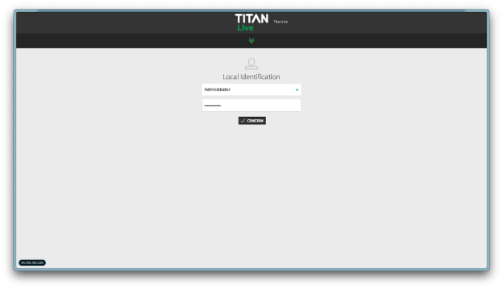

- Click on “+ NEW SERVICE”

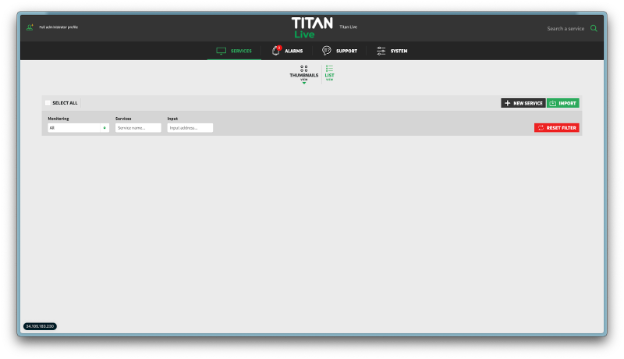

- Click on “DEVICES” tab on the left of the screen, click on: “HLS FMP4/CMAF” and then choose press ‘USE’ next to: “CMAF INGEST NEA”

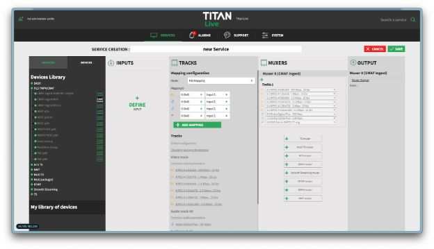 

- Move one column to the left to the column with the title: INPUTS  
- Click on “\+ DEFINE INPUT”. In the INPUT CONFIGURATION pane that opens, under ‘Input type’ change from IP and choose: “SRT”.  
- Change SRT Mode to Caller  
- Input URL \- enter srt://\[IP\_ADDR\_DARWIN\]:\[SRT\_PORT\] where:  
  IP\_ADDR\_DARWIN is the Internal address of Techex Darwin as shown in GCP Console   
  SRT\_PORT is the PORT that Techex Darwin is listening on  
  For example: srt://10.154.0.29:6101  
  The input URL should change to green when the syntax is correct.   
  You may also connect to the output from Vizrt Vectar

- Press the Green Tick at the top. Then click on ‘PROBE’ to test the reception of the source.  
- It will say Probe in progress for around 15 seconds then you should the 3 x PID’s from the Source similar to:

  1 x Video  
  1 x Audio  
  1 x SCTE-35 Metadata

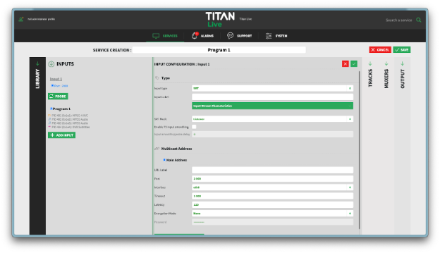

- Next, move to the next column with the title TRACKS to enable the SCTE-35 Passthrough.  
- At the bottom, Click on the text below ‘Data Track \#0’ change the field labelled ‘Data Type’ from TTL to ‘SCTE-35 Pass-through’ and  change “Stream Conditioning” from Disabled to ‘On SCTE-35 Splice points’.  
- Click the Green Tick at the top of the Tracks

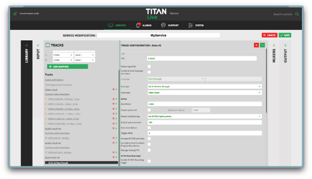

- While still in the Tracks Column, under ‘Audio track \#0’, click on “Common audio parameters”. In the pain that opens select MPEG AAC instead of Dolby Digital Plus as codec  
- Click on the green tick.  
    
- Next, move to the output column on the right. Click on ‘Muxer Output’ to open the output pane.   
- Tick the box that says: Enable  
- In the CMAF ingest url, change the URL to this pattern:  
  - http://\<nealive\_private\_ip\>:8008/live\_ingest/\<channel\_name\>.toml/

You can get the nealive\_private\_ip from the Compute Engine Console. It’s the 10.154.x.x address next to the VM called ateme-nl.   
https://console.cloud.google.com/compute/instances

For channel\_name, use channel1 or a name of your choice.  
Note, the CMAF Ingest URL must have a / after the .toml

An example CMAF ingest URL looks like this:  
http://10.154.0.38:8008/live\_ingest/channel1.toml/

Tick the Green Tick box in the top right corner

Click the Save Button in the top right corner to save your input to Titan Live.  
The screen where you enter the Output Setting and the CMAF Ingest URL:  
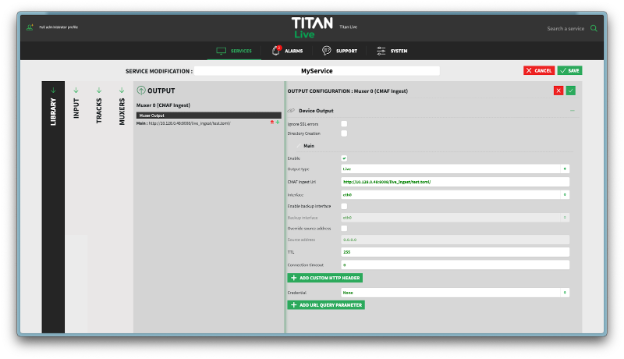

- When you click Save, you will be advised that it is creating a new template. Please give your template a name, call it: CMAF Inget Template or similar.  
- Give your Service a name in the box above the columns. Change the name from new Service to ‘gHack Programme Out’ ‘gHack Live’  
- Press the small Play Button in the Preview Window. You should see a low frame rate preview of the SRT stream coming into Titan Live

This completes the initial Titan Live Configuration, next, we will move to the Packager which is Nea Live.  
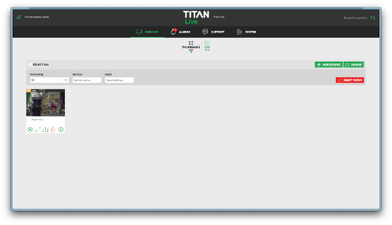

- Move to the NEA Live, connect to the UI with the “Administrator” user and the password provided. Get the External IP Address from the Google Compute Engine list of VM’s:  
  [https://console.cloud.google.com/compute/instances](https://console.cloud.google.com/compute/instances)  
    
  You need to connect using http on port 8080, so the URL should look similar to:  
  [http://35.234.156.153:8080/](http://35.234.156.153:8080/)  
    
  If you can’t reach the UI, check the Google Cloud Firewall and make sure there is a rule allowing traffic on port 8080  
    
  The Login Screen should look like this. Login as Administrator with the password at the top of this document.

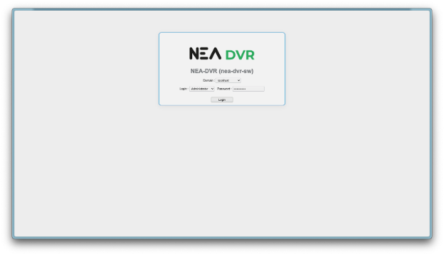

- Click on “Services” and then “Profiles”  
- First Click the button that says: ‘New Stream Adaption Family’  
- In the empty text entry field that opens, enter: SAF then click the Blue Tick on the right.

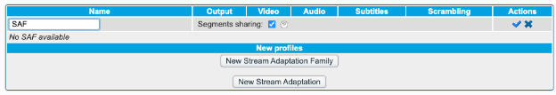

After ticking the Blue tick, it should look like this:

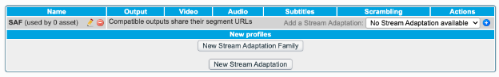

- Then click on ‘New Stream Adaptation’   
- Create an HLS Stream Adaptation with the name HLS  
- Choose Apple HLS in the drop down menu in the output column  
- Where it says ‘Splicing method’ change that to Template
- Where it says ‘Template to use’ change that to ‘hls-scte35-enhanced’
- Press the Blue tick on the right.

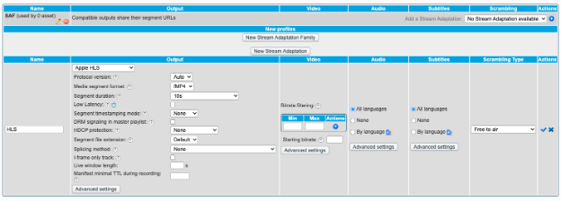

- Then click on ‘New Stream Adaptation’ again.  
- This time, create a DASH Stream Adaptation with the name DASH  
- Choose MPEG DASH in the drop down menu in the output column  
- Press the Blue tick on the right.

After creating the Stream Adaptation Family (SAF) and creating the two Stream Adaptions, you need to add the HLS and DASH Stream Adaptations to the Stream Adaptation Family (SAF). Use the small blue \+ button on the right. See circle in the following image. Press the button twice to add DASH and HLS to the SAF.

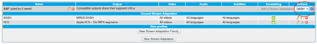  

After adding the Stream Adaptations to the Stream Adaptation Family (SAF), it should look like this:  

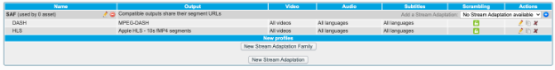

Next, we will create the Live Output Channel.

- Click on “Services” and then “Live” and finally click the “Add channel” button.  
- For ‘Channel name’ use the same channel name as the one used in the Titan Live output url in the Channel Name field. The suggested channel name was channel1  
- Note \- this name needs to be the same as the name in CMAF ingest URL.  
- For ‘Input Type’ Select ‘CMAF Ingest’ from the ‘Input Type’ drop down menu and select the Stream Adaptation Family we created earlier (SAF) from the drop down under Output (near the bottom of the page) and then hit the “Add” button.

Once you’ve clicked Add, the channel should go green. If it appears in Red, it’s not receiving the CMAF chunks from Titan Live. It takes about 30 seconds to turn green.

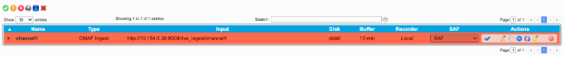

- Once the Channel Goes Green, it’s working. Like below.

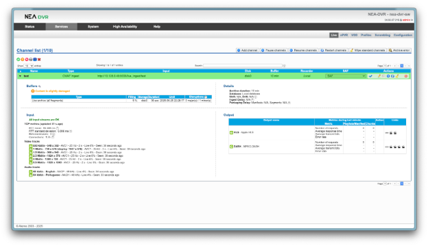

- You can get the MPD and DASH manifest links on the far right hand side by copying the link locations circled in red in the picture below.  
- They will come with the internal IP address, you won’t be able to connect from the Internet to such an IP Address. Be sure to replace the private IP in the link with the public IP of the instance if you want to connect to the manifest from outside the VPC.

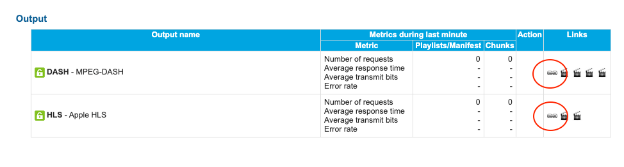

- The Link to the DASH manifest will look something like:   
  DASH Internal address: [http://10.154.0.38/live/disk0/channel1/DASH/channel1.mpd](http://10.154.0.38/live/disk0/channel1/DASH/channel1.mpd)  
- Needs to be converted to external address:  
  Something like: [http://35.246.70.251:80/live/disk0/channel1/DASH/channel1.mpd](http://35.246.70.251:80/live/disk0/channel1/DASH/channel1.mpd)  
- However note, that is over HTTP. Most Players and apps prefer https. A Google Cloud CDN Configuration has been prepared for you with https configured. The FQDN to use is: [https://team1.reallycloudy.com/live/disk0/channel1/DASH/channel1.mpd](https://team1.reallycloudy.com/live/disk0/channel1/DASH/channel1.mpd)  
- However, it will be either team1, team2, team3 \- ask your coach what team number you are.  
    
    
    
    
- The HLS manifest will look something like:  
  HLS Internal address: [http://10.154.0.38/live/disk0/channel1/HLS/channel1.m3u8](http://10.154.0.38/live/disk0/channel1/HLS/channel1.m3u8)  
    
- Needs to be converted to external address:  
  Something like: [http://35.246.70.251/live/disk0/channel1/HLS/channel1.m3u8](http://10.154.0.38/live/disk0/channel1/HLS/channel1.m3u8)  
    
- The Google Cloud CDN with https will look like:  
  Something like: [https://team2.reallycloudy.com/live/disk0/channel1/HLS/channel1.m3u8](https://team2.reallycloudy.com/live/disk0/channel1/HLS/channel1.m3u8)  
  (depending on your team number)

You can test these using Curl or with External Players. Such as the DASH Player.

curl \-s \-D \- [https://team2.reallycloudy.com/live/disk0/channel1/HLS/channel1.m3u8](https://team2.reallycloudy.com/live/disk0/channel1/HLS/channel1.m3u8)

Or use the DASH Reference Player:   
[https://reference.dashif.org/dash.js/nightly/samples/dash-if-reference-player/index.html](https://reference.dashif.org/dash.js/nightly/samples/dash-if-reference-player/index.html)  
Or this Google Player for HLS or DASH:  
[https://video-player-863535727365.europe-west4.run.app/](https://video-player-863535727365.europe-west4.run.app/)

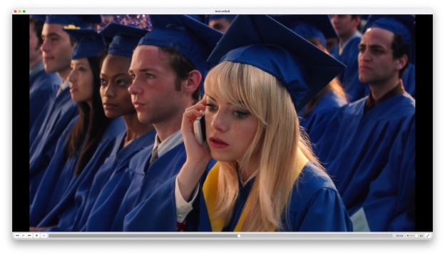

## Trouble Shooting of the channel doesn’t go Green

- If it’s in Red, check the VPC Firewall Rules and ensure that default-allow-internal is present  
- Connect to Titan Live over SSH from the Compute Engine Console, make sure you can connect to port 8008 of the internal ip Address of the Nea Live machine.