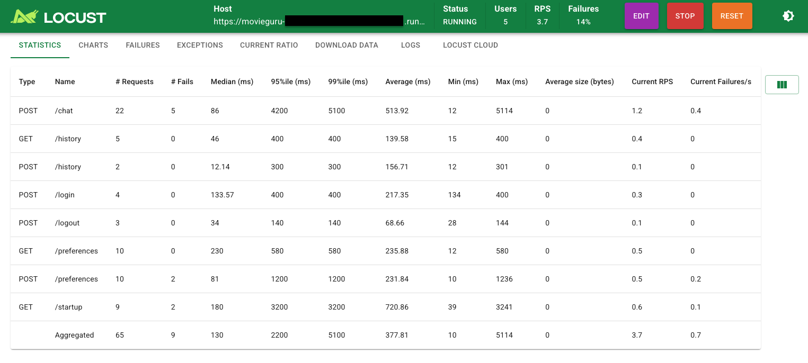

# Practical SRE

Welcome to the Practical SRE (Site Reliability Engineering) gHack! In this hands-on session, you'll step into the role of SREs and Product Owners for the **Movie Guru** GenAI app—a cutting-edge application that helps users find movies using natural language queries powered by AI. Your mission is to ensure that Movie Guru delivers a smooth, reliable, and responsive experience for its users.

The Movie Guru app's backend is currently running in your cloud environments and has been pre-instrumented to silently generate a wealth of metrics through the use of a load generator. This means that as you work on these challenges, you'll have access to valuable data reflecting its performance and user interactions, allowing you to make informed decisions throughout the workshop.

By the end of this workshop, you'll have developed a comprehensive reliability framework for Movie Guru, gaining practical SRE skills that can be applied to real-world systems.

Remember, if there is a term being used in the challenge you don't understand, look at the **Learning Resources** section at the bottom of the challenge text. Otherwise, **Google** can be your best friend.

## Learning Objectives

In this hack you will learn how to:

   1. Identify User Journeys
   1. Identify your stakeholders in an organization.
   1. Design realistic SLOs
   1. Understanding metrics dashboards in Google Cloud Monitoring.
   1. Create SLOs in Google Cloud Monitoring.
   1. Creating Alerts
   1. SRE best practices

## Challenges

- Challenge 1: Your first day as SRE
- Challenge 2: Yes, there are others
- Challenge 3: SLOs: Not Just Another Acronym
- Challenge 4: Let the monitoring begin
- Challenge 5: Setting Priorities for Reliability
- Challenge 6: SLOs on the dashboard
- Challenge 7: Stay alert
- Challenge 8: What's really UP, doc?

## Prerequisites

- Your own GCP project with Editor IAM role.
- `gcloud` command line tool
- `curl` command line tool

> [!NOTE]  
> We recommend using the Cloud Shell to run the challenges as it has all the necessary tooling already installed.

## Contributors

- Manasa Kandula
- Steve McGhee

## Challenge 1: Your first day as SRE

### Prerequisites

Before we start our first day as SREs, we are going to start up metrics collection so that we have a nice load of metrics to work with in later challenges. The load generator is preprovisioned and the address is provided to you by the coach.

#### Step 1: Make note of the necessary environment variables

- The values will be provided to you by the coach. Each team has its own set of values.
- Copy the values (after replacing the placeholders) into a notepad to be able to re-run when needed.
- You might need to re-apply them before running command-line commands for all challenges.
- The cloud console terminal times-out after around 30 minutes of inactivity.

  ```sh
  PROJECT_ID=<your project id>
  METRICS_APP_ADDRESS=<the metrics app address>
  LOCUST_ADDRESS=<your load generator address>
  ```

#### Step 2: Generate Load on the Application

- Open your browser and navigate to the Locust Load Generator address ($LOCUST_ADDRESS). You should see a screen similar to the one below:

   

- Fill out the *Start new load test* form with the following values:

  - Number of users at peak: 5
  - Ramp up: 1
  - Host: <METRICS_APP_ADDRESS> (the default value in the locust app should already point to this address)
  - Runtime: 7h (under Advanced options)
  
   This configuration will gradually increase the load on the backend, spawning around 5 simulated users over the course of 7 hours.

- Once the load test begins, Locust will swarm various backend endpoints, simulating traffic as users interact with the application. You should see something similar to this:

  

### Introduction

Ok. You have started on Day 1 as the newly formed SRE team for **The Movie Advisory Company**, a start-up whose first product is the **Movie Guru** app.

### Description

This challenge involves exploring the Movie Guru app and documenting typical user journeys.

- **Access** and **Explore** the App

  Go to the Movie Guru User video. This video shows you the way a typical user interacts with the app, and identfies User Journey's associated with them.

  [](https://www.youtube.com/watch?v=XbWWlSabxmw)
  
- **Document User Journeys**

  - Select at least two distinct user journeys within the **Movie Guru** app.
  - Clearly document each journey using this format:
    - Journey Name: [Give a descriptive name]
    - Goal: [What does the user want to achieve?]
    - Steps: [List the specific actions the user takes to achieve the goal]

> [!NOTE]  
> If you need a refresher on what a user journey is, visit the section on [What is a user journey?](#what-is-a-user-journey) (in **Learning Resources**).

### Success Criteria

To successfully complete this exercise, you should have:

- **Identify at least 2 user journeys:** Two UJs in the format mentioned above for the **Movie Guru** app written down.
- Remember, there is no perfect answer.

### Learning Resources

#### What is a User Journey?

In the context of SRE (Site Reliability Engineering), a user journey (UJ) describes the series of steps a user takes to accomplish a specific goal while interacting with a service. It focuses on the user's perspective and their experience with the system's performance and reliability. It is like a map that shows the steps a user takes to achieve a goal while using our service. We use this map to understand user behavior, their expectations, and improve their experience.

Here is an example UJ for a typical online webshop:

##### Example: Adding an Item to an Online Shopping Cart

Goal: Add a desired product to their shopping cart.
Steps:

- Browse an e-commerce website.
- Find a product they want to purchase.
- Click the "Add to Cart" button.
- View the updated shopping cart with the added item.

**Compare your journeys to the example below:**  See how your ideas align with the user journeys provided. The examples cover some common interactions, but there will be other ways users interact with the app. There is no perfect answer.

**User journeys are hypotheses:** They are your best guess about how users will interact with the app.  These journeys will need to be refined over time based on real user data and feedback.

### Example User Journeys for Movie Guru

Here are a few examples of user journeys for the Movie Guru app:

#### UJ 1: Access the App

**Goal:**  Start using the Movie Guru app and view the main interface.

**Steps:**

1. Go to the Movie Guru login page.
1. The user enters their username.
1. Click the "Login" button.
1. View the main page. This contains the chatbot, with any chat history loaded (if it exists), and a view of featured films, and profile info (if it exists).

#### UJ 2: Get Useful Responses

Goal: Receive helpful and relevant responses from the Movie Guru chatbot.

Steps:

1. Initiate Chat: The user opens the chat interface in the Movie Guru app.
    - The app may have an initial profile with some initial preferences to guide the interaction.
2. User Receives a Response:
    - Movie Guru provides an initial response based on the user's input or previous interactions.
3. User Explores the Response:
    - The user reads and interprets the information provided.
    - The user may ask follow-up questions or request clarification.
4. User Provides Feedback:
    - The user provides explicit feedback (e.g., "This is helpful!" or "I need more information on this").
    - The user may rephrase their query or ask for alternative suggestions.
5. User Receives Refined Response:
    - Movie Guru refines its response based on the user's feedback, providing more relevant and helpful information.
6. Repeat Steps 2-5 (Optional): The user can continue to interact and provide feedback to further refine the conversation.
7. End Chat: The user ends the chat session.

#### UJ 3: Update Preferences

**Goal:** Update invalid preferences to personalize future recommendations.

**Steps:**

1. Access Preferences: The user navigates to the "Preferences" or "Profile" section of the home page.
1. View Existing Preferences (Optional): The app displays any existing preferences the user has previously saved. This could include:
   - Liked/dislikes genres
   - Liked/disliked actors
   - Liked/disliked directors
1. Delete Wrong/Invalid Items: The user interacts with the interface to adjust their preferences. This might involve:
1. Receive Confirmation (Optional): The app provides feedback to the user that their preferences have been successfully saved by not rendering the preference again.

## Challenge 2: Yes, there are others

### Introduction

Your second day as an SRE at **The Movie Advisory Company** started with a bang. The CEO, clearly fueled by an excessive amount of coffee, stormed into your workspace, ranting about Movie Guru's unreliable performance.  **"Users are complaining about the site not always being reachable!" he yelled, "This is unacceptable! Movie Guru needs to be up 100% of the time!"** He demanded a solution immediately. With a panicked look in his eyes, he pointed you towards the platform team (a single, overworked engineer) and the application team (known for their eccentric work habits).

Your challenge: Figure out how to improve the app's stability, manage the CEO's expectations, and prevent a complete meltdown. Welcome to the world of SRE!

### Description

1. **Initial Response to CEO:** Analyze the CEO's demands in the context of SRE principles. Are there any parts of his demand that clash with those principles? Discuss your analysis with your team-mates and coach. You can also do a short role-play with one of you acting as the CEO.

   > [!NOTE]  
   > The focus on the role-play should be on articulating your reasoning and how it aligns with SRE principles. The focus shouldn't be on trying to persuade the CEO to change their mind (this isn't a communication/negotiation workshop).

1. **Information Gathering:** You're not alone in this quest for stability! To improve Movie Guru's stability, you'll need to collaborate with others. Identify the key stakeholders within the company and determine what information you need from each of them to achieve your reliability goals.

### Success Criteria

To successfully complete this challenge, you should be able to demonstrate the following:

**Initial Response:**

- Explained why 100% uptime is an unrealistic and potentially harmful goal.
- Clearly articulated the relationship between reliability and cost.
- Emphasized the importance of aligning reliability targets with user needs and business priorities.
- [BONUS] Communicated the need to balance reliability investments with other factors like innovation.

**Information Gathering:**

- Identified key stakeholder teams within The Movie Advisory Company (including technical teams, product owners, and business stakeholders).
- Explained the role of each stakeholder group in ensuring Movie Guru's reliability.
- Specified the information needed from each stakeholder group to assess the current state of reliability and plan for improvements.
- Demonstrated an understanding of the importance of collaboration and communication in achieving reliability goals.

### Learning Resources

- Realistic Expectations on Reliability: It's essential to communicate that 100% uptime is neither feasible nor necessary. Regularly reinforcing this helps align stakeholders with a balanced, achievable reliability strategy.

- Stakeholder Engagement: Involve key technical and business stakeholders, such as development, platform, QA teams, and product managers. Each provides crucial insights into stability, user needs, and resource constraints.

- Gathering Critical Information: Collect performance data, architecture diagrams, deployment processes, capacity planning information, and incident response details. This helps build a clear picture of the current system's strengths and areas for improvement.

- Balanced Reliability Goals: By aligning SLOs with both user needs and practical limits, we can drive improvements that support long-term stability and innovation, fostering trust and a sustainable reliability model.

## Challenge 3: SLOs: Not Just Another Acronym

### Introduction

In the previous challenge, you dove deep into Movie Guru's reliability landscape, discovering a young app with room to grow. You learned that the company currently lacks a robust way to measure and define user experience, relying instead on the unsustainable goal of constant uptime.

Armed with the insights gained from exploring the app, collaborating with stakeholders, and understanding the system's design, challenges, and user feedback, it's time to take a crucial step: defining SLIs and SLOs for User Journeys. If you need a refresher on [SLIs or SLOs](#learning-resources-2), see the **Learning Resources**.

### Description

**Make guesses for this exercise whenever you don't have real information to go on.**

1. **Choose Your Journeys:** Select two key user journeys for **Movie Guru**.
2. **Choose Your SLIs:** What SLIs would you use to see that your application is healthy (as experienced by the user)?
3. **Craft Your SLOs:** Define relevant SLOs for each chosen user journey using the SLIs identified above.
   - Consider what aspects of reliability matter most to users in each journey and how you can measure success.
   - See **Learning Resources** for an example.

### Success Criteria

- You have selected SLIs for your app.
- You have crafted 2 SLOs for the **Movie Guru** app. Each SLO includes the following components, demonstrating a comprehensive understanding of how to define and measure service level objectives:
  - **Objective:** A clear statement of the reliability target for a specific user journey or feature. The value has to have a good business reason behind it.
  - **Time window:** The period over which the SLI is measured (e.g., 30-day rolling window).
  - **Service Level Indicator (SLI):**  A metric used to assess the service's performance against the objective (e.g., availability, latency,  quality, throughput, timeliness). Make your best guess here.

### Learning Resources

- [The Google SRE book](https://sre.google/sre-book/table-of-contents/)

#### What are SLIs?

Service Level Indicators (SLIs) are specific measurements that show how well a service is performing. They help teams understand if they are meeting their goals for reliability and quality. For example, one SLI might measure how often a website is available to users, while another could track how quickly the website responds to requests. An SLI can also look at the number of errors or failures compared to total requests. These indicators are important because they help teams see where they can improve their services.

#### What are SLOs?

Based on Google's SRE framework, Service Level Objectives (SLOs) are target values or ranges for a service's reliability, measured by Service Level Indicators (SLIs). SLOs help you define the desired user experience and guide decisions about reliability investments. They act as a key communication tool between technical teams and business stakeholders, ensuring everyone is aligned on what level of reliability is acceptable and achievable.  Crucially, SLOs should be based on what matters most to users, not arbitrary targets like 100% uptime.

Example SLO:

For the user journey of "adding a product to an online shopping cart", a possible SLO could be:

- **99.9% of "Add to Cart" requests should be successful within 2 seconds, measured over a 30-day rolling window**.
This SLO focuses on the key user action ("Add to Cart") and sets targets for both availability (99.9% success rate) and latency (2-second response time). It's directly tied to user experience, ensuring a smooth and efficient shopping experience.
The addition of "measured over a 30-day rolling window" specifies the timeframe for evaluating the SLO. This means that the success rate and response time are calculated based on data collected over the past 30 days. This rolling window provides a continuous and up-to-date assessment of the SLO's performance.

## Challenge 4: Let the monitoring begin

### Introduction

The platform team introduces you to the app's Custom Monitoring Dashboards in the Google Cloud Console.
The platform team's dashboards use metrics collected from the **movie-guru backend service**.

- **Login Dashboard**: Tracks the health and efficiency of the user login process.
- **Startup Dashboard**: Monitors the performance of the post-login, **Main Page Load**.
- **Chat Dashboard**: Provides a comprehensive view of user interactions with the chatbot, including engagement, sentiment, and response times.

> [!NOTE]  
> Metrics in the dashboards may appear blocky because we’re simulating load with only a few users. Achieving smoother graphs generally requires a larger user load.

### Description

**Make guesses for this exercise whenever you don't have real information to go on.**

1. **Browse the existing dashboards**
1. **Assess user experience**
     - Based on the metrics and your own experience, describe how users likely perceive the app's performance.  
1. Note down which aspects of the app need serious improvement.
1. **Choose Your SLIs:**
   - SREs need to document carefully the metrics they use to construct their SLIs (referesher on [what are SLIs](#what-are-slis)).
   - Your challenge is to first define the SLIs (on paper) by examining the dashboards to identify relevant metrics.
   - Write them down in definition form as illustrated below.
     - Example Availability SLI: The availability of `service abc` is measured by the ratio of successful startups recorded as a ratio of `metric x` to the total attempts in `metric y`.
     - Example Latency SLI: The latency of `service abc`, measured by the `metric x`, is tracked as a histogram at the 10th, 50th, 90th, and 99th percentiles.

**Tips**: Look at the [Business Goals](#business-goals) below to narrow down your search to just a few SLIs relevant for this and the upcoming exercises. If you aren't sure of the difference between an **SLI** and a **metric**, look at how [metrics differ from SLIs](#how-do-metrics-differ-from-slis).

#### Business goals

- **Business goal 1:** The main page should be accessible and load quickly for users.
- **Business goal 2:** The chatbot should respond quickly to users and keep them engaged.

### Success Criteria

- You've chosen SLI based on the metrics that are being collected from the server.
- These SLIs can measure the health of the app based on the two business goals.

### Learning Resources

#### How do metrics differ from SLIs?

Metrics and Service Level Indicators (SLIs) both provide valuable data about a system’s performance, but they serve distinct roles. Metrics are broad measurements that capture various aspects of system activity, such as CPU usage, latency, and error rates. They form the foundational data used to observe, monitor, and troubleshoot a system. SLIs, on the other hand, are carefully selected metrics that directly reflect the quality of service experienced by users. Focusing on factors like availability, latency, or error rate, SLIs gauge how well a service is meeting specific reliability targets known as Service Level Objectives (SLOs). While metrics provide a comprehensive view of system health, SLIs narrow the focus to measure the specific qualities that most affect user satisfaction, aligning system performance with business objectives.

#### Latency Metrics

- These metrics (for all dashboards) measures how long it takes for users to get a successful response from the server.
- It provides insights into the speed and efficiency of a specific server process (eg: login, chat, etc).
- Lower latency means faster logins, contributing to a better user experience.
- The dashboard displays several percentiles of login latency (10th, 50th, 90th, 95th, 99th), giving you a comprehensive view of the login speed distribution.
- This metric is also displayed as a line chart, allowing you to track changes in latency over time and identify any performance degradations.

## Challenge 5: Setting Priorities for Reliability

### Introduction

Now that you’re familiar with the business goals and the SLIs that measure them, and you know your app's current performance, it's time to set improvement goals.
We'll be setting achievable targets for your teams to achieve in the short-term objectives (a few months) and aspirational long-term objectives for the app.

### Description

> [!NOTE]  
> For this exercise, make educated guesses if exact information isn’t available.

Just like SLIs, SLOs (refresher on [what are SLOs](#what-are-slos)) are also documented on paper before implementing them in monitoring tools. That's what you will do here.

1. Define **Achievable** SLOs for the [business goals](#business-goals-1) below.
   - Set realistic, achievable values that you’d like the app to reach in the next month. Use the app’s current performance as a reference point. Your application needs to walk before it can run.

2. Define **Aspirational** SLOs (on paper) for the [business goals](#business-goals-1) below.
   - Picture Movie Guru a year from now: an efficient, user-delighting tool (but still short of perfection—since unicorns and 100% targets are rare in the real world). These SLOs should represent goals your team can work toward in the coming year.

#### Business goals

**Business Goal 1**: Ensure users can access the main page quickly and reliably.

- Define SLO 1a: Availability SLO
- Define SLO 1b: Latency SLO

**Business Goal 2**: Ensure the chatbot responds quickly and keeps users engaged.

- Define SLO 2a: Quality SLO (based on user engagement)
- Define SLO 2b: Latency SLO

### Success Criteria

- You’ve established **Achievable** SLO objectives for the short-term.
  - Each SLO has a target value and a compliance period (see examples below)
  - Example SLOs for a fictional shopping cart service:
    - Availability: 99.9% of the users are able to visit the shopping cart measured over a 24-hour rolling window.
    - Latency:  99% of users should be able to load the shopping cart within 600 milliseconds, measured over a 24-hour rolling window.
- You’ve set **Aspirational** SLOs based on an ideal user experience to aim for over the next year.
- Your objectives are backed by logical business assumptions.

## Challenge 6: SLOs on the dashboard

### Prerequisites

Run the following command in the **Cloud Shell terminal** (or any CLI with curl installed).

> [!NOTE]  
> With this command we're priming the backend that generates metrics to behave in a specific way. You are simulating fixes made to the app after 1-2 months work.

```sh
## Check if the METRICS_APP_ADDRESS env variable is set in your environment before you do this.

curl -X POST \
  -H "Content-Type: application/json" \
  -d '{
  "ChatSuccess": 0.95,
  "ChatSafetyIssue": 0.1,
  "ChatEngaged": 0.70,
  "ChatAcknowledged": 0.15,
  "ChatRejected": 0.05,
  "ChatUnclassified": 0.1,
  "ChatSPositive": 0.6,
  "ChatSNegative": 0.1,
  "ChatSNeutral": 0.2,
  "ChatSUnclassified": 0.1,
  "LoginSuccess": 0.999,
  "StartupSuccess": 0.95,
  "PrefUpdateSuccess": 0.99,
  "PrefGetSuccess": 0.999,
  "LoginLatencyMinMS": 10,
  "LoginLatencyMaxMS": 200,
  "ChatLatencyMinMS": 906,
  "ChatLatencyMaxMS": 4683,
  "StartupLatencyMinMS": 400,
  "StartupLatencyMaxMS": 1000,
  "PrefGetLatencyMinMS": 153,
  "PrefGetLatencyMaxMS": 348,
  "PrefUpdateLatencyMinMS": 363,
  "PrefUpdateLatencyMaxMS": 645
}' \
$METRICS_APP_ADDRESS/phase 
```

### Introduction

This challenge is about setting up **Achievable** Service Level Objectives (SLOs) for the app in **Cloud Monitoring Suite**. These are targets you expect to meet in 1-2 months after making a few improvements to the app.

### Description

1. **Create a service in the UI**
    > [!NOTE]  
    > You can also create these via the API. Check [Tips](#tips) in **Learning Resources** for creating services via the API.

   - Go to the **SLOs** tab in the monitoring suite. This is where you'll define and manage your SLOs.
   - Click on **+ Define Service > Custom Service**.
   - Give it a **Display name**.

    

2. **Create 4 SLOs**
  
   **Use the SLO targets you defined in the previous challenge.**
    Use **Request Based** SLI calculations for now and NOT **window based**

   - Chat Latency:
     - Metric: **movieguru_chat_latency** (look under the **prometheus targets > movieguru** section).
   - Chat Engagement:
     - Metric: **movieguru_chat_outcome_counter_total** (Filter: **Outcome=Engaged**)
     - Remarks: Ideally we would like to use **Outcome=Engaged** and **Outcome=Acknowledged** to indicate that the user finds the response relevant, but we will stick to just **Engaged** for now.
     - [Optional] If you want to use a filter that incorporates both **Engaged** and **Acknowledged**, use the monitoring API to create the SLO (see example).
   - Main Page Load Latency:
     - Metric: **movieguru_startup_latency_milliseconds** (measured at the **startup** endpoint)
   - Main Page Load Success Rate:
     - Metric: This requires finding the ratio of two metrics: **movieguru_startup_success_total** and **movieguru_startup_attempts_total**.
     - Remarks: Since the UI doesn't support combining metrics, you'll need to use the Cloud Monitoring API to define this SLO.

### Success Criteria

- You have all the SLOs created.
- You have created at least 1 SLO through the Monitoring API.

### Learning Resources

- [Setting SLOs through UI](https://cloud.google.com/stackdriver/docs/solutions/slo-monitoring/ui/create-slo)
- [Setting SLOs with API](https://cloud.google.com/stackdriver/docs/solutions/slo-monitoring/api/using-api#slo-create)

#### Why are we creating services again?

 In the context of creating GCP SLOs and services, *creating* a service doesn't mean building the service itself from scratch. It just means defining a group of SLOs under a single **service** umbrella.

#### Why are some error budgets negative?

The SLIs of the service are measured from the start of the lab when the app was performing badly. This means, that your error budget was eaten into even *before* the SLOs were created. The budgets will reset once the compliance window reaches an end.  

### Tips

See below for high level steps for creating services and SLOs via API

Use the [Setting SLOs with API](https://cloud.google.com/stackdriver/docs/solutions/slo-monitoring/api/using-api#slo-create) as a reference for finding the right commands for the following steps.

1. Create an access token.
1. Create a service with a name like **movieguru-backend** (you can use a pre-existing service, but their id's need to be referenced. For this step, it's just easier to create one.)
1. Create an SLO definition.
1. Create the SLO from the definition.

#### Example

If creating a new service, run this step. If reusing an existing service, skip this step.

```sh
## Make sure the env variable PROJECT_ID is set.
echo $PROJECT_ID

## Get an access token
ACCESS_TOKEN=`gcloud auth print-access-token`

## Give the service a name
SERVICE_DISPLAY_NAME="my-first-service"

## Create a custom service definition
CREATE_SERVICE_POST_BODY=$(cat <<EOF
{
  "displayName": "${SERVICE_DISPLAY_NAME}",
   "custom": {},
   "telemetry": {}
}
EOF
)

## POST to create the service
curl  --http1.1 --header "Authorization: Bearer ${ACCESS_TOKEN}" --header "Content-Type: application/json" -X POST -d "${CREATE_SERVICE_POST_BODY}" https://monitoring.googleapis.com/v3/projects/${PROJECT_ID}/services?service_id=${SERVICE_DISPLAY_NAME}
```

- Create an SLO:
  - Get the **unique id** of the service, by looking in the service page. This is often different from the **service display name**.

  

- Run the following command.

```sh
## Make sure the env variable PROJECT_ID is set.
echo $PROJECT_ID

## Unique Service ID of an existing service
SERVICE_ID=<service UNIQUE id>

## Get an access token
ACCESS_TOKEN=`gcloud auth print-access-token`

## Create an SLO definition
CHAT_ENGAGEMENT_SLO_POST_BODY=$(cat <<EOF
{
  "displayName": "70% - Chat Engagement Rate - Rolling 24 Hour",
  "goal": 0.7,
  "rollingPeriod": "86400s",
  "serviceLevelIndicator": {
    "requestBased": {
      "goodTotalRatio": {
        "goodServiceFilter": "metric.type=\"prometheus.googleapis.com/movieguru_chat_outcome_counter_total/counter\" resource.type=\"prometheus_target\" metric.labels.Outcome=monitoring.regex.full_match(\"Engaged|Acknowledged\")",
        "totalServiceFilter": "metric.type=\"prometheus.googleapis.com/movieguru_chat_outcome_counter_total/counter\" resource.type=\"prometheus_target\""
      }
    }
  }
}
EOF
)

## POST the SLO definition
curl  --http1.1 --header "Authorization: Bearer ${ACCESS_TOKEN}" --header "Content-Type: application/json" -X POST -d "${CHAT_ENGAGEMENT_SLO_POST_BODY}" https://monitoring.googleapis.com/v3/projects/${PROJECT_ID}/services/${SERVICE_ID}/serviceLevelObjectives

```

## Challenge 7: Stay alert

### Prerequisites

- Run this command in the terminal (**Cloud Shell terminal**). This simulates your app team making some changes to the app.

  ```sh
    ## Check if the METRICS_APP_ADDRESS env variable is set in your environment before you do this.

  curl -X POST \
    -H "Content-Type: application/json" \
    -d '{
    "ChatSuccess": 0.95,
    "ChatSafetyIssue": 0.1,
    "ChatEngaged": 0.40,
    "ChatAcknowledged": 0.10,
    "ChatRejected": 0.45,
    "ChatUnclassified": 0.05,
    "ChatSPositive": 0.6,
    "ChatSNegative": 0.1,
    "ChatSNeutral": 0.2,
    "ChatSUnclassified": 0.1,
    "LoginSuccess": 0.999,
    "StartupSuccess": 0.95,
    "PrefUpdateSuccess": 0.99,
    "PrefGetSuccess": 0.999,
    "LoginLatencyMinMS": 10,
    "LoginLatencyMaxMS": 200,
    "ChatLatencyMinMS": 4500,
    "ChatLatencyMaxMS": 8000,
    "StartupLatencyMinMS": 400,
    "StartupLatencyMaxMS": 1000,
    "PrefGetLatencyMinMS": 153,
    "PrefGetLatencyMaxMS": 348,
    "PrefUpdateLatencyMinMS": 363,
    "PrefUpdateLatencyMaxMS": 645
  }' \
  $METRICS_APP_ADDRESS/phase
  ```

### Introduction

This challenge guides you through monitoring the four SLOs created in the previous challenge.

- **The devs have pushed a change**: You've learnt that the app team just made a change to the backend a short while ago.
- **Perform an Initial Observation of the SLOs**: Initially, all Service Level Indicators (SLIs) should be within the acceptable range of the objective. Minor, short-term dips below the objective are normal and not a cause for concern, as long as the SLO is met within the specified compliance window.

   

### Description

- View the **Error Budget** (EB) charts for each SLO.
- **Create Burn Rate Alerts**
  - Create **SLO alerts** from the UI for all 4 SLOs.
    - **Slow burn rate alert** (1.5-2.0x): Indicates minor issues or gradual degradation.
    - **Fast burn rate alert** (10x): Signals major outages requiring immediate attention.

    > [!WARNING]  
    > **Alerts may not trigger in this lab!** The lab starts with poor SLI performance, which consumes the error budget almost immediately. The alert window is therefore very brief and may have passed before you reach this step.

- **Observe burn rates for different SLOs**:
  - Keep an eye on the burn rates for the 4 SLOs for 5-10 minutes.
  - Has the recent app change introduced any issues. If so, where?
  - Estimate the burn rate for each SLO and identify which ones require immediate action.
  - What would an ideal burn rate be?

### Success Criteria

- **Burn Rate Triggers**: Ensure you have created 2 burn rate alerts for all your SLOs (8 in total).
  - These alerts should be configured to trigger at different burn rates (e.g., 1.5-2.0x for slow burn, 10x for fast burn) to capture varying levels of degradation.
- You are able to eyeball the error budget change rate of all the SLOs.
- You've identified 2 SLOs with decling error budgets where one is declining very rapidly, while the other is declining more slowly.
- [Optional] **Alert Activity**: While the exact number of alerts triggered will vary depending on the system's behavior, may see a few alerts. Don't be disappointed if you don't.

### Learning Resources

- [SLO alerting on Burn Rate](https://cloud.google.com/stackdriver/docs/solutions/slo-monitoring/alerting-on-budget-burn-rate)
- [Creating alerting policies with the UI](https://cloud.google.com/stackdriver/docs/solutions/slo-monitoring/ui/create-alert)

#### What are **error budgets**

An error budget is the acceptable amount of time your service can fail to meet its SLOs, helping you balance innovation and reliability. Calculated as 1 - SLO, a 99% availability SLO gives you a 1% error budget (about 7.3 hours per month) for new features, maintenance, and experimentation.  Error budgets promote proactive risk management and informed decision-making about service reliability.

#### What is a **burn rate**

Burn rate measures how quickly you're using up your error budget.  It acts as an early warning system for SLO violations, helping you prioritize and respond to issues before they impact users. Calculated as a multiple of your error budget consumption, a high burn rate (e.g., 10x) signals a major problem needing immediate action. A slow burn rate (generally configured over a longer interval) alerts you if you are likely to exhaust your error budget before the end of the compliance period. It is less urgent than a fast burn, but signals something may be wrong, but not urgent. Setting alerts for different burn rates (e.g., 2x for slow burn, 10x for fast burn) allows you to proactively manage service reliability and keep users happy. By monitoring burn rate, you can ensure your services meet their SLOs and avoid "overspending" your error budget.

- If there were no issues, or planned maintainence events and everything operated perfectly, the error budget would remain at 100%.
- A healthy burn rate is beneficial, indicating that you are utilizing your error budgets effectively for improvements and planned maintenance. If you error budget is consistently near 100% at the end of the compliance period, then you're likely wasting these windows.
- A burn rate of 1x means that your error budget will be fully consumed by the end of the compliance period.
- While you established the SLOs in Challenge 5, it's important to note that the error budgets are calculated from the beginning of the lab, as metrics collection commenced in Challenge 1.

## Challenge 8: What's really UP, doc?

### Prerequisites

- Reset the backend server

  > [!NOTE]  
  > With this command we're priming the backend that generates metrics to behave in a specific way. This simulates your colleagues making some changes that might have broken/fixed a few things.

  ```sh
  ## Check if the METRICS_APP_ADDRESS env variable is set in your environment before you do this.

  curl -X POST \
    -H "Content-Type: application/json" \
    -d '{
    "ChatSuccess": 0.95,
    "ChatSafetyIssue": 0.1,
    "ChatEngaged": 0.70,
    "ChatAcknowledged": 0.15,
    "ChatRejected": 0.05,
    "ChatUnclassified": 0.1,
    "ChatSPositive": 0.6,
    "ChatSNegative": 0.1,
    "ChatSNeutral": 0.2,
    "ChatSUnclassified": 0.1,
    "LoginSuccess": 0.999,
    "StartupSuccess": 0.95,
    "PrefUpdateSuccess": 0.99,
    "PrefGetSuccess": 0.999,
    "LoginLatencyMinMS": 10,
    "LoginLatencyMaxMS": 200,
    "ChatLatencyMinMS": 906,
    "ChatLatencyMaxMS": 4683,
    "StartupLatencyMinMS": 400,
    "StartupLatencyMaxMS": 1000,
    "PrefGetLatencyMinMS": 153,
    "PrefGetLatencyMaxMS": 348,
    "PrefUpdateLatencyMinMS": 363,
    "PrefUpdateLatencyMaxMS": 645
  }' \
  $METRICS_APP_ADDRESS/phase 
  ```

### Introduction

**The Calm Before the Storm**: You settle in for another day of SRE serenity, casually monitoring the dashboards and basking in the glow of Movie Guru's stable performance.  Suddenly, your peaceful morning is shattered by a frantic colleague from customer support.

*"Mayday! Mayday!"* they exclaim, bursting into your cubicle. "*Users are reporting that Movie Guru is acting up! They can't seem to use the website properly!*"

You and your colleagues decide to see what is wrong by navigating to the **Movie Guru** website. You notice that approximately 50% of your chat messages fail.

Look at the video below to understand what the user experience is like (the video is sped up):

[](https://www.youtube.com/watch?v=O5C1DT1IjBw)

### Description

- Look at your SLO dashboards to spot issues (wait a few minutes before you check).
- Compare your observation (when visiting the website) with the data displayed on the dashboards. What discrepancies do you notice?
- Explain the reason for the difference between what users are reporting and what the dashboards are showing.
- How can you improve your monitoring to better reflect the actual user experience?

### Success Criteria

- You have identified the monitoring gap.
- You have propose solutions to improve monitoring.

### Learning Resources

- [SRE Books](https://sre.google)
- [SRE workbook](https://sre.google/workbook/table-of-contents/)
