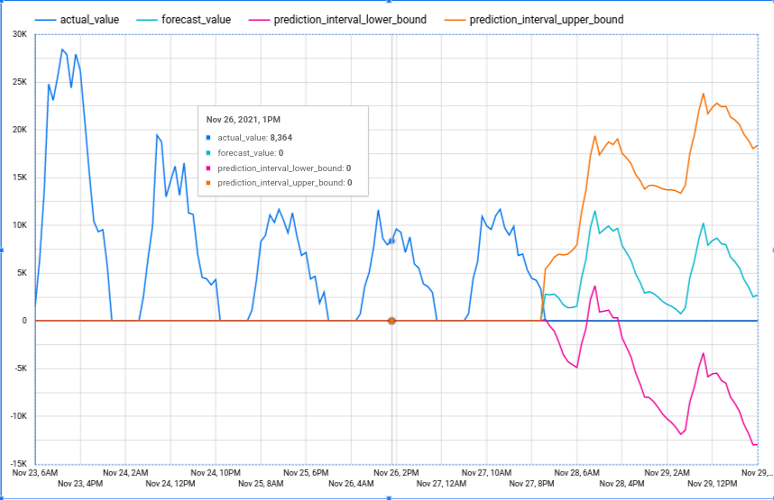

# Real-time analytics with Change Data Capture

## Introduction

This gHack will take you through replicating and processing operational data from an Oracle database into Google Cloud in real time. You'll also figure out how to forecast future demand, and how to visualize this forecast data as it arrives.

We will be using a fictitious retail store named FastFresh to help demonstrate the concepts we'll be dealing with. FastFresh specializes in selling fresh produce, and wants to minimize food waste and optimize stock levels across all stores. You will use fictitious sales transactions from FastFresh as the operational data in this tutorial.

The above diagram showcases the flow of operational data through Google Cloud, which is as follows:

- Incoming data from an Oracle source is captured and replicated into Cloud Storage through Datastream.
- This data is processed and enriched by Dataflow templates, and is then sent to BigQuery.
- BigQuery ML is used to forecast demand for your data, which is then visualized in Looker.

## Learning Objectives

- Replicate and process data from Oracle into BigQuery in real time.
- Run demand forecasting against  data that has been replicated and processed from Oracle in BigQuery.
- Learn how to visualize forecasted demand and operational data in real time in Looker.

You'll be using a variety of Google Cloud offerings to achieve this including:

1. Oracle
1. BigQuery
1. Datastream
1. Dataflow
1. BigQuery ML
1. Looker or Looker Studio

## Challenges

- Challenge 1: Getting started
  - Get yourself ready to develop our FastFresh solution
- Challenge 2: Replicating Oracle Data Using Datastream
  - Backfill the Oracle FastFresh schema and replicate updates to Cloud Storage in real time.
- Challenge 3: Creating a Dataflow Job using the Datastream to BigQuery Template
  - Now it's time to create a Dataflow job which will read from GCS and update BigQuery. You will deploy the pre-built Datastream to BigQuery Dataflow streaming template to capture these changes and replicate them into BigQuery.
- Challenge 4: Building a Demand Forecast
  - In this challenge you will use BigQuery ML to build a model to forecast the demand for products in store.
- Challenge 5: Visualizing the results
  - In this challenge you will use your favourite visualization tool to display the predictions from the previous challenge

## Prerequisites

- Access to a GCP project with `Owner` IAM role
- Basic understanding of GCP

## Contributors

- Murat Eken
- Carlos Augusto
- Gino Filicetti

## Challenge 1: Getting started

### Introduction

Throughout this hack, you will be using a number of different tools and products within Google Cloud. Our focus in this first challenge will be setting up the pre-requisites. As part of the project setup, we've already created a VM that hosts a Oracle database for you, but there's more to set up :)

### Description

We'll need to stage the Change Data Capture (CDC) stream from the Oracle database into a Google Cloud Storage bucket. Create a new bucket that minimizes egress costs.

In order to trigger Dataflow processing we'll use Pub/Sub notifications for Cloud Storage, so go ahead and turn on Pub/Sub notifications for the newly created bucket. Once the topic is ready, add a subscription to it.

Finally create a BigQuery dataset in the same region, which will be used to store and analyze the data.

### Success Criteria

1. There's a new Cloud Storage bucket
2. The bucket is configured to send Pub/Sub notifications
3. There's a Pub/Sub subscription on the new notifications topic
4. There's a new BigQuery dataset

### Tips

- You can use the UI to configure some of the requirements (not everything possible through the UI) but [Cloud Shell](https://cloud.google.com/shell) has all the tools you need to complete this challenge

### Learning Resources

- [Creating Storage Buckets](https://cloud.google.com/storage/docs/creating-buckets)
- [Pub/Sub notifications for Cloud Storage](https://cloud.google.com/storage/docs/reporting-changes)
- [Pub/Sub subscriptions](https://cloud.google.com/pubsub/docs/create-subscription)
- [Creating BQ Datasets](https://cloud.google.com/bigquery/docs/datasets)

## Challenge 2: Replicating Oracle Data Using Datastream

### Introduction

Datastream supports the synchronization of data to Google Cloud databases and storage solutions from sources such as MySQL and Oracle.

In this challenge, we'll configure Datastream to load the Oracle FastFresh schema and replicate updates from the Oracle database to Cloud Storage in real time.

> **Note** Keep in mind that it is possible to directly stream data from Oracle to BigQuery with Datastream and do transformations within BigQuery. However, for the sake of including Dataflow jobs in the next challenges we'll stage the data in Cloud Storage first in this challenge and transform it with Dataflow before loading it in BigQuery in the next one.

### Description

Configure Datastream to replicate data from the *ORDERS* table in the Oracle database into the bucket created in the previous challenge in *JSON* format using the *datastream* user, validate it, but **don't start** it yet. Make sure to include existing records in the stream as well.

> **Note** We have fulfilled the Oracle source and Cloud Storage destination prerequisites during setup, so you can ignore that section (and ignore the potential validation error for Cloud Storage permissions at the end).

### Success Criteria

1. You've created a new Datastream stream
2. The stream is setup to replicate the *ORDERS* table into the bucket in *JSON* format

### Tips

- The `IP Allowlisting` option is the easiest method for the connectivity, however don't forget to update the firewall rules :)

### Learning Resources

- [Datastream Overview](https://cloud.google.com/datastream/docs/overview)
- [Creating a new Stream](https://cloud.google.com/datastream/docs/create-a-stream)
- [Creating a new Connection Profile](https://cloud.google.com/datastream/docs/create-connection-profiles)
- [Firewall rules](https://cloud.google.com/vpc/docs/using-firewalls)

## Challenge 3: Creating a Dataflow Job using the Datastream to BigQuery Template

### Introduction

Now that you have a Datastream stream configured to capture changes from the source and send them to GCS, it's time to create a Dataflow job which will read from GCS and update BigQuery.

There's a number of pre-built templates available for Dataflow, and there's even one for Datastream to BigQuery.

You can also extend the functionality of this template by including User Defined Functions (UDFs). UDFs are functions written in JavaScript that are applied to each incoming record and can do operations such as enriching, filtering and transforming data.

### Description

We've already prepared a some transformation logic that masks a column in the data, you can download it from [here](https://raw.githubusercontent.com/caugusto/datastream-bqml-looker-tutorial/main/udf/retail_transform.js).

Configure a Dataflow job that reads from the Pub/Sub notifications using the pre-built Datastream template with the target as the BQ dataset that's been created in the very first challenge. Use the provided UDF to process the data before it's stored in BQ.

Use the `sub-retail` subnet in the `vpc-retail` network and limit the maximum number of workers to `5`.

Start the Dataflow job and once it's running, then start the Datastream job.

> **Warning** The template needs Cloud Storage Buckets for a few more things, these need to be different from the bucket that contains the staging data.

> **Note** It will take ~10 minutes to complete the replication.

### Tips

- Create a new bucket to hold the transformation logic and other data
- Some of the settings needed to complete this challenge (such as the UDF, max number of workers and networking related ones) are in the *Optional Parameters* section
- Pay attention to how you specify the [subnet](https://cloud.google.com/dataflow/docs/guides/specifying-networks#example_network_and_subnetwork_specifications)

### Success Criteria

1. All the data from Oracle table **ORDERS** has been replicated to the new BigQuery dataset using Datastream & Dataflow
2. The **ORDERS** table in BQ dataset should have a row count `520217`

### Learning Resources

- [Pre-built Dataflow templates](https://cloud.google.com/dataflow/docs/guides/templates/provided-streaming)
- [Use the Dataflow Monitoring Interface](https://cloud.google.com/dataflow/docs/guides/using-monitoring-intf)
- [Monitor a Stream](https://cloud.google.com/datastream/docs/monitor-a-stream)
- [Getting Started with BigQuery](https://cloud.google.com/bigquery/docs/quickstarts/query-public-dataset-console)
- [Preview BigQuery Data](https://cloud.google.com/bigquery/docs/quickstarts/load-data-console#preview_table_data)

## Challenge 4: Building a Demand Forecast

### Introduction

BigQuery ML can be used to build and deploy [demand forecasting](https://cloud.google.com/architecture/demand-forecasting-overview) models using the [ARIMA_PLUS](https://cloud.google.com/bigquery-ml/docs/reference/standard-sql/bigqueryml-syntax-create-time-series) algorithm. In this section, you use BigQuery ML to build a model to forecast the demand for products in store.

### Description

In order to build a model, we need to prepare the data first. Create a new table that includes `time_of_sale` in hourly granularity, `product_name` and the total sales `quantity` for each product for the period between `2021-11-22` and `2021-11-28`.

Using this training data create a new `ARIMA_PLUS` model to predict expect sales quantity for a product.

Once the model is ready use it to forecast the sales for all the products for the next 2 days (48 hours) and store it in a table.

### Success Criteria

1. There's a new table created for training purposes with the correct structure
2. BQML ARIMA model is trained using the created table
3. The predictions (forecasts) are stored in a new table

### Learning Resources

- [Creating and Using BigQuery Tables](https://cloud.google.com/bigquery/docs/tables)
- [BQ timestamp functions](https://cloud.google.com/bigquery/docs/reference/standard-sql/timestamp_functions)
- [Creating ARIMA_PLUS Model](https://cloud.google.com/bigquery-ml/docs/reference/standard-sql/bigqueryml-syntax-create-time-series)

## Challenge 5: Visualizing the results

### Introduction

We can look at the data in BigQuery SQL workbench, but it's usually better to visualize data using a BI tool. We could use any BI tool for that purpose but for this challenge we'll use Looker or Looker Studio to achieve that.

### Description

Build a time series chart that displays the forecasts for the product `Bag of Organic Bananas`, including the lower and upper bounds of the predictions (confidence bands).

See below for an example:

### Success Criteria

1. There's a line graph that shows the hourly sales for an individual product and its forecasted sales for the next two days, including the confidence bands

### Learning Resources

- [Looker Studio with BigQuery](https://cloud.google.com/bigquery/docs/visualize-looker-studio)
