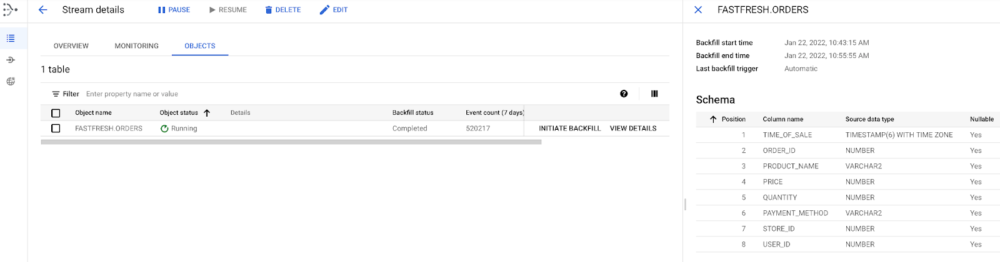
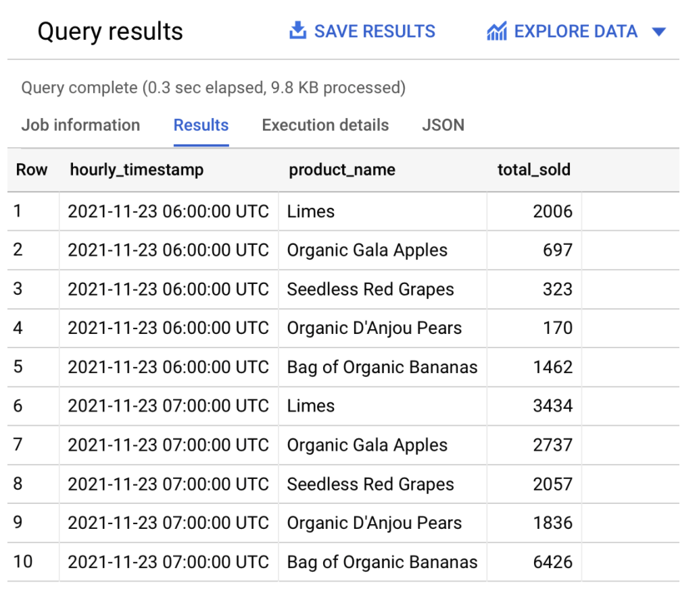

# Real-time analytics with CDC

## Introduction

Welcome to the coach's guide for the Real-time analytics with CDC gHack. Here you will find links to specific guidance for coaches for each of the challenges.

Remember that this hack includes a [lecture presentation](resources/lectures.pdf) that introduces key topics associated with each challenge. It is recommended that the host present this presentation before attendees kick off the hack.

## Coach's Guides

- Challenge 1: Getting started
  - Get yourself ready to develop our FastFresh solution
- Challenge 2: Replicating Oracle Data Using Datastream
  - Backfill the Oracle FastFresh schema and replicate updates to Cloud Storage in real time.
- Challenge 3: Creating a Dataflow Job using the Datastream to BigQuery Template
  - Now it's time to create a Dataflow job which will read from GCS and update BigQuery. You will deploy the pre-built Datastream to BigQuery Dataflow streaming template to capture these changes and replicate them into BigQuery.
- Challenge 4: Building a Demand Forecast
  - In this challenge you will use BigQuery ML to build a model to forecast the demand for products in store.
- Challenge 5: Visualizing the results
  - In this challenge you will use your favourite visualization tool to display the predictions from the previous challenge

## Challenge 1: Getting started

### Notes & Guidance

Create a Cloud Storage bucket to store the replicated data

```shell
gsutil mb -l ${REGION} gs://${PROJECT_ID}
```

Create a new topic called `cdc` which sends notifications about object changes to the Pub/Sub topic

```shell
gcloud storage buckets notifications create gs://${PROJECT_ID} --topic=cdc
```

Create a Pub/Sub subscription to receive messages which are sent to the `cdc` topic

```shell
gcloud pubsub subscriptions create cdc_sub --topic=cdc
```

Create a BigQuery dataset named `retail`:

```shell
bq mk --location ${REGION} --dataset ${PROJECT_ID}:retail
```

## Challenge 2: Replicating Oracle Data Using Datastream - Coach's Guide

### Notes & Guidance

In Cloud Console, navigate to Datastream and click **Create Stream**. A form is generated. Populate the form as follows and click **Continue**:

- **Stream name**: `oracle-cdc`
- **Stream ID**: `oracle-cdc`
- **Source type**: `Oracle`
- **Destination Type**: `Cloud Storage`
- **All other fields**: `Keep the default value`

In the **Define & Test Source** section, select **Create new connection profile**. A form is generated. Populate the form as follows:

- **Connection profile name**: `oracle-src`
- **Connection profile ID**: `oracle-src`
- **Hostname**: `See TF outputs, IP of the VM`
- **Port**: `1521`
- **Username**: `See TF outputs`
- **Password**: `See TF outputs`
- **System Identifier (SID)**: `See TF outputs`

Choose the connectivity method **IP allowlisting**, and then click **Continue**.

You'll need to update the firewall for the network in which the VM is created. You could do that either through the UI, or using the following command:

```shell
IPS="34.71.242.81,34.72.28.29,34.67.6.157,34.67.234.134,34.72.239.218"  # these are for us-central1
gcloud compute firewall-rules create fwr-ingress-allow-datastream \
   --action=allow \
   --network=vpc-retail \
   --direction=ingress \
   --target-tags=orcl-db \
   --source-ranges="$IPS" \
   --rules=tcp:1521
```

Click **Run Test** to validate the connection to the Oracle database, and then click **Create & Continue**.

The **Select Objects to Include** defines the objects to replicate, specific schemas, tables and columns and be included or excluded. Select the `FASTFRESH > ORDERS` table:


To load existing records, set the **Backfill mode** to Automatic,  and then click **Continue**.

In the **Define Destination** section, select **Create new connection profile**. A form is generated. Populate the form as follows, and then click **Create & Continue**:

- **Connection Profile Name**: `gcs-dst`
- **Connection Profile ID**: `gcs-dst`
- **Bucket Name**: *The equivalent to `gs://${PROJECT_ID}`. This is the bucket you created earlier*

Leave the Stream path prefix blank and select **JSON** for **Output format**. Click **Continue**.

Click **Run Validation** and, assuming no issues were found, click **Create**.

## Challenge 3: Creating a Dataflow Job using the Datastream to BigQuery Template - Coach's Guide

### Notes & Guidance

Create a new bucket to hold additional stuff and copy the transformation logic there

```shell
wget https://raw.githubusercontent.com/meken/gcp-realtime-analytics-db-setup/main/udf/retail_transform.js
gsutil mb -l ${REGION} gs://${PROJECT_ID}-other
gsutil cp retail_transform.js gs://${PROJECT_ID}-other/js/
```

The subnet needs to be in format `regions/${REGION}/subnetworks/${subnet}`

Required parameters for the template *Datastream to BigQuery*

| Parameter | Value |
| ---       | ---   |
| File location for Datastream file output in Cloud Storage | `gs://${PROJECT_ID}` |
| The Pub/Sub subscription on the Cloud Storage bucket | `projects/${PROJECT_ID}/subscriptions/cdc_sub` |
| Datastream output file format (avro/json) | `JSON` |
| Name or template for the dataset to contain staging tables | `retail` |
| Template for the dataset to contain replica table | `retail` |
| Dead letter queue directory | `gs://${PROJECT_ID}-other/dlq` |

> [!NOTE]  
> It used to be possible to use a top level bucket as the *File location for Datastream file output in Cloud Storage* parameter. However, the most recent version of the template now requires a root path, a folder that must exist in that bucket. In that case just create a new `cdc` folder in the bucket, update the Datastream Destination configuration to use that as the prefix (`/cdc`) and use that as the parameter in the Dataflow job configuration (`gs://${PROJECT_ID}/cdc/`).

The following optional parameters must be set too.

| Parameter | Value |
| ---       | ---   |
| Cloud Storage location of your Javascript UDF | `gs://${PROJECT_ID}-other/js/retail_transform.js` |
| The name of the JavaScript function you wish to call as your UDF | `process` |
| Max workers | `5` |
| Network | `vpc-retail` |
| Subnetwork | `regions/${REGION}/subnetworks/sub-retail` |

And then hit *Run Job*.

You can start the Datastream job either through the UI or using the following command line:

```shell
gcloud datastream streams update oracle-cdc --location=${REGION} --state=RUNNING --update-mask=state
```

Return to the Datastream console to validate the progress of the `ORDERS` table backfill as shown here:



Because this task is an initial load, Datastream reads from the `ORDERS` object. It writes all records to the JSON files located in the Cloud Storage bucket that you specified during the stream creation. It will take about 10 minutes for the backfill task to complete.

After a few minutes, your backfilled data replicates into BigQuery. Any new incoming data streams into your datasets in (near) real-time. Each record  is processed by the UDF logic that you defined as part of the Dataflow template.

You can execute the following SQL statements to query the number of rows on both the `ORDERS` and `ORDERS_log` tables:

```sql
SELECT count(*) FROM `retail.ORDERS`;
```

With the backfill completed, this statement will return the number `520217`. Be patient as it might take up to ~10 minutes before all the records are replicated in BigQuery.

> [!NOTE]  
> If for whatever reason things fail, you can always delete BQ tables, clear the bucket with the JSON files, recreate the Dataflow job (after stopping/canceling the original one) and re-initiate the backfill from Datastream.

A real time view of the operational data is now available in BigQuery. You can run queries such as comparing the sales of a particular product across stores in real time, or to combine sales and customer data to analyze the spending habits of customers in particular stores.

The following two new tables in the retail dataset are created by the Dataflow job:

- `ORDERS`: This output table is a replica of the Oracle table and include the transformations applied to the data as part of the Dataflow template:
- `ORDERS_log`: This staging table records all the changes from your Oracle source. The table is partitioned, and stores the updated record alongside some metadata change information, such as whether the change is an update, insert, or delete.

## Challenge 4: Building a Demand Forecast - Coach's Guide

### Notes & Guidance

#### Prepare your training data

Here you will use parts of the replicated data as training data to your model.

The training data  describes for each product (`product_name`), how many units were sold (`total_sold`) per hour (`hourly_timestamp`).

Using the BigQuery console, **run** the following SQL to create and save the training data to a new `training_data` table:

```sql
CREATE OR REPLACE TABLE
  `retail.training_data` AS
SELECT
  TIMESTAMP_TRUNC(time_of_sale, HOUR) AS hourly_timestamp,
  product_name,
  SUM(quantity) AS total_sold
FROM
  `retail.ORDERS`
GROUP BY
  hourly_timestamp,
  product_name
HAVING
  hourly_timestamp BETWEEN TIMESTAMP_TRUNC('2021-11-22', HOUR)
  AND TIMESTAMP_TRUNC('2021-11-28', HOUR)
ORDER BY
  hourly_timestamp
```

**Run** the following SQL to verify the training_data table:

```sql
SELECT * FROM `retail.training_data` LIMIT 10;
```



#### Forecast Demand

Still In BigQuery, execute the following SQL to create a time-series model that uses the ARIMA_PLUS algorithm:

```sql
CREATE OR REPLACE MODEL
  retail.sales_forecast OPTIONS (
    MODEL_TYPE='ARIMA_PLUS',
    TIME_SERIES_TIMESTAMP_COL='hourly_timestamp',
    TIME_SERIES_DATA_COL='total_sold',
    TIME_SERIES_ID_COL='product_name' ) AS
SELECT
  hourly_timestamp,
  product_name,
  total_sold
FROM
  retail.training_data
```

Run the following SQL to forecast the demand for organic bananas over the next 2 days:

> [!NOTE]  
> The [`ML.FORECAST`](https://cloud.google.com/bigquery-ml/docs/reference/standard-sql/bigqueryml-syntax-forecast) function is used to forecast the expected demand over a horizon of n hours.

```sql
CREATE OR REPLACE TABLE
  retail.predictions AS
SELECT
  *
FROM
  ML.FORECAST(MODEL retail.sales_forecast,
    STRUCT(48 AS horizon))
```

Because the training data is hourly, the horizon value will use the same unit of time when forecasting (hours). A horizon value of 48 hours will return forecast results over the next 2 days.

> [!NOTE]  
> Since this is a small sample dataset, further investigation into the accuracy of the model is out of scope for this tutorial.

## Challenge 5: Visualizing the results - Coach's Guide

### Notes & Guidance

#### Create a table for easier visualization

In BigQuery, **run** the following SQL query to create a new table, joining the actual and forecasted sales for a given product:

```sql
CREATE TABLE
  retail.final_results AS (
  SELECT
    hourly_timestamp,
    total_sold AS actual_value,
    NULL AS forecast_value,
    NULL AS prediction_interval_lower_bound,
    NULL AS prediction_interval_upper_bound
  FROM
    `retail.training_data`
  WHERE
    product_name = 'Bag of Organic Bananas'
  UNION ALL
  SELECT
    forecast_timestamp AS hourly_timestamp,
    NULL AS actual_value,
    forecast_value,
    prediction_interval_lower_bound,
    prediction_interval_upper_bound
  FROM
    `retail.predictions`
  WHERE
    product_name = 'Bag of Organic Bananas' )
```

> [!NOTE]  
> This view lets the BI tool query the relevant data when you explore the actual and forecasted data.


