# Ghack: Agentize SAP

## Introduction

Welcome to the coach's guide for The Agentize gHack. Here you will find links to specific guidance for coaches for each of the challenges.


> [!NOTE]  
> If you are a gHacks participant, this is the answer guide. Don't cheat yourself by looking at this guide during the hack!

## Coach's Guides

In this challenge lab, participants will get hands-on experience with:

1.  **SAP & Google Data Integration:** See how SAP Datasphere's premium Outbound Replication seamlessly feeds SAP data (like Material Master information) directly into Google BigQuery, the heart of Google's data analytics platform. (We'll also cover loading data from Cloud Storage if a Datasphere instance isn't available).
2.  **AI-Powered Agents:** Learn how Google Agentspace can be used to quickly build agentic applications on your unified data. 
3.  **AI-Powered Agents: Advanced techniques** Then dig deeper into advanced techniques of building agents using Agent Development Kit (ADK). 

## Coach Prerequisites

This hack has prerequisites that a coach is responsible for understanding and/or setting up BEFORE hosting an event. Please review the [gHacks Hosting Guide](https://ghacks.dev/faq/howto-host-hack.html) for information on how to host a hack event.

The guide covers the common preparation steps a coach needs to do before any gHacks event, including how to properly setup Google Meet and Chat Spaces.

### Student Resources

Always refer students to the [gHacks website](https://ghacks.dev) for the student guide: [https://ghacks.dev](https://ghacks.dev)

> [!NOTE]  
> Students should **NOT** be given a link to the gHacks Github repo before or during a hack. The student guide intentionally does **NOT** have any links to the Coach's guide or the GitHub repo.

### Additional Coach Prerequisites (Optional)

Please, ensure that the backend SAP system is running before running the ghack.


## Repository Contents

- `README.md`
  - Student's Challenge Guide
- `solutions.md`
  - Coach's Guide and related files
- `./resources`
  - Resource files, sample code, scripts, etc meant to be provided to students. (Must be packaged up by the coach and provided to students at start of event)
- `./artifacts`
  - Terraform scripts and other files needed to set up the environment for the gHack
- `./images`
  - Images and screenshots used in the Student or Coach's Guide

## Task 1: Preparing Your Data Feast in BigQuery

First, we need a place for all our data ingredients. Let's create a BigQuery dataset and load our SAP and Salesforce data.

1.  Open the Cloud Shell in the Google Cloud Console.    
2.  Create the BigQuery dataset by running the following command:

    ```bash
    bq mk icecream_lab
    ```
    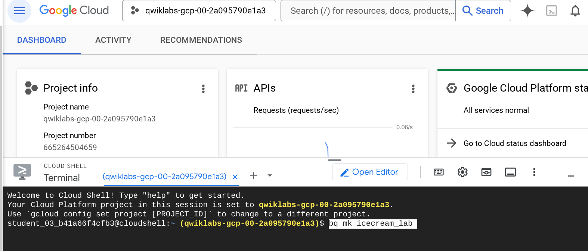

3.  **Load SAP Material Master Data:**

    **Scenario A: If an SAP Datasphere instance *is* configured and available for this lab:**
    In case the Datasphere instance is provided for the workshop, you will be notified by the instructor. You will also be provided with additional materials to customize and run the replication. Otherwise, please use Scenario B, where we have already prepared the dataset in GCP for you.

    **Scenario B: If an SAP Datasphere instance *is not* available (Using Cloud Storage):**
    The Material Master data has been pre-extracted to Cloud Storage. Load it into BigQuery using the following command. Make sure you are in the Cloud Shell:

    ```bash     
    bq load \
    --source_format=CSV \
    --skip_leading_rows=1 \
    icecream_lab.MaterialMasterData \
    gs://$GOOGLE_CLOUD_PROJECT/MaterialMasterData.csv \
    MaterialNumber:STRING,MaterialDescription:STRING
    ```
        
   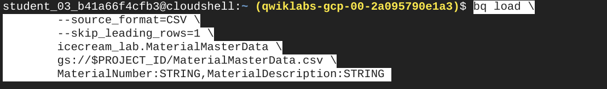

5.  **Load Salesforce Customer Case Data:**
    This data is provided in Cloud Storage. Load it into BigQuery using the Cloud Shell:

    ```bash
    bq load \
    --source_format=CSV \
    --skip_leading_rows=1 \
    icecream_lab.CustomerCases \
    gs://$GOOGLE_CLOUD_PROJECT/CustomerCases.csv \
    CustomerName:STRING,ProductName:STRING,FeedbackDate:DATE,Rating:INTEGER,Description:STRING
    ```

6.  **Create a View over Public FDA Data:**
    Let's create a view to easily access public FDA food enforcement data specifically related to ice cream.
    First, search for Google BigQuery in the search bar.
    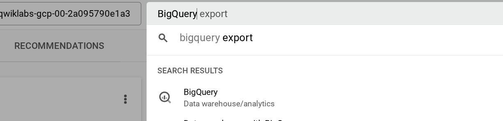

    Execute this SQL query in the BigQuery Console Query Editor:

    ```sql
    CREATE OR REPLACE VIEW icecream_lab.fda_ice_cream_enforcements AS
    SELECT
     * -- Selects all columns from the source table
    FROM
     `bigquery-public-data.fda_food.food_enforcement`
    WHERE
     product_description LIKE '%ice cream%';
    ```
    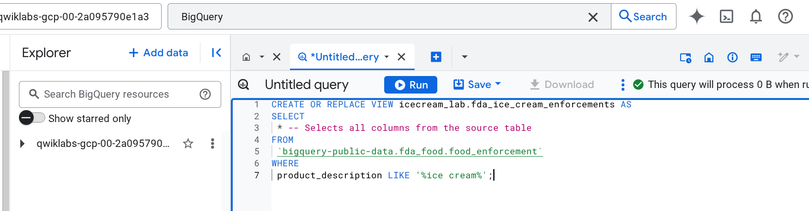

8.  Verify that the tables (`MaterialMasterData`, `CustomerCases`) and the view (`fda_ice_cream_enforcements`) exist in your `icecream_lab` dataset in the BigQuery console. In the preview, you can also check the uploaded or replicated data.
    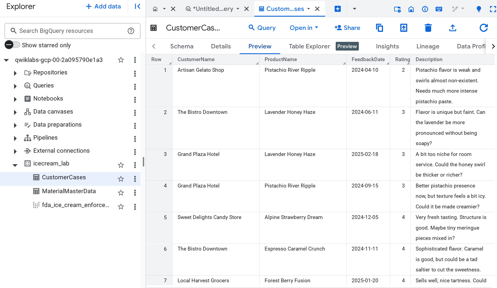


## Task 2: Quick No-Code Agentic Applications on Google Cloud using Agentspace

Now that our data is staged, let's build a simple conversational AI application using Agentspace. This allows users to ask questions about the data in natural language.

### Configure OAuth Consent Screen and Client

In this section, you will configure an OAuth consent screen for your Enterprise Search and Assistant app, enabling user authorization. You will also create an OAuth client that will be used for the Gmail action in your Agentspace application later.

1.  In the Google Cloud Console, navigate to **APIs & Services > OAuth consent screen**.
2.  In case you see the scree **Google Auth Platform not configured yet**, click **Get started**.
   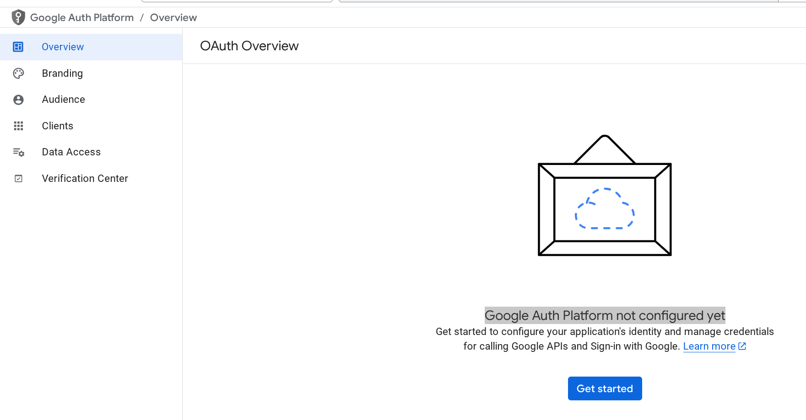
3.  For the **App name**, enter `Application`.
4.  Enter your lab **User support email** and click **Next**.
5.  Under Audience, select **Internal** and click **Next**.
6.  Under **Contact Information** your email address (you can enter your private or company email address, howeverm this will not be used in the next steps of the lab). Click **Next**.
7.  Select **I agree to the Google API Services: User Data Policy.** and click **Continue** and then **Create**.

In the next step, we will create OAuth client. 
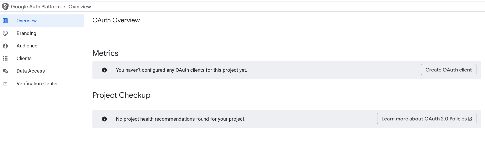

1.  Click **Create OAuth client**.
2.  For **Application type**, select **Web application**.
3. For the **Name**, enter `Application`.
4. Under **Authorized redirect URIs**, click **+ ADD URI**.
5. Enter the required Agentspace Authorized redirect URI: `https://vertexaisearch.cloud.google.com/oauth-redirect`.
6. Click **Create**. Note the **Client ID** and **Client secret**
    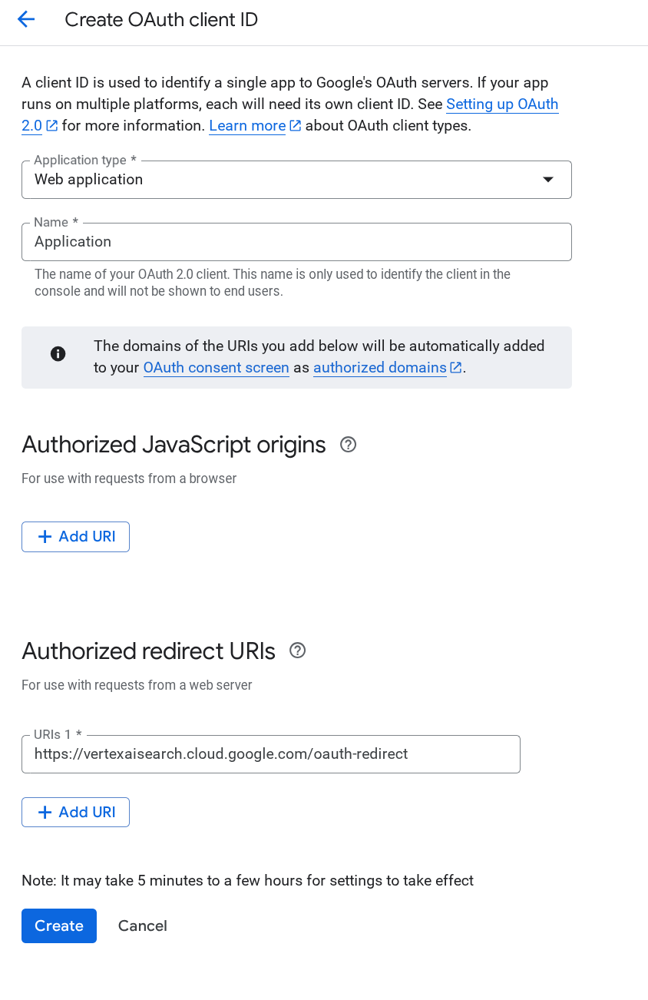

### Build and Configure the Agentspace App

1.  Navigate to **AI Applications** in the Google Cloud Console (you can search for it in the top bar). Enable the API if prompted.
    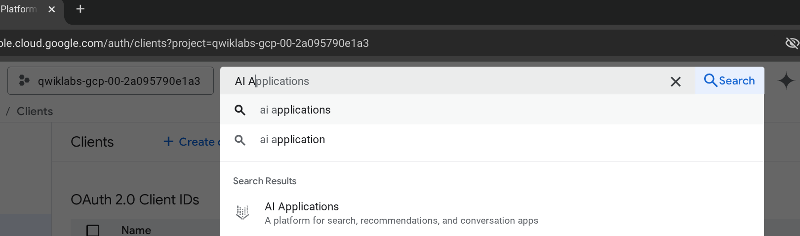
2.  In the **Create App** dialog, choose the **Agentspace** type.
3.  Give your app a name (e.g., "Scoops & Smiles Insights"), company name and select **Search + Assistant** as a tier in case you have this option in the UI. Click **Continue**.
    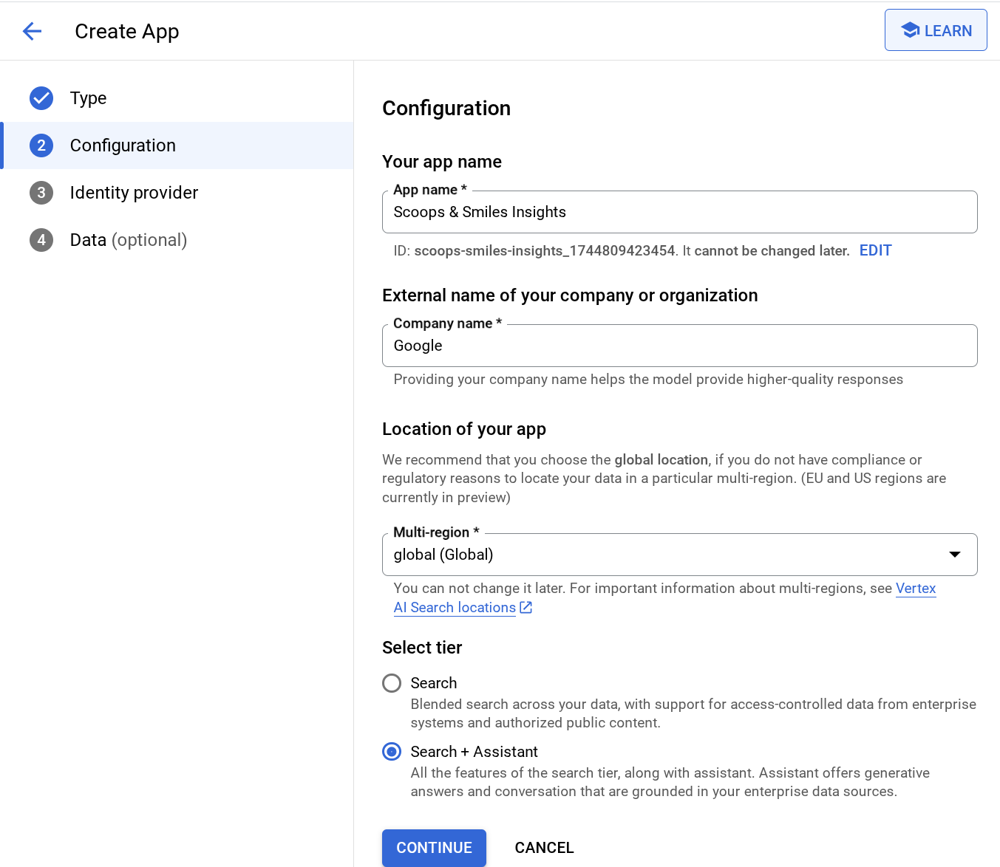
4.  Select **Google Identity Provider**
5.  Navigate to the **Data Stores** section for your app (under Configurations).
6.  Click **+ CREATE DATA STORE** and select **BigQuery**.
    * Select "Structured - BigQuery table with your own schema" for the kind of data
    * Select "One time" in synchromization frequency
    * Click **Browse** and select **MaterialMasterData** in your project
   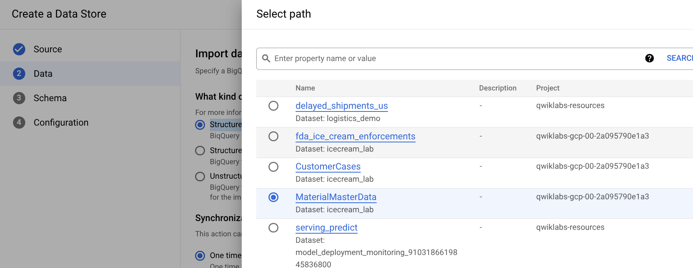
    * Click **Continue** and leave the default schema 
    * Give the Data Store a name (e.g., `Icecream master data`).
    * Click **Create**.
    * Repeate those steps with `CustomerCases` table and the `fda_ice_cream_enforcements` view.  
7.  Now, let us create one more data storage, but this time for the unstructured data. Click **+ CREATE DATA STORE** again and select **Cloud Storage**.
    * Enter the Cloud Storage URI for the recipe PDF (you can look it up and copy it from the Google Cloud Storage, it should have name YOURPROJECTID_recepies) and click **Continue**.
    * Give the Data Store a name (e.g., `IceCream Recipes`).
    * Click **Create**.
      
8.  Select all created data stores and click **Create** to create the application
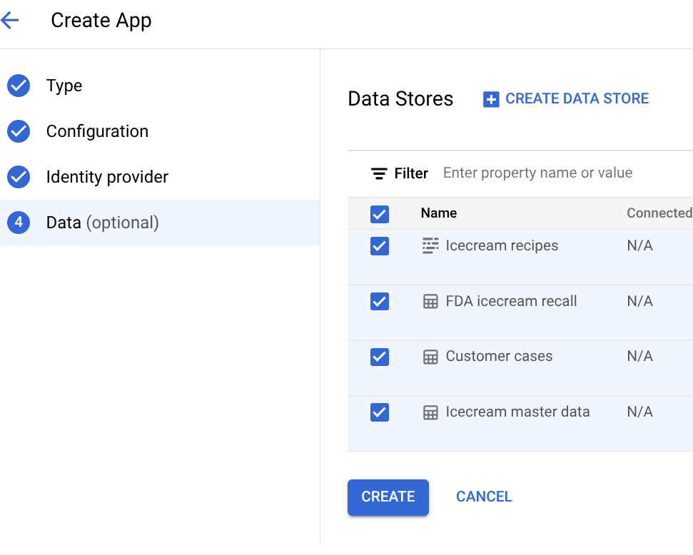
9.  Navigate to the **Actions** section in the menu on the left.
10.  Click **Add action**.
11.  Click **Connect** on the **Gmail** tool.
12. Enter a **Name** for the action connector: **gmail**.
13. Paste the Client ID and client secret you created earlier into the corresponding fields.
14. Select **Send Email** as an action.
15. Click **Finish setup**. 

### Integrate Agentspace application with Google Search
1. Stay in the Agentspace application configuratoin page and select **Configurations** in the menu on the left
2. Select **Assistant** tab
3. Activate **Enable Google search grounding**
4. Click **Save and publish**
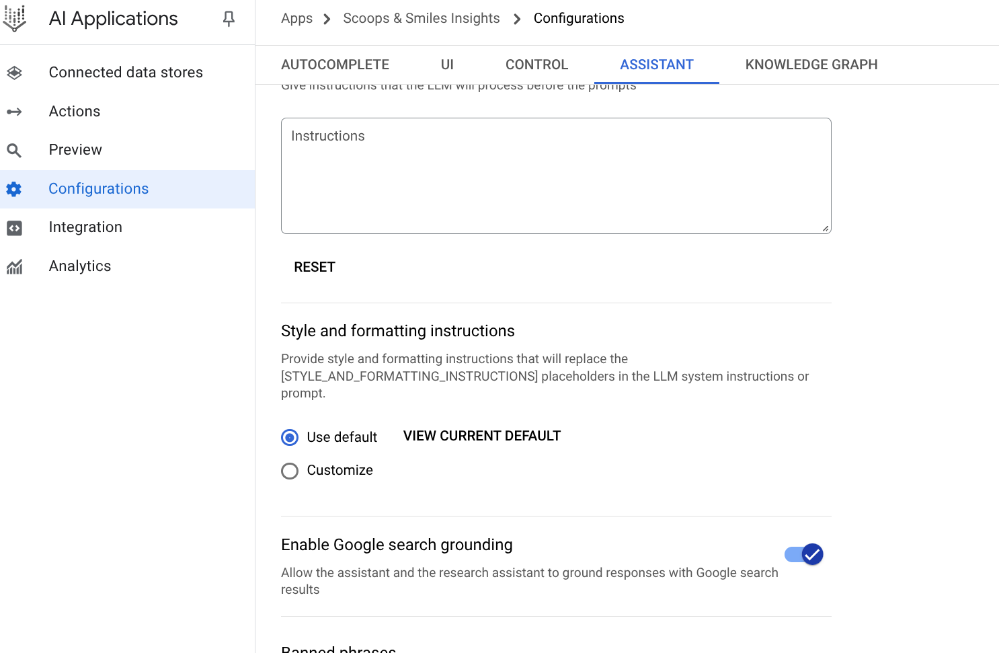

### Interact with Your Agentspace App

1.  Wait for the data stores to finish indexing. This might take several minutes. You can check the status in the **Data Stores** section.
    <ql-infobox>
    <strong>Note:</strong> Indexing can take time.You will need the indexing to be complete to get accurate responses from the prompts below.
    While waiting, you can take a little break or you might explore other parts of the Agent Builder interface or proceed to Task 3 descriptions. 
    You can open a new tab with console.cloud.google.com and perform the Task 3. This way, you can easily switch back to the Agentspace prompts testing tab. You will need an email text generated using Prompt 6 in the next task.
    </ql-infobox>
3.  Once indexing is complete for your BigQuery and Cloud Storage data stores, navigate to the **Integration** section.
4.  Open your application using the link in the section **The link to your web app**.
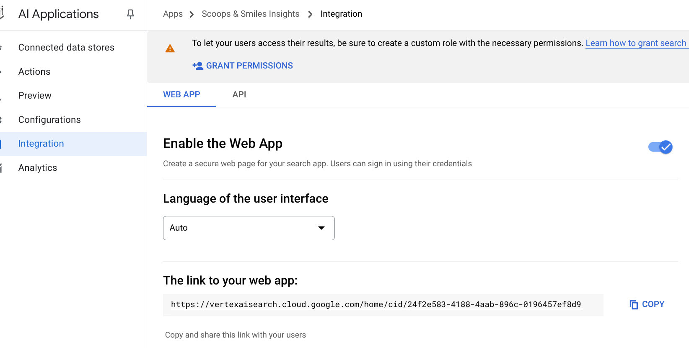
5.  Interact with the Assistant using the following prompts. Observe how it utilizes the different data sources:

    * **Prompt 1:**
        * **Datasource:** MaterialMasterData (SAP via BQ)
        * **Prompt:** `Analyze our product portfolio. Identify and summarize the key strengths of our ice cream catalog, focusing on: Flavor variety (range of types offered), Unique or innovative flavor profiles mentioned, Mention of premium ingredients or quality attributes, Presence of interesting textures (swirls,           inclusions, crunches). Provide a concise summary of these strengths.`

    * **Prompt 2:**
        * **Datasources:** CustomerCases (SFDC via BQ), Web Search
        * **Prompt:** `Retrieve customer feedback on our ice cream products, focusing on the improvement suggestions from our customers. Can you identify any particular pattern in this feedback? Additionally, conduct a review our competitors’ strategy online. Based on both results, suggest what should we work on to             improve our portfolio and drive sales.`

    * **Prompt 3:**
        * **Datasources:** CustomerCases (SFDC via BQ), Web Search
        * **Prompt:** `Generate a concept image for a potential new summer seasonal flavor: "Lemon Berry Bliss". The image should show a scoop of pale yellow lemon ice cream generously swirled with a vibrant mixed berry (strawberry, blueberry, raspberry) ribbon. It should look bright, appealing, and refreshing, perhaps         set against a simple, clean background.`

    * **Prompt 4:**
        * **Datasource:** fda\_ice\_cream\_enforcements (BQ View), Web Search
        * **Prompt:** `Analyze historical product recalls related to ice cream and information on the web to find out how we can avoid major issues and recalls with our products and build a great reputation.`

    * **Prompt 5:**
        * **Datasources:** CustomerCases (SFDC via BQ), MaterialMasterData (SAP via BQ), Recipes PDF (Cloud Storage)
        * **Prompt:** `We have got a request to focus on improvement of the recipe of Pistachio River Ripple. Based on the customer feedback and an existing recipe, suggest what exactly needs to be changed. List exact ingredients we need to purchase to make those changes.`

    * **Prompt 6:** (This uses the Gmail Tool - you may be prompted to authorize)
        * **Action:** Send Email
        * **Prompt:** `Send an email to our purchasing organization (purchasing@company.com) with the recipe improvement suggestions for Pistachio River Ripple and the ingredients that need to be purchased.`


## Task 3: Diving Deeper - Collaborative Agents with Google ADK

**Overview:**

In this Task, you will learn how to design and implement a team of custom AI agents to automate a common business process within SAP ERP (ECC or S/4HANA): creating Purchase Requisitions (PRs) from email requests, including vendor selection and initial vetting. You'll experience how AI can streamline procurement workflows, reduce manual effort, enhance compliance, and improve efficiency. We will execute the creation of these agents using Google Agent Development Kit and deploy them on Cloud Run.

**Scenario: Automating Purchase Requisition Creation from Email with Vendor Selection**

Manually processing purchase requests that arrive via email is time-consuming and prone to errors. These requests need to have their data extracted, potential vendors identified and checked, and finally, be formally entered as Purchase Requisitions in SAP.

Our goal is to build a team of AI agents that work together to handle this process.

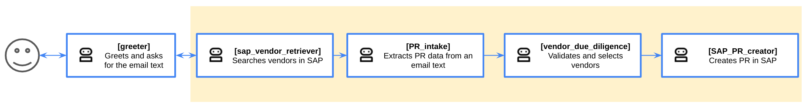

**Greeter agent**: Initiates the PR creation process. It interacts with the user, prompts for the email text containing purchase request details, and passes this text to subsequent agents for processing.

**SAP vendor retriever agent**: Performs initial vendor searches within SAP and provides a list of existing or potential vendors from SAP to inform downstream processes.

**PR intake agent**: Extracts PR data from the provided email text. It receives the full email text and extracts key information required for a Purchase Requisition, such as item description and quantity.

**Vendor due diligence agent**: Validates and selects vendors for the Purchase Requisition. It takes the extracted PR data and potential vendor information, validates identified vendors by checking their status in SAP, preferred supplier lists, or basic compliance flags, and then selects the most appropriate vendor(s) based on predefined criteria.

**SAP_PR_creator agent**: Creates the Purchase Requisition in the SAP system. It takes the structured PR data and the selected, vetted vendor, uses this information to automatically create a Purchase Requisition in the SAP system, typically via APIs, and ensures correct field mapping for the PR creation.

**Objectives:**

Upon completing this exercise, you will be able to:

* Understand how AI agents can automate multi-step SAP business processes, including external checks.
* Design the roles and responsibilities of different AI agents within a collaborative workflow, including due diligence steps.
* Simulate the configuration of AI agents for data extraction, validation, external data querying, and SAP transaction execution (API interaction).
* Appreciate the benefits of AI-driven automation in procurement risk management and efficiency.

**Lab Steps (High-Level):**

1.  **Environment Setup:** Create the necessary Application Integration Components to enable SAP Connectivity
2.  **Coding exercises** Follow the steps to implement the team of agents

### Environment Setup
Application Integration service is an important component to enable the communication of Agents with your SAP Environment.
It has a rich support of SAP as a backend with native connectors to SAP applications via RFC, oData or directly to the database.
In this lab we are utilizing the connection via http(s) oData services using the **SAP Gateway** Connector.
Navigate to **Integration Connectors** Service.

#### Reviewing Network Endpoint Attachment

An endpoint attachment is an interface for a private service connect. It is used to enable a private connectivity of a connector to SAP. Our SAP backend already provides the PSC service and we have preconfigured a private endpoint attachment for it at a lab start. Let us review the customizing.

1. Stay in the Integration Connectors and select **Endpoint Attachments** in the menu on the left
2. Click the endpoint attachment with the name **saps4hana-endpoint-attachment**
3. Review configured parameters. Note the IP address of the created endpoint attachment, you will need it at the later steps.

#### Creating SAP Integration Connector

1. Stay in the Integration Connectors and select **Connections** in the menu on the left
2. Click **Create New**
3. Input the following parameters, click **Next** when needed:
    - **Region**: `europe-west4`
    - **Connector**: `SAP Gateway`
    - **Connection Name**: `s4-vendors`
    - **Namespace**: `sap`
    - **Service**: `API_BUSINESS_PARTNER`
    - **Data Format**: `JSON`
    - **Enable SSL**: `true`
    - **Choose a trust mode**: `Insecure Connection`
    - **Destination Type**: `Host address`
    - **host 1**: `https://<copy IP from the endpoint attachment>:44300/sap/opu/odata/sap/API_BUSINESS_PARTNER/`
    - **Authentication**: `User password`
    - **Username**:  `QWIKLAB`
    - **Password**: `Ubyberg38421!`
    - If prompted, enable the service account the requested access to the secret manager
4. Click **Create**

<ql-infobox>
<strong>Note:</strong> Connectors are being provisioned for the first time in europe-west4. So, creating sap-vendors-connection may take 5 to 10 minutes. 
    While waiting, you can take a little break or you can now go back to the Agentspace exercise to finish the task before doing the coding challenge.
</ql-infobox>

#### Review the Connector Executor with Application Integration

To use a connector from Integration Connectors, you need to provision Application Integration flow based on the specific template. We already created it for you during the lab runrime setup. You can now review how it is setup.

1. Go to `Application Integration` service and navigate to `Integrations` section
2. Click `ExecuteConnection` integration to review it.

### Coding exercises

For this task, we have deployed the code with some TODOs to Google Cloud Run for you. To implement those TODOs, please, open Google Cloud Run (you can search for the service in the search panel).
Then, navigate to the **purchasing-agent-service** by clicking on it.

From here, you can modify code and redeploy it and test the application by clicking on its URL and evaluating the team of agents.
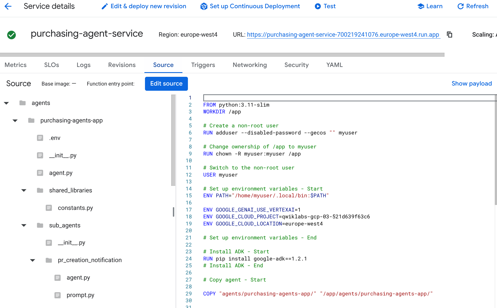

Solutions to all TODO tasks can be found in the following repository in the main branch: https://gitlab.com/ekakruse/sapwithadk/-/tree/main?ref_type=heads