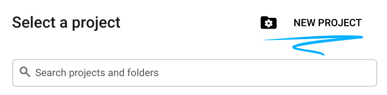
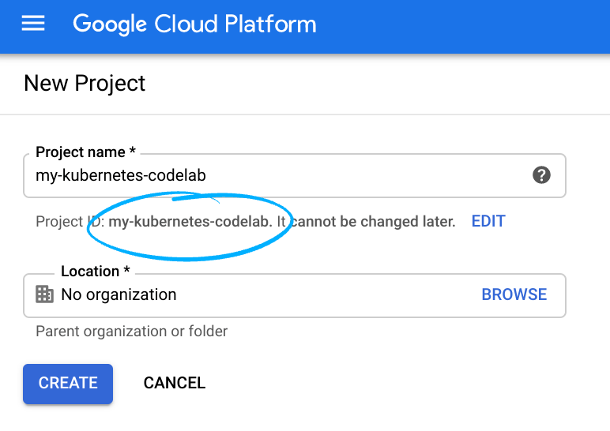
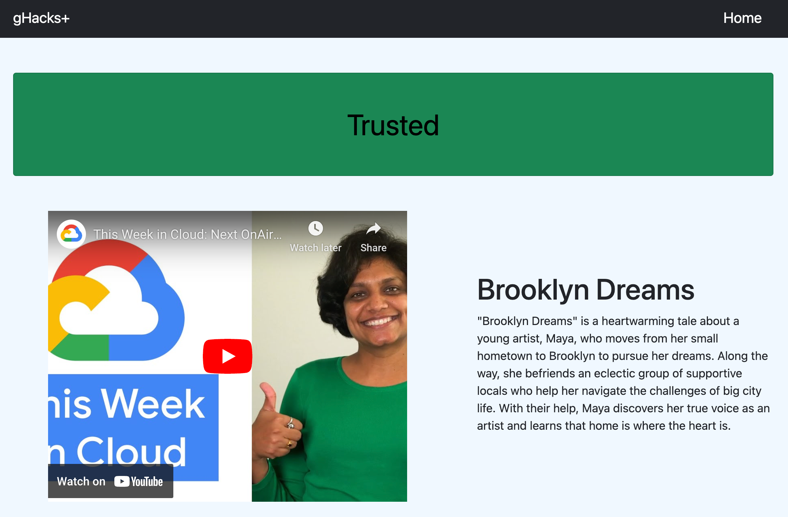

# Security in Media & Entertainment
## Introduction
Google Cloud HTTP(S) load balancing is deployed at the edge of Google's network in Google points of presence (POP) around the world. User traffic directed to an HTTP(S) load balancer enters the POP closest to the user and is then load balanced over Google's global network to the closest backend that has sufficient capacity available.

Cloud Armor is Google's distributed denial of service and web application firewall (WAF) detection system. Cloud Armor is tightly coupled with the Google Cloud HTTP Load Balancer and safeguards applications of Google Cloud customers from attacks from the internet. reCAPTCHA Enterprise is a service that protects your site from spam and abuse, building on the existing reCAPTCHA API which uses advanced risk analysis techniques to tell humans and bots apart. Cloud Armor Bot Management provides an end-to-end solution integrating reCAPTCHA Enterprise bot detection and scoring with enforcement by Cloud Armor at the edge of the network to protect downstream applications.


## Learning Objectives
In this lab, you configure an HTTP Load Balancer with a backend, as shown in the diagram below. Then, you'll learn to set up a reCAPTCHA session token site key and embed it in your website. You will also learn to set up redirection to reCAPTCHA Enterprise manual challenge. We will then configure a Cloud Armor bot management policy to showcase how bot detection protects your application from malicious bot traffic.

1. How to set up a HTTP Load Balancer with appropriate health checks.
1. How to create a reCAPTCHA WAF challenge-page site key and associated it with Cloud Armor security policy.
1. How to create a reCAPTCHA session token site key and install it on your web pages.
1. How to create a Cloud Armor bot management policy.
1. How to validate that the bot management policy is handling traffic based on the rules configured.

## Challenges
- Challenge 0: Setup & Requirements
   - Before we can hack, you will need to set up a few things.
- Challenge 1: Create Managed Instance Groups
   - Use managed instance groups to create an HTTP Load Balancer backend.
- Challenge 2: Setup Your HTTP Load Balancer
   - Configure the HTTP Load Balancer to send traffic to your backend.
- Challenge 3: Deploy a reCAPTCHA Token and Challenge Page
   - Implement reCAPTCHA on a website's landing page. 
- Challenge 4: Configure Bot Management
   - Use Cloud Armor bot management rules to allow, deny and redirect requests based on the reCAPTCHA score.

## Prerequisites
- The ability to create your own GCP projects with Owner IAM role.
- Basic Networking and HTTP knowledge
- Basic Unix/Linux command line knowledge

## Contributors
- Lexi Flynn
- Gino Filicetti

## Challenge 0: Setup & Requirements

### Introduction

Thank you for participating in the Security in Media & Entertainment gHack. Before you can hack, you will need to set up a few prerequisites.

### Description

#### Setup Your Project
1. Sign-in to the [Google Cloud Console](http://console.cloud.google.com/) and create a new project or reuse an existing one. If you don't already have a Gmail or Google Workspace account, you must [create one](https://accounts.google.com/SignUp).

    
    
    

- The **Project name** is the display name for this project's participants. It is a character string not used by Google APIs, and you can update it at any time.

- The **Project ID** must be unique across all Google Cloud projects and is immutable (cannot be changed after it has been set). The Cloud Console auto-generates a unique string; usually you don't care what it is. You'll need to reference the Project ID (and it is typically identified as `PROJECT_ID`), so if you don't like it, generate another random one, or, you can try your own and see if it's available. Then it's "frozen" after the project is created.

- There is a third value, a Project Number which some APIs use. Learn more about all three of these values in the [documentation](https://cloud.google.com/resource-manager/docs/creating-managing-projects#before_you_begin).

    > **Caution:** A project ID must be globally unique and cannot be used by anyone else after you've selected it. You are the only user of that ID. If a project is deleted, that ID can never be used again.

    > **Note:** If you're using a Gmail account, you can leave the default location set to **No organization**. If you're using a Google Workspace account, then choose a location that makes sense for your organization.

2. Next, you'll need to [enable billing](https://console.cloud.google.com/billing) in the Cloud Console in order to use Cloud resources/APIs. Running through this gHack shouldn't cost much, if anything at all. To shut down resources so you don't incur billing beyond this tutorial, follow any "clean-up" instructions found at the end of this gHack. New users of Google Cloud are eligible for the [$300 USD Free Trial program](http://cloud.google.com/free).

#### Start the Cloud Shell
While Google Cloud can be operated remotely from your laptop, in this gHack you will be using the Google Cloud Shell, a command line environment running in the Cloud.

- From the GCP Console click the Cloud Shell icon on the top right toolbar:

    

- It should only take a few moments to provision and connect to the environment. When it is finished, you should see something like this:

    

- This virtual machine is loaded with all the development tools you'll need. It offers a persistent 5GB home directory, and runs on Google Cloud, greatly enhancing network performance and authentication. All of your work in this gHack can be done completely in the browser.

#### Setup Cloud Shell
- Inside Cloud Shell, make sure that your project id is set up:

    ```bash
    gcloud config list project
    gcloud config set project [YOUR-PROJECT-NAME]
    PROJECT_ID=[YOUR-PROJECT-NAME]
    echo $PROJECT_ID
    ```
#### Enable APIs
- Enable all necessary service APIs

    ```bash
    gcloud services enable compute.googleapis.com
    gcloud services enable logging.googleapis.com
    gcloud services enable monitoring.googleapis.com
    gcloud services enable recaptchaenterprise.googleapis.com
    ```

#### Create the `default` VPC Network
**NOTE:** Normally you should already have a `default` network defined with auto-subnet creation turned on. 

If it does not already exist in your project, you can create one using this command:

```bash
gcloud compute networks create default \
    --subnet-mode=auto \
    --bgp-routing-mode=global 
```

#### Configure Firewall Rules
Configure firewall rules to allow HTTP traffic to the backends from the Google Cloud health checks and the Load Balancer. Also, configure a firewall rule to allow SSH into the instances.

We will be using the ***default*** VPC network created in your project. Create a firewall rule to allow HTTP traffic to the backends. Health checks determine which instances of a load balancer can receive new connections. For HTTP load balancing, the health check probes to your load balanced instances come from addresses in the ranges **130.211.0.0/22** and **35.191.0.0/16**. Your VPC firewall rules must allow these connections. Also, the load balancers talk to the backend on the same IP range.

1. In the Cloud Console, navigate to Navigation at the top left and go to: **VPC network > Firewall**.

    

1. Notice the existing ICMP, internal, RDP, and SSH firewall rules.Each Google Cloud project starts with the default network and these firewall rules.

1. Click Create Firewall Rule.

1. Set the following values, leave all other values at their defaults:

    |Property|Value|
    |--|--|
    |Name|default-allow-health-check|
    |Network|default|
    |Targets|Specified target tags|
    |Target tags|allow-health-check|
    |Source filter|IP Ranges|
    |Source IP ranges|130.211.0.0/22, 35.191.0.0/16|
    |Protocols and ports|Specified protocols and ports, and then *check* tcp. Type **80** for port number|

    > Make sure to enter the two **Source IP ranges** one-by-one and press SPACE in between them.

1. Click Create

- Alternatively, if you want to use the Cloud Shell, this is the command to run:
    ```bash
    gcloud compute firewall-rules create default-allow-health-check --direction=INGRESS --priority=1000 --network=default --action=ALLOW --rules=tcp:80 --source-ranges=130.211.0.0/22,35.191.0.0/16 --target-tags=allow-health-check
    ```

- Similarly, create a Firewall rule to allow SSH-ing into the instances via the Console like above or with this command:
    ```bash
    gcloud compute firewall-rules create allow-ssh --direction=INGRESS --priority=1000 --network=default --action=ALLOW --rules=tcp:22 --source-ranges=0.0.0.0/0 --target-tags=allow-health-check
    ```

### Success Criteria

- You've created a new project for your hacking
- You've confirmed that Cloud Shell is working for you
- You've enabled the specified APIs needed for this gHack
- You've created firewall rules to allow health checks and SSH traffic through

## Challenge 1: Create Managed Instance Groups

### Introduction

A managed instance group uses an instance template to create a group of identical instances. Use these to create the backend of the HTTP Load Balancer.

### Description

#### Create Instance Template
- Create an instance template with the following configuration: 
    - **Name**: lb-backend-template
    - **Series**: N1
    - **Networking**:
        - Use the default Network and Subnet(us-east1) 
        - Add a network tag named **allow-health-check**  
    
            > **NOTE**: The network tag **allow-health-check** ensures that the HTTP Health Check and SSH firewall rules apply to these instances.

            > **NOTE:** Make sure to type a space or press tab after typing the tag name, otherwise it might not get set.

    - **Startup Script**: 
        ```bash
        #! /bin/bash
        sudo apt-get update
        sudo apt-get install apache2 -y
        sudo a2ensite default-ssl
        sudo a2enmod ssl
        export vm_hostname="$(hostname)"
        sudo echo "Page served from: $vm_hostname" | \
        sudo tee /var/www/html/index.html
        ```

#### Create Managed Instance Group

- Create a new stateless managed instance group with the following configuration: 
    - **Name:** lb-backend-example
    - **Location:** Single zone
    - **Region:** us-east1
    - **Zone:** us-east1-b
    - **Instance template:** lb-backend-example
    - **Autoscaling:** Don't autoscale
    - **Number of instances:** 1

#### Add A Named Port 
For your instance group, set port 80 as a "named port" port. This allows the load balancing service to forward traffic to the named port.

### Success Criteria

- You've created an instance template which defines instance properties including type, boot disk image, and subnet
- Your instance template is configured to allow health checks 
- You've created a new managed instance group as the HTTP backend 
- A port is configured to allow the load balancing service to forward traffic to the backend 

### Learning Resources

- [Instance Templates](https://cloud.google.com/compute/docs/instance-templates)
- [Instance Groups](https://cloud.google.com/compute/docs/instance-groups)
- [Load balancing and scaling](https://cloud.google.com/compute/docs/load-balancing-and-autoscaling)
- [gcloud compute instance-groups](https://cloud.google.com/sdk/gcloud/reference/compute/instance-groups)

## Challenge 2: Setup Your HTTP Load Balancer

### Introduction

Configure the HTTP Load Balancer to send traffic to your backend instance group named: **lb-backend-example** created in Challenge 1.

### Description

#### Start the configuration
- Create a classic HTTPS load balancer to send traffic from the Internet to your VMs named: `http-lb`

#### Configure the backend
Backend services direct incoming traffic to one or more attached backends. Each backend is composed of an instance group and additional serving capacity metadata.

Configure the backend with the following configuration:

 - **Name**: http-backend
 - **Protocol**: HTTP
 - **Named Port**: http
 - **Instance Group**: lb-backend-example
 - **Port Numbers**: 80

Configure the Health Check with the following configuration: 

- **Name**: http-health-check
- **Protocol**: TCP
- **Port**: 80
- **Logging**: enabled
- **Sample Rate**: 1

> **NOTE:** Health checks determine which instances receive new connections. This HTTP health check polls instances every 5 seconds, waits up to 5 seconds for a response and treats 2 successful or 2 failed attempts as healthy or unhealthy, respectively.

#### Configure the frontend
The host and path rules determine how your traffic will be directed. For example, you could direct video traffic to one backend and static traffic to another backend. However, you are not configuring the Host and path rules in this hack.

Configure the frontend with the following configuration: 

- **Protocol**: HTTP
- **IP Version**: IPv4
- **IP Address**: Ephemeral
- **Port**: 80

#### Test the HTTP Load Balancer
Now that you created the HTTP Load Balancer for your backends, verify that traffic is forwarded to the backend service. To test IPv4 access to the HTTP Load Balancer.

> **NOTE:** It might take up to 15 minutes to access the HTTP Load Balancer. In the meantime, you might get a 404 or 502 error. Keep trying until you see the page load.

### Success Criteria

- You've created an HTTP load balancer 
- Traffic is forwarded by the load balancer to the backend created in Challenge 1
- The load balancer has a working IPv4 address 

### Learning Resources

- [External HTTP(S) Load Balancing](https://cloud.google.com/load-balancing/docs/https)

## Challenge 3: Deploy a reCAPTCHA Token and Challenge Page

### Introduction 

reCAPTCHA Enterprise for WAF and Google Cloud Armor integration offers the following features: reCAPTCHA challenge page, reCAPTCHA action-tokens, and reCAPTCHA session-tokens. In this code lab, we will be implementing the reCATCHA session token site key and reCAPTCHA WAF challenge-page site.

### Description

#### Create reCAPTCHA session token and WAF challenge-page site key
The reCAPTCHA JavaScript sets a reCAPTCHA session-token as a cookie on the end-user's browser after the assessment. The end-user's browser attaches the cookie and refreshes the cookie as long as the reCAPTCHA JavaScript remains active.

> **NOTE:** Before beginning make sure you've enabled the reCAPTCHA Enterprise API as specified in Challenge 0.

- Use gcloud to create the reCAPTCHA session token site key and enable the WAF feature for the key. 
    - You must set the WAF service to Cloud Armor to enable the Cloud Armor integration.
    - Key type is **session-token**
    - Use the **score** integration type. Other options are **checkbox** and **invisible**.
    - Use a **testing score** of `0.5`.
        - This will validate that the bot management policies we create with Cloud Armor are working as intended. Replicating bot traffic is not easy and hence, this is a good way to test the feature.
    - Make note of the output of your gcloud command, it will output the key that you'll need later in this hack.

- Use gcloud to create the reCAPTCHA WAF challenge-page site key and enable the WAF feature for the key. You can use the reCAPTCHA challenge page feature to redirect incoming requests to reCAPTCHA Enterprise to determine whether each request is potentially fraudulent or legitimate. We will later associate this key with the Cloud Armor security policy to enable the manual challenge. We will refer to this key as **CHALLENGE-PAGE-KEY** in the later steps.
    - You must set the WAF service to Cloud Armor to enable the Cloud Armor integration.
    - Key type is **challenge-page**
    - Use the **invisible** integration type.
    - Make note of the output of your gcloud command, it will output the key that you'll need later in this hack.

- Navigate to the reCAPTCHA Enterprise screen in the Google Cloud Console. Go to the **KEYS** tab and confirm that both of the keys you created are there.

#### Implement reCAPTCHA session token site key
- In the console, locate the VM in your instance group and SSH to it.

- Go to the nginx webserver root directory and sudo to root.

- Edit `index.html` and embed the reCAPTCHA session token site key. 
    - **NOTE:** The session token site key is added to the ```HEAD``` section of the HTML page.
    - Change `index.html` to have 3 links on it pointing to pages we will create next:

        |Link Text|Link href|
        |--|--|
        |Visit allowed|`/good-score.html`|
        |Visit blocked|`/bad-score.html`|
        |Visit redirected|`/median-score.html`|
    
- Create three other HTML pages to test out the bot management policies and scores. Name them:
    - **good-score.html**
    - **bad-score.html**
    - **median-score.html**

> **NOTE:** These pages only need to contain some title text to tell you which score it is for, like so:


- Validate that you are able to access all the webpages by opening them in your browser.
    - Open ```http://{LoadBalance_IP_Here}/index.html```. You will be able to verify that the reCAPTCHA implementation is working when you see "protected by reCAPTCHA" at the bottom right corner of the page:
        
        

    - Click into each of the links:

        

    - Validate that you see the correct behaviour for each page:
        - ```good-score.html```: You see the page perfectly.
        - ```bad-score.html```: You are blocked from the page.
        - ```median-score.html```: You are challenged with a puzzle.

### Success Criteria

- You've enabled the reCAPTCHA API 
- You've created a Cloud Armor WAF enabled reCAPTCHA session token key with integration type score
- You've created a Cloud Armor WAF enabled reCAPTCHA challenge page key with integration type invisible
- Your webserver's landing page is updated to include the reCAPTCHA session token site key and 3 links and shows the "protected by reCAPTCHA" image.
- You can validate access to each page.

### Learning Resources

- [Enable the reCAPTCHA Enterprise API](https://cloud.google.com/recaptcha-enterprise/docs/set-up-google-cloud#enable-the-recaptcha-enterprise-api)
- [Creating reCAPTCHA keys](https://cloud.google.com/recaptcha-enterprise/docs/create-key#website-keys)
- [reCAPTCHA: Install score-based site keys (no challenge) on websites](https://cloud.google.com/recaptcha-enterprise/docs/instrument-web-pages)
- [reCAPTCHA: Create an assessment](https://cloud.google.com/recaptcha-enterprise/docs/create-assessment)
- [Compute Engine: Connect to Linux VMs using Google tools](https://cloud.google.com/compute/docs/instances/connecting-to-instance#console)

## Challenge 4: Configure Bot Management

### Description

#### Create Cloud Armor security policy rules for Bot Management
In this section, you will use Cloud Armor bot management rules to allow, deny and redirect requests based on the reCAPTCHA score. Remember that when you created the session token site key, you set a testing score of 0.5.

- In Cloud Shell, create a recaptcha security policy via gcloud with the description "policy for bot management"


- Update the security policy to use a reCAPTCHA Enterprise manual challenge to distinguish between human and automated clients.
    - Associate the reCAPTCHA WAF challenge site key created for manual challenge with the security policy using the tag 
    
        recaptcha-redirect: `site-key`

- Add a bot management rule to the policy to allow traffic if the url path matches good-score.html and has a score greater than 0.4 using the following tags: 

    - expression: `"request.path.matches('good-score.html') &&    token.recaptcha_session.score > 0.4" `
    - action: `allow` 

- Add a bot management rule to the policy to deny traffic if the url path matches bad-score.html and has a score less than 0.6 using the following tags: 

    - expression: ` "request.path.matches('bad-score.html') && token.recaptcha_session.score < 0.6"`
    - action: `deny-403`

- Add a bot management rule to the policy to redirect traffic to Google reCAPTCHA if the url path matches median-score.html and has a score equal to 0.5 using the following tags:

    - expression: ` "request.path.matches('median-score.html') && token.recaptcha_session.`
    - action: `redirect`
    - redirect-type: `google-recaptcha`

- Attach the security policy to the backend service http-backend using the following tags: 
    - security-policy: `recaptcha-policy` 
    - global

- In the Console, verify your policy resembles the following:

    

#### Validate Bot Management with Cloud Armor

- Open up a browser and go to ```http://{LoadBalance_IP_Here}/index.html```. Click on **"Visit allow link"**. Verify you are allowed through.

    

- Open a new window in Incognito mode to ensure we have a new session and go to ```http://{LoadBalance_IP_Here}/index.html```. Click on **"Visit blocked link"**. Verify you receive a HTTP 403 error.

    

- Open a new window in Incognito mode to ensure we have a new session and go to ```http://{LoadBalance_IP_Here}/index.html```. Click on **"Visit redirect link"**. Verify you see the redirection to Google reCAPTCHA and the manual challenge page.

    

#### Verify Cloud Armor logs

Explore the security policy logs to validate bot management worked as expected.

- In the Console, navigate to the logs for the recaptcha policy you created.

- Use the below MQL (Monitoring Query Language) query to view the request logs 

    ```sql
    resource.type:(http_load_balancer) AND jsonPayload.enforcedSecurityPolicy.name:(recaptcha-policy)
    ```

- Verify a log entry exists in Query results where the request is for each rule (good, bad, median)
- Verify that the configuredAction is set to **ALLOW, DENY or GOOGLE_RECAPTCHA** with the name **recaptcha-policy**.

    

    

    

> NOTE: Cloud Armor security policies create logs that can be explored to determine when traffic is denied and when it is allowed, along with the source of the traffic.

### Success Criteria

- You've configured the Cloud Armor security policy rules for Bot Management 
- The policy has been attached to the backend 
- Users with a good score are allowed through 
- Users with a median score are redirected to the reCAPTCHA manual challenge 
- Users with a bad score are not allowed through 
- A score is recorded in the Cloud Armor logs when a user attempts to access the landing page links 

### Learning Resources

- [Overview of reCAPTCHA Enterprise for WAF and Google Cloud Armor integration](https://cloud.google.com/recaptcha-enterprise/docs/integration-overview)
- [Implement the reCAPTCHA Enterprise for WAF and Google Cloud Armor integration](https://cloud.google.com/recaptcha-enterprise/docs/implement-tokens)
- [Google Cloud Armor bot management overview](https://cloud.google.com/armor/docs/bot-management)
- [Configure Google Cloud Armor security policies](https://cloud.google.com/armor/docs/configure-security-policies#bot-management)
