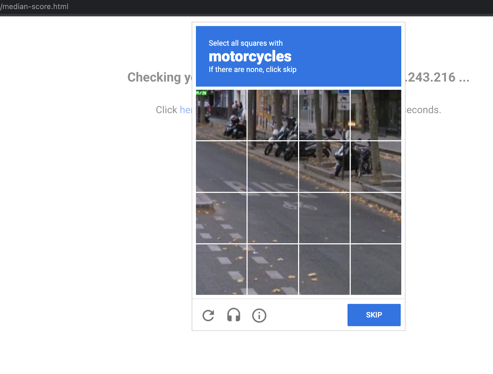

# Security with reCAPTCHA and Cloud Armor
## Introduction
Welcome to gHacks+, a new and exciting streaming platform for all manner of Google Cloud related technology and skills.

At gHacks+ they're seeing an increase in malicious bot attacks and user impersonation attempts against their platform. They have turned to Google Cloud to solve their security concerns using our reCAPTCHA and Cloud Armor security offerings.

It will be your job to ensure a successful deployment on their platform and save them from further attack.

## Description
Google Cloud HTTP(S) load balancing is deployed at the edge of Google's network in Google points of presence (POP) around the world. User traffic directed to an HTTP(S) load balancer enters the POP closest to the user and is then load balanced over Google's global network to the closest backend that has sufficient capacity available.

Cloud Armor is Google's distributed denial of service and web application firewall (WAF) detection system. Cloud Armor is tightly coupled with the Google Cloud HTTP Load Balancer and safeguards applications of Google Cloud customers from attacks from the internet. reCAPTCHA Enterprise is a service that protects your site from spam and abuse, building on the existing reCAPTCHA API which uses advanced risk analysis techniques to tell humans and bots apart. Cloud Armor Bot Management provides an end-to-end solution integrating reCAPTCHA Enterprise bot detection and scoring with enforcement by Cloud Armor at the edge of the network to protect downstream applications.


## Learning Objectives
In this lab, you configure an HTTP Load Balancer with a backend, as shown in the diagram above. Then, you'll learn to set up a reCAPTCHA session token site key and embed it in the gHacks+ website. You will also learn how to set up redirection to reCAPTCHA Enterprise manual challenge. We will then configure a Cloud Armor bot management policy to showcase how bot detection protects your application from malicious bot traffic.

1. How to set up a HTTP Load Balancer with appropriate health checks.
1. How to create a reCAPTCHA WAF challenge-page site key and associated it with Cloud Armor security policy.
1. How to create a reCAPTCHA session token site key and install it on your web pages.
1. How to create a Cloud Armor bot management policy.
1. How to validate that the bot management policy is handling traffic based on the rules configured.

## Challenges
- Challenge 0: Setup & Requirements
   - Before we can hack, you will need to set up a few things.
- Challenge 1: Create Managed Instance Groups
   - Use managed instance groups to create an HTTP Load Balancer backend.
- Challenge 2: Setup Your HTTP Load Balancer
   - Configure the HTTP Load Balancer to send traffic to your backend.
- Challenge 3: Deploy a reCAPTCHA Token and Challenge Page
   - Implement reCAPTCHA on a website's landing page. 
- Challenge 4: Configure Bot Management
   - Use Cloud Armor bot management rules to allow, deny and redirect requests based on the reCAPTCHA score.

## Prerequisites
- A new GCP project and your user having the Owner IAM role.
- Basic Networking and HTTP knowledge
- Basic Unix/Linux command line knowledge

## Contributors
- Lexi Flynn
- Gino Filicetti

## Challenge 0: Setup & Requirements

### Introduction

Thank you for participating in the Security with reCAPTCHA and Cloud Armor gHack. Before you can hack, you will need to set up a few prerequisites.

### Description

#### Confirm Your Project Is Good to Go
1. Sign-in to the [Google Cloud Console](http://console.cloud.google.com/) and select the project that was assigned to you. Alternately, if you have permissions, create a new project for this hack.

#### Start the Cloud Shell
While Google Cloud can be operated remotely from your laptop, in this gHack you will be using the Google Cloud Shell, a command line environment running in the Cloud.

- From the GCP Console click the Cloud Shell icon on the top right toolbar:

    

- It should only take a few moments to provision and connect to the environment. When it is finished, you should see something like this:

    

- This virtual machine is loaded with all the development tools you'll need. It offers a persistent 5GB home directory, and runs on Google Cloud, greatly enhancing network performance and authentication. All of your work in this gHack can be done completely in the browser.

#### Upload and Unzip All Student Files
You've been given a set of files that you will need through-out this gHack.

In the Google Space for this gHack Event, go to the **Files** tab and download `student-files.zip` to your computer. 

Now go to the Cloud Shell, click the 3 vertical dots and select **Upload**.


Find the `student-files.zip` file and upload it to the Cloud Shell.

Finally, unzip it with this command:

```bash
unzip student-files.zip
```

Leave the unzipped files where they are, we will be using them in subsequent challenges.

#### Run Terraform to Provision Needed Resources
There are some resources that need to be created before starting our hack. We have consolidated these into a Terraform script that provisions everything for us. It will do the following:

- Enable the Google Cloud services we'll be using.
- Create the `default` VPC Network (if it does not already exist).

Now run these commands to get Terraform to provision all of our pre-requisites:

```bash
terraform init
terraform apply --auto-approve --var gcp_project_id=${GOOGLE_CLOUD_PROJECT}
```

> **Note** You can safely ignore any errors about the `default` network already existing if encountered.

You should see output similar to this:


### Success Criteria

- You have a project for your hacking
- You've confirmed that Cloud Shell is working for you
- You've run the Terraform script to install all needed pre-requisites

### Learning Resources
- [Creating and Managing Projects](https://cloud.google.com/resource-manager/docs/creating-managing-projects#before_you_begin)
- [VIDEO: Running Terraform in Cloud Shell](https://youtu.be/flNnefErtL0)
- [Terraform Documentation](https://developer.hashicorp.com/terraform/docs)

## Challenge 1: Create Managed Instance Groups

### Introduction

A managed instance group uses an instance template to create a group of identical instances. Use these to create the backend of the HTTP Load Balancer.

### Description

#### Create Instance Template
We need to create an instance template that will be using with a load balancer in the next challenge. 

Keep the following things in mind:
- Choose something reasonable for the VM series such as `N1`
- Keep note of the subnet you use for networking and make sure everything you create in this gHack uses the same subnet
- Add a network tag: `allow-health-check`
    > **Note** The network tag **allow-health-check** ensures that the HTTP Health Check and SSH firewall rules apply to these instances.

    > **Note** Make sure to type a space or press tab after typing the tag name, otherwise it might not get set.

- We need to use a start up script to install some things on a new VM. Just cut and paste this code into the **Startup Script** field.

    ```bash
    #! /bin/bash
    sudo apt-get update
    sudo apt-get install apache2 unzip -y
    sudo a2ensite default-ssl
    sudo a2enmod ssl
    export vm_hostname="$(hostname)"
    sudo echo "Page served from: $vm_hostname" | \
    sudo tee /var/www/html/index.html
    ```

#### Create Managed Instance Group
Now that we have an instance template we can create an instance group that uses it. An instance group is just a grouping of virtual machines. In this case we're specifying that they should all be created from the same template.

Keep the following things in mind:
- Your managed instance group needs to be stateless
- It should be Single zone and in the same region you've been using up to now
- Keep the instances to 1
- Set port 80 as a "named port" port. This allows the load balancing service to forward traffic to the named port.

### Success Criteria

- You've created an instance template which defines instance properties including type, boot disk image, and subnet
- Your instance template is configured to allow health checks 
- You've created a new managed instance group as the HTTP backend 
- A port is configured to allow the load balancing service to forward traffic to the backend 

### Learning Resources

- [Instance Templates](https://cloud.google.com/compute/docs/instance-templates)
- [Instance Groups](https://cloud.google.com/compute/docs/instance-groups)
- [Load balancing and scaling](https://cloud.google.com/compute/docs/load-balancing-and-autoscaling)
- [gcloud compute instance-groups](https://cloud.google.com/sdk/gcloud/reference/compute/instance-groups)

## Challenge 2: Setup Your HTTP Load Balancer

### Introduction
Configure the HTTP Load Balancer to send traffic to the backend instance group you created in Challenge 1.

### Description
At a high level, in this challenge you will need to:
- Create a new load balancer.
- Configure its backend services.
- Configure a health check.
- Configure its frontend services.

#### Open the VPC Firewall 
Before we start, we need to make sure that HTTP traffic can flow within our network and that we can access our backend VMs

To achieve this, we will need to open up the `default` network's firewall to allow HTTP connections (for the load balancer's health-check) and SSH connections (for us to ssh into VMs).

You need to create 2 inbound firewall rules:

1. Open up HTTP for the load balancer's health-checks
    - Source ranges must be: `130.211.0.0/22` and `35.191.0.0/16`
    - Use a target tag of: `allow-health-check`
2. Open up SSH for us to log into VMs
    - Source must be all of the internet
    - Use a target tag of: `allow-health-check`

#### Start the configuration
- Create a "classic" HTTPS load balancer to send traffic from the Internet to the VMs in your instance group.

#### Configure the backend
Backend services direct incoming traffic to one or more attached backends. Each backend is composed of an instance group and additional serving capacity metadata.

Configure the backend making sure to:

 - Use the instance group you created in Challenge 1
 - Make it an HTTP backend

Configure the Health Check making sure to:

- Use the same port as the backend just created
- Enable logging

> **Note** Health checks determine which instances receive new connections. Your HTTP health check should poll instances every 5 seconds, waits up to 5 seconds for a response and treats 2 successful or 2 failed attempts as healthy or unhealthy, respectively.

#### Configure the frontend
The host and path rules determine how your traffic will be directed. For example, you could direct video traffic to one backend and static traffic to another backend. However, you are not configuring the Host and path rules in this gHack.

Configure the frontend as HTTP with an Ephemeral IP.

#### Test the HTTP Load Balancer
Now that you created the HTTP Load Balancer for your backends, verify that traffic is forwarded to the backend service. You should see simple webpage saying:

```
Page served from: { name of your VM }
```

> **Note** It might take up to 15 minutes to access the HTTP Load Balancer. In the meantime, you might get a 404 or 502 error. Keep trying until you see the page load.

### Success Criteria

- Your VPC firewall allows HTTP and SSH connections
- You've created an HTTP load balancer 
- Traffic is forwarded by the load balancer to the backend created in Challenge 1
- Health-check shows healthy connection to a backend VM
- The load balancer has a working IPv4 address 

### Learning Resources

- [Configuring VPC Firewall Rules](https://cloud.google.com/vpc/docs/using-firewalls)
- [External HTTP(S) Load Balancing](https://cloud.google.com/load-balancing/docs/https)
- [Load Balancer Health Checks](https://cloud.google.com/load-balancing/docs/https#health-checks)

## Challenge 3: Deploy a reCAPTCHA Token and Challenge Page

### Introduction 

reCAPTCHA Enterprise for WAF and Google Cloud Armor integration offers the following operating modes: reCAPTCHA challenge page, reCAPTCHA action-tokens, and reCAPTCHA session-tokens. In this gHack, we will be implementing the reCAPTCHA session token site key and reCAPTCHA WAF challenge-page site.

### Description

#### Create reCAPTCHA session token and WAF challenge-page site key
The reCAPTCHA JavaScript sets a reCAPTCHA session-token as a cookie on the end-user's browser after the assessment. The end-user's browser attaches the cookie and refreshes the cookie as long as the reCAPTCHA JavaScript remains active.

- In the Cloud Shell, use `gcloud` to create the reCAPTCHA session token site key and enable the WAF feature for the key. 
    - You must set the WAF service to Cloud Armor to enable the Cloud Armor integration.
    - Key type is **session-token**
    - Use the **score** integration type. Other options are **checkbox** and **invisible**.
    - Use a **testing score** of `0.5`.
        - This will validate that the bot management policies we create with Cloud Armor are working as intended. Replicating bot traffic is not easy and hence, this is a good way to test the feature.
    - Make note of the output of your `gcloud` command, it will output the key that you'll need later in this gHack.

- Use `gcloud` to also create the reCAPTCHA WAF challenge-page site key and enable the WAF feature for the key. You can use the reCAPTCHA challenge page feature to redirect incoming requests to reCAPTCHA Enterprise to determine whether each request is potentially fraudulent or legitimate. We will later associate this key with the Cloud Armor security policy to enable the manual challenge. We will refer to this key as **CHALLENGE-PAGE-KEY** in the later steps.
    - You must set the WAF service to Cloud Armor to enable the Cloud Armor integration.
    - Key type is **challenge-page**
    - Use the **invisible** integration type.
    - Make note of the output of your `gcloud` command, it will output the key that you'll need later in this gHack.

- Navigate to the reCAPTCHA Enterprise screen in the Google Cloud Console. Go to the **KEYS** tab and confirm that both of the keys you created are there.

#### Setup the gHacks+ Website
We've provided all the files for the gHacks streaming service's website. Now we need to upload these files to the VM.

- In the console, locate the VM in your instance group and get its name and zone.
- Use `gcloud compute scp` command to copy the `student-resources.zip` file in your Cloud Shell up to the VM
- SSH into the VM and unzip `student-resources.zip` into the root of the apache server's html folder.
    > **Tip** You'll have to do this as root

#### Implement reCAPTCHA session token site key
Edit `index.html` for the gHacks+ site and embed the reCAPTCHA session token site key. 
> **Tip** The session token site key is added to the ```HEAD``` section of the HTML page.

Validate that you are able to access all the movies available on the gHacks+ site. You'll need to find the load balancer's IP for this and go to `index.html` in a browser.
> **Note** You will be able to verify that the reCAPTCHA implementation is working when you see "protected by reCAPTCHA" at the bottom right corner of the index page:
    


### Success Criteria

- You've enabled the reCAPTCHA API 
- You've created a Cloud Armor WAF enabled reCAPTCHA session token key with integration type score
- You've created a Cloud Armor WAF enabled reCAPTCHA challenge page key with integration type invisible
- The gHacks+ index page is updated to include the reCAPTCHA session token site key and 3 links and shows the "protected by reCAPTCHA" image.
- You can access each movie.

### Learning Resources

- [Enable the reCAPTCHA Enterprise API](https://cloud.google.com/recaptcha-enterprise/docs/set-up-google-cloud#enable-the-recaptcha-enterprise-api)
- [Creating reCAPTCHA keys](https://cloud.google.com/recaptcha-enterprise/docs/create-key#website-keys)
- [reCAPTCHA: Install score-based site keys (no challenge) on websites](https://cloud.google.com/recaptcha-enterprise/docs/instrument-web-pages)
- [reCAPTCHA: Create an assessment](https://cloud.google.com/recaptcha-enterprise/docs/create-assessment)
- [Compute Engine: Connect to Linux VMs using Google tools](https://cloud.google.com/compute/docs/instances/connecting-to-instance#console)
- [scp Man Page](https://www.commandlinux.com/man-page/man1/scp.1.html)

## Challenge 4: Configure Bot Management

### Description

#### Create Cloud Armor security policy rules for Bot Management
In this section, you will use Cloud Armor bot management rules to allow, deny and redirect requests based on the reCAPTCHA score. Remember that when you created the session token site key, you set a testing score of 0.5.

- In Cloud Shell, use `gcloud` to create a reCAPTCHA security policy.

- Update the security policy to use a reCAPTCHA Enterprise manual challenge to distinguish between human and automated clients.
    - You will need your challenge-page site key created earlier.
    
> **Tip** For the bot management policies, you'll need expressions that use `request.path.matches()` and `token.recaptcha_session.score` values to match on.

- Add a bot management rule to the policy to **allow** traffic if the url path matches `good-score.html` and has a score greater than 0.4.

- Add a bot management rule to the policy to **deny** traffic with a 403 if the url path matches `bad-score.html` and has a score less than 0.6.

- Add a bot management rule to the policy to **redirect** traffic to Google reCAPTCHA if the url path matches `median-score.html` and has a score equal to 0.5.

- Attach this reCAPTCHA security policy to the backend service of your Load Balancer. **Make sure it is available globally.**

#### Validate Bot Management with Cloud Armor

- Open up a browser and go to ```http://{LoadBalance_IP_Here}/index.html```. Click on the movie "Brooklyn Dreams". Verify you are allowed through.

    

- Open a new window in Incognito mode to ensure we have a new session and go to ```http://{LoadBalance_IP_Here}/index.html```. Click on the movie "Thorned". Verify you receive a HTTP 403 error.

    

- Open another new window in Incognito mode to ensure we have a new session and go to ```http://{LoadBalance_IP_Here}/index.html```. Click on the movie "La Cucina in Crisis". Verify you see the redirection to Google reCAPTCHA and the manual challenge page.

    

#### Verify Cloud Armor logs

Explore the security policy logs to validate bot management worked as expected.

- In the Console, navigate to the logs for the reCAPTCHA policy you created.

- You should see the following MQL (Monitoring Query Language) query get pre-populated:

    ```sql
    resource.type:(http_load_balancer) AND jsonPayload.enforcedSecurityPolicy.name:({YOUR_POLICY_NAME})
    ```

- Verify a log entry exists in Query results where the request is for each rule (good, bad and median)

- Verify that the configuredAction is set to **ALLOW, DENY or GOOGLE_RECAPTCHA** with the name **recaptcha-policy**.

    

    

    

> **Note** Cloud Armor security policies create logs that can be explored to determine when traffic is denied and when it is allowed, along with the source of the traffic.

### Success Criteria

- You've configured the Cloud Armor security policy rules for Bot Management 
- The policy has been attached to the backend 
- Users with a good score are allowed through 
- Users with a median score are redirected to the reCAPTCHA manual challenge 
- Users with a bad score are not allowed through 
- A score is recorded in the Cloud Armor logs when a user attempts to access movies in the gHacks+ streaming site.

### Learning Resources

- [Google Cloud Armor bot management overview](https://cloud.google.com/armor/docs/bot-management)
- [Configure Google Cloud Armor security policies](https://cloud.google.com/armor/docs/configure-security-policies#bot-management)
- [Overview of reCAPTCHA Enterprise for WAF and Google Cloud Armor integration](https://cloud.google.com/recaptcha-enterprise/docs/integration-overview)
- [Implement the reCAPTCHA Enterprise for WAF and Google Cloud Armor integration](https://cloud.google.com/recaptcha-enterprise/docs/implement-tokens)