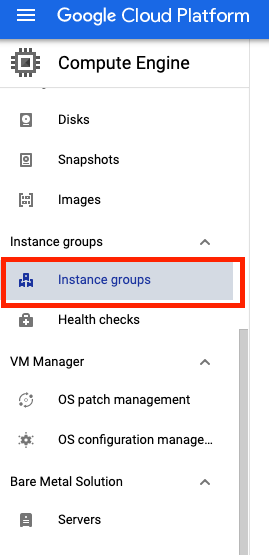

# Challenge 1 - Create Managed Instance Groups

[< Previous Challenge](./Solution-00.md) - **[Home](README.md)** - [Next Challenge>](./Solution-02.md)

## Notes & Guidance
Students will creating managed instance groups here, so there are a few things to keep an eye on:

- They might not know that the script has to be copy and pasted verbatim.

## Step By Step Walk-through

### Configure the instance templates
1. In the Cloud Console, navigate to **Navigation menu > Compute Engine > Instance templates**, and then click **Create instance template**.
1. For **Name**, type **lb-backend-template**.
1. For **Series**, select **N1**.
1. Click **Networking, Disks, Security, Management, Sole-Tenancy**.

    

1. Click on the **Networking** tab, add the network tags: **allow-health-check**
1. Set the following values and leave all other values at their defaults:

    |Property|Value|
    |--|--|
    |Network|default|
    |Subnet|default (us-east1)|
    |Network tags|allow-health-check|
    
    > The network tag **allow-health-check** ensures that the HTTP Health Check and SSH firewall rules apply to these instances.
    > **NOTE:** Make sure to type a space or press tab after typing the tag name, otherwise it might not get set.

1. Go to the **Management** section and insert the following script into the **Startup script** field:

    ```bash
    #! /bin/bash
    sudo apt-get update
    sudo apt-get install apache2 -y
    sudo a2ensite default-ssl
    sudo a2enmod ssl
    export vm_hostname="$(hostname)"
    sudo echo "Page served from: $vm_hostname" | \
    sudo tee /var/www/html/index.html
    ```


1. Click **Create**.
1. Wait for the instance template to be created.

### Create the managed instance group
1. Still in the **Compute Engine** page, click **Instance groups** in the left menu.

    

1. Click **Create instance group**. Select **New managed instance group (stateless)**.
1. Set the following values, leave all other values at their defaults:

    |Property|Value|
    |--|--|
    |Name|lb-backend-example|
    |Location|Single zone|
    |Region|us-east1|
    |Zone|us-east1-b|
    |Instance template|lb-backend-example|
    |Autoscaling|Don't autoscale|
    |Number of instances|1|

1. Click **Create**

### Add a named port to the instance group
1. For your instance group, use this command to define an HTTP service and map a port name to the relevant port. The load balancing service forwards traffic to the named port.

    ```bash
    gcloud compute instance-groups set-named-ports lb-backend-example \
        --named-ports http:80 \
        --zone us-east1-b
    ```


