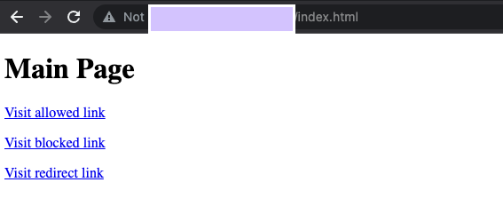

# Challenge 3 - Deploy a reCAPTCHA Token and Challenge Page

[< Previous Challenge](./Solution-02.md) - **[Home](README.md)** - [Next Challenge>](./Solution-04.md)

## Notes & Guidance
- Before starting make sure to give them another overview of how reCAPTCHA works and how it uses different levels of scoring.
- Updating the html files can be a little tricky, keep an eye on them.

## Step By Step Walk-through
### Create reCAPTCHA session token and WAF challenge-page site key
Before creating the session token site key and challenge page site key, double check that you have enabled the reCAPTCHA Enterprise API as indicated in the "Enable API" section at the beginning.

The reCAPTCHA JavaScript sets a reCAPTCHA session-token as a cookie on the end-user's browser after the assessment. The end-user's browser attaches the cookie and refreshes the cookie as long as the reCAPTCHA JavaScript remains active.

1. Create the reCAPTCHA session token site key and enable the WAF feature for the key. We will also be setting the WAF service to Cloud Armor to enable the Cloud Armor integration.

    ```bash
    gcloud recaptcha keys create --display-name=test-key-name \
        --web --allow-all-domains --integration-type=score --testing-score=0.5 \
        --waf-feature=session-token --waf-service=ca
    ```

    > **NOTE:** We are using the integration type **score** which will be leveraged in the Cloud Armor policy. You can alternatively use **checkbox** and **invisible**.

    > We are also setting a **testing score** when creating the key to validate that the bot management policies we create with Cloud Armor are working as intended. Replicating bot traffic is not easy and hence, this is a good way to test the feature.

1. Output of the above command, gives you the key created. Make a note of it as we will add it to your web site in the next step.
1. Create the reCAPTCHA WAF challenge-page site key and enable the WAF feature for the key. You can use the reCAPTCHA challenge page feature to redirect incoming requests to reCAPTCHA Enterprise to determine whether each request is potentially fraudulent or legitimate. We will later associate this key with the Cloud Armor security policy to enable the manual challenge. We will refer to this key as **CHALLENGE-PAGE-KEY** in the later steps.

    ```bash
    gcloud recaptcha keys create --display-name=challenge-page-key \
        --web --allow-all-domains --integration-type=INVISIBLE \
        --waf-feature=challenge-page --waf-service=ca
    ```

1. Navigate to **Navigation menu > Security > reCAPTCHA Enterprise**. You should see the keys you created under Enterprise Keys:

    

### Implement reCAPTCHA session token site key
1. Navigate to **Navigation menu > Compute Engine > VM Instances**. Locate the VM in your instance group and SSH to it.

    

1. Go to the webserver root directory and and change user to root

    ```bash
    cd /var/www/html/
    sudo su
    ```

1. Update the landing index.html page and embed the reCAPTCHA session token site key. The session token site key is set in the head section of your landing page as below: 

    ```html
    <script src="https://www.google.com/recaptcha/enterprise.js?render=<REPLACE_TOKEN_HERE>&waf=session" async defer></script>
    ```

Remember to replace the token before updating the index.html file as indicated below

```bash
echo '<!doctype html><html><head><title>ReCAPTCHA Session Token</title><script src="https://www.google.com/recaptcha/enterprise.js?render=<REPLACE_TOKEN_HERE>&waf=session" async defer></script></head><body><h1>Main Page</h1><p><a href="/good-score.html">Visit allowed link</a></p><p><a href="/bad-score.html">Visit blocked link</a></p><p><a href="/median-score.html">Visit redirect link</a></p></body></html>' > index.html
```

4. Create three other sample pages to test out the bot management policies: 
    - **good-score.html**

        ```bash
        echo '<!DOCTYPE html><html><head><meta http-equiv="Content-Type" content="text/html; charset=windows-1252"></head><body><h1>Congrats! You have a good score!!</h1></body></html>' > good-score.html
        ```

    - **bad-score.html**

        ```bash
        echo '<!DOCTYPE html><html><head><meta http-equiv="Content-Type" content="text/html; charset=windows-1252"></head><body><h1>Sorry, You have a bad score!</h1></body></html>' > bad-score.html
        ```

    - **median-score.html**

        ```bash
        echo '<!DOCTYPE html><html><head><meta http-equiv="Content-Type" content="text/html; charset=windows-1252"></head><body><h1>You have a median score that we need a second verification.</h1></body></html>' > median-score.html
        ```

1. Validate that you are able to access all the webpages by opening them in your browser. Make sure to replace **[LB_IP_v4]** with the IPv4 address of the load balancer.
    - Open ***http://[LB_IP_v4]/index.html***. You will be able to verify that the reCAPTCHA implementation is working when you see "protected by reCAPTCHA" at the bottom right corner of the page:
        
        

    - Click into each of the links:

        

    - Validate you are able to access all the pages.

        
