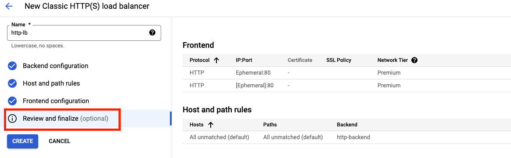

# Security with reCAPTCHA and Cloud Armor

## Introduction
Welcome to the coach's guide for the Security with reCAPTCHA and Cloud Armor gHack. Here you will find links to specific guidance for coaches for each of the challenges.

## Coach's Guides
- Challenge 0: Setup & Requirements
   - Before we can hack, you will need to set up a few things.
- Challenge 1: Create Managed Instance Groups
   - Use managed instance groups to create an HTTP Load Balancer backend.
- Challenge 2: Setup Your HTTP Load Balancer
   - Configure the HTTP Load Balancer to send traffic to your backend.
- Challenge 3: Deploy a reCAPTCHA Token and Challenge Page
   - Implement reCAPTCHA on a website's landing page. 
- Challenge 4: Configure Bot Management
   - Use Cloud Armor bot management rules to allow, deny and redirect requests based on the reCAPTCHA score.

## Challenge 0: Setup & Requirements

### Notes & Guidance

**IMPORTANT:** This hack includes student resources that need to be made available to participants. When you create the Google Space you'll also have to do the following:

- Create a zip file of the `resources` folder in this gHack. The HTML files need to be at the root of the zip, do not include the resources folder itself in the zip.
- Upload this zip file to the **"Files"** tab in the Google Space

If you are running this hack in an Argolis environment there are a few extra important things to keep in mind:

- The `default` network isn't automatically created. Students will be instructed to create a default network with auto-subnet creation turned on at the start of the hack.
- There are some default Argolis policies that will need to be changed to allow traffic through to the load balancer. Run the `argolis-fix-policy-defaults.sh` script in [this repository](https://github.com/gfilicetti/gcp-scripts) to set all the proper defaults.

## Challenge 1: Create Managed Instance Groups

### Notes & Guidance
Students will creating managed instance groups here, so there are a few things to keep an eye on:

- They might not know that the script has to be copy and pasted verbatim.

### Step By Step Walk-through

#### Configure the instance templates
1. In the Cloud Console, navigate to **Navigation menu > Compute Engine > Instance templates**, and then click **Create instance template**.
1. For **Name**, type **lb-backend-template**.
1. For **Series**, select **N1**.
1. Click **Networking, Disks, Security, Management, Sole-Tenancy**.

    

1. Click on the **Networking** tab, add the network tags: **allow-health-check**
1. Set the following values and leave all other values at their defaults:

    |Property|Value|
    |--|--|
    |Network|default|
    |Subnet|default (us-east1)|
    |Network tags|allow-health-check|
    
    > The network tag **allow-health-check** ensures that the HTTP Health Check and SSH firewall rules apply to these instances.

    > **Note** Make sure to type a space or press tab after typing the tag name, otherwise it might not get set.

1. Go to the **Management** section and insert the following script into the **Startup script** field:

    ```bash
    #! /bin/bash
    sudo apt-get update
    sudo apt-get install apache2 unzip -y
    sudo a2ensite default-ssl
    sudo a2enmod ssl
    export vm_hostname="$(hostname)"
    sudo echo "Page served from: $vm_hostname" | \
    sudo tee /var/www/html/index.html
    ```

1. Click **Create**.
1. Wait for the instance template to be created.

#### Create the managed instance group
1. Still in the **Compute Engine** page, click **Instance groups** in the left menu.

    

1. Click **Create instance group**. Select **New managed instance group (stateless)**.
1. Set the following values, leave all other values at their defaults:

    |Property|Value|
    |--|--|
    |Name|lb-backend-instance-group|
    |Location|Single zone|
    |Region|us-east1|
    |Zone|us-east1-b|
    |Instance template|lb-backend-instance-group|
    |Autoscaling|Don't autoscale|
    |Number of instances|1|

1. Click **Create**

#### Add a named port to the instance group
1. For your instance group, use this command to define an HTTP service and map a port name to the relevant port. The load balancing service forwards traffic to the named port.

    ```bash
    gcloud compute instance-groups set-named-ports lb-backend-instance-group \
        --named-ports http:80 \
        --zone us-east1-b
    ```

## Challenge 2: Setup Your HTTP Load Balancer

### Notes & Guidance
- Remember that the HTTP Load Balancer can take up to 15 minutes to provision, make sure the students are patient.
- Sometimes students get hung up on setting up the health checks properly.

### Step By Step Walk-through
#### Start the configuration
1. In the Cloud Console, click **Navigation menu** > click **Network Services** > **Load balancing**, and then click **Create load balancer**.
1. Under **HTTP(S) Load Balancing**, click on **Start configuration**.

    

1. Select **From Internet to my VMs, Classic HTTP(S) Load Balancer** and click **Continue**.
1. Set the **Name** to *http-lb*.

#### Configure the backend
Backend services direct incoming traffic to one or more attached backends. Each backend is composed of an instance group and additional serving capacity metadata.

1. Click on **Backend configuration**.
1. For **Backend services & backend buckets**, click **Create a backend service**.
1. Set the following values, leave all other values at their defaults:

    |Property|Value|
    |--|--|
    |Name|lb-backend|
    |Protocol|HTTP|
    |Named Port|http|
    |Instance Group|lb-backend-instance-group|
    |Port Numbers|80|

1. Click **Done**.
1. Click **Add Backend**.
1. For **Health Check**, select **Create a health check**.

    

1. Set the following values, leave all other values at their defaults:

    |Property|Value|
    |--|--|
    |Name|http-health-check|
    |Protocol|TCP|
    |Port|80|

    > Health checks determine which instances receive new connections. This HTTP health check polls instances every 5 seconds, waits up to 5 seconds for a response and treats 2 successful or 2 failed attempts as healthy or unhealthy, respectively.

    

1. Click **Save**.
1. Check the **Enable Logging** box.
1. Set the **Sample Rate** to 1:

    

1. Click Create to create the backend service.

    

#### Configure the frontend
The host and path rules determine how your traffic will be directed. For example, you could direct video traffic to one backend and static traffic to another backend. However, you are not configuring the Host and path rules in this hack.

1. Click on **Frontend configuration**.
1. Specify the following, leaving all other values at their defaults:

    |Property|Value|
    |--|--|
    |Protocol|HTTP|
    |IP Version|IPv4|
    |IP Address|Ephemeral|
    |Port|80|

1. Click **Done**.

#### Review and create the HTTP Load Balancer
1. Click on **Review and finalize**.

    

1. Review the **Backend services** and **Frontend**.
1. Click on **Create**.
1. Wait for the load balancer to be created.
1. Click on the name of the load balancer: **http-lb**.
1. Note the IPv4 address of the load balancer for the next task. We will refer to it as **[LB_IP_v4]**.

#### Test the HTTP Load Balancer
Now that you created the HTTP Load Balancer for your backends, verify that traffic is forwarded to the backend service. To test IPv4 access to the HTTP Load Balancer, open a new tab in your browser and navigate to **http://[LB_IP_v4]**. Make sure to replace **[LB_IP_v4]** with the IPv4 address of the load balancer.

> It might take up to 15 minutes to access the HTTP Load Balancer. In the meantime, you might get a 404 or 502 error. Keep trying until you see the page load.

## Challenge 3: Deploy a reCAPTCHA Token and Challenge Page

### Notes & Guidance
- Before starting make sure to give them another overview of how reCAPTCHA works and how it uses different levels of scoring.
- Updating the html files can be a little tricky, keep an eye on them.

### Step By Step Walk-through
#### Create reCAPTCHA session token and WAF challenge-page site key
Before creating the session token site key and challenge page site key, double check that you have enabled the reCAPTCHA Enterprise API as indicated in the "Enable API" section at the beginning.

The reCAPTCHA JavaScript sets a reCAPTCHA session-token as a cookie on the end-user's browser after the assessment. The end-user's browser attaches the cookie and refreshes the cookie as long as the reCAPTCHA JavaScript remains active.

1. Create the reCAPTCHA session token site key and enable the WAF feature for the key. We will also be setting the WAF service to Cloud Armor to enable the Cloud Armor integration.

    ```bash
    gcloud recaptcha keys create --display-name=test-key-name \
        --web --allow-all-domains --integration-type=score --testing-score=0.5 \
        --waf-feature=session-token --waf-service=ca
    ```

    > **Note** We are using the integration type **score** which will be leveraged in the Cloud Armor policy. You can alternatively use **checkbox** and **invisible**.

    > We are also setting a **testing score** when creating the key to validate that the bot management policies we create with Cloud Armor are working as intended. Replicating bot traffic is not easy and hence, this is a good way to test the feature.

1. Output of the above command, gives you the key created. Make a note of it as we will add it to your web site in the next step.
1. Create the reCAPTCHA WAF challenge-page site key and enable the WAF feature for the key. You can use the reCAPTCHA challenge page feature to redirect incoming requests to reCAPTCHA Enterprise to determine whether each request is potentially fraudulent or legitimate. We will later associate this key with the Cloud Armor security policy to enable the manual challenge. We will refer to this key as **CHALLENGE-PAGE-KEY** in the later steps.

    ```bash
    gcloud recaptcha keys create --display-name=challenge-page-key \
        --web --allow-all-domains --integration-type=INVISIBLE \
        --waf-feature=challenge-page --waf-service=ca
    ```

1. Navigate to **Navigation menu > Security > reCAPTCHA Enterprise**. You should see the keys you created under Enterprise Keys:

    

#### Implement reCAPTCHA session token site key
1. Navigate to **Navigation menu > Compute Engine > VM Instances**. Locate the VM in your instance group and SSH to it.

    

1. Go to the webserver root directory and and change user to root

    ```bash
    cd /var/www/html/
    sudo su
    ```

1. Use `scp` from the Cloud Shell and upload `student-resources.zip` (from the Google Space's Files tab) to the VM.

    ```bash
    scp student-resources.zip user@32.43.54.1:~
    ```

1. Move the contents of the zip into the root html folder, overwriting `index.html`

1. Update `index.html` and embed the reCAPTCHA session token site key. The session token site key is set in the head section of your landing page as below: 

    ```html
    <script src="https://www.google.com/recaptcha/enterprise.js?render=<REPLACE_TOKEN_HERE>&waf=session" async defer></script>
    ```

1. Validate that you are able to access all the webpages by opening them in your browser. Make sure to replace **[LB_IP_v4]** with the IPv4 address of the load balancer.
    - Open ***http://[LB_IP_v4]/index.html***. You will be able to verify that the reCAPTCHA implementation is working when you see "protected by reCAPTCHA" at the bottom right corner of the page:
        
        

    - Click into each of the links:

        

    - Validate you are able to access all the pages.

        
        
        

## Challenge 4: Configure Bot Management

### Notes & Guidance
- There are a lot of gcloud command line calls that need to be discovered here, make sure they're reading the linked documentation.
- They have to get the MQL statement exactly right, try to hold their hand through that.

### Step By Step Walk-through
#### Create Cloud Armor security policy rules for Bot Management
In this section, you will use Cloud Armor bot management rules to allow, deny and redirect requests based on the reCAPTCHA score. Remember that when you created the session token site key, you set a testing score of 0.5.

1. In Cloud Shell, create security policy via gcloud:

    ```bash
    gcloud compute security-policies create recaptcha-policy \
        --description "policy for bot management"
    ```
1. To use reCAPTCHA Enterprise manual challenge to distinguish between human and automated clients, associate the reCAPTCHA WAF challenge site key we created for manual challenge with the security policy. Replace "CHALLENGE-PAGE-KEY" with the key we created:

    ```bash
    gcloud compute security-policies update recaptcha-policy \
        --recaptcha-redirect-site-key "CHALLENGE-PAGE-KEY"
    ```

1. Add a bot management rule to allow traffic if the url path matches good-score.html and has a score greater than 0.4:

    ```bash
    gcloud compute security-policies rules create 2000 \
        --security-policy recaptcha-policy \
        --expression "request.path.matches('good-score.html') &&    token.recaptcha_session.score > 0.4" \
        --action allow
    ```

1. Add a bot management rule to deny traffic if the url path matches bad-score.html and has a score less than 0.6: 

    ```bash
    gcloud compute security-policies rules create 3000 \
        --security-policy recaptcha-policy \
        --expression "request.path.matches('bad-score.html') && token.recaptcha_session.score < 0.6" \
        --action "deny-403"
    ```

1. Add a bot management rule to redirect traffic to Google reCAPTCHA if the url path matches median-score.html and has a score equal to 0.5:

    ```bash
    gcloud compute security-policies rules create 1000 \
        --security-policy recaptcha-policy \
        --expression "request.path.matches('median-score.html') && token.recaptcha_session.score == 0.5" \
        --action redirect \
        --redirect-type google-recaptcha
    ```

1. Attach the security policy to the backend service lb-backend:

    ```bash
    gcloud compute backend-services update lb-backend \
        --security-policy=recaptcha-policy –-global
    ```

1. In the Console, navigate to **Navigation menu > Network Security > Cloud Armor**.

1. Click **recaptcha-policy**. Your policy should resemble the following:

    

#### Validate Bot Management with Cloud Armor

1. Open up a browser and enter the url ***http://[LB_IP_v4]/index.html***. Navigate to **"Visit allow link"**. You should be allowed through:

    

1. Open a new window in Incognito mode to ensure we have a new session. Enter the url ***http://[LB_IP_v4]/index.html*** and navigate to **"Visit blocked link"**. You should receive a HTTP 403 error

    

1. Open a new window in Incognito mode to ensure we have a new session. Enter the url ***http://[LB_IP_v4]/index.html*** and navigate to **"Visit redirect link"**. You should see the redirection to Google reCAPTCHA and the manual challenge page as below

    

#### Verify Cloud Armor logs

Explore the security policy logs to validate bot management worked as expected.

1. In the Console, navigate to **Navigation menu > Network Security > Cloud Armor**.

1. Click **recaptcha-policy**

1. Click **Logs**

    

1. Click **View policy logs**

1. Below is the MQL(monitoring query language) query, you can copy and paste into the query editor: 

    ```sql
    resource.type:(http_load_balancer) AND jsonPayload.enforcedSecurityPolicy.name:(recaptcha-policy)
    ```

1. Now click Run Query.

1. Look for a log entry in Query results where the request is for ***http://[LB_IP_v4]/good-score.html***. Expand jsonPayload. Expand enforcedSecurityPolicy.

    

1. Repeat the same for ***http://[LB_IP_v4]/bad-score.html*** and ***http://[LB_IP_v4]/median-score.html***

    

    

Notice that the configuredAction is set to **ALLOW, DENY or GOOGLE_RECAPTCHA** with the name **recaptcha-policy**.

> Cloud Armor security policies create logs that can be explored to determine when traffic is denied and when it is allowed, along with the source of the traffic.