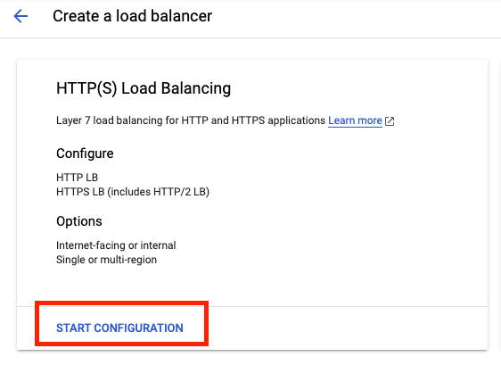
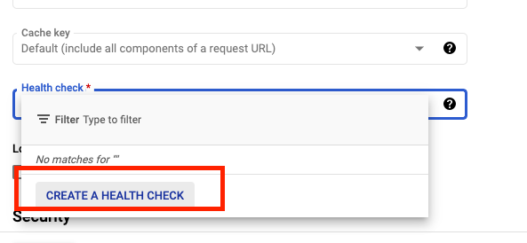
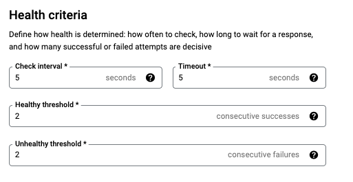
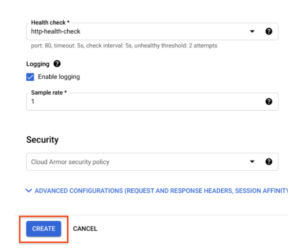

# Challenge 2 - Setup Your HTTP Load Balancer

[< Previous Challenge](./Solution-01.md) - **[Home](README.md)** - [Next Challenge>](./Solution-03.md)

## Notes & Guidance
- Remember that the HTTP Load Balancer can take up to 15 minutes to provision, make sure the students are patient.
- Sometimes students get hung up on setting up the health checks properly.

## Step By Step Walk-through
### Start the configuration
1. In the Cloud Console, click **Navigation menu** > click **Network Services** > **Load balancing**, and then click **Create load balancer**.
1. Under **HTTP(S) Load Balancing**, click on **Start configuration**.

    

1. Select **From Internet to my VMs, Classic HTTP(S) Load Balancer** and click **Continue**.
1. Set the **Name** to *http-lb*.

### Configure the backend
Backend services direct incoming traffic to one or more attached backends. Each backend is composed of an instance group and additional serving capacity metadata.

1. Click on **Backend configuration**.
1. For **Backend services & backend buckets**, click **Create a backend service**.
1. Set the following values, leave all other values at their defaults:

    |Property|Value|
    |--|--|
    |Name|http-backend|
    |Protocol|HTTP|
    |Named Port|http|
    |Instance Group|lb-backend-example|
    |Port Numbers|80|

1. Click **Done**.
1. Click **Add Backend**.
1. For **Health Check**, select **Create a health check**.

    

1. Set the following values, leave all other values at their defaults:

    |Property|Value|
    |--|--|
    |Name|http-health-check|
    |Protocol|TCP|
    |Port|80|

    > Health checks determine which instances receive new connections. This HTTP health check polls instances every 5 seconds, waits up to 5 seconds for a response and treats 2 successful or 2 failed attempts as healthy or unhealthy, respectively.

    

1. Click **Save**.
1. Check the **Enable Logging** box.
1. Set the **Sample Rate** to 1:

    

1. Click Create to create the backend service.

    

### Configure the frontend
The host and path rules determine how your traffic will be directed. For example, you could direct video traffic to one backend and static traffic to another backend. However, you are not configuring the Host and path rules in this hack.

1. Click on **Frontend configuration**.
1. Specify the following, leaving all other values at their defaults:

    |Property|Value|
    |--|--|
    |Protocol|HTTP|
    |IP Version|IPv4|
    |IP Address|Ephemeral|
    |Port|80|

1. Click **Done**.

### Review and create the HTTP Load Balancer
1. Click on **Review and finalize**.

    

1. Review the **Backend services** and **Frontend**.
1. Click on **Create**.
1. Wait for the load balancer to be created.
1. Click on the name of the load balancer: **http-lb**.
1. Note the IPv4 address of the load balancer for the next task. We will refer to it as **[LB_IP_v4]**.

### Test the HTTP Load Balancer
Now that you created the HTTP Load Balancer for your backends, verify that traffic is forwarded to the backend service. To test IPv4 access to the HTTP Load Balancer, open a new tab in your browser and navigate to **http://[LB_IP_v4]**. Make sure to replace **[LB_IP_v4]** with the IPv4 address of the load balancer.

> It might take up to 15 minutes to access the HTTP Load Balancer. In the meantime, you might get a 404 or 502 error. Keep trying until you see the page load.
