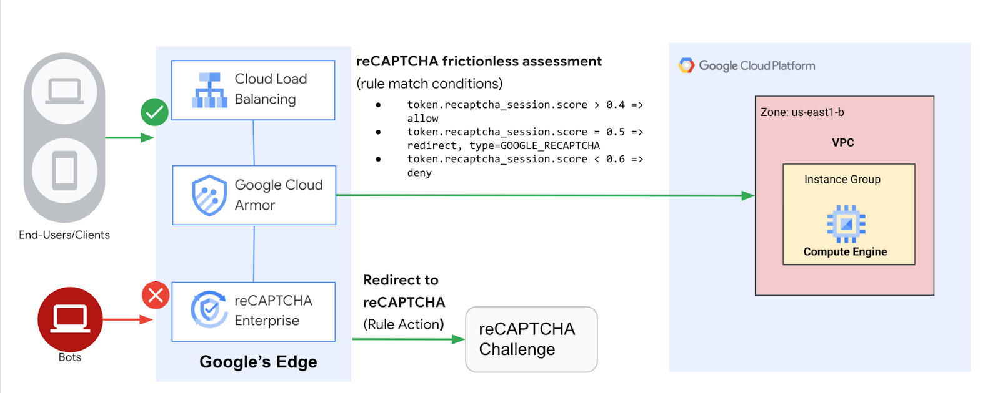

# Security in Media & Entertainment
## Introduction
Google Cloud HTTP(S) load balancing is deployed at the edge of Google's network in Google points of presence (POP) around the world. User traffic directed to an HTTP(S) load balancer enters the POP closest to the user and is then load balanced over Google's global network to the closest backend that has sufficient capacity available.

Cloud Armor is Google's distributed denial of service and web application firewall (WAF) detection system. Cloud Armor is tightly coupled with the Google Cloud HTTP Load Balancer and safeguards applications of Google Cloud customers from attacks from the internet. reCAPTCHA Enterprise is a service that protects your site from spam and abuse, building on the existing reCAPTCHA API which uses advanced risk analysis techniques to tell humans and bots apart. Cloud Armor Bot Management provides an end-to-end solution integrating reCAPTCHA Enterprise bot detection and scoring with enforcement by Cloud Armor at the edge of the network to protect downstream applications.

## Learning Objectives
In this lab, you configure an HTTP Load Balancer with a backend, as shown in the diagram below. Then, you'll learn to set up a reCAPTCHA session token site key and embed it in your website. You will also learn to set up redirection to reCAPTCHA Enterprise manual challenge. We will then configure a Cloud Armor bot management policy to showcase how bot detection protects your application from malicious bot traffic.

1. How to set up a HTTP Load Balancer with appropriate health checks.
1. How to create a reCAPTCHA WAF challenge-page site key and associated it with Cloud Armor security policy.
1. How to create a reCAPTCHA session token site key and install it on your web pages.
1. How to create a Cloud Armor bot management policy.
1. How to validate that the bot management policy is handling traffic based on the rules configured.

## Challenges
- Challenge 0: **[Setup & Requirements](Student/Challenge-00.md)**
   - Before we can hack, you will need to set up a few things.
- Challenge 1: **[Create Managed Instance Groups](Student/Challenge-01.md)**
   - SHORT DESCRIPTION
- Challenge 2: **[Setup Your HTTP Load Balancer](Student/Challenge-02.md)**
   - SHORT DESCRIPTION
- Challenge 3: **[Deploy a reCAPTCHA Token and Challenge Page](Student/Challenge-03.md)**
   - SHORT DESCRIPTION
- Challenge 4: **[Configure Bot Management](Student/Challenge-04.md)**
   - SHORT DESCRIPTION

## Prerequisites
- The ability to create your own GCP projects with Owner IAM role.
- Basic Networking and HTTP knowledge
- Basic Unix/Linux command line knowledge

## Contributors
- Lexi Flynn
- Gino Filicetti

