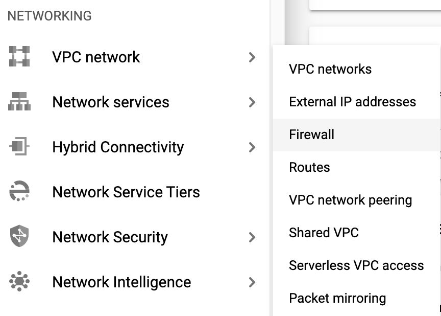

# Challenge 0 - Setup & Requirements

**[Home](../README.md)** - [Next Challenge>](./Challenge-01.md)

## Introduction

Thank you for participating in the Security in Media & Entertainment gHack. Before you can hack, you will need to set up a few prerequisites.

## Description

### Setup Your Project
1. Sign-in to the [Google Cloud Console](http://console.cloud.google.com/) and create a new project or reuse an existing one. If you don't already have a Gmail or Google Workspace account, you must [create one](https://accounts.google.com/SignUp).

    
    
    

- The **Project name** is the display name for this project's participants. It is a character string not used by Google APIs, and you can update it at any time.

- The **Project ID** must be unique across all Google Cloud projects and is immutable (cannot be changed after it has been set). The Cloud Console auto-generates a unique string; usually you don't care what it is. You'll need to reference the Project ID (and it is typically identified as `PROJECT_ID`), so if you don't like it, generate another random one, or, you can try your own and see if it's available. Then it's "frozen" after the project is created.

- There is a third value, a Project Number which some APIs use. Learn more about all three of these values in the [documentation](https://cloud.google.com/resource-manager/docs/creating-managing-projects#before_you_begin).

    > **Caution:** A project ID must be globally unique and cannot be used by anyone else after you've selected it. You are the only user of that ID. If a project is deleted, that ID can never be used again.

    > **Note:** If you're using a Gmail account, you can leave the default location set to **No organization**. If you're using a Google Workspace account, then choose a location that makes sense for your organization.

2. Next, you'll need to [enable billing](https://console.cloud.google.com/billing) in the Cloud Console in order to use Cloud resources/APIs. Running through this gHack shouldn't cost much, if anything at all. To shut down resources so you don't incur billing beyond this tutorial, follow any "clean-up" instructions found at the end of this gHack. New users of Google Cloud are eligible for the [$300 USD Free Trial program](http://cloud.google.com/free).

### Start the Cloud Shell
While Google Cloud can be operated remotely from your laptop, in this gHack you will be using the Google Cloud Shell, a command line environment running in the Cloud.

- From the GCP Console click the Cloud Shell icon on the top right toolbar:

    

- It should only take a few moments to provision and connect to the environment. When it is finished, you should see something like this:

    

- This virtual machine is loaded with all the development tools you'll need. It offers a persistent 5GB home directory, and runs on Google Cloud, greatly enhancing network performance and authentication. All of your work in this gHack can be done completely in the browser.

### Setup Cloud Shell
- Inside Cloud Shell, make sure that your project id is set up:

    ```bash
    gcloud config list project
    gcloud config set project [YOUR-PROJECT-NAME]
    PROJECT_ID=[YOUR-PROJECT-NAME]
    echo $PROJECT_ID
    ```
### Enable APIs
- Enable all necessary service APIs

    ```bash
    gcloud services enable compute.googleapis.com
    gcloud services enable logging.googleapis.com
    gcloud services enable monitoring.googleapis.com
    gcloud services enable recaptchaenterprise.googleapis.com
    ```

### Create the `default` VPC Network
**NOTE:** Normally you should already have a `default` network defined with auto-subnet creation turned on. 

If it does not already exist in your project, you can create one using this command:

```bash
gcloud compute networks create default \
    --subnet-mode=auto \
    --bgp-routing-mode=global 
```

### Configure Firewall Rules
Configure firewall rules to allow HTTP traffic to the backends from the Google Cloud health checks and the Load Balancer. Also, configure a firewall rule to allow SSH into the instances.

We will be using the ***default*** VPC network created in your project. Create a firewall rule to allow HTTP traffic to the backends. Health checks determine which instances of a load balancer can receive new connections. For HTTP load balancing, the health check probes to your load balanced instances come from addresses in the ranges **130.211.0.0/22** and **35.191.0.0/16**. Your VPC firewall rules must allow these connections. Also, the load balancers talk to the backend on the same IP range.

1. In the Cloud Console, navigate to Navigation at the top left and go to: **VPC network > Firewall**.

    

1. Notice the existing ICMP, internal, RDP, and SSH firewall rules.Each Google Cloud project starts with the default network and these firewall rules.

1. Click Create Firewall Rule.

1. Set the following values, leave all other values at their defaults:

    |Property|Value|
    |--|--|
    |Name|default-allow-health-check|
    |Network|default|
    |Targets|Specified target tags|
    |Target tags|allow-health-check|
    |Source filter|IP Ranges|
    |Source IP ranges|130.211.0.0/22, 35.191.0.0/16|
    |Protocols and ports|Specified protocols and ports, and then *check* tcp. Type **80** for port number|

    > Make sure to enter the two **Source IP ranges** one-by-one and press SPACE in between them.

1. Click Create

- Alternatively, if you want to use the Cloud Shell, this is the command to run:
    ```bash
    gcloud compute firewall-rules create default-allow-health-check --direction=INGRESS --priority=1000 --network=default --action=ALLOW --rules=tcp:80 --source-ranges=130.211.0.0/22,35.191.0.0/16 --target-tags=allow-health-check
    ```

- Similarly, create a Firewall rule to allow SSH-ing into the instances via the Console like above or with this command:
    ```bash
    gcloud compute firewall-rules create allow-ssh --direction=INGRESS --priority=1000 --network=default --action=ALLOW --rules=tcp:22 --source-ranges=0.0.0.0/0 --target-tags=allow-health-check
    ```

## Success Criteria

- You've created a new project for your hacking
- You've confirmed that Cloud Shell is working for you
- You've enabled the specified APIs needed for this gHack
- You've created firewall rules to allow health checks and SSH traffic through
