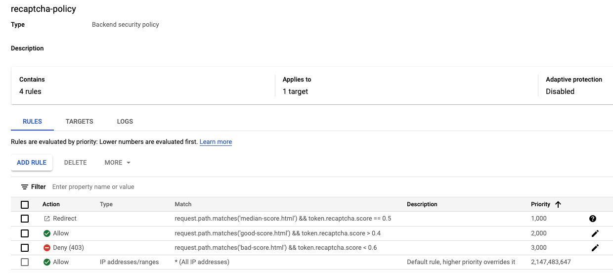
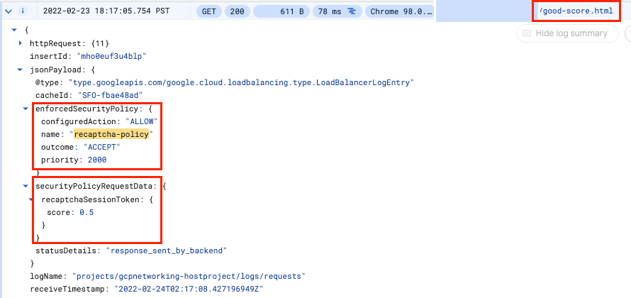

# Challenge 4 - Configure Bot Management

[< Previous Challenge](./Challenge-03.md) - **[Home](../README.md)**

## Description

### Create Cloud Armor security policy rules for Bot Management
In this section, you will use Cloud Armor bot management rules to allow, deny and redirect requests based on the reCAPTCHA score. Remember that when you created the session token site key, you set a testing score of 0.5.

- In Cloud Shell, create a recaptcha security policy via gcloud with the description "policy for bot management"


- Update the security policy to use a reCAPTCHA Enterprise manual challenge to distinguish between human and automated clients.
    - Associate the reCAPTCHA WAF challenge site key created for manual challenge with the security policy using the tag 
    
        `--recaptcha-redirect-site-key`

- Add a bot management rule to the policy to allow traffic if the url path matches good-score.html and has a score greater than 0.4 using the following tags: 

    - expression: `"request.path.matches('good-score.html') &&    token.recaptcha_session.score > 0.4" `
    - action: `allow` 

- Add a bot management rule to the policy to deny traffic if the url path matches bad-score.html and has a score less than 0.6 using the following tags: 

    - expression: ` "request.path.matches('bad-score.html') && token.recaptcha_session.score < 0.6"`
    - action: `deny-403`

- Add a bot management rule to the policy to redirect traffic to Google reCAPTCHA if the url path matches median-score.html and has a score equal to 0.5 using the following tags:
    - expression: ` "request.path.matches('median-score.html') && token.recaptcha_session.`
    - action: `redirect`
    - redirect-type: `google-recaptcha`

- Attach the security policy to the backend service http-backend using the following tags: 
    - security-policy: `recaptcha-policy` 
    - global

- In the Console, verify your policy should resemble the following:

    

### Validate Bot Management with Cloud Armor

1. Open up a browser and enter the url for your load balancer. Navigate to **"Visit allow link"**. Verify are allowed through.

    

1. Open a new window in Incognito mode to ensure we have a new session. Enter the url for your load balancer and navigate to **"Visit blocked link"**. Verify you receive a HTTP 403 error.

    

1. Open a new window in Incognito mode to ensure we have a new session. Enter the url for your load balancer and navigate to **"Visit redirect link"**. Verify you see the redirection to Google reCAPTCHA and the manual challenge page as below

    

### Verify Cloud Armor logs

Explore the security policy logs to validate bot management worked as expected.

- In the Console, navigate to the logs for the recaptcha policy you created.

- Use the below MQL(monitoring query language) query to view the request logs 

    ```sql
    resource.type:(http_load_balancer) AND jsonPayload.enforcedSecurityPolicy.name:(recaptcha-policy)
    ```

- Verify a log entry exists in Query results where the request is for each rule (good, bad, median)
- Verify that the configuredAction is set to **ALLOW, DENY or GOOGLE_RECAPTCHA** with the name **recaptcha-policy**.

    

    

    

> NOTE: Cloud Armor security policies create logs that can be explored to determine when traffic is denied and when it is allowed, along with the source of the traffic.

## Success Criteria

- You've configured the Cloud Armor security policy rules for Bot Management 
- The policy has been attached to the backend 
- Users with a good score are allowed through 
- Users with a median score are redirected to the reCAPTCHA manual challenge 
- Users with a bad score are not allowed through 
- A score is recorded in the Cloud Armor logs when a user attempts to access the landing page links 

## Learning Resources

- [Overview of reCAPTCHA Enterprise for WAF and Google Cloud Armor integration](https://cloud.google.com/recaptcha-enterprise/docs/integration-overview)
- [Implement the reCAPTCHA Enterprise for WAF and Google Cloud Armor integration](https://cloud.google.com/recaptcha-enterprise/docs/implement-tokens)
- [Google Cloud Armor bot management overview](https://cloud.google.com/armor/docs/bot-management)
- [Configure Google Cloud Armor security policies](https://cloud.google.com/armor/docs/configure-security-policies#bot-management)
